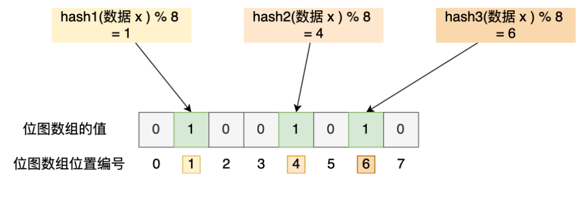
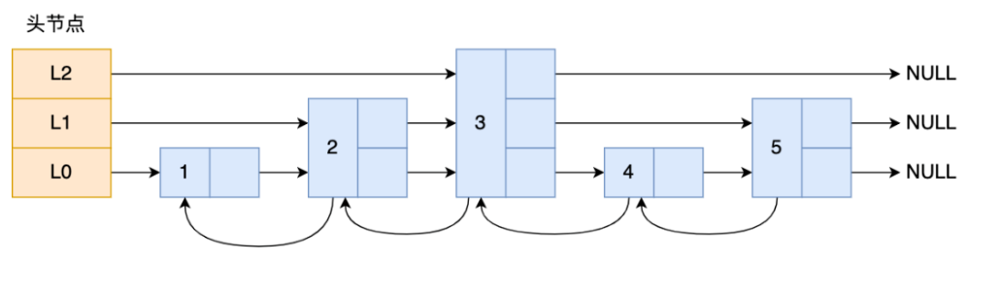

<!-- vscode-markdown-toc-config
	numbering=false
	autoSave=true
	/vscode-markdown-toc-config -->
<!-- /vscode-markdown-toc -->


## 与其他编程语言相比，使用Go语言有以下几个主要的好处：

1. 简洁性和可读性：
   - Go语言的语法简洁明了，易于学习和理解。
   - Go强调代码的可读性，鼓励使用简单和一致的编码风格。
   - 通过强制的代码格式化（如gofmt工具），Go代码在不同的开发者之间保持一致性，提高了协作效率。

2. 并发编程支持：
   - Go语言内置了对并发编程的支持，提供了Goroutine和Channel等机制。
   - Goroutine是轻量级的线程，可以方便地创建和管理大量的并发任务。
   - Channel提供了一种优雅的方式来实现Goroutine之间的通信和同步。
   - 这些特性使得编写高并发、高性能的程序变得更加容易和自然。

3. 强大的标准库：
   - Go语言提供了一个功能丰富的标准库，涵盖了许多常用的功能，如网络编程、文件操作、加密算法等。
   - 标准库的设计简洁而实用，提供了高质量的API和文档。
   - 使用标准库可以快速构建可靠和高效的应用程序，减少了对第三方库的依赖。

4. 静态类型和编译期检查：
   - Go是一门静态类型语言，在编译时进行类型检查，可以捕获许多潜在的错误。
   - 静态类型系统提供了类型安全性，减少了运行时错误的可能性。
   - 编译期检查还包括对未使用的变量、包导入等的检查，帮助维护代码的整洁性。

5. 快速编译和执行：
   - Go语言的编译速度非常快，即使对于大型项目也能够快速编译。
   - 编译后的Go程序是静态链接的，不依赖于外部运行时环境，可以方便地部署和分发。
   - Go程序的执行效率也很高，与C/C++等语言相当，适合开发高性能的系统级应用。

6. 垃圾回收和内存管理：
   - Go语言内置了垃圾回收机制，自动进行内存管理和回收。
   - 开发者无需手动管理内存的分配和释放，减少了内存泄漏和悬挂指针等问题。
   - 同时，Go的垃圾回收器在设计上力求高效和低延迟，最小化对应用性能的影响。

7. 跨平台支持：
   - Go语言支持跨平台编译和部署，可以轻松地在不同的操作系统上编译和运行Go程序。
   - 通过设置适当的编译参数，可以生成适用于目标平台的可执行文件。
   - 这种跨平台特性使得Go成为一种理想的选择，特别是对于开发可移植的系统级应用和工具。

8. 活跃的社区和生态系统：
   - Go语言拥有一个活跃而友好的开发者社区，提供了大量的开源库、工具和资源。
   - 社区成员积极参与Go的发展和改进，不断贡献新的特性和优化。
   - Go的生态系统日益完善。


## Go编译运行
go 源代码首先要通过 go build 编译为可执行文件，在 linux 平台上为 ELF 格式的可执行文件，编译阶段会经过编译器、汇编器、链接器三个过程最终生成可执行文件。
1、编译器：.go 源码通过 go 编译器生成为 .s 的 plan9 汇编代码；
2、汇编器：通过 go 汇编器将编译器生成的 .s 汇编语言转换为机器代码，并写出最终的目标程序.o 文件；
3、链接器：汇编器生成的一个个 *.o 目标文件通过链接处理得到最终的可执行程序；

go 源码通过上述几个步骤生成可执行文件后，二进制文件在被操作系统加载起来运行时会经过如下几个阶段：
1、从磁盘上把可执行程序读入内存；
2、创建进程和主线程；
3、为主线程分配栈空间；
4、把由用户在命令行输入的参数拷贝到主线程的栈；
5、把主线程放入操作系统的运行队列等待被调度执起来运行；


###### Go在windows环境下build生成linux程序
go env -w GOARCH=amd64
go env -w GOOS=linux

windows就是
go env -w GOOS=linux


## Go module
1. 查看开启情况，go env GO111MODULE；
2. 开启---go env -w GO111MODULE="on"；
3. 设置Go proxy---go env -w GOPROXY=http://goproxy.cn；
4. 查看GOMODECACHE；
5. 设置GOMODECACHE---go env -w GOMODCACHE=$GOPATH/pkg/mod；
6. GOPATH模式下 
    go get拉取外部依赖包会自动下载并安装到GOPATH下；
    没有版本控制的概念，无法知道当前更新的是哪个版本；
7. 进行Go module的初始化---go mod init <module-repo>；
8. 初始化项目时，会生成go.mod文件，描述当前项目的元信息；
9. 第一次拉取模块依赖后，生成go.sum，详细罗列当前项目依赖的模块版本；
10. go get过程分为三步，finding(发现)-->downloading(下载)-->extracting(提取)；
11. go mod init 项目路径 


## Go panic
1. 数组/索引索引越界；index out of range
2. 空指针调用；invalid memory address or nil pointer dereference
3. 过早关闭http响应体；指的是resp可能为nil；
4. 除以0；integer divide by zero；
5. 向已关闭的通道发消息；send on closed channel；
6. 重复关闭通道；close of closed channel；
7. 关闭未初始化通道；close of nil channel；
8. 未初始化map；assignment to entry in nil map；
9. 跨协程的panic处理，指的是一个协程panic，在另一个协程中recover；
10. sync计数为负值，指的是WaitGroup add方法传负值；negative WaitGroup counter；


## new 和 make 的区别？
make 
make(T, args) 返回的是初始化之后的 T 类型的值，这个新值并不是 T 类型的零值，也不是指针*T，是经过初始化之后的 T 的引用。
make 也是内建函数； 
slice := make([]int, 0, 100) 
hash := make(map[int]bool, 10) 
ch := make(chan int, 5) 
make 只能用于 slice,map,channel 三种类型, 并且只能是这三种对象  

new 
i := new(int) 
// 两者等价 
var v int 
i := &v 
new(T)为一个 T 类型新值分配空间并将此空间初始化为 T 的零值,返回的是新值
的地址,也就是 T 类型的指针*T,该指针指向 T 的新分配的零值； 
 
make 和 new 的区别 
1. new(T) 返回 T 的指针*T 并指向 T 的零值； 
2. make(T)返回的初始化的 T，只能用于 slice、map、channel，要获得一个显式的指针，使用 new 进行分配，或者显式地使用一个变量的地址； 
3. new 函数分配内存，make 函数初始化。 


## 什么是协程（Goroutine）与线程区别 
协程是用户态轻量级线程，它是线程调度的基本单位。通常在函数前加上 go 关键字就能实现并发。 
1. 调度方式不同： 
Go 语言的协程是由 Go 语言的运行时（runtime）进行调度的，而线程是由操作系统进行调度的。
Go 语言的协程调度器采用的是 M:N 调度模型，即将 M 个协程映射到 N 个操作系统线程上执行，这样可以更高效地利用 CPU 资源。 
2. 内存占用：
一个 Goroutine 会以一个很小的栈启动 2KB 或 4KB，当遇到栈空间不足时，栈会自动伸缩，因此可以轻易实现成千上万个 goroutine 同时启动。
独立的栈空间、 共享程序堆空间、调度由用户控制、协程是轻量级的线程。同一个程序中的所有goroutine 共享同一个地址空间。 
系统线程都会有一个固定大小的栈大小 2M，这个栈保存函数递归调用时的参数和局部变量，
固定大小出现两个问题，需要栈空间小时是浪费，需要栈空间较大时会溢出；
3. 切换代价不同： 
线程的切换需要保存和恢复线程的上下文，包括寄存器、栈指针等，这个过程需
要耗费一定的时间和资源。而协程的切换则只需要保存和恢复协程的上下文，这个过程非常快速，通常只需要几百纳秒。 
适用场景： 
由于协程可以快速切换并发执行的任务，因此比线程更适合处理 I/O 密集型的任务。 
线程则更适合处理 CPU 密集型任务。在 CPU 密集型任务下，Go 协程的优势要小很多，甚至可能更差。 


## Go 面向对象 
Go 实现面向对象的两个关键是 struct 和 interface。 
封装：对于同一个包，对象对包内的文件可见；对不同的包，需要将对象以大写开头才是可见的。 
继承：继承是编译时特征，在 struct 内加入所需要继承的类即可： 
type A struct{} 
type B struct{
    A 
}

组合
var _ Codec = (*GobCodec)(nil)

多态：多态是运行时特征，Go 多态通过 interface 来实现。类型和接口是松耦合
的，某个类型的实例可以赋给它所实现的任意接口类型的变量。 
Go 支持多重继承，就是在类型中嵌入所有必要的父类型。 

golang语言中没有继承概念，只有组合，也没有虚方法，更没有重载。因此，不会覆写被组合的结构体的方法。

#### 如何理解组合
在Go语言中，组合（Composition）是一种实现代码重用和结构化的方式。它允许将一个结构体嵌入到另一个结构体中，从而实现类似于继承的行为，但又不同于传统的继承关系。

组合的基本思想是将一个结构体作为另一个结构体的字段，通过嵌入的方式将一个结构体的功能和属性组合到另一个结构体中。
这样可以在不修改原有结构体的情况下，通过组合的方式扩展和增强结构体的功能。

下面是一个示例代码，演示了如何在Go语言中使用组合：

```go
type Engine struct {
    Power int
    Type  string
}

func (e *Engine) Start() {
    fmt.Println("Engine started with power:", e.Power)
}

type Car struct {
    Brand string
    Engine
}

func (c *Car) Drive() {
    fmt.Println("Car", c.Brand, "is driving")
    c.Start()
}

func main() {
    car := Car{
        Brand: "Toyota",
        Engine: Engine{
            Power: 100,
            Type:  "Gasoline",
        },
    }

    car.Drive()
    car.Start()
}
```

在上述示例中，我们定义了两个结构体：`Engine`和`Car`。`Engine`结构体表示汽车的引擎，包含了引擎的功率和类型属性，以及一个`Start`方法。`Car`结构体表示汽车，包含了汽车的品牌属性和一个嵌入的`Engine`结构体。

通过将`Engine`结构体嵌入到`Car`结构体中，我们实现了组合的关系。`Car`结构体可以直接访问`Engine`结构体的字段和方法，就像它们是`Car`结构体自己的一部分一样。

在`main`函数中，我们创建了一个`Car`类型的实例`car`，并设置了它的品牌和引擎属性。然后，我们可以通过`car`实例直接调用`Drive`方法和`Start`方法，即使`Start`方法是在`Engine`结构体中定义的。

组合的好处在于：

1. 代码重用：通过组合的方式，可以将通用的功能和属性封装在一个结构体中，并在其他结构体中重用，避免了代码的重复。

2. 灵活性：组合允许在运行时动态地组合和替换组件，而不需要修改原有的代码。可以通过嵌入不同的结构体来实现不同的功能组合。

3. 可读性：组合可以使代码结构更加清晰和易于理解，通过将相关的功能和属性组合在一起，提高了代码的可读性和可维护性。

4. 避免继承的问题：组合提供了一种替代继承的方式，避免了继承可能带来的问题，如强耦合、脆弱的基类问题等。

总之，组合是Go语言中实现代码重用和结构化的重要机制。通过将结构体嵌入到其他结构体中，可以实现功能的组合和扩展，提高代码的灵活性和可维护性。


### struct{}{}为什么不占用内存
Go 语言中的 struct{}{} 是一个空结构体，它确实不占用内存空间。这是因为：

1. 空结构体不包含任何字段，因此不需要为字段分配内存。
2. Go 语言在设计时做了一个优化，认为所有的空结构体都是相同的，因此可以共享同一块内存。
3. 编译器在编译时会将所有的空结构体都指向同一个地址，这个地址通常是一个全局的空结构体变量。
4. 在运行时，所有的空结构体变量都指向这个共享的内存地址，因此不会占用额外的内存空间。

这个特性在某些场景下非常有用，比如：
1. 用作通道（channel）的元素类型，表示不关心实际传递的值，只关心通知或信号。
2. 用作 map 的键类型，表示只关心键的存在性，而不关心键对应的值。
3. 用作集合（set）的实现，因为空结构体可以高效地表示元素的存在性，而不占用额外的内存空间。
总之，struct{}{} 作为一个特殊的类型，在 Go 语言中有其独特的用途，并且由于编译器的优化，它不会占用任何内存空间。


## 接口interface 

#### 2 个 interface 可以比较吗？ok 
Go 语言中，interface 的内部实现包含了 2 个字段，类型 T 和 值 V，interface 可以使用 == 或 != 比较。
2 个 interface 相等有以下 2 种情况： 
1. 两个 interface 均等于 nil（此时 V 和 T 都处于 unset 状态）； 
2. 类型 T 相同，且对应的值 V 相等。 
看下面的例子： 
type Stu struct { 
     Name string 
} 
 
type StuInt interface{} 
 
func main() { 
     var stu1, stu2 StuInt = &Stu{"Tom"}, &Stu{"Tom"} 
     var stu3, stu4 StuInt = Stu{"Tom"}, Stu{"Tom"} 
     fmt.Println(stu1 == stu2) // false 
     fmt.Println(stu3 == stu4) // true 
} 
stu1 和 stu2 对应的类型是 *Stu，值是 Stu 结构体的地址，两个地址不同，因此结果为 false。 
stu3 和 stu4 对应的类型是 Stu，值是 Stu 结构体，且各字段相等，因此结果为 true。 

#### go 的 interface 怎么实现的？
Go 语言中的接口（interface）是一种抽象类型，它定义了一组方法的集合。接口提供了一种方式来描述对象的行为，而不需要指定具体的类型。这使得 Go 语言能够实现灵活的多态性和松耦合的设计。

接口的原理可以概括为以下几点：

1. 接口定义：
   - 接口定义了一组方法的签名，但不提供具体的实现。
   - 接口中的方法只有方法名、参数列表和返回值类型，没有方法体。
   - 接口可以嵌套其他接口，形成接口的组合。

2. 隐式实现：
   - Go 语言中，一个类型只要实现了接口中定义的所有方法，就被认为是实现了该接口。
   - 不需要显式地声明一个类型实现了某个接口，编译器会自动进行类型检查和推断。
   - 这种隐式实现的方式使得 Go 语言的接口非常灵活和简洁。

3. 接口值：
   - 接口值由两部分组成：类型和值。
   - 类型部分表示实际存储的具体类型，值部分表示具体类型的实例。
   - 当将一个具体类型的值赋给接口类型的变量时，接口值的类型部分被设置为该具体类型，值部分被设置为该值的副本。

4. 类型断言和类型判断：
   - 可以使用类型断言来获取接口值的具体类型。
   - 类型断言的语法为 `value.(Type)`，其中 `value` 是接口值，`Type` 是要断言的具体类型。
   - 如果断言成功，则返回接口值的具体类型和 `true`；否则，触发 panic 或返回 `false`。
   - 还可以使用 `type switch` 语句对接口值进行类型判断和分支处理。

5. 空接口：
   - 空接口 `interface{}` 没有定义任何方法，因此所有类型都实现了空接口。
   - 空接口可以用来表示任意类型的值，类似于其他语言中的 `Object` 或 `void*`。
   - 空接口常用于函数参数、返回值或容器中，以接受或返回任意类型的值。

6. 接口与多态：
   - 接口实现了 Go 语言的多态特性。
   - 通过将具体类型的值赋给接口类型的变量，可以实现多态的行为。
   - 接口类型的变量可以存储实现了该接口的任意具体类型的值，并调用其对应的方法。

总之，Go 语言的接口提供了一种灵活而强大的抽象机制，通过定义一组方法的契约，实现了类型的多态和解耦。接口使得代码更加模块化、可扩展和可测试，是 Go 语言中非常重要的一部分。


解读一下 Go 语言中 interface 的源码实现。在 Go 的运行时源码中,interface 的定义位于 `runtime/runtime2.go` 文件中。

首先,interface 的底层表示是一个名为 `iface` 的结构体：

```go
type iface struct {
    tab  *itab
    data unsafe.Pointer
}
```

`iface` 结构体包含两个字段：
- `tab`：指向一个 `itab` 结构体的指针,用于存储接口的类型信息。
- `data`：一个 `unsafe.Pointer`,用于存储实际的数据指针。

`itab` 结构体的定义如下：

```go
type itab struct {
    inter *interfacetype
    _type *_type
    hash  uint32
    _     [4]byte
    fun   [1]uintptr
}
```

`itab` 结构体包含以下字段：
- `inter`：指向 `interfacetype` 结构体的指针,表示接口的类型信息。
- `_type`：指向 `_type` 结构体的指针,表示实际存储的具体类型信息。
- `hash`：一个 32 位的哈希值,用于快速比较两个接口是否相等。
- `_`：一个占位符,用于字节对齐。
- `fun`：一个函数指针数组,存储了实现接口方法的函数指针。

`interfacetype` 结构体的定义如下：

```go
type interfacetype struct {
    typ     _type
    pkgpath name
    mhdr    []imethod
}
```

`interfacetype` 结构体表示接口的类型信息,包含以下字段：
- `typ`：`_type` 类型,表示接口的类型信息。
- `pkgpath`：一个 `name` 类型,表示接口所在的包路径。
- `mhdr`：一个 `imethod` 类型的切片,存储了接口定义的方法信息。

`imethod` 结构体的定义如下：

```go
type imethod struct {
    name nameOff
    ityp typeOff
}
```

`imethod` 结构体表示接口中定义的方法信息,包含以下字段：
- `name`：方法名称的偏移量。
- `ityp`：方法类型的偏移量。

当一个具体类型实现了接口时,会动态生成一个 `itab` 结构体,其中包含了接口类型信息和具体类型信息,以及实现接口方法的函数指针。当调用接口方法时,实际上是通过 `itab` 中的函数指针来调用具体类型的方法实现。

在类型断言和类型判断时,会通过比较 `itab` 中的类型信息来判断具体类型是否实现了接口或是否为指定的类型。

以上就是 Go 语言中 interface 的源码解读。通过 `iface`、`itab` 和 `interfacetype` 等结构体的组合,Go 实现了高效的动态派发和类型安全的接口机制。


#### 2 个 nil 可能不相等吗？ ok 
可能不等。interface 在运行时绑定值，只有值为 nil 接口值才为 nil，但是与指针
的 nil 不相等。举个例子： 
var p *int = nil 
var i interface{} = nil 
if(p == i){ 
fmt.Println("Equal") 
} 
两者并不相同。总结：两个 nil 只有在类型相同时才相等。 


#### 实现接口时用指针接收者，指针或值调用接口有什么讲究吗

在Go语言中，当使用指针接收者实现接口时，调用接口方法时可以使用指针或值，但是有一些细节需要注意。

1. 使用指针接收者实现接口：
   - 当一个类型使用指针接收者实现接口时，表示该类型的指针类型实现了该接口。
   - 这意味着可以将该类型的指针赋值给接口类型的变量。
   - 使用指针接收者实现接口的好处是可以在接口方法中修改接收者的状态。

2. 使用指针调用接口方法：
   - 当使用指针调用接口方法时，实际上是将指针传递给了接口方法。
   - 在接口方法中，可以通过指针接收者访问和修改接收者的状态。
   - 使用指针调用接口方法时，接口变量必须存储的是指向实现类型的指针。

3. 使用值调用接口方法：
   - 当使用值调用接口方法时，实际上是将值的副本传递给了接口方法。
   - 在接口方法中，对接收者的修改只影响副本，不会影响原始值。
   - 使用值调用接口方法时，接口变量可以存储实现类型的值或指针。

4. 接口变量的赋值：
   - 当将一个值赋值给接口变量时，会创建该值的副本，接口变量存储的是副本的地址。
   - 当将一个指针赋值给接口变量时，接口变量存储的是指针的值（即指针本身）。
   - 无论是值还是指针赋值给接口变量，都可以通过接口变量调用接口方法。

下面是一个示例代码，演示了使用指针接收者实现接口以及指针和值调用接口方法的区别：

```go
type Shape interface {
    Area() float64
}

type Rectangle struct {
    Width  float64
    Height float64
}

func (r *Rectangle) Area() float64 {
    return r.Width * r.Height
}

func main() {
    var s Shape

    // 使用指针赋值给接口变量
    r1 := &Rectangle{Width: 5, Height: 3}
    s = r1
    fmt.Println(s.Area())  // 输出: 15

    // 使用值赋值给接口变量
    r2 := Rectangle{Width: 6, Height: 4}
    s = &r2
    fmt.Println(s.Area())  // 输出: 24

    // 使用值调用接口方法
    r3 := Rectangle{Width: 7, Height: 5}
    s = r3
    fmt.Println(s.Area())  // 输出: 35
}
```

在上述示例中，`Rectangle`类型使用指针接收者实现了`Shape`接口的`Area`方法。我们可以将`Rectangle`类型的指针或值赋值给`Shape`类型的接口变量`s`，并通过`s`调用`Area`方法。

需要注意的是，如果使用值调用接口方法，对接收者的修改只影响副本，而不会影响原始值。如果需要在接口方法中修改接收者的状态，应该使用指针接收者实现接口。

总之，使用指针接收者实现接口提供了更大的灵活性，可以在接口方法中修改接收者的状态。

## map

#### map 的底层实现 
Go 语言中的 map 是一种键值对的数据结构,其底层实现采用了哈希表（hash table）的方式。在 Go 的运行时源码中,map 的实现位于 `runtime/map.go` 文件中。

map 的底层结构由以下几个关键组件组成：

1. `hmap` 结构体：
   ```go
   type hmap struct {
       count     int
       flags     uint8
       B         uint8
       noverflow uint16
       hash0     uint32
       buckets    unsafe.Pointer
       oldbuckets unsafe.Pointer
       nevacuate  uintptr
       extra *mapextra
   }
   ```
   - `count`：表示 map 中的键值对数量。
   - `flags`：表示 map 的状态标志,如是否正在扩容等。
   - `B`：表示 bucket 的数量的对数,即 2^B 为 bucket 的数量。
   - `noverflow`：表示溢出 bucket 的数量。
   - `hash0`：一个随机的哈希种子,用于计算哈希值。
   - `buckets`：指向 bucket 数组的指针。
   - `oldbuckets`：在扩容时,指向旧的 bucket 数组的指针。
   - `nevacuate`：表示已经搬迁的 bucket 的数量。
   - `extra`：指向额外的 map 信息,如迭代器等。

2. `bmap` 结构体：
   ```go
   type bmap struct {
       tophash [bucketCnt]uint8
   }
   ```
   - `tophash`：存储了每个键的哈希值的高 8 位,用于快速比较键是否相等。
   - `bmap` 结构体后面紧跟着键值对数据,存储在连续的内存空间中。

3. `mapextra` 结构体：
   ```go
   type mapextra struct {
       overflow    *[]*bmap
       oldoverflow *[]*bmap
       nextOverflow *bmap
   }
   ```
   - `overflow`：指向溢出 bucket 的指针数组。
   - `oldoverflow`：在扩容时,指向旧的溢出 bucket 的指针数组。
   - `nextOverflow`：指向下一个可用的溢出 bucket。

当向 map 中插入一个键值对时,会先计算键的哈希值,然后根据哈希值的低位确定键值对应该存储在哪个 bucket 中。如果 bucket 已满,就会创建一个溢出 bucket,并将键值对存储在溢出 bucket 中。

在查找键值对时,首先计算键的哈希值,然后根据哈希值的低位确定所在的 bucket。在 bucket 中,比较键的哈希值的高 8 位（tophash）是否匹配,如果匹配,再比较键的完整哈希值和键的值是否相等。如果在当前 bucket 中没有找到,就会继续查找溢出 bucket,直到找到对应的键值对或查找完所有的 bucket。

当 map 的键值对数量达到一定阈值时（装载因子超过 6.5）,会触发扩容操作。扩容会将 bucket 数组的大小扩大为原来的两倍,并重新计算键值对的哈希值,将它们搬迁到新的 bucket 中。

以上就是 Go 语言中 map 的底层实现的关键点。


#### go 里面的 map 是并发安全的吗？如何并发安全 
Go 中的 map 是非并发安全的，多个 goroutine 对同一个 map 进行并发读写操作时可能会导致数据竞争和并发问题。
为了保证 map 的并发安全性，可以使用以下两种方式：
1. 使用 sync 包中的 Map 类型 
sync 包中的 Map 类型是一个并发安全的 map，可以用于多个 goroutine 对同一个 map进行并发读写操作。例如： 
```Go
var m sync.Map 
 
m.Store("key", "value") 
value, ok := m.Load("key") 
func main() { 
 
barVal := map[string]int{ 
"alpha": 34, "bravo": 56, "charlie": 23, 
"delta": 87, "echo": 56, "foxtrot": 12, 
"golf": 34, "hotel": 16, "indio": 87, 
"juliet": 65, "kili": 43, "lima": 98, 
} 
 
i := 0 
 
keys := make([]string, len(barVal)) 
 
for k, _ := range barVal{ 
keys[i] = k 
i++ 
} 
 
sort.Strings(keys) 
 
fmt.Println("sorted keys==", keys) 
 
for _, key := range keys{ 
fmt.Printf("key=%v, value=%v\n", key, barVal[key]) 
} 
} 
m.Delete("key") 

```
上面的代码使用 sync.Map 类型实现了一个并发安全的 map，可以在多个 goroutine 中对
其进行并发读写操作。 

2. 使用读写锁进行保护 
另一种方式是使用读写锁（sync.RWMutex）对 map 进行保护，实现并发安全。例如： 
```Go
var mu sync.RWMutex 
var m map[string]string 
 
func read(key string) string { 
    mu.RLock() 
    defer mu.RUnlock() 
    return m[key] 
} 
 
func write(key, value string) { 
    mu.Lock() 
    defer mu.Unlock() 
    m[key] = value 
} 
``` 
上面的代码使用读写锁对 map 进行保护，read 函数使用读锁进行保护，write 函数使用写锁进行保护，可以在多个 goroutine 中对其进行并发读写操作。 
 
需要注意的是，使用读写锁进行保护时，需要根据实际情况选择读锁或写锁，以保证并发安全和性能的平衡。同时，也可以使用 sync.Map 类型来简化代码，避免使用锁时出现的一些问题，例如死锁等。 

#### 解决 hash 碰撞的方法 
1、开放寻址法； 

这种方法的核心思想是依次探测和比较数组中的元素以判断目标键值对是否存在于哈希表中。实现哈希表的底层数据接口是数组。 

哈希函数：index := hash(“key1”) % array.len 

当我们向当前哈希表写入新的数据时，如果发生了冲突，就会将键值对写入到下一个索引不为空的位置，如果位置已经被占用了，则继续向下寻找，如果找到最后还是被占用的话，则从头开始寻找位置。

2、拉链法。 

实现哈希表的底层数据结构是链表数组。 

哈希函数：index := hash(“key1”) % array.len 

经过 hash 函数找到一个桶，然后就可以遍历当前桶的链表了，在遍历链表的过程中会遇到以下两种情况： 
a、找到键相同的键值对 — 更新键对应的值； 
b、没有找到键相同的键值对 — 在链表的末尾追加新的键值对； 


#### 通过 make 函数定义 map 
make(map[string]int)

mapCreated := make(map[string]float32)  相当于：mapCreated := map[string]float32{}.

如果只是 var 声明一个 map，此时不能添加新 key 到 map 中。 
如果 key 没有在 map 中，取值时取 type 的默认值； 
```Go
m := map[string]int{"1": 1, "2": 2} 
fmt.Println("value is", m["3"]) 
//value is 0 
```

可以对未初始化的map取值，但是取出来的东西是空；不能对未初始化的map赋值；nil map未初始化，空map长度为0；

map的key需要是可比的；map使用前一定要初始化；不是线程安全的；map循环是无序的；

delete(map, key)  --移除 map 中的元素，如果 key 不存在，该操作不会产生错误； 

len(map) ---可以获得 map 的长度 

map 和 slice 一样是引用类型，不能通过==进行比较，==只能判断 map 是否是 nil；


#### map 的排序 
// for-range 遍历 map             for key, value := range map1 {} 
// 如果只想获取 key，可以这么使用：for key := range map1 {}

map 默认是无序的，想为 map 排序，需要将 key（或者 value）拷贝到一个切片，再对切片排序，然后可以使用切片的 for-range 方法打印出所有的 key 和 value。


#### map 中删除一个 key，它的内存会释放么？
如果删除的元素是值类型，如int，float，bool，string以及数组和struct，map的内存不会自动释放
如果删除的元素是引用类型，如指针，slice，map，chan等，map的内存会自动释放，但释放的内存是子元素应用类型的内存占用将map设置为nil后，内存被回收。


#### 遍历map为啥不是有序的？
1. map底层实现是哈希表，在进行插入数据时，会对key进行hash运算，这也就导致了数据不是按顺序存储的，和遍历的顺序也就会不一致；
2. map 在扩容后，会发生 key 的搬迁，原来落在同一个 bucket 中的 key，搬迁后，有些 key 可能就到其他 bucket 了；
而遍历的过程，就是按顺序遍历 bucket，同时按顺序遍历 bucket 中的 key。 
搬迁后，key 的位置发生了重大的变化，有些 key 被搬走了，有些 key 则原地不动。这样，遍历 map 的结果就不可能按原来的顺序了。
3. 在遍历 map 时，并不是固定地从 0 号 bucket 开始遍历，每次都是从一个随机值序号的 bucket 开始遍历，并且是从这个 bucket 的一个随机序号的 cell 开始遍历。

#### map三种并发安全的方式
1. 读写锁；
2. 分片加锁；将这个 map 分成 n 块，每个块之间的读写操作都互不干扰；
type SafeMap2 struct {
    Maps               [N]map[string]string
    locks              [N]sync.RWMutex 
}
3. sync.Map


## 切片 

#### 数组 
定义：arr := [...]int{1, 2, 3}或 arr := [3]int{1, 2, 3}     

如果数组中元素的个数小于或者等于 4 个，那么所有的变量会直接在栈上初始化。

如果数组元素大于 4 个，变量就会在静态存储区初始化然后拷贝到栈上； 

数组是固定产长度的，不能动态扩容，在编译期就确定大小。 


#### 操作切片方法
numbers = append(numbers, 2,3,4)        ---往 numbers 中添加多个元素 

append(slice1, slice...)，返回新的切片     ---将一个切片 append 到另一个切片中  

copy(numbers1,numbers)                  ---拷贝 numbers 的内容到 numbers1 

当切片作为参数传递给函数时，函数内部所做的更改在函数外部也可见；而数组不可见； 

切片初始化三种方式：
1. 使用下标获取数组或者切片的一部分；不会拷贝原数组或者原切片中的数据，它只会创建一个指向原数组的切片结构体，所以修改新切片的数据也会修改原切片。 
2. 字面定义；sl := []int{1, 2, 3} --创建一个数组返回一个切片引用； 
3. make([]T, length, capacity)    必须要有 length 参数，len() ---长度 ，cap() ---容量 


#### 切片初始化加索引
func main() {
    var a = []int{2: 3, 4, 0: 0}
    fmt.Println(a)
}
// 索引 0 值为 0，索引 2 值为 3，没有指定索引的元素会在前一个索引基础之上加一 


#### 切片拷贝三种方式
1、使用=操作符拷贝切片，这种就是浅拷贝 
2、使用[:]下标的方式复制切片，这种也是浅拷贝 
3、使用 Go 语言的内置函数 copy()进行切片拷贝，这种就是深拷贝 
深浅拷贝都是进行复制，区别在于复制出来的新对象与原来的对象在它们发生改
s := make([]int, 5)  ## s = [0 0 0 0 0] 
r := append(s, 1, 2, 3) ## r = [0 0 0 0 0 1 2 3] 
fmt.Println(r, len(r), cap(r)) ## len(r)=8, cap(r)=10 


#### 两个切片追加在一起
s1 := []int{1, 2, 3} 
s2 := []int{4, 5}
fmt.Println(append(s1, s2...))  ## [1 2 3 4 5]


#### 切片切取
a := [5]int{1, 2, 3, 4, 5} 
t := a[3:4:4] ## 意思切取索引 3-->4(不包含 4)，第三个参数用来限制新切片的容量，切片容量为第三个参数
第一个参数，如果第二个参数省略的话，默认为切片的长度；
fmt.Println(t[0]) ## 4
s1 := []int{1, 2, 3}
s2 := s1[1:]
s2[1] = 5
fmt.Println(s1, "\n", s2) 
// golang 切片底层的数据结构是数组，当使用 s1[1:] 获得切片 s2，和 s1 共享同一个底层数组，这会导致 s2[1] = 4 语句影响 s1 

从数组中截取切片
1. 如果没有指定max,则max的值为截取对象的容量；
2. 如果指定max,则max的值不能超过截取对象的容量；
3. 利用数组创建切片，切片操作的是同一个数组；


#### 如何判断 2 个字符串切片（slice) 是相等的？ 
reflect.DeepEqual() ， 但反射非常影响性能。 
 

#### 在使用Go语言的内置函数`copy`与切片配合时，需要注意什么？

1. 切片的长度和容量：
   - `copy`函数的第一个参数是目标切片，第二个参数是源切片。
   - `copy`函数将源切片中的元素复制到目标切片中，但是只会复制目标切片长度范围内的元素。
   - 如果目标切片的长度小于源切片的长度，只有前面部分的元素会被复制。
   - 如果目标切片的长度大于源切片的长度，只有源切片中的元素会被复制，目标切片后面的元素保持不变。

2. 切片的底层数组：
   - 切片是对底层数组的引用，`copy`函数复制的是切片的元素，而不是底层数组。
   - 如果目标切片和源切片共享同一个底层数组，复制操作会影响到共享的元素。
   - 如果目标切片和源切片指向不同的底层数组，复制操作不会影响到源切片的底层数组。

3. 切片的容量增长：
   - 如果目标切片的容量不足以容纳源切片中的所有元素，`copy`函数只会复制目标切片容量范围内的元素。
   - 如果想要完整复制源切片中的所有元素，需要确保目标切片的容量足够大。
   - 可以使用`make`函数创建一个足够大的目标切片，或者使用切片的`append`函数动态扩展目标切片的容量。

4. 元素类型的兼容性：
   - `copy`函数要求目标切片和源切片的元素类型必须相同或可赋值。
   - 如果元素类型不兼容，编译器会报错。

下面是一些示例代码，演示了`copy`函数与切片配合的使用：

```go
func main() {
    src := []int{1, 2, 3, 4, 5}
    dst := make([]int, 3)

    // 复制源切片中的元素到目标切片
    copy(dst, src)
    fmt.Println(dst)  // 输出: [1 2 3]

    // 目标切片容量不足，只复制部分元素
    dst2 := make([]int, 2)
    copy(dst2, src)
    fmt.Println(dst2)  // 输出: [1 2]

    // 目标切片长度大于源切片长度
    dst3 := make([]int, 6)
    copy(dst3, src)
    fmt.Println(dst3)  // 输出: [1 2 3 4 5 0]

    // 共享底层数组的切片
    src2 := []int{1, 2, 3, 4, 5}
    dst4 := src2[2:4]
    copy(dst4, []int{6, 7})
    fmt.Println(src2)  // 输出: [1 2 6 7 5]
}
```

在使用`copy`函数与切片配合时，务必注意切片的长度、容量以及底层数组的共享情况，以确保复制操作的正确性和预期行为。同时，也要确保目标切片和源切片的元素类型是兼容的，以避免编译错误。


#### 切片slice扩容策略
在 Go 语言中，切片的扩容是通过 append 函数实现的。
当我们向一个切片中添加元素时，如果当前切片的容量不足以存储新的元素，Go 会自动为该切片分配一块新的内存空间，
然后将原来的数据复制到新分配的内存空间中，并将新的元素添加进去。这个过程被称为切片的扩容。 
具体来说，当我们使用 append 函数向一个切片添加元素时，Go 会先判断当前切片的容量是否足够存储新元素。
如果足够，则直接将新元素添加到切片的末尾；如果不足，则需要进行扩容操作。 
在进行扩容操作时，Go 会先根据当前切片的长度和容量计算出新的容量。

具体的计算方式是，1.17 之前 
代码的扩容策略可以简述为以下三个规则： 
1.当期望容量>两倍的旧容量时，直接使用期望容量作为新切片的容量 
2.如果旧容量< 1024（注意这里单位是元素个数）,那么直接翻倍旧容量 
3.如果旧容量> 1024，那么会进入一个循环，每次增加 25%直到大于期望容量 
可以看到，原来的 go 对于切片扩容后的容量判断有一个明显的 magic number：1024，
在 1024 之前，增长的系数是 2，而 1024 之后则变为 1.25。关于为什么会这么设计，社区的相关讨论 1 给出了几点理由： 
1.如果只选择翻倍的扩容策略，那么对于较大的切片来说，现有的方法可以更好的节省内存。 
2.如果只选择每次系数为 1.25 的扩容策略，那么对于较小的切片来说扩容会很低效。 
3.之所以选择一个小于 2 的系数，在扩容时被释放的内存块会在下一次扩容时更容易被重新利用 

1.18 之后 
到了 Go1.18 时，又改成不和 1024 比较了，而是和 256 比较；
并且扩容的增量也有所变化，不再是每次扩容 1/4，而是（oldCap + 3 * 256）/4； 
然后，Go 会为新的容量分配一块内存空间，并将原来的数据复制到这个新的内存空间中，最后将新的元素添加到切片的末尾。 
需要注意的是，切片的扩容操作可能会导致原来的切片和新的切片共享同一块内存空间。
这种情况下，如果修改了原来的切片或新的切片中的数据，都会影响到另一个切片。
因此，在使用切片时，需要注意切片的扩容和共享内存的情况，避免引发不必要的错误。


## 链式调用
链式调用是一种简化代码的编程方式，能够使代码更简洁、易读。链式调用的原理也非常简单，某个对象调用某个方法后，
将该对象的引用/指针返回，即可以继续调用该对象的其他方法。通常来说，当某个对象需要一次调用多个方法来设置其属性时，
就非常适合改造为链式调用了。


## Hook机制
Hook，翻译为钩子，其主要思想是提前在可能增加功能的地方埋好(预设)一个钩子，当我们需要重新修改或者增加这个地方的逻辑的时候，
把扩展的类或者方法挂载到这个点即可。钩子的应用非常广泛，例如 Github 支持的 travis 持续集成服务，当有 git push 事件发生时，
会触发 travis 拉取新的代码进行构建。IDE 中钩子也非常常见，比如，当按下 Ctrl + s 后，自动格式化代码。
再比如前端常用的 hot reload 机制，前端代码发生变更时，自动编译打包，通知浏览器自动刷新页面，实现所写即所得。


## orm
对象关系映射（Object Relational Mapping，简称ORM）是通过使用描述对象和数据库之间映射的元数据，将面向对象语言程序中的对象自动持久化到关系数据库中。
数据库表迁移
新增字段  ALTER TABLE tableName ADD COLUMN col_name, col_type;
删除字段：
CREATE TABLE new_table AS SELECT col1, col2, ... from old_table   ##从old_table中挑选需要保留的字段到 new_table 中。
DROP TABLE old_table                                              ## 删除 old_table                    
ALTER TABLE new_table RENAME TO old_table;                        ## 重命名 new_table 为 old_table

1. Session用于实现与数据的交互； 
    直接调用SQL语句进行原生交互RAW; 数据库表的增删；
2. Engine负责与数据库交互前的准备(连接和测试数据库)和交互后的收尾工作(关闭连接)；
3. orm框架往往需要兼容多个数据库，每一种数据库分别实现，实现最大程度的复用和解耦；Dialect接口,其它数据库实现它；
4. schema定义数据库表接口与对象映射,即对象object和表table的转换，给定一个任意对象，转换为关系型数据库中的表结构；
    表名-结构体/字段名和类型-成员变量和类型/额外约束条件(非空主键)-成员变量的Tag；
5. 使用反射(reflect)将数据库的记录转换为对应的结构体实例，实现查询(select)功能。
    Insert需要将已经存在的对象的每一个字段的值平铺开来，而 Find 则是需要根据平铺开的字段的值构造出对象；
6. 实现事务；
7. 钩子与结构体绑定，即每个结构体需要实现各自的钩子；
8. 数据库迁移；支持字段的新增和删除；
    ALTER TABLE table_name ADD COLUMN col_name, col_type;
    CREATE TABLE new_table AS SELECT col1, col2, ... from old_table DROP TABLE old_table ALTER TABLE new_table RENAME TO old_table;

## gorm

#### gorm 加上 logger 
go get –u gorm.io/gorm/logger 

```Go
newLogger := logger.New( 
   log.New(os.Stdout, "\r\n", log.LstdFlags), 
   logger.Config{ 
      SlowThreshold: time.Second, //慢 SQL 阈值 
      LogLevel: logger.Info, //日志级别 
      Colorful: true, //彩色 
   }) 
 
DB, _ = gorm.Open(mysql.Open(viper.GetString("mysql.dsn")), &gorm.Config{Logger: newLogger}) 
```
访问接口，终端会有 sql 语句打印；

 
#### gorm 里面如何批量插入某个字段 
在 GORM 中，可以使用 CreateInBatches 方法来批量插入数据。
如果要批量插入某个字段，可以先构造一个包含该字段的结构体切片，然后使用CreateInBatches 方法进行批量插入。 

下面是一个示例代码： 
```Go
type User struct { 
    ID   uint 
    Name string 
    Age  int 
    City string 
} 
 
// 构造包含 City 字段的结构体切片 
users := []User{ 
    {Name: "Alice", Age: 20, City: "New York"}, 
    {Name: "Bob", Age: 25, City: "Los Angeles"}, 
    {Name: "Charlie", Age: 30, City: "Chicago"}, 
} 
 
// 批量插入数据，只插入 City 字段 
result := db.CreateInBatches(users, len(users)).Select("City") 
 
if result.Error != nil { 
    // 处理错误 
} 
 
// 输出插入的记录数 
fmt.Printf("Inserted %d records\n", result.RowsAffected) 

```
在上面的代码中，我们先构造了一个包含 City 字段的结构体切片，然后使用 
CreateInBatches 方法进行批量插入。在调用 CreateInBatches 方法时，我们指定
了要插入的记录数和要选择的字段（即只插入 City 字段）。最后，我们可以通
过 result.RowsAffected 获取插入的记录数。 

 
#### gorm 里面更新有几种方式？ 
1. 使用 Update 方法更新单条记录 
Update 方法可以用于更新单条记录，它接收一个结构体或 map 参数，表示要更 新的字段和值。
例如： db.Model(&User{}).Where("id = ?", 1).Update("name", "Alice")，此代码会将 id 为 1 的 User 记录的 name 字段更新为 "Alice"。

2. 使用 Updates 方法更新单条记录 
Updates 方法可以用于更新单条记录，它接收一个结构体或 map 参数，表示要更新的多个字段和值。
例如： 
db.Model(&User{}).Where("id = ?", 1).Updates(map[string]interface{}{"name": "Alice", "age": 20}) 
上面的代码会将 id 为 1 的 User 记录的 name 字段更新为 "Alice"，age 字段 更新为 20。

3. 使用 UpdateColumn 方法更新单个字段 
UpdateColumn 方法可以用于更新单个字段，它接收两个参数，第一个参数表示要更新的字段名，第二个参数表示要更新的值。例如： 
db.Model(&User{}).Where("id = ?", 1).UpdateColumn("name", "Alice")
上面的代码会将 id 为 1 的 User 记录的 name 字段更新为 "Alice"。

4. 使用 UpdateColumns 方法更新多个字段 
UpdateColumns 方法可以用于更新多个字段，它接收一个结构体或 map 参数，
表示要更新的多个字段和值。与 Updates 方法不同的是，UpdateColumns 方法只
更新指定的字段，不会更新其他字段。例如： 
db.Model(&User{}).Where("id = ?", 1).UpdateColumns(map[string]interface{}{"name": "Alice", "age": 20}) 
上面的代码会将 id 为 1 的 User 记录的 name 字段更新为 "Alice"，age 字段更新为 20。其他字段不会被更新。

5. 使用 Save 方法更新记录 
Save 方法可以用于更新记录，它接收一个结构体参数，表示要更新的记录。如
果该记录的主键已经存在，则会更新该记录；否则会插入一条新记录。例如： 
user := User{ID: 1, Name: "Alice", Age: 20} 
db.Save(&user) 
上面的代码会将 id 为 1 的 User 记录的 name 字段更新为 "Alice"，age 字段
更新为 20。如果该记录不存在，则会插入一条新记录。 
需要注意的是，以上方法在执行时都会生成 SQL 语句并执行，可以通过 
db.Debug().Updates() 等方法查看生成的 SQL 语句。 


## Gin
框架提供的特性， 
1. 路由(Routing)：将请求映射到函数，支持动态路由。例如'/hello/:name； 
2. 模板(Templates)：使用内置模板引擎提供模板渲染机制； 
3. 工具集(Utilites)：提供对 cookies，headers 等处理机制； 
4. 插件(Plugin)：Bottle 本身功能有限，但提供了插件机制。可以选择安装到全局，也可以只针对某几个路由生效。

#### 前缀树
动态路由可以匹配某一类型路由而非一条固定的路由；例如/hello/:name，可以匹配/hello/geektutu、hello/jack等。
实现动态路由最常用的数据结构，被称为前缀树；

HTTP请求的路径恰好是由/分隔的多段构成的，因此，每一段可以作为前缀树的一个节点。
我们通过树结构查询，如果中间某一层的节点都不满足条件，那么就说明没有匹配到的路由，查询结束。

对于路由来说，最重要的当然是注册与匹配了。开发服务时，注册路由规则，映射handler；访问时，匹配路由规则，查找到对应的handler。
因此，Trie 树需要支持节点的插入与查询。插入功能很简单，递归查找每一层的节点，如果没有匹配到当前part的节点，则新建一个，
有一点需要注意，/p/:lang/doc只有在第三层节点，即doc节点，pattern才会设置为/p/:lang/doc。p和:lang节点的pattern属性皆为空。
因此，当匹配结束时，我们可以使用n.pattern == ""来判断路由规则是否匹配成功。
例如，/p/python虽能成功匹配到:lang，但:lang的pattern值为空，因此匹配失败。
查询功能，同样也是递归查询每一层的节点，退出规则是，匹配到了*，匹配失败，或者匹配到了第len(parts)层节点。


#### 路由
##### 路由分组
```Go
defaultRouter := r.Group("/") 
{ 
   defaultRouter.GET("/", func(context *gin.Context) 
{ 
      context.String(http.StatusOK, "值%v", "您好 gin") 
   }) 
   defaultRouter.GET("/new", func(context 
*gin.Context) { 
      context.String(http.StatusOK, "值%v", "您好 gin") 
   }) 
}
```

##### gin定义路由多种方式 
在 Gin 中，路由是指将请求的 URL 映射到相应的处理函数上。Gin 提供了多种方式来定义路由，包括： 
1. GET 方法 
使用 GET 方法可以定义 GET 请求的路由，例如： 
router.GET("/hello", func(c *gin.Context) { 
    c.String(http.StatusOK, "Hello, world!") 
}) 
上面的代码定义了一个 GET 请求的路由，当请求的 URL 为 "/hello" 时，会调
用后面的处理函数返回 "Hello, world!"。 
2. POST 方法 
使用 POST 方法可以定义 POST 请求的路由，例如： 
router.POST("/users", func(c *gin.Context) { 
    // 处理 POST 请求 
}) 
上面的代码定义了一个 POST 请求的路由，当请求的 URL 为 "/users" 时，会
调用后面的处理函数处理 POST 请求。 
3. PUT 方法 
使用 PUT 方法可以定义 PUT 请求的路由，例如： 
router.PUT("/users/:id", func(c *gin.Context) { 
    // 处理 PUT 请求 
}) 
上面的代码定义了一个 PUT 请求的路由，当请求的 URL 为 "/users/:id" 时，
会调用后面的处理函数处理 PUT 请求。其中，":id" 表示一个参数，可以通过 
c.Param("id") 获取该参数的值。 
4. DELETE 方法 
使用 DELETE 方法可以定义 DELETE 请求的路由，例如： 
router.DELETE("/users/:id", func(c *gin.Context) { 
    // 处理 DELETE 请求 
}) 
上面的代码定义了一个 DELETE 请求的路由，当请求的 URL 为 "/users/:id" 
时，会调用后面的处理函数处理 DELETE 请求。其中，":id" 表示一个参数，可
以通过 c.Param("id") 获取该参数的值。 
5. PATCH 方法 
使用 PATCH 方法可以定义 PATCH 请求的路由，例如： 
router.PATCH("/users/:id", func(c *gin.Context) { 
    // 处理 PATCH 请求 
}) 
上面的代码定义了一个 PATCH 请求的路由，当请求的 URL 为 "/users/:id" 时，
会调用后面的处理函数处理 PATCH 请求。其中，":id" 表示一个参数，可以通
过 c.Param("id") 获取该参数的值。 
6. Any 方法 
使用 Any 方法可以定义任何请求方法的路由，例如： 
router.Any("/users/:id", func(c *gin.Context) { 
    // 处理任何请求方法 
}) 
上面的代码定义了一个任何请求方法的路由，当请求的 URL 为 "/users/:id" 时，
会调用后面的处理函数处理所有请求方法。其中，":id" 表示一个参数，可以通
过 c.Param("id") 获取该参数的值。 
7. Group 方法 
使用 Group 方法可以将多个路由分组，例如： 
users := router.Group("/users") 
{ 
    users.GET("/", func(c *gin.Context) { 
        // 处理 GET 请求 
    }) 
    users.POST("/", func(c *gin.Context) { 
        // 处理 POST 请求 
    }) 
    users.PUT("/:id", func(c *gin.Context) { 
        // 处理 PUT 请求 
    }) 
    users.DELETE("/:id", func(c *gin.Context) { 
        // 处理 DELETE 请求 
    }) 
} 
上面的代码将 "/users" 路由下的多个请求方法分组处理，可以更好地组织代码。 
8. Use 方法 
使用 Use 方法可以为路由添加中间件，例如： 
router.Use(authMiddleware) 
router.GET("/hello", func(c *gin.Context) { 
    c.String(http.StatusOK, "Hello, world!") 
}) 
上面的代码为 "/hello" 路由添加了一个 authMiddleware 中间件，可以在处理请
求前进行身份验证等操作。 
以上是 Gin 中定义路由的常用方式，可以根据实际需求选择适合的方式。 


##### 路由中间件 
路由中多个 HandlerFunc 参数，可以作为中间件； 
r.GET(“/”, InitMiddleWare, func(context *gin.Context){}) 
context.Next() ---调用该请求的剩余处理程序； 
context.Abort() ----终止该请求的剩余处理程序； 
r.use(middleWare1, middleWare2)  ---全局中间件 
r.Group()  ---可以在里面加路由分组中间件 


#### swagger 使用
在 Router 函数中加上 docs.SwaggerInfo.BasePath = ""
r.GET("/swagger/*any", ginSwagger.WrapHandler(swaggerFiles.Handler)) 
在对应 handler 上加上 swagger 注释，然后命令行执行 swag init，启动服务。 
浏览器访问http://localhost:8080/swagger/index.html 看到 swagger UI，
http://localhost:8080/swagger/doc.json 看到 json 样式； 


#### GIN 怎么做参数校验 
go 采用 validator 作参数校验。 
它具有以下独特功能： 
1. 使用验证 tag 或自定义 validator 进行跨字段 Field 和跨结构体验证； 
2. 允许切片、数组和哈希表，多维字段的任何或所有级别进行校验； 
3. 能够对哈希表 key 和 value 进行验证； 
4. 通过在验证之前确定它的基础类型来处理类型接口； 
5. 别名验证标签，允许将多个验证映射到单个标签，以便更轻松地定义结构体上的验证； 
6. gin web 框架的默认验证器； 

#### 你项目有优雅的启停吗？ 
所谓「优雅」启停就是在启动退出服务时要满足以下几个条件： 
1. 不可以关闭现有连接（进程） 
2. 新的进程启动并「接管」旧进程 
3. 连接要随时响应用户请求，不可以出现拒绝请求的情况 
4. 停止的时候，必须处理完既有连接，并且停止接收新的连接。 

为此我们必须引用信号来完成这些目的： 
启动： 
1. 监听 SIGHUP（在用户终端连接(正常或非正常)结束时发出）； 
2. 收到信号后将服务监听的文件描述符传递给新的子进程，此时新老进程同时接收请求； 

退出： 
1. 监听 SIGINT 和 SIGSTP 和 SIGQUIT 等。 
2. 父进程停止接收新请求，等待旧请求完成（或超时）； 
3. 父进程退出。 
 

###### tips
jsonp 和 json 区别是，jsonp 可以传入回调函数，并且将参数传给回调函数；
context.XML(http.StatusOK, obj)  ---返回 xml 数据 


#### 令牌桶
描述：有个固定大小的桶，系统会以恒定速率向桶中放入令牌，桶满则不放。请求到来时需要从桶中获取令牌才能执行，否则不能执行，要么阻塞，要么丢弃。

生产和消费令牌其实就是维护token数，token数是共享资源，可能会有多线程操作，需要加锁。

time/rate包的Limiter类型对限流器进行了定义：
limit：limit字段表示往桶里放Token的速率，它的类型是Limit，是int64的类型别名。设置limit时既可以用数字指定每秒向桶中放多少个Token，也可以指定向桶中放Token的时间间隔，其实指定了每秒放Token的个数后就能计算出放每个Token的时间间隔了。
burst: 令牌桶的大小。
tokens: 桶中的令牌。
last: 上次往桶中放 Token 的时间。
lastEvent：上次发生限速器事件的时间（通过或者限制都是限速器事件）

这个池子一开始容量为b，装满b个令牌，然后每秒往里面填充r个令牌。
由于令牌池中最多有b个令牌，所以一次最多只能允许b个事件发生，一个事件花费掉一个令牌。

Go实现令牌桶
以下是使用 Go 语言实现令牌桶算法的示例代码：
```go
package main

import (
    "fmt"
    "time"
)

type TokenBucket struct {
    capacity  int           // 桶的容量
    tokens    int           // 当前令牌数量
    rate      time.Duration // 令牌放入速率
    lastToken time.Time     // 上次放入令牌的时间
}

func NewTokenBucket(capacity int, rate time.Duration) *TokenBucket {
    return &TokenBucket{
        capacity:  capacity,
        tokens:    capacity,
        rate:      rate,
        lastToken: time.Now(),
    }
}

func (tb *TokenBucket) Allow() bool {
    now := time.Now()
    elapsedTime := now.Sub(tb.lastToken)
    tokensToAdd := int(elapsedTime / tb.rate)

    if tokensToAdd > 0 {
        tb.tokens += tokensToAdd
        if tb.tokens > tb.capacity {
            tb.tokens = tb.capacity
        }
        tb.lastToken = now
    }

    if tb.tokens > 0 {
        tb.tokens--
        return true
    }

    return false
}

func main() {
    // 创建一个令牌桶，容量为5，每秒放入1个令牌
    tokenBucket := NewTokenBucket(5, time.Second)

    // 模拟请求
    for i := 0; i < 10; i++ {
        if tokenBucket.Allow() {
            fmt.Println("Request", i, "allowed")
        } else {
            fmt.Println("Request", i, "denied")
        }
        time.Sleep(500 * time.Millisecond)
    }
}
```

在上面的代码中，我们定义了一个 `TokenBucket` 结构体，它包含以下字段：
- `capacity`：令牌桶的容量，表示最大可以存储的令牌数量。
- `tokens`：当前令牌桶中的令牌数量。
- `rate`：令牌放入速率，表示每隔多长时间放入一个令牌。
- `lastToken`：上次放入令牌的时间。

`NewTokenBucket` 函数用于创建一个新的令牌桶，需要指定令牌桶的容量和令牌放入速率。

`Allow` 方法用于判断是否允许请求通过。它会计算上次放入令牌到当前时间的时间差，根据令牌放入速率计算需要放入的令牌数量，并更新令牌桶中的令牌数量。如果当前令牌数量大于0，则允许请求通过，并减少一个令牌；否则拒绝请求。

在 `main` 函数中，我们创建了一个容量为5，每秒放入1个令牌的令牌桶。然后模拟了10个请求，每个请求间隔500毫秒。根据令牌桶的限流规则，前5个请求会被允许通过，后面的请求会被拒绝，直到令牌桶中的令牌数量恢复。

这是一个基本的令牌桶算法实现，你可以根据实际需求进行适当的修改和扩展。


#### 开发web框架流程
1. 将所有的HTTP请求转向了我们自己的处理逻辑。
实现Engine（实现ServeHTTP方法---net/http.Handler接口，然后调用net/http.ListenAndServe进行服务监听），拦截了所有的HTTP请求，拥有了统一的控制入口。
可以自由定义路由映射的规则，也可以统一添加一些处理逻辑，例如日志、异常处理等。

2. 定义路由映射；
首先定义了类型HandlerFunc(方法类型)，这是提供给框架用户的，用来定义路由映射的处理方法。
在Engine中，添加了一张路由映射表router，key 由请求方法和静态路由地址构成，例如GET-/、GET-/hello、POST-/hello，
这样针对相同的路由，如果请求方法不同,可以映射不同的处理方法(Handler)，value 是用户映射的处理方法。
当用户调用(*Engine).GET()方法时，会将路由和处理方法注册到映射表 router 中，(*Engine).Run()方法，是 ListenAndServe 的包装。
Engine实现的 ServeHTTP 方法的作用就是，解析请求的路径，查找路由映射表，如果查到，就执行注册的处理方法。如果查不到，就返回 404 NOT FOUND 。

3. 设计上下文(Context)，封装 Request 和 Response ，提供对 JSON、HTML 等返回类型的支持。
Web服务来说，无非是根据请求*http.Request，构造响应http.ResponseWriter。
但是这两个对象提供的接口粒度太细，比如我们要构造一个完整的响应，需要考虑消息头(Header)和消息体(Body)，而 Header 包含了状态码(StatusCode)，
消息类型(ContentType)等几乎每次请求都需要设置的信息。因此，如果不进行有效的封装，那么框架的用户将需要写大量重复，繁杂的代码，而且容易出错。
针对常用场景，能够高效地构造出 HTTP 响应是一个好的框架必须考虑的点。
Context 随着每一个请求的出现而产生，请求的结束而销毁，和当前请求强相关的信息都应由 Context 承载。
因此，设计 Context 结构，扩展性和复杂性留在了内部，而对外简化了接口。
路由的处理函数，以及将要实现的中间件，参数都统一使用 Context 实例， Context 就像一次会话的百宝箱，可以找到任何东西。

4. 使用 Trie 树实现动态路由(dynamic route)解析。

5. 实现路由分组控制；
一个 Group 对象需要具备哪些属性呢？
首先是前缀(prefix)，比如/，或者/api；
要支持分组嵌套，那么需要知道当前分组的父亲(parent)是谁；
中间件是应用在分组上的，那还需要存储应用在该分组上的中间件(middlewares)。

6. 中间件设计
间件的定义与路由映射的 Handler 一致，处理的输入是Context对象。插入点是框架接收到请求初始化Context对象后，允许用户使用自己定义的中间件做一些额外的处理，
例如记录日志等，以及对Context进行二次加工。另外通过调用(*Context).Next()函数，中间件可等待用户自己定义的 Handler处理结束后，再做一些额外的操作。
Context中定义属性handlers []HandlerFunc和index    int，index是记录当前执行到第几个中间件，当在中间件中调用Next方法时，控制权交给了下一个中间件，直到调用到最后一个中间件，然后再从后往前，调用每个中间件在Next方法之后定义的部分。
```Go
func A(c *Context) {
    part1
    c.Next()
    part2
}
func B(c *Context) {
    part3
    c.Next()
    part4
}
假设我们应用了中间件 A 和 B，和路由映射的 Handler。c.handlers是这样的[A, B, Handler]，c.index初始化为-1。调用c.Next()，接下来的流程是这样的：

c.index++，c.index 变为 0
0 < 3，调用 c.handlers[0]，即 A
执行 part1，调用 c.Next()
c.index++，c.index 变为 1
1 < 3，调用 c.handlers[1]，即 B
执行 part3，调用 c.Next()
c.index++，c.index 变为 2
2 < 3，调用 c.handlers[2]，即Handler
Handler 调用完毕，返回到 B 中的 part4，执行 part4
part4 执行完毕，返回到 A 中的 part2，执行 part2
part2 执行完毕，结束。

最终的顺序是part1 -> part3 -> Handler -> part 4 -> part2。 
```


## goroutine
1. goroutine是由Go的运行时调度和管理的，在语言层面已经内置了调度和上下文切换的机制；
2. 操作系统线程有固定的栈内存（通常为2MB），一个goroutine的栈在其生命周期开始时只有很小的栈（2KB），goroutine的栈不是固定的，可以按需增加和缩小；
3. goroutine什么情况下会阻塞：
    a. 由于原子、互斥量或通道操作调用导致 Goroutine 阻塞;
    b. 


#### goroutine 什么情况会发生内存泄漏？如何避免。
在 Go 中内存泄露分为暂时性内存泄露和永久性内存泄露。 
暂时性内存泄露 
1. 获取长字符串中的一段导致长字符串未释放 
2. 获取长 slice 中的一段导致长 slice 未释放 
3. 在长 slice 新建 slice 导致泄漏 
4. string 相比切片少了一个容量的 cap 字段，可以把 string 当成一个只读的切片
类型。获取长 string 或者切片中的一段内容，由于新生成的对象和老的 string 或
者切片共用一个内存空间，会导致老的 string 和切片资源暂时得不到释放，造成短暂的内存泄漏；

永久性内存泄露 
1. goroutine 永久阻塞而导致泄漏 
2. time.Ticker 未关闭导致泄漏 
3. 不正确使用 Finalizer（Go 版本的析构函数）导致泄漏 


#### 如果若干个 goroutine，有一个 panic 会怎么做？
有一个 panic，那么剩余 goroutine 也会退出，程序退出。如果不想程序退出，那
么必须通过调用 recover() 方法来捕获 panic 并恢复将要崩掉的程序。  


## sync 

#### 说说 atomic 底层怎么实现的
atomic 源码位于 sync\atomic。
Go 语言中的 atomic 包提供了一组原子操作的函数,用于在多个 goroutine 之间安全地访问和修改共享的数值变量。atomic 包的底层实现依赖于底层硬件提供的原子操作指令。

atomic 包的底层实现主要涉及以下几个方面:

1. 原子操作指令:
   - atomic 包的函数底层依赖于 CPU 提供的原子操作指令,如 Compare-and-Swap（CAS）、Fetch-and-Add 等。
   - 这些指令保证了对共享变量的访问和修改是原子性的,不会被其他 goroutine 中断。
   - 不同的 CPU 架构可能提供不同的原子操作指令,atomic 包会根据编译目标平台选择合适的指令。

2. 内存顺序保证:
   - atomic 包的操作提供了内存顺序的保证,确保了原子操作与其他内存操作之间的顺序性。
   - 通过使用 atomic 包,可以避免因编译器优化或 CPU 乱序执行而导致的内存访问顺序问题。
   - atomic 包的操作建立了适当的内存屏障,保证了原子操作前后的内存操作按照预期的顺序执行。

3. 类型和操作:
   - atomic 包提供了一组针对不同类型的原子操作函数,如 Add、Load、Store、Swap、CAS 等。
   - 这些函数可以原子地读取、修改和比较共享变量的值。
   - atomic 包支持的类型包括整数类型（如 int32、uint64）、指针类型和布尔类型。

4. 汇编实现:
   - atomic 包的函数在底层通过汇编语言实现,直接调用 CPU 提供的原子操作指令。
   - 通过汇编实现,可以最大程度地利用 CPU 的原子操作能力,获得最佳的性能。
   - 不同的 CPU 架构可能有不同的汇编实现,以适应不同的指令集和性能特点。

5. 同步原语:
   - atomic 包的操作可以用于构建高级的同步原语,如互斥锁、读写锁、信号量等。
   - 通过组合使用 atomic 包的函数,可以实现各种并发编程的同步机制。
   - atomic 包的操作是非阻塞的,可以避免因锁竞争而导致的性能损失。

总之,atomic 包的底层实现依赖于 CPU 提供的原子操作指令,通过汇编语言直接调用这些指令,保证了对共享变量的原子访问和修改。同时,atomic 包提供了内存顺序的保证,确保了原子操作与其他内存操作之间的顺序性。atomic 包的操作可以用于构建高级的同步原语,是并发编程中实现同步和避免数据竞争的重要工具。

需要注意的是,虽然 atomic 包提供了原子操作,但它并不能完全替代锁机制。在某些情况下,仍然需要使用锁来保护一段代码的临界区。atomic 包主要用于对单个变量进行原子操作,而锁机制可以用于保护一组相关的变量和操作。

atomic 采用 CAS（CompareAndSwap）的方式实现的。 所谓 CAS 就是使用了 CPU 中的原子性操作。
在操作共享变量的时候，CAS 不需要对其进行加锁，而是通过类似于乐观锁的方式进行检测，
总是假设被操作的值未曾改变（即与旧值相等），并一旦确认这个假设的真实性就立即进行值替换。
本质上是不断占用 CPU 资源来避免加锁的开销。 


#### mutex 有几种模式？
在Go语言的`sync`包中，`Mutex`（互斥锁）有两种模式：

1. 正常模式（Normal Mode）：
   - 在正常模式下，`Mutex`的行为类似于传统的互斥锁。
   - 当一个Goroutine调用`Lock`方法获取锁时，如果锁当前没有被其他Goroutine持有，那么该Goroutine会成功获取锁并继续执行。
   - 如果锁已经被其他Goroutine持有，那么当前Goroutine会被阻塞，直到锁被释放。
   - 当一个Goroutine调用`Unlock`方法释放锁时，如果有其他Goroutine在等待获取该锁，那么其中一个等待的Goroutine会被唤醒并获得锁。
   - 所有 goroutine 按照 FIFO 的顺序进行锁获取，被唤醒的 goroutine 和新请求锁的goroutine 同时进行锁获取，通常新请求锁的 goroutine 更容易获取锁(持续占有cpu)，被唤醒的 goroutine 则不容易获取到锁。

2. 饥饿模式（Starvation Mode）：
   - 饥饿模式是`Mutex`的一种特殊模式，用于防止某些Goroutine长时间等待锁而导致饥饿的情况。
   - 在饥饿模式下，`Mutex`会倾向于将锁授予等待时间最长的Goroutine，以确保公平性。
   - 当一个Goroutine调用`Lock`方法获取锁时，如果锁当前没有被其他Goroutine持有，并且没有其他Goroutine在排队等待获取锁，那么该Goroutine会成功获取锁并继续执行。
   - 如果锁已经被其他Goroutine持有，或者有其他Goroutine在排队等待获取锁，那么当前Goroutine会被放入等待队列的末尾。
   - 当锁被释放时，`Mutex`会从等待队列的头部开始，将锁授予等待时间最长的Goroutine。
   - 饥饿模式的目的是防止某些Goroutine因为总是有新的Goroutine获取锁而长时间得不到锁，导致饥饿的情况发生。

`Mutex`默认使用正常模式。在正常情况下，正常模式的性能较好，因为它允许锁的快速获取和释放。但是，在某些场景下，如果锁的竞争非常激烈，并且某些Goroutine可能会长时间得不到锁，导致饥饿问题，那么可以考虑使用饥饿模式来确保公平性。

需要注意的是，饥饿模式会带来一些性能开销，因为它需要维护一个等待队列，并且在锁的获取和释放过程中需要进行额外的判断和操作。因此，在选择使用饥饿模式时，需要权衡公平性和性能的需求。

总的来说，`sync.Mutex`提供了两种模式：正常模式和饥饿模式，以满足不同的并发场景和需求。开发者可以根据实际情况选择适合的模式来确保并发安全和性能的平衡。


#### mutex的自旋含义
互斥锁（Mutex）的自旋（Spinning）是一种优化策略，旨在减少Goroutine的切换开销，提高并发性能。

当一个Goroutine尝试获取一个已经被其他Goroutine持有的互斥锁时，它有两种选择：

1. 阻塞等待：Goroutine可以将自己置于休眠状态，直到锁被释放。这种方式会导致Goroutine的上下文切换，从而增加了切换的开销。

2. 自旋等待：Goroutine可以在一个循环中不断地尝试获取锁，直到成功获取到锁为止。在自旋等待期间，Goroutine会一直占用CPU资源，不会主动释放CPU。

自旋的基本思想是，如果锁的持有时间很短，并且锁的竞争不激烈，那么Goroutine通过自旋等待可以快速地获取到锁，避免了切换到休眠状态的开销。这样可以提高并发性能，因为Goroutine无需频繁地进行上下文切换。

举个简单的例子：

```go
func criticalSection(mutex *sync.Mutex) {
    // 尝试获取锁
    if mutex.TryLock() {
        // 如果成功获取锁，执行临界区代码
        // ...
        // 释放锁
        mutex.Unlock()
    } else {
        // 如果获取锁失败，进行自旋等待
        for !mutex.TryLock() {
            // 自旋等待，不断尝试获取锁
        }
        // 成功获取锁后，执行临界区代码
        // ...
        // 释放锁
        mutex.Unlock()
    }
}
```

在上面的示例中，如果Goroutine在第一次尝试获取锁失败后，并不会立即阻塞等待，而是进入一个自旋等待的循环。在自旋等待期间，Goroutine会不断地尝试获取锁，直到成功为止。一旦获取到锁，就可以执行临界区代码，并在完成后释放锁。

需要注意的是，自旋等待并不是一直进行的。Go语言运行时会根据系统的情况（如CPU核心数、锁的竞争程度等）来决定是否进行自旋等待，以及自旋等待的次数。如果自旋等待的次数超过了一定的阈值，或者系统的负载较高，运行时会将Goroutine置于休眠状态，让出CPU资源。

总结一下，互斥锁的自旋是一种优化策略，通过让Goroutine在短时间内不断尝试获取锁，避免了频繁的上下文切换，从而提高了并发性能。但是，自旋等待也会占用CPU资源，因此需要根据实际情况进行平衡和调优。


#### sync.Mutex允许自旋的条件
在Go语言中，`Mutex`确实允许自旋（Spinning），但是自旋的条件和自旋的次数是由Go语言运行时自动控制的，开发者无法直接干预。

Go语言运行时会根据以下条件来决定是否对`Mutex`进行自旋：

1. CPU核心数：
   - 当系统的CPU核心数较多时，自旋的可能性更大。
   - 在多核心系统上，自旋可以避免Goroutine的频繁切换，从而提高性能。

2. 锁的竞争程度：
   - 当锁的竞争程度较低时，自旋的可能性更大。
   - 如果锁的持有时间较短，并且锁的竞争不激烈，那么自旋可以快速获取锁，避免Goroutine的切换开销。

3. 自旋的次数限制：
   - Go语言运行时对自旋的次数进行了限制，以避免过度自旋导致CPU资源的浪费。
   - 当自旋的次数超过一定的阈值时，运行时会将Goroutine置于休眠状态，让出CPU资源。

4. 系统的负载情况：
   - 当系统的负载较高时，自旋的可能性降低。
   - 在高负载情况下，自旋可能会导致CPU资源的过度消耗，影响系统的整体性能。

Go语言运行时会动态地调整自旋的策略，以平衡性能和资源利用率。在大多数情况下，开发者无需关心`Mutex`的自旋细节，运行时会自动进行优化。

然而，如果在某些特定场景下，锁的竞争非常激烈，并且锁的持有时间较长，那么过度的自旋可能会导致性能问题。在这种情况下，可以考虑使用其他的同步原语，如`sync.RWMutex`（读写锁）或`sync.Cond`（条件变量）来优化并发性能。

总的来说，Go语言的`Mutex`允许自旋，但是自旋的条件和次数是由运行时自动控制的。开发者通常无需关心自旋的细节，运行时会根据系统的情况进行动态调整，以获得最佳的性能表现。


#### sync.RWMutex
它保护对内存的访问；你可以请求锁定进行读取，在这种情况下，你将被授予读取权限，除非锁定正在进行写入操作。
这意味着，只要没有别的东西占用写操作，任意数量的读取者就可以进行读取操作。
sync.RWMutex`类型有三个方法：
1. `func (rw *RWMutex) Lock()`: 获取写锁。如果有其他协程已经持有了写锁或读锁，那么当前协程会阻塞，直到其他协程释放锁。
2. `func (rw *RWMutex) Unlock()`: 释放写锁。如果当前协程没有持有写锁，该方法会引发 panic。
3. `func (rw *RWMutex) RLock()`: 获取读锁。如果有其他协程持有写锁，那么当前协程会阻塞，直到其他协程释放锁。
4. `func (rw *RWMutex) RUnlock()`: 释放读锁。如果当前协程没有持有读锁，该方法会引发 panic。
RWMutex 在读锁占用的情况下，会阻止写，但不阻止读RWMutex。 
在写锁占用情况下，会阻止任何其他Goroutine（无论读和写）进来，整个锁相当于由该 Goroutine独占。

#### sync.RWMutex实现原理
`sync.RWMutex`是Go语言标准库中提供的读写锁（Reader-Writer Mutex）的实现。它允许多个读操作并发执行，但写操作必须独占锁。
下面是`sync.RWMutex`的实现原理：

1. 结构定义：
   ```go
   type RWMutex struct {
       w           Mutex  // 用于控制写操作的互斥锁
       writerSem   uint32 // 写操作的信号量
       readerSem   uint32 // 读操作的信号量
       readerCount int32  // 当前读操作的计数
       readerWait  int32  // 等待的读操作数量
   }
   ```

2. 读锁（RLock）：
   - 当一个Goroutine调用`RLock`方法获取读锁时，会先原子性地增加`readerCount`计数。
   - 如果当前没有写操作持有锁（即`writerSem`为0），那么Goroutine成功获取读锁，可以继续执行读操作。
   - 如果当前有写操作持有锁，那么Goroutine会原子性地增加`readerWait`计数，表示有读操作等待获取锁。然后，Goroutine会阻塞等待，直到写操作释放锁。
   - 当写操作释放锁时，会通知所有等待的读操作，让它们重新尝试获取读锁。

3. 读锁释放（RUnlock）：
   - 当一个Goroutine调用`RUnlock`方法释放读锁时，会原子性地减少`readerCount`计数。
   - 如果`readerCount`减为0，并且有写操作等待获取锁（即`writerSem`大于0），那么会通知一个等待的写操作，让它获取写锁。

4. 写锁（Lock）：
   - 当一个Goroutine调用`Lock`方法获取写锁时，会先获取`w`互斥锁，保证同一时刻只有一个写操作在进行。
   - 然后，Goroutine会原子性地增加`writerSem`计数，表示有写操作等待获取锁。
   - 接下来，Goroutine会等待所有当前持有读锁的Goroutine释放锁（即等待`readerCount`变为0）。
   - 当所有读锁都释放后，写操作就可以独占地持有锁，执行写操作。

5. 写锁释放（Unlock）：
   - 当一个Goroutine调用`Unlock`方法释放写锁时，会原子性地减少`writerSem`计数。
   - 然后，Goroutine会释放`w`互斥锁，允许其他写操作竞争锁。
   - 最后，如果有读操作等待获取锁（即`readerWait`大于0），会通知所有等待的读操作，让它们重新尝试获取读锁。

`sync.RWMutex`的实现利用了互斥锁和信号量的组合，通过原子操作来管理读写操作的并发访问。它允许多个读操作并发执行，提高了并发读取的性能。同时，写操作会独占锁，确保数据的一致性和互斥访问。

需要注意的是，`sync.RWMutex`的读锁升级为写锁是不允许的，即在持有读锁
一个 writer goroutine 获得了内部的互斥锁，就会反转 readerCount 字段，把它从原来的正整数 readerCount(>=0)
修改为负数（readerCount - rwmutexMaxReaders），让这个字段保持两个含义（既保存了 reader 的数量，又表示当前有 writer）。
也就是说当readerCount为负数的时候表示当前writer goroutine持有写锁中，reader goroutine会进行阻塞。

当一个 writer 释放锁的时候，它会再次反转 readerCount 字段。可以肯定的是，因为当前锁由 writer 持有，
所以，readerCount 字段是反转过的，并且减去了 rwmutexMaxReaders 这个常数，变成了负数。
所以，这里的反转方法就是给它增加 rwmutexMaxReaders 这个常数值。

在正常模式下，锁的等待者会按照先进先出的顺序获取锁。但是刚被唤起的 Goroutine 与新创建的 Goroutine 竞争时，大概率会获取不到锁，在这种情况下，这个被唤醒的 Goroutine 会加入到等待队列的前面。 如果一个等待的 Goroutine 超过1ms 没有获取锁，那么它将会把锁转变为饥饿模式。
Go在1.9中引入优化，目的保证互斥锁的公平性。在饥饿模式中，互斥锁会直接交给等待队列最前面的 Goroutine。新的 Goroutine 在该状态下不能获取锁、也不会进入自旋状态，它们只会在队列的末尾等待。如果一个 Goroutine 获得了互斥锁并且它在队列的末尾或者它等待的时间少于 1ms，那么当前的互斥锁就会切换回正常模式。


#### sync.Cond
Broadcast()   唤醒所有等待cond的goroutine
Signal()      唤醒一个等待cond的goroutine
Wait()会自动释放c.L锁，并挂起调用者的 goroutine。之后恢复执行，Wait()会在返回时对 c.L 加锁。 除非被 Signal 或者 Broadcast 唤醒，否则 Wait()不会返回
```Go
func main() {
    c := sync.NewCond(&sync.Mutex{})
    var ready int

    for i := 0; i < 10; i++ {
        go func(i int) {
            time.Sleep(time.Duration(rand.Int63n(10)) * time.Second)

            // 加锁更改等待条件
            c.L.Lock()
            ready++
            c.L.Unlock()

            log.Printf("运动员##%d 已准备就绪\n", i)
            // 广播唤醒所有的等待者
            c.Broadcast()
        }(i)
    }

    c.L.Lock()
    for ready != 10 {
        c.Wait()
        log.Println("裁判员被唤醒一次")
    }
    c.L.Unlock()

    //所有的运动员是否就绪
    log.Println("所有运动员都准备就绪。比赛开始，3，2，1, ......")
}
```


#### WaitGroup
WaitGroup 主要维护了2 个计数器，一个是请求计数器 v，一个是等待计数器 w，二者组成一个64bit 的值，请求计数器占高32bit，等待计数器占低32bit。
每次 Add 执行，请求计数器 v 加 1，Done 方法执行，等待计数器减 1，v 为 0 时通过信号量唤醒Wait()

`sync.WaitGroup`是Go语言标准库中提供的一种同步原语，用于等待一组Goroutine的完成。它的实现基于计数器和信号量的机制。下面是`sync.WaitGroup`的实现原理：

1. 结构定义：
   ```go
   type WaitGroup struct {
       noCopy noCopy // 禁止拷贝
       state1 [3]uint32
   }
   ```
   - `noCopy`字段用于禁止拷贝`WaitGroup`的值，确保只能通过指针传递。
   - `state1`是一个长度为3的`uint32`数组，用于存储`WaitGroup`的内部状态。

2. 计数器：
   - `state1`数组的第一个元素表示计数器的值，即未完成的Goroutine数量。
   - 当调用`Add`方法增加计数器时，会原子性地增加该值。
   - 当调用`Done`方法减少计数器时，会原子性地减少该值。

3. 信号量：
   - `state1`数组的第二个元素表示信号量的值，用于阻塞和唤醒等待的Goroutine。
   - 当调用`Wait`方法时，如果计数器的值不为0，说明还有未完成的Goroutine，当前Goroutine会阻塞等待。
   - 当计数器的值变为0时，表示所有Goroutine都已完成，阻塞的Goroutine会被唤醒。

4. 等待器：
   - `state1`数组的第三个元素表示等待器的值，用于记录等待的Goroutine数量。
   - 当调用`Wait`方法时，如果需要阻塞等待，会原子性地增加等待器的值。
   - 当计数器的值变为0时，会原子性地减少等待器的值，并唤醒所有等待的Goroutine。

5. Add方法：
   - `Add`方法用于增加计数器的值，表示有新的Goroutine加入等待组。
   - 它接受一个`delta`参数，表示要增加的计数器值。
   - 调用`Add`方法会原子性地增加计数器的值，确保并发安全。

6. Done方法：
   - `Done`方法用于减少计数器的值，表示一个Goroutine已经完成。
   - 它等价于调用`Add(-1)`，即将计数器的值减1。
   - 调用`Done`方法会原子性地减少计数器的值，并检查计数器是否变为0。如果变为0，会唤醒所有等待的Goroutine。

7. Wait方法：
   - `Wait`方法用于等待所有Goroutine的完成。
   - 当调用`Wait`方法时，如果计数器的值不为0，当前Goroutine会阻塞等待。
   - 当计数器的值变为0时，表示所有Goroutine都已完成，阻塞的Goroutine会被唤醒并继续执行。

`sync.WaitGroup`的实现利用了原子操作和信号量机制，通过计数器来跟踪未完成的Goroutine数量，并通过信号量来阻塞和唤醒等待的Goroutine。它提供了一种简单而有效的方式来同步多个Goroutine的执行，确保所有Goroutine都完成后再继续执行后续操作。


#### 原子操作和锁的区别
原子操作和锁都是并发编程中用于实现同步和互斥的机制，但它们有一些区别。下面详细介绍原子操作和锁的区别：

1. 粒度：
   - 原子操作通常用于对单个变量或少量数据进行操作，粒度较小。
   - 锁通常用于保护一段代码块或一组相关的操作，粒度较大。

2. 性能：
   - 原子操作通常比锁更轻量级，执行速度更快。
   - 锁的获取和释放涉及到上下文切换和同步操作，相对来说性能开销较大。

3. 阻塞：
   - 原子操作是非阻塞的，即使多个线程同时执行原子操作，也不会导致线程阻塞。
   - 锁是阻塞的，当一个线程获取锁时，其他线程如果也尝试获取同一个锁，会被阻塞，直到锁被释放。

4. 公平性：
   - 原子操作不保证公平性，多个线程同时执行原子操作时，不能保证每个线程都能公平地访问共享资源。
   - 锁可以通过一些机制（如公平锁）来保证公平性，确保多个线程能够按照一定的顺序获取锁。

5. 死锁：
   - 原子操作不会导致死锁，因为原子操作是非阻塞的，不会出现多个线程相互等待的情况。
   - 锁可能会导致死锁，如果多个线程以不同的顺序获取多个锁，就可能出现死锁的情况。

6. 适用场景：
   - 原子操作适用于对单个变量或少量数据进行简单的读写操作，如计数器、标志位等。
   - 锁适用于保护一段代码块或一组相关的操作，如访问共享数据结构、同步多个操作的执行顺序等。

7. 编程模型：
   - 原子操作通常使用比较和交换（Compare-and-Swap，CAS）或者原子加减操作来实现，不需要显式地获取和释放锁。
   - 锁的使用需要显式地获取和释放锁，通常使用互斥锁（Mutex）或读写锁（RWMutex）来实现。

总的来说，原子操作和锁都有其适用的场景和优缺点。原子操作适用于简单的、粒度小的操作，具有较低的性能开销，但不保证公平性。锁适用于保护一段代码块或一组相关的操作，可以保证公平性，但性能开销较大，并且需要注意死锁的问题。

在实际编程中，需要根据具体的并发需求和性能要求来选择使用原子操作还是锁。通常可以将原子操作和锁结合使用，利用它们各自的优点来实现高效且正确的并发编程。


#### sync.Pool
`sync.Pool`是Go语言标准库中提供的一个对象池，用于管理和复用一组临时对象。它的主要作用是减少内存分配和垃圾回收的开销，提高程序的性能。

`sync.Pool`的特点和用途如下：

1. 对象复用：
   - `sync.Pool`允许多个Goroutine共享一组临时对象，避免了每次使用时都需要重新分配内存。
   - 当一个Goroutine需要使用临时对象时，可以从`sync.Pool`中获取一个已有的对象，使用完毕后再将其放回池中。
   - 通过对象复用，可以减少内存分配的次数，降低GC的压力。

2. 内存管理：
   - `sync.Pool`内部维护了一个对象池，用于存储和管理临时对象。
   - 当一个对象被放回池中时，`sync.Pool`会将其保留一段时间，以备后续的复用。
   - 如果对象池中的对象长时间未被使用，`sync.Pool`会自动清理这些对象，释放内存。

3. 并发安全：
   - `sync.Pool`是并发安全的，多个Goroutine可以同时从池中获取和释放对象，无需额外的同步机制。
   - 内部通过原子操作和锁来保证并发访问的正确性。

4. 动态伸缩：
   - `sync.Pool`的大小可以动态伸缩，根据实际的使用情况自动调整池中对象的数量。
   - 当对象池中的对象不足时，`sync.Pool`会自动创建新的对象来满足需求。
   - 当对象池中的对象过多时，`sync.Pool`会自动清理一部分对象，释放内存。

5. 适用场景：
   - `sync.Pool`适用于管理一组可复用的临时对象，如缓冲区、数据结构等。
   - 对于频繁创建和销毁的临时对象，使用`sync.Pool`可以显著减少内存分配和GC的开销。
   - 典型的应用场景包括数据库连接池、HTTP请求处理、大量小对象的复用等。

使用`sync.Pool`的基本流程如下：

1. 创建`sync.Pool`对象，并指定一个用于创建新对象的函数。
2. 当需要使用临时对象时，调用`sync.Pool`的`Get`方法从池中获取一个对象。
3. 使用获取到的对象执行相关操作。
4. 使用完毕后，调用`sync.Pool`的`Put`方法将对象放回池中，以便后续复用。

示例代码：

```go
var pool = sync.Pool{
    New: func() interface{} {
        return &bytes.Buffer{}
    },
}

func main() {
    // 从对象池中获取一个 bytes.Buffer 对象
    buf := pool.Get().(*bytes.Buffer)
    // 使用 buf 执行操作
    buf.WriteString("Hello, World!")
    fmt.Println(buf.String())
    // 使用完毕后，将 buf 放回对象池
    buf.Reset()
    pool.Put(buf)
}
```

总之，`sync.Pool`提供了一种高效的方式来管理和复用临时对象，通过对象池的机制减少了内存分配和GC的开销，提高了程序


## GMP模型
G--->goroutine，拥有自己的栈空间，定时器，初始化时栈空间大小为2k，可随着需求增长；

M--->machine，操作系统线程，当一个 Goroutine 需要执行时，M 将会将其放入自己的执行队列中，并不断地从队列中取出 Goroutine 进行执行。

P--->processor，处理器，Go 运行时系统通常为每个可用的 CPU 核心分配一个 P。P 负责从全局的 Goroutine 队列中获取 Goroutine，并将其分配给可用的 M 执行。

M代表一个工作线程，在M上有一个P和G，P是绑定到M上的，G是通过P的调度获取的，在某一时刻，一个M上只有一个G（g0除外）。
在P上拥有一个G队列，里面是已经就绪的G，是可以被调度到线程栈上执行的协程，称为运行队列。
线程是运行goroutine的实体，调度器的功能是把可运行的goroutine分配到工作线程中。

全局队列（Global Queue）：存放等待运行的 G。
P 的本地队列：同全局队列类似，存放的也是等待运行的 G，存的数量有限，不超过 256 个。新建 G’时，G’优先加入到 P 的本地队列，
如果队列满了，则会把本地队列中一半的 G 移动到全局队列。
P 列表：所有的 P 都在程序启动时创建，并保存在数组中，最多有 GOMAXPROCS(可配置) 个。
M：线程想运行任务就得获取 P，从 P 的本地队列获取 G，P 队列为空时，M 也会尝试从全局队列拿一批 G 放到 P 的本地队列，
或从其他 P 的本地队列偷一半放到自己 P 的本地队列。M 运行 G，G 执行之后，M 会从 P 获取下一个 G，不断重复下去。


#### 调度流程
1. go func()创建协程；
2. 放入到P的本地队列中；如果P的本地队列已满的话，放到全局队列中；
3. M从绑定的P的本地队列获取G执行；若M的P本地队列为空则从全局队列中取，当全局队列中也没有的话，从其它的MP组合中偷取G执行；这种从其它P偷的方式成为work stealing；
4. 调度；
5. 执行；若G的func()发送systemCall阻塞,创建一个新的M或从休眠M队列中取一个M,接管当前正在阻塞G的P；
    当G因channel或者Network I/O阻塞时，不会阻塞M，M会寻找其它runnable的G;当阻塞G恢复后重新进入runnable进入P队列等待执行；
6. 执行完后销毁G；
7. 返回给M；


#### Go 中 GMP 有哪些状态？
G 的状态： 

_Gidle：刚刚被分配并且还没有被初始化，值为 0，为创建 goroutine 后的默认值 

_Grunnable： 没有执行代码，没有栈的所有权，存储在运行队列中，可能在某个P 的本地队列或全局队列中。

_Grunning： 正在执行代码的 goroutine，拥有栈的所有权。 

_Gsyscall：正在执行系统调用，拥有栈的所有权，与 P 脱离，但是与某个 M 绑定，会在调用结束后被分配到运行队列。

_Gwaiting：被阻塞的 goroutine，阻塞在某个 channel 的发送或者接收队列。 

_Gdead： 当前 goroutine 未被使用，没有执行代码，可能有分配的栈，分布在空闲列表 gFree，可能是一个刚刚初始化的 goroutine，也可能是执行了 goexit 退出的 goroutine。 

_Gcopystac：栈正在被拷贝，没有执行代码，不在运行队列上，执行权在

_Gscan ： GC 正在扫描栈空间，没有执行代码，可以与其他状态同时存在。


P 的状态： 

_Pidle ：处理器没有运行用户代码或者调度器，被空闲队列或者改变其状态的结构持有，运行队列为空 

_Prunning ：被线程 M 持有，并且正在执行用户代码或者调度器(如上图) 

_Psyscall：没有执行用户代码，当前线程陷入系统调用(如上图) 

_Pgcstop ：被线程 M 持有，当前处理器由于垃圾回收被停止 

_Pdead ：当前处理器已经不被使用 


M 的状态： 

自旋线程：处于运行状态但是没有可执行 goroutine 的线程，数量最多为GOMAXPROC，若是数量大于 GOMAXPROC 就会进入休眠。 

非自旋线程：处于运行状态有可执行 goroutine 的线程。


#### GMP 能不能去掉 P 层？会怎么样？ 
P 层的作用
每个 P 有自己的本地队列，大幅度的减轻了对全局队列的直接依赖，所带来的效果就是锁竞争的减少。
而 GM 模型的性能开销大头就是锁竞争。
每个 P 相对的平衡上，在 GMP 模型中也实现了 Work Stealing 算法，如果 P 的本地队列为空，
则会从全局队列或其他 P 的本地队列中窃取可运行的 G 来运行，减少空转，提高了资源利用率。 


#### 如果有一个 G 一直占用资源怎么办？什么是 work stealing 算法？ 
如果有个 goroutine 一直占用资源，那么 GMP 模型会从正常模式转变为饥饿模
式（类似于 mutex），允许其它 goroutine 使用 work stealing 抢占（禁用自旋锁）。 
work stealing 算法指，一个线程如果处于空闲状态，则帮其它正在忙的线程分担压力，从全局队列取一个 G 任务来执行，可以极大提高执行效率。 


#### GMP调度过程中有哪些阻塞
在Go语言的GMP（Goroutine-M-P）调度模型中，有几种情况可能会导致阻塞：

1. 系统调用阻塞（Syscall Blocking）：
   - 当一个Goroutine发起系统调用（如文件I/O、网络操作等）时，如果该系统调用是阻塞的，那么该Goroutine会被阻塞。
   - 在这种情况下，对应的M（Machine）会与该Goroutine解绑，并寻找其他可运行的Goroutine来执行。
   - 当系统调用完成后，阻塞的Goroutine会重新加入调度队列，等待被调度器重新调度执行。

2. 通道阻塞（Channel Blocking）：
   - 当一个Goroutine试图从一个空的通道（Channel）接收数据或向一个已满的通道发送数据时，该Goroutine会被阻塞。
   - 在这种情况下，该Goroutine会被放入通道的等待队列中，直到通道中有数据可接收或有空间可发送数据。
   - 通道的阻塞操作是同步的，Goroutine会一直等待直到操作完成。

3. 锁阻塞（Lock Blocking）：
   - 当多个Goroutine竞争同一个锁（如Mutex、RWMutex）时，只有一个Goroutine能够成功获取锁，其他Goroutine会被阻塞。
   - 被阻塞的Goroutine会被放入锁的等待队列中，直到持有锁的Goroutine释放锁。
   - 锁的阻塞操作是同步的，Goroutine会一直等待直到获取到锁。

4. 条件变量阻塞（Condition Variable Blocking）：
   - 当一个Goroutine调用条件变量的Wait方法时，该Goroutine会释放关联的锁并进入休眠状态，直到被其他Goroutine通过条件变量的Signal或Broadcast方法唤醒。
   - 在等待期间，该Goroutine会被阻塞，不会占用M的执行资源。

5. 网络I/O阻塞（Network I/O Blocking）：
   - 当一个Goroutine进行网络I/O操作（如读写TCP连接）时，如果数据未就绪或网络缓冲区已满，该Goroutine可能会被阻塞。
   - 在这种情况下，运行时会将该Goroutine置于等待状态，直到数据就绪或缓冲区可用。
   - Go语言的运行时通过非阻塞I/O和I/O多路复用技术来尽量避免或减少网络I/O阻塞对其他Goroutine的影响。

6. 垃圾回收阻塞（Garbage Collection Blocking）：
   - 当Go语言的垃圾回收器（GC）运行时，它会暂停所有的Goroutine，以便进行垃圾回收操作。
   - 在GC期间，所有的Goroutine都会被阻塞，直到GC完成。
   - Go语言的GC算法在不断优化，以减少GC暂停时间对Goroutine执行的影响。

#### Go中hand off机制
在Go语言的GMP（Goroutine-M-P）调度模型中，hand off（移交）是一种重要的机制，用于在不同的P（Processor）之间转移G（Goroutine）的执行权。
hand off机制的目的是在某些特定情况下，将G从一个P的运行队列中移交给另一个P，以实现负载均衡和高效利用CPU资源。

hand off机制主要发生在以下几种情况：

1. 系统调用（Syscall）阻塞：
   - 当一个G执行系统调用时，如果该系统调用是阻塞的，那么当前的P会与该G解绑（handoff），并寻找其他可运行的G来执行。
   - 解绑后的P会将G移交给全局运行队列（Global Run Queue）或其他空闲的P的本地运行队列（Local Run Queue）。
   - 当系统调用完成后，G会重新加入全局运行队列或某个P的本地运行队列，等待被调度执行。

2. 协作式调度（Cooperative Scheduling）：
   - 当一个G主动调用`runtime.Gosched()`函数时，表示该G自愿放弃当前的执行权，让出CPU时间片。
   - 此时，当前的P会将G移交给全局运行队列或其他P的本地运行队列，让其他G有机会执行。
   - 移交后，P会从运行队列中选择下一个可运行的G来执行。

3. 工作窃取（Work Stealing）：
   - 当一个P的本地运行队列为空时，它会尝试从其他P的本地运行队列或全局运行队列中窃取G来执行。
   - 窃取的过程涉及将G从源P的运行队列中移交给目标P的运行队列。
   - 工作窃取机制有助于在多个P之间实现负载均衡，充分利用CPU资源。

4. 抢占式调度（Preemptive Scheduling）：
   - 当一个G执行时间过长或者占用CPU时间过多时，运行时系统会触发抢占式调度。
   - 抢占式调度会在安全点（Safe Point）处中断G的执行，将其移交给全局运行队列或其他P的本地运行队列。
   - 抢占后，P会选择下一个可运行的G来执行，确保公平性和响应性。

hand off机制的实现涉及到一些细节，如运行队列的管理、P的状态切换、上下文切换等。Go语言运行时系统通过一系列的函数和数据结构来支持hand off机制，如`runtime.ready`、`runtime.globrunqput`、`runtime.runqsteal`等。

总的来说，hand off机制是Go语言GMP调度模型中的一个关键组成部分，它通过在不同的P之间移交G的执行权，实现了负载均衡、高效利用CPU资源以及公平性和响应性的保证。hand off机制的设计和实现体现了Go语言调度器的智能和灵活性，使得Go程序能够在多核环境下实现高并发和高性能。


#### Sysmon有什么用
Sysmon是Go语言运行时系统中的一个重要组件，它是一个独立的M（Machine），负责执行一些系统级别的监控和管理任务。Sysmon的主要作用包括：

1. 定期进行垃圾回收（GC）：
   - Sysmon负责触发和协调Go语言的垃圾回收过程。
   - 它会定期检查堆内存的使用情况，当达到一定阈值时，会启动GC来回收不再使用的内存。
   - Sysmon通过与其他M和P协作，来完成GC的各个阶段，如标记、清扫等。

2. 处理系统调用：
   - 当Go程序发起系统调用时，实际上是由Sysmon来处理这些调用。
   - Sysmon会将系统调用转发给操作系统内核，并在调用完成后将结果返回给相应的Goroutine。
   - 通过将系统调用交给Sysmon处理，可以避免阻塞M，提高系统的并发性能。

3. 监控和管理M的数量：
   - Sysmon会根据系统的负载情况，动态调整M的数量。
   - 当系统负载较低时，Sysmon可能会减少M的数量，以减少资源消耗；当负载较高时，它可能会增加M的数量，以提高并发性能。
   - Sysmon通过与调度器协作，来创建和销毁M，确保系统的最佳性能。

4. 处理网络I/O和定时器：
   - Sysmon负责处理Go程序中的网络I/O操作和定时器。
   - 它会监听网络事件，如连接的建立、数据的读写等，并将事件通知给相应的Goroutine。
   - 对于定时器，Sysmon会在指定的时间触发定时器事件，并将事件发送给相应的Goroutine。

5. 负责信号处理：
   - Sysmon会捕获和处理操作系统发送的信号，如SIGINT、SIGTERM等。
   - 它会将信号转发给相应的Goroutine，以便程序可以正确地响应和处理这些信号。

6. 执行一些运行时的管理任务：
   - Sysmon还负责执行一些其他的运行时管理任务，如堆内存的扩展、栈的增长等。
   - 它会根据系统的需要，动态调整运行时的各种参数和资源，以优化程序的性能。

总的来说，Sysmon在Go语言运行时系统中扮演着重要的角色，它通过执行各种系统级别的监控和管理任务，来确保Go程序的高效运行和资源利用。Sysmon与其他组件如调度器、垃圾回收器等协同工作，共同构成了Go语言运行时系统的核心。

虽然Sysmon的存在对于Go开发者来说是透明的，但了解它的作用和机制有助于更好地理解Go语言的运行时行为和性能特点。在调试和优化Go程序时，也可能会涉及到对Sysmon行为的分析和调整。


## channel
channel（通道）用于在 goroutine 之间传递数据和同步操作。
channel 可以阻塞发送方直到接收者准备好接收数据，并且可以阻塞接收方直到有可用的数据发送。
它是 Go 中实现并发的重要机制之一。 

1. 从一个有缓冲的 channel 里读数据，当channel被关闭，依然能读出有效值。只有当返回的 ok 为 false 时，读出的数据才是无效的；
2. 不要从一个 receiver 侧关闭 channel，也不要在有多个 sender 时，关闭 channel；
3. 优雅地关闭channel--增加一个传递关闭信号的channel，receiver通过信号channel下达关闭数据channel指令。senders监听到关闭信号后，停止接收数据；
4. Channel 可能会引发 goroutine 泄漏。 泄漏的原因是 goroutine 操作 channel 后，处于发送或接收阻塞状态，而 channel 处于满或空的状态，一直得不到改变。
    同时，垃圾回收器也不会回收此类资源，进而导致 goroutine 会一直处于等待队列中，不见天日。
5. channel 的发送和接收操作本质上都是 “值的拷贝”；
6. 发生 panic 的情况有三种：向一个关闭的 channel 进行写操作；关闭一个 nil 的 channel；重复关闭一个 channel；
7. 给一个 nil channel 发送数据，造成永远阻塞
8. 从一个 nil channel 接收数据，造成永远阻塞
9. 给一个已经关闭的 channel发送数据，引起panic
10. 从一个已经关闭的 channel 接收数据，如果缓冲区中为空，则返回一个零值
11. 无缓冲的channel是同步的，而有缓冲的channel是非同步的
12. 无缓冲的channel发送操作会阻塞；
13. 使用锁的情景：1. 访问共享数据结构中的缓存信息；2. 保存应用程序上下文和状态信息数据。
14. 使用通道的情景：1. 与异步操作的结果进行交互; 2. 分发任务; 3. 传递数据所有权

#### channel底层结构
用来保存goroutine之间传递数据的循环链表。=====> buf。
用来记录此循环链表当前发送或接收数据的下标值。=====> sendx和recvx。
用于保存向该chan发送和从该chan接收数据的goroutine的队列。=====> sendq 和 recvq
保证channel写入和读取数据时线程安全的锁。 =====> lock

#### 向 channel 写数据的流程： 
如果等待接收队列 recvq 不为空，说明缓冲区中没有数据或者没有缓冲区，此时直接从 recvq 取出 G,并把数据写入，最后把该 G 唤醒，结束发送过程；
如果缓冲区中有空余位置，将数据写入缓冲区，结束发送过程；
如果缓冲区中没有空余位置，将待发送数据写入 G，将当前 G 加入 sendq，进入睡眠，等待被读 goroutine 唤醒；

#### 向 channel 读数据的流程： 
如果等待发送队列 sendq 不为空，且没有缓冲区，直接从 sendq 中取出 G，把 G 中数据读出，最后把 G 唤醒，结束读取过程； 
如果等待发送队列 sendq 不为空，此时说明缓冲区已满，从缓冲区中首部读出数据，把 G 中数据写入缓冲区尾部，把 G 唤醒，结束读取过程；
如果缓冲区中有数据，则从缓冲区取出数据，结束读取过程；将当前 goroutine 加入 recvq，进入睡眠，等待被写 goroutine 唤醒；

使用场景： 消息传递、消息过滤，信号广播，事件订阅与广播，请求、响应转发，任务分发，结果汇总，并发控制，限流，同步与异步


#### 对已经关闭的的 chan 进行读写，会怎么样？为什么？
1. 读已经关闭的 chan 能一直读到东西，但是读到的内容根据通道内关闭前是否有元素而不同。
    如果 chan 关闭前，buffer 内有元素还未读, 会正确读到 chan 内的值，且返回的第二个 bool 值（是否读成功）为 true。
    如果 chan 关闭前，buffer 内有元素已经被读完，chan 内无值，接下来所有接收的值都会非阻塞直接成功，返回 channel 元素的零值，但是第二个 bool 值一直为 false。
2. 写已经关闭的 chan 会 panic


#### channel 死锁的场景
1. 当一个 channel 中没有数据，而直接读取时，会发生死锁： 
```Go
q := make(chan int,2) 
<-q 
解决方案是采用 select 语句，再 default 放默认处理方式： 
q := make(chan int,2) 
select{ 
   case val:=<-q: 
   default: 
         ...
}
```

2. 当 channel 数据满了，再尝试写数据会造成死锁； 
```Go
q := make(chan int,2) 
q<-1 
q<-2 
q<-3 
解决方法，采用 select 
func main() {
    q := make(chan int, 2)
    q <- 1
    q <- 2
    select {
    case q <- 3:
        fmt.Println("ok")
    default:
        fmt.Println("wrong")
    }
} 
```

3. 向一个关闭的 channel 写数据。 
注意：一个已经关闭的 channel，只能读数据，不能写数据。 


#### channel 底层实现？是否线程安全
Channel 是 Go 语言中用于实现 goroutine 之间通信和同步的重要机制。

Channel 的底层实现:
1. 数据结构:
   - Channel 在底层使用了一个 hchan 结构体来表示。
   - hchan 结构体包含了 channel 的缓冲区、发送和接收队列、互斥锁等信息。
   - 缓冲区用于存储发送到 channel 的数据,其大小在创建 channel 时指定。
   - 发送和接收队列分别存储了等待发送和接收数据的 goroutine。

2. 发送和接收操作:
   - 当向 channel 发送数据时,如果 channel 的缓冲区未满,数据会直接写入缓冲区。
   - 如果缓冲区已满,发送操作会将当前 goroutine 加入发送队列,并阻塞等待。
   - 当从 channel 接收数据时,如果缓冲区有数据,会直接从缓冲区读取数据。
   - 如果缓冲区为空,接收操作会将当前 goroutine 加入接收队列,并阻塞等待。

3. 同步和通信:
   - 当发送操作向 channel 写入数据时,如果有等待接收的 goroutine,会直接将数据传递给接收方,无需经过缓冲区。
   - 当接收操作从 channel 读取数据时,如果有等待发送的 goroutine,会直接从发送方获取数据,无需经过缓冲区。
   - 这种直接传递数据的方式实现了 goroutine 之间的同步和通信。

4. 阻塞和唤醒:
   - 当发送或接收操作无法立即完成时,对应的 goroutine 会被阻塞,进入等待状态。
   - 当条件满足时（如缓冲区有空间或有数据）,阻塞的 goroutine 会被唤醒,继续执行。
   - 唤醒操作通过向等待队列中的 goroutine 发送信号来实现。

Channel 的线程安全性:
- Channel 在 Go 语言中是线程安全的,多个 goroutine 可以同时向同一个 channel 发送和接收数据,不会导致数据竞争或不一致的问题。
- Channel 的线程安全性是通过内部的互斥锁（mutex）来保证的。
- 在进行发送和接收操作时,channel 会获取互斥锁,确保同一时刻只有一个 goroutine 能够访问 channel 的内部数据结构。
- 互斥锁的使用确保了 channel 的操作是原子性的,不会出现多个 goroutine 同时修改 channel 状态的情况。

需要注意的是,虽然 channel 本身是线程安全的,但是对于通过 channel 传递的数据,在多个 goroutine 中访问时仍然需要进行适当的同步,以避免数据竞争的问题。

总之,channel 的底层实现利用了 hchan 结构体、缓冲区、发送和接收队列等机制,通过阻塞和唤醒操作实现了 goroutine 之间的通信和


#### 无缓冲的 channel 和有缓冲的 channel 的区别？ 
有缓冲和无缓冲的 channel 在行为和使用方式上有一些重要的区别。下面我将详细说明它们之间的差异。

1. 缓冲区大小:
   - 无缓冲 channel:
     - 无缓冲 channel 的缓冲区大小为0。
     - 创建无缓冲 channel 的语法: `ch := make(chan int)`
   - 有缓冲 channel:
     - 有缓冲 channel 的缓冲区大小可以指定,大于0。
     - 创建有缓冲 channel 的语法: `ch := make(chan int, bufferSize)`

2. 发送和接收操作的阻塞行为:
   - 无缓冲 channel:
     - 发送操作会阻塞,直到有另一个 goroutine 准备好接收数据。
     - 接收操作会阻塞,直到有另一个 goroutine 发送数据。
     - 发送和接收操作必须同步进行,形成一对一的匹配。
   - 有缓冲 channel:
     - 发送操作只有在缓冲区满时才会阻塞,等待缓冲区有空间。
     - 接收操作只有在缓冲区为空时才会阻塞,等待缓冲区有数据。
     - 发送和接收操作可以异步进行,直到缓冲区满或为空。

3. 同步和通信:
   - 无缓冲 channel:
     - 无缓冲 channel 强制发送和接收操作同步进行。
     - 发送方和接收方必须准备好才能进行通信,否则会阻塞。
     - 无缓冲 channel 常用于实现 goroutine 之间的同步和直接通信。
   - 有缓冲 channel:
     - 有缓冲 channel 允许发送和接收操作在缓冲区未满或未空时异步进行。
     - 发送方和接收方可以独立进行操作,直到缓冲区满或空时才会阻塞。
     - 有缓冲 channel 常用于实现 goroutine 之间的解耦和批量处理。

4. 死锁问题:
   - 无缓冲 channel:
     - 如果发送操作没有对应的接收操作,或者接收操作没有对应的发送操作,会导致死锁。
     - 必须确保发送和接收操作的数量和顺序匹配,否则会导致程序永远阻塞。
   - 有缓冲 channel:
     - 有缓冲 channel 在缓冲区未满或未空时,不会导致死锁。
     - 但是,如果缓冲区满了,发送操作会阻塞,如果没有对应的接收操作,也会导致死锁。

5. 应用场景:
   - 无缓冲 channel:
     - 用于实现 goroutine 之间的同步和直接通信。
     - 常用于信号通知、任务派发、结果收集等场景。
   - 有缓冲 channel:
     - 用于实现 goroutine 之间的解耦和批量处理。
     - 常用于任务队列、消息传递、流量控制等场景。


#### Go 语言中可以使用 channel 和 mutex 实现阻塞队列 
```Go
package main

import ( 
    "fmt" 
    "sync" 
) 

type BlockingQueue struct {  
    queue     []interface{} 
    capacity  int 
    mutex     sync.Mutex 
    notEmpty *sync.Cond 
    notFull  *sync.Cond 
}

func NewBlockingQueue(n int) *BlockingQueue {  
    bq := &BlockingQueue{
        queue:    make([]interface{}, 0, n),
        capacity: n,
    }

    bq.notEmpty = sync.NewCond(&bq.mutex)  
    bq.notFull = sync.NewCond(&bq.mutex) 
    return bq 
}

func (bq *BlockingQueue) Push(item interface{}) {  
    bq.mutex.Lock() 
    defer bq.mutex.Unlock() 
    for len(bq.queue) == bq.capacity {
        bq.notFull.Wait()
    }
    bq.queue = append(bq.queue, item) 
    bq.notEmpty.Signal()
}
 
func (bq *BlockingQueue) Pop() interface{} { 
    bq.mutex.Lock()
    defer bq.mutex.Unlock() 
    for len(bq.queue) == 0 {
        bq.notEmpty.Wait() 
    }
    item := bq.queue[0] 
    bq.queue = bq.queue[1:] 
    bq.notFull.Signal() 
    return item 
}
 
func main() { 
    bq := NewBlockingQueue(3) 
    for i := 0; i < 5; i++ {
        go func(i int) {
             bq.Push(i)
             fmt.Printf("Push %d, queue size: %d\n", i, len(bq.queue)) 
        }(i) 
    }
    for i := 0; i < 5; i++ { 
        go func() {
            item := bq.Pop() 
            fmt.Printf("Pop %v, queue size: %d\n", item, len(bq.queue)) 
        }() 
    } 
}
```
在上述代码中，使用了一个 slice 来存放队列元素，同时通过 mutex 来保证线程安全，
当队列满时生产者需要等待，当队列空时消费者需要等待。
使用 sync.Cond实现等待通知机制，当队列满时，生产者调用 notFull.Wait()方法进行等待，当队列非满时，
生产者调用 notEmpty.Signal()方法通知消费者；
当队列为空时，消费者调用 notEmpty.Wait()方法进行等待，当队列非空时，消费者调用 notFull.Signal()方法通知生产者。 
该阻塞队列可以用于多线程环境下的任务分发、消息传递等场景。

#### channel 为什么需要两个队列实现？
在 Go 中，每个 channel 都包含两个队列：发送队列和接收队列。
这是因为channel 的发送和接收操作是异步进行的，发送方和接收方可能会以不同的顺序执行。 
当发送方向一个未满的 channel 发送数据时，该数据会被添加到发送队列中。
如果接收方正在等待从 channel 接收数据，则该数据将从发送队列中移除并发送给接收方。
否则，该数据将一直留在发送队列中，直到有接收方准备好接收。 

类似地，当接收方从一个非空的 channel 接收数据时，该数据会从接收队列中取出并发送给接收方。
如果发送方正在等待向该 channel 发送数据，则该数据将直接从发送方传递给接收方，而不会先放入接收队列。 
因此，通过使用这两个队列，channel 可以有效地实现多个 goroutine 之间的同步和通信。


#### go 通道和锁的使用场景？ 
在 Go 语言中，协程（Goroutine）之间的通信通常使用通道（Channel）来实现，
而不需要显式地加锁。这是因为通道本身就是一种并发安全的数据结构，它可以
保证在多个协程之间进行数据传递时不会出现竞态条件（Race Condition）。 
通道的实现方式是基于消息传递的模型，即一个协程向通道中发送消息，另一个
协程从通道中接收消息。在这个过程中，通道会自动进行同步和互斥操作，保证
每个消息只能被一个协程接收，从而避免了竞态条件的发生。 
通道适用于以下场景： 
1. 协程之间需要进行数据传递和同步操作。 
2. 多个协程需要共享数据，但是不需要进行复杂的同步和互斥操作。 
3. 协程之间的数据传递是单向的，即一个协程只负责发送数据，另一个协程只负责接收数据。 

而锁适用于以下场景： 
1. 多个协程需要共享数据，并且需要进行复杂的同步和互斥操作。 
2. 协程之间的数据传递是双向的，即一个协程既可以发送数据，也可以接收数据。 
3. 需要对共享数据进行读写操作，而通道只能进行单向的数据传递。 
总之，在 Go 语言中，通道是一种更加高效、安全和简单的并发编程方式，通常
优先考虑使用通道来进行协程之间的数据传递和同步操作。而锁则适用于一些复
杂的同步和互斥操作，或者需要进行读写操作的场景。 


## context
主要应用：1：上下文控制，2：多个 goroutine 之间的数据交互等，3：超时控制：到某个时间点超时，过多久超时。

Context通常被称为上下文，在go中，理解为goroutine的运行状态、现场，存在上下层goroutine context的传递，上层goroutine会把context传递给下层goroutine。
每个goroutine在运行前，都要事先知道程序当前的执行状态，通常将这些状态封装在一个 context变量，传递给要执行的goroutine中。
对于goroutine，他们的创建和调用关系总是像层层调用进行的，就像一个树状结构，而更靠顶部的context应该有办法主动关闭下属的goroutine的执行。
context.Background()函数的返回值就是一个根节点；
func WithCancel(parent Context) (ctx Context, cancel CancelFunc) {}
func WithDeadline(parent Context, d time.Time) (Context, CancelFunc) {}
func WithTimeout(parent Context, timeout time.Duration) (Context, CancelFunc) {}
func WithValue(parent Context, key, val interface{}) Context {}
以上WithXXX就是获得子节点；
子节点通过如下判断是否已经结束，并退出goroutine
select {
case <- ctx.Done():
    fmt.Println("do some clean work ...... ")
}

1. context包通过构建树形关系的context，来达到上一层goroutine对下一层goroutine的控制。
    对于处理一个request请求操作，需要通过goroutine来层层控制goroutine，以及传递一些变量来共享。
2. context变量的请求周期一般为一个请求的处理周期。即针对一个请求创建context对象；在请求处理结束后，撤销此ctx变量，释放资源。
3. 每创建一个goroutine，要不将原有context传递给子goroutine，要么创建一个子context传递给goroutine.
4. Context能灵活地存储不同类型、不同数目的值，并且使多个Goroutine安全地读写其中的值。
5. 当通过父 Context对象创建子Context时，可以同时获得子Context的撤销函数，这样父goroutine就获得了子goroutine的撤销权。

原则：
1. 不要把context放到一个结构体中，应该作为第一个参数显式地传入函数
2. 即使方法允许，也不要传入一个nil的context，如果不确定需要什么context的时候，传入一个context.TODO
3. 使用context的Value相关方法应该传递和请求相关的元数据，不要用它来传递一些可选参数
4. 同样的context可以传递到多个goroutine中，Context在多个goroutine中是安全的
5. 在子context传入goroutine中后，应该在子goroutine中对该子context的Done channel进行监控，一旦该channel被关闭，应立即终止对当前请求的处理，并释放资源。

#### withCancel
WithCancel 返回带有新 Done 通道的父级副本。当调用返回的 cancel 函数或关闭父上下文的 Done 通道时，返回的 ctx 的 Done 通道将关闭。
取消此上下文会释放与其关联的资源，因此在此上下文中运行的操作完成后，代码应立即调用 cancel。

#### withDeadline
WithDeadline 返回父上下文的副本，并将截止日期调整为不晚于 d。如果父级的截止日期已经早于 d，则 WithDeadline(parent, d) 在语义上等同于 parent。
当截止时间到期、调用返回的取消函数时或当父上下文的 Done 通道关闭时，返回的上下文的 Done 通道将关闭。
取消此上下文会释放与其关联的资源，因此在此上下文中运行的操作完成后，代码应立即调用取消。
其实就是设置过期时间；

#### withTimeout
WithTimeout 返回 WithDeadline(parent, time.Now().Add(timeout))。
取消此上下文会释放与其关联的资源，因此在此上下文中运行的操作完成后，代码应立即调用取消。
其实就是设置超时时间；

#### withValue
WithValue 返回父级的副本，其中与 key 关联的值为 val。
其中键必须是可比较的，并且不应是字符串类型或任何其他内置类型，以避免使用上下文的包之间发生冲突。 WithValue 的用户应该定义自己的键类型。
为了避免分配给 interface{}，上下文键通常具有具体的 struct{} 类型。或者，导出的上下文键变量的静态类型应该是指针或接口。


```Go
const ( 
 KEY = "trace_id" 
) 
 
func NewRequestID() string { 
 return strings.Replace(uuid.New().String(), "-", "", -1) 
} 
 
func NewContextWithTraceID() context.Context { 
 ctx := context.WithValue(context.Background(), KEY,NewRequestID()) 
 return ctx 
} 
 
func PrintLog(ctx context.Context, message string)  { 
 fmt.Printf("%s|info|trace_id=%s|%s",time.Now().Format("2006-01-02 15:04:05") , 
GetContextValue(ctx, KEY), message) 
} 
 
func GetContextValue(ctx context.Context,k string)  string{ 
 v, ok := ctx.Value(k).(string) 
 if !ok{ 
  return "" 
 } 
 return v 
} 
 
func ProcessEnter(ctx context.Context) { 
 PrintLog(ctx, "Golang 梦工厂") 
} 
 
 
func main()  { 
 ProcessEnter(NewContextWithTraceID()) 
} 
 
超时控制： 
ProcessEnter(NewContextWithTraceID()) 
} 
func main()  { 
 HttpHandler() 
} 
 
func NewContextWithTimeout() (context.Context,context.CancelFunc) { 
 return context.WithTimeout(context.Background(), 3 * time.Second) 
} 
 
func HttpHandler()  { 
 ctx, cancel := NewContextWithTimeout() 
 defer cancel() 
 deal(ctx) 
} 
 
func deal(ctx context.Context)  { 
 for i:=0; i< 10; i++ { 
  time.Sleep(1*time.Second) 
  select { 
  case <- ctx.Done(): 
   fmt.Println(ctx.Err()) 
   return 
  default: 
   fmt.Printf("deal time is %d\n", i) 
  } 
 } 
} 
 
// deal time is 0 
// deal time is 1 
// context deadline exceeded 

```

## GC
#### 三色标记原理
三色标记原理基于对象的可达性进行垃圾回收。它将对象分为三种不同的颜色：白色、灰色和黑色。
白色：表示对象尚未被扫描和标记。
灰色：表示对象已经被扫描，但其引用的对象尚未被扫描。灰色对象是有可能引用黑色对象的。
黑色：表示对象已经被扫描和标记，并且其引用的对象也已经被扫描和标记。

垃圾回收的过程如下：
1. 初始状态下，所有的对象都是白色。
2. 从根对象（如全局变量、栈中的对象等）开始，将根对象标记为灰色，并将其放入待处理的灰色对象队列中。
3. 循环执行以下步骤，直到灰色对象队列为空：
a. 从灰色对象队列中取出一个灰色对象。
b. 将该灰色对象标记为黑色。
c. 扫描该灰色对象引用的其他对象，如果引用的对象是白色，则将其标记为灰色，并放入灰色对象队列中。
4. 当灰色对象队列为空时，所有的可达对象都已经被标记为黑色。此时，白色对象即为不可达的垃圾对象。
5. 对于白色对象，可以进行相应的回收操作，如释放内存等。

#### 写屏障
STW   Stop The Word
指的是垃圾回收器执行时会暂停所有运行的线程；
引入写屏障的原因：
有如下场景：对象A引用对象B和C，对象D引用对象E；在三色标记中扫描灰色集合中，扫描到了对象A，并标记到了A的应用B和C，这个时候开始扫描D的应用，
另一个goroutine修改了D对E的引用，将E让A引用，这样就导致E对象就扫描不到，而被误认为白色对象而被清理；

#### 混合写屏障
强三色不变式：不存在黑色对象引用到白色对象的指针，即强制的不允许黑色对象引用白色对象；
弱三色不变式：所有被黑色对象引用的白色对象都处于灰色保护状态。


插入屏障：在A对象引用B对象的时候，B对象被标记为灰色。(将B挂在A下游，B必须被标记为灰色)
删除屏障：被删除的对象，如果自身为灰色或者白色，那么被标记为灰色。

混合写屏障：
1、GC开始将栈上的对象全部扫描并标记为黑色(之后不再进行第二次重复扫描，无需STW)，
2、GC期间，任何在栈上创建的新对象，均为黑色。
3、被删除的对象标记为灰色。
4、被添加的对象标记为灰色。


#### 知道golang的内存逃逸吗？什么情况下会发生内存逃逸？
golang程序变量会携带有一组校验数据，用来证明它的整个生命周期是否在运行时完全可知。如果变量通过了这些校验，它就可以在栈上分配。否则就说它逃逸了，必须在堆上分配。

能引起变量逃逸到堆上的典型情况：
1、在方法内把局部变量指针返回 局部变量原本应该在栈中分配，在栈中回收。但是由于返回时被外部引用，因此其生命周期大于栈，则溢出。
2、发送指针或带有指针的值到 channel 中。 在编译时，是没有办法知道哪个 goroutine 会在 channel 上接收数据。所以编译器没法知道变量什么时候才会被释放。
3、在一个切片上存储指针或带指针的值。 一个典型的例子就是 []*string 。这会导致切片的内容逃逸。尽管其后面的数组可能是在栈上分配的，但其引用的值一定是在堆上。
4、slice 的背后数组被重新分配了，因为 append 时可能会超出其容量( cap )。 
    slice 初始化的地方在编译时是可以知道的，它最开始会在栈上分配。如果切片背后的存储要基于运行时的数据进行扩充，就会在堆上分配。
5、在 interface 类型上调用方法。 在 interface 类型上调用方法都是动态调度的 —— 方法的真正实现只能在运行时知道。
    想像一个 io.Reader 类型的变量 r , 调用 r.Read(b) 会使得 r 的值和切片b 的背后存储都逃逸掉，所以会在堆上分配。


#### 你是否主动关闭过 http 连接，为啥要这样做？ok 
有关闭，不关闭会程序可能会消耗完 socket 描述符。有如下 2 种关闭方式： 
1. 直接设置请求变量的 Close 字段值为 true，每次请求结束后就会主动关闭连接。
设置 Header 请求头部选项 Connection: close，然后服务器返回的响应头部也会有这个选项，此时 HTTP 标准库会主动断开连接 
// 主动关闭连接
```Go
func main() { 
 req, err := http.NewRequest("GET", "http://golang.org", nil) 
 checkError(err) 
 
 req.Close = true 
 //req.Header.Add("Connection", "close") // 等效的关闭方式 
 
 resp, err := http.DefaultClient.Do(req) 
 if resp != nil { 
  defer resp.Body.Close() 
 } 
 checkError(err) 
 
 body, err := ioutil.ReadAll(resp.Body) 
 checkError(err) 
 
 fmt.Println(string(body)) 
}
```
2. 你可以创建一个自定义配置的 HTTP transport 客户端，用来取消 HTTP 全局的复用连接。 
```Go
func main() {
 tr := http.Transport{DisableKeepAlives: true} 
 client := http.Client{Transport: &tr} 
 
 resp, err := client.Get("https://golang.google.cn/") 
 if resp != nil { 
  defer resp.Body.Close() 
 } 
 checkError(err) 
 
 fmt.Println(resp.StatusCode) // 200 
 
 body, err := ioutil.ReadAll(resp.Body) 
 checkError(err) 
 
 fmt.Println(len(string(body))) 
} 
```
 
#### Go GC 有几个阶段 
目前的 go GC 采用三色标记法和混合写屏障技术。 
Go GC 有四个阶段: 
1. STW，开启混合写屏障，扫描栈对象； 
2. 将所有对象加入白色集合，从根对象开始，将其放入灰色集合。
每次从灰色集合取出一个对象标记为黑色，然后遍历其子对象，标记为灰色，放入灰色集合；
如此循环直到灰色集合为空。剩余的白色对象就是需要清理的对象。 
3. STW，关闭混合写屏障； 
4. 在后台进行 GC（并发）。 
 
1.标记阶段（Marking Phase）：标记阶段是垃圾收集器的第一个阶段，主要任务是识别不再使用的对象并将其标记为“垃圾”。 
2.清扫阶段（Sweeping Phase）：清扫阶段是垃圾收集器的第二个阶段，主要任务是回收被标记为“垃圾”的对象所占用的内存。 
3.整理阶段（Compacting Phase）：整理阶段是垃圾收集器的最后一个阶段，主要任务是对已经回收的空间进行整理，以便在之后的内存分配中可以更容易地找到
连续的可用内存块。请注意，整理阶段只有在使用“压缩式垃圾回收”时才会发生。


#### golang 的内存管理的原理清楚吗？简述 go 内存管理机制。 
Go 语言的内存管理是通过编译器和运行时系统（runtime）协作完成的。Go 语言采用了一种自动内存管理的机制,即垃圾回收（Garbage Collection,GC）。这意味着开发者无需手动管理内存的分配和释放,由运行时系统自动完成。

Go 语言的内存管理主要有以下几个关键组成部分:

1. 内存分配器（Memory Allocator）:
   - Go 语言的内存分配器负责在堆上分配和管理内存。
   - Go 语言使用了一种称为 tcmalloc 的高效内存分配算法,并对其进行了改进和优化。
   - 内存分配器将堆划分为不同大小的内存块（span）,并使用空闲列表（free list）来管理空闲的内存块。
   - 当进行内存分配时,内存分配器会根据对象的大小选择合适的内存块进行分配。

2. 垃圾回收器（Garbage Collector）:
   - Go 语言的垃圾回收器负责自动回收不再使用的内存。
   - Go 语言采用了并发的三色标记清除（Tri-color Mark and Sweep）算法来实现垃圾回收。
   - 垃圾回收器会定期扫描堆中的对象,标记那些可以被回收的对象,并将其内存释放。
   - Go 语言的垃圾回收是并发的,可以与用户程序同时运行,减少了停顿时间。

3. 逃逸分析（Escape Analysis）:
   - 编译器会进行逃逸分析,以确定一个对象是否需要在堆上分配。
   - 如果对象的生命周期在函数内部,编译器会尽可能将其分配在栈上,以减少堆内存的压力。
   - 逃逸分析可以提高程序的性能,减少不必要的内存分配和垃圾回收的开销。

4. 栈和堆的协作:
   - Go 语言的内存管理涉及了栈和堆的协作。
   - 每个 goroutine 都有自己的栈空间,用于存储函数的局部变量和调用信息。
   - 当栈空间不足时,运行时系统会自动进行栈的扩容。
   - 对于需要在函数间共享或长期存在的对象,会在堆上进行分配。

Go 语言的内存管理机制旨在提供高效、自动化的内存管理,减轻开发者的负担。垃圾回收器与用户程序并发执行,通过标记-清除算法回收不再使用的内存。同时,编译器的逃逸分析可以优化内存分配,尽可能将对象分配在栈上,提高性能。


#### 简述 Go 语言 GC(垃圾回收)的工作原理 ok 
垃圾回收机制是 Go 一大特(nan)色(dian)。Go1.3 采用标记清除法， Go1.5 采用
三色标记法，Go1.8 采用三色标记法+混合写屏障。 

*标记清除法* 
分为两个阶段：标记和清除 
标记阶段：从根对象出发寻找并标记所有存活的对象。 
清除阶段：遍历堆中的对象，回收未标记的对象，并加入空闲链表。 
缺点是需要暂停程序 STW。 

*三色标记法*： 
将对象标记为白色，灰色或黑色。 
白色：不确定对象（默认色）；黑色：存活对象。灰色：存活对象，子对象待处理。 
标记开始时，先将所有对象加入白色集合（需要 STW）。首先将根对象标记为
灰色，然后将一个对象从灰色集合取出，遍历其子对象，放入灰色集合。同时将
取出的对象放入黑色集合，直到灰色集合为空。最后的白色集合对象就是需要清理的对象。 
这种方法有一个缺陷，如果对象的引用被用户修改了，那么之前的标记就无效了。
因此 Go 采用了写屏障技术，当对象新增或者更新会将其着色为灰色。

一次完整的 GC 分为四个阶段： 
1. 准备标记（需要 STW），开启写屏障。 
2. 开始标记 
3. 标记结束（STW），关闭写屏障 
4. 清理（并发） 
基于插入写屏障和删除写屏障在结束时需要 STW 来重新扫描栈，带来性能瓶颈。

混合写屏障分为以下四步： 
1. GC 开始时，将栈上的全部对象标记为黑色（不需要二次扫描，无需 STW）； 
2. GC 期间，任何栈上创建的新对象均为黑色 
3. 被删除引用的对象标记为灰色
4. 被添加引用的对象标记为灰色 
总而言之就是确保黑色对象不能引用白色对象，这个改进直接使得 GC 时间从2s 降低到 2us。


#### 如何知道一个对象是分配在栈上还是堆上？ 
Go 和 C++不同，Go 局部变量会进行逃逸分析。如果变量离开作用域后没有被引
用，则优先分配到栈上，否则分配到堆上。那么如何判断是否发生了逃逸呢？ 
go build -gcflags '-m -m -l' xxx.go. 
关于逃逸的可能情况：变量大小不确定，变量类型不确定，变量分配的内存超过
用户栈最大值，暴露给了外部指针。 


## jwt 
JWT就是一种基于Token的轻量级认证模式，服务端认证通过后，会生成一个JSON对象，经过签名后得到一个Token（令牌）再发回给用户，
用户后续请求只需要带上这个Token，服务端解密之后就能获取该用户的相关信息了。

jwt三个部分组成,它是一个很长的字符串，中间用点（.）分隔成三个部分。
1. header(头部)，也是json对象，描述jwt的元数据，最后用Base64URL加密成字符串；
2. payload(负载)，用来存放实际需要传递的数据，最后用Base64URL加密成字符串；
3. signature(签名)，对前两部分的签名；


#### json序列化与反序列化
1. json tag忽略某个字段；`json:"-"`；
2. json tag忽略空值字段；`json:"name,omitempty"`；
3. json tag忽略嵌套结构体空值；`json:"Person,omitempty"`+嵌套的结构体要是指针；
4.


## defer
1. 多个defer语句，按先进后出的方式执行；
2. defer声明时，对应的参数会实时解析；
3. defer、return、返回值三者的执行逻辑-return最先执行，return负责将结果写入返回值中，defer执行收尾工作，最后函数携带当前返回值退出；
4. defer用于关闭文件和互斥锁；
5. panic后面的defer语句不被执行，panic语句前的defer语句会被执行；
6. 调用os.Exit(0)时defer语句不会被执行；

### defer的底层数据结构
在 Go 语言的源码中,`defer` 的实现位于 `src/runtime/defer.go` 文件中。这个文件定义了与 `defer` 相关的数据结构和函数。

1. **数据结构**:
   - `_defer`: 表示一个延迟调用,包含函数指针、参数、链表指针等信息。
   - `_deferInfo`: 记录延迟调用的相关信息,如调用者、调用PC等。

2. **函数**:
   - `deferprocStack`: 将一个延迟调用压入调用栈。
   - `deferreturn`: 在函数返回时执行延迟调用栈中的函数。
   - `deferproc`: 创建并压入一个新的延迟调用。

3. **执行流程**:
   - 当遇到 `defer` 语句时,会调用 `deferproc` 函数,创建一个 `_defer` 结构体并压入延迟调用栈。
   - 当函数返回时,会调用 `deferreturn` 函数,逐个执行延迟调用栈中的函数。
   - 延迟调用函数的参数在 `deferproc` 时就被保存下来,在 `deferreturn` 时直接使用。

defer 使用了一个栈（stack）的数据结构来管理延迟执行的函数调用。
在函数执行的过程中，可以多次使用 defer 语句，每次都会将对应的 defer 记录压入栈顶。当函数执行完毕并返回时，Go 语言的运行时系统会依次从 defer 栈的栈顶开始，逐个弹出 defer 记录并执行对应的延迟函数调用。


### defer举例
defer 执行顺序和调用顺序相反，类似于栈后进先出(LIFO)。 
defer 在 return 之后执行，但在函数退出之前，defer 可以修改返回值。

下面是一个例子： 
func test() int {  
    i := 0
    defer func() {
        fmt.Println("defer1")
    }()
    defer func() {
        i += 1
        fmt.Println("defer2")
    }()
    return i
}

func main() {
    fmt.Println("return", test()) 
} 
 
// defer2 
// defer1 
// return 0 
上面这个例子中，test 返回值并没有修改，这是由于 Go 的返回机制决定的，执行 Return 语句后，Go 会创建一个临时变量保存返回值。

如果是有名返回（也就是指明返回值 func test() (i int)） 
func test() (i int) {
    i = 0
    defer func() {
        i += 1
        fmt.Println("defer2")
    }()
    return i 
} 

func main() {
    fmt.Println("return", test()) 
}
// defer2 
// return 1 
这个例子中，返回值被修改了。对于有名返回值的函数，执行 return 语句时，并
不会再创建临时变量保存，因此，defer 语句修改了 i，即对返回值产生了影响。

func main() { 
    var a bool = true
    defer func(){
        fmt.Println("1")
    }()
    if a == true {
        fmt.Println("2")
        return
    }
    defer func(){
        fmt.Println("3")
    }() 
}
// 输出 2 1 
// defer 关键字后面的函数或者方法想要执行必须先注册，return 之后的 defer 是不能注册的， 也就不能执行后面的函数或方法 


## errors包
1. errors.New创建一个表示特定错误的对象，接受一个字符串类型的参数，返回一个error类型的对象；
2. errors.Is用于判断给定的错误是否是目标错误类型或者基于目标错误类型包装过的错误，会递归检查错误链，直到找到目标错误类型或者到达错误链的末尾。如果找到目标错误类型，则返回true，否则返回false。


## io包
1. io.CopyN(io.Discard, conn, bytesToDiscard)           ## 指的是将网络连接中bytesToDiscard大小的字节丢弃掉；
2. io.ReadAtLeast()                ## 能够从数据源读取至少指定数量的字节数据到缓冲区中


## 反射reflect
反射是程序在运行时检查其变量和值并找到其类型的能力，实现使用字符串函数名，调用函数。 
1. 对比变量相等；reflect.DeepEqual(sm1, sm2)
2. 反射类型Type用于获取类型相关的信息（比如slice的长度，struct的成员，函数的参数个数）；反射类型Value用于获取和修改原始数据的值（修改slice和map中的元素，修改struct的成员变量）
3. reflect.TypeOf(o)得到反射类型，实际类型比如结构体order； 
4. reflect.ValueOf(o)得到反射类型，获取指针对应的反射值； 
5. Type通过New()转成Value,Value通过Type()转成Type；
6. reflect.TypeOf(o).Kind()     ---表示order的特定类型，结构体struct
7. reflect.TypeOf(o).Elem()/reflect.ValueOf(o)     ---指针类型转为非指针类型
8. reflect.TypeOf(o).NumField() ---获取成员变量的个数； 
    reflect.TypeOf(o).Field(i)   ---第i个成员变量； 
    field.Name              //变量名称
    field.Offset            //相对于结构体首地址的内存偏移量，string类型会占据16个字节 
    field.Anonymous         //是否为匿名成员 
    field.Type,             //数据类型，reflect.Type类型
    ld.IsExported(),        //包外是否可见（即是否以大写字母开头）
	field.Tag.Get("json"))  //获取成员变量后面``里面定义的tag
9. methodNum := reflect.TypeOf(o).NumMethod()   //成员方法的个数。接收者为指针的方法【不】包含在内获取struct成员方法的信息
    method := typeUser.Method(i)
10. reflect.TypeOf(funcName)    // 获取函数信息 
    typeFunc.NumIn()            //输入参数的个数
    typeFunc.NumOut()           //输出参数的个数
    typeFunc.In(i)              //第i个输入参数
	typeFunc.Out(i)             //第i个输出参数的类型
11. reflect.ValueOf(o).Addr()   //非指针类型转为指针类型
12. reflect.ValueOf(o).Interface().(int)   //通过Interface()函数把Value转为interface{}，再从interface{}强制类型转换，转为原始数据类型。或者在Value上直接调用Int()、String()等一步到位;
13. reflect.ValueOf(o).IsValid()   //空值判断
14. reflect.ValueOf(&o).Elem().FieldByName("name").SetString("dx")   //要想修改原始数据的值，给ValueOf传的必须是指针，而指针Value不能调用Set和FieldByName方法，所以得先通过Elem()转为非指针Value。
15. reflect.ValueOf(FuncName).Call(args)   //调用函数，args根据reflect.TypeOf(FuncName)的参数来进行赋值；
16. reflect.ValueOf(&user).MethodByName("Foo").Call([]reflect.Value{})   //调用方法;
17. value := reflect.New(reflect.TypeOf(User{}));value.Elem().FieldByName("Name").SetString("dx");value.Interface().(*User);  //创建struct
18. reflect.MakeSlice(reflect.TypeOf([]User));    //创建切片
19. reflect.MakeMapWithSize()     //创建map；
20. reflect.Indirect(reflect.ValueOf(&user)).Type()           //获取指针指向的对象的反射值。


#### go 的 reflect 底层实现 
go reflect 源码位于 src\reflect\下面，作为一个库独立存在。反射是基于接口实现的。 
Go 反射有三大法则： 
1. 反射从接口映射到反射对象；
2. 反射从反射对象映射到接口值；
3. 只有值可以修改(settable)，才可以修改反射对象。 
Go 反射基于上述三点实现。我们先从最核心的两个源文件入手 type.go 和 value.go. 
type 用于获取当前值的类型。value 用于获取当前的值。


#### 如何获取一个结构体的所有 tag？ 
利用反射： 
import reflect 
type Author struct {
    Name         int      `json:Name`
    Publications []string `json:Publication,omitempty` 
}

func main() {
    t := reflect.TypeOf(Author{})
    for i := 0; i < t.NumField(); i++ {
        name := t.Field(i).Name
        s, _ := t.FieldByName(name)
        fmt.Println(name, s.Tag)
    } 
}
上述例子中，reflect.TypeOf 方法获取对象的类型，之后 NumField()获取结构体成员的数量。 
通过 Field(i)获取第 i 个成员的名字。 再通过其 Tag 方法获得标签。


## rpc
Remote Procedure Call，远程过程调用
grpc 使用了 Google 开源的 Protocol Buffers 作为数据格式，这种数据格式比 JSON 和 XML 更加高效，更加紧凑。 
grpc 的主要特点是高效、可靠、跨平台、易于扩展。它使用 HTTP/2 协议进行通信，可以在客户端和服务器之间建立长连接，从而提高通信的效率。
它还支持 TLS加密，可以保证通信的安全性。另外，grpc 还支持流式传输和双向流式传输，可
以在客户端和服务器之间进行大规模的数据交换。


在 Go 语言中使用 grpc 非常简单。
首先需要安装 grpc 和 protobuf 的 Go 语言库。
然后，定义一个 protobuf 文件，用于描述 RPC 接口和数据类型。
接下来，使用 protobuf 的编译器将 protobuf 文件编译成 Go 语言代码。
最后，使用 Go 语言代码 实现 RPC 服务端和客户端。 


### RPC 工作原理
远程过程调用协议，是一种通过网络从远程计算机程序上请求服务，而不需要了解底层网络技术的协议。
它假定某些传输协议的存在，如 TCP 或 UDP，以便为通信程序之间携带信息数据。
通过它可以使函数调用模式网络化。在 OSI 网络通信模型中，RPC 跨越了传输层和应用层。
RPC 使得开发包括网络分布式多程序在内的应用程序更加容易。 

运行时,一次客户机对服务器的 RPC 调用,其内部操作大致有如下十步： 
1. 调用客户端句柄；执行传送参数； 
2. 调用本地系统内核发送网络消息； 
3. 消息传送到远程主机； 
4. 服务器句柄得到消息并取得参数； 
5. 执行远程过程； 
6. 执行的过程将结果返回服务器句柄； 
7. 服务器句柄返回结果，调用远程系统内核； 
8. 消息传回本地主机； 
9. 客户句柄由内核接收消息； 
10. 客户接收句柄返回的数据。


### rpc和http区别
rpc 是远程过程调用，就是本地去调用一个远程的函数，而 http 是通过url 和符合 restful 风格的数据包去发送和获取数据； 
rpc 的一般使用的编解码协议更加高效，比如 grpc 使用 protobuf 编解码。
而 http 的一般使用 json 进行编解码，数据相比 rpc 更加直观，但是数据包也更大，效率低下； 
rpc 一般用在服务内部的相互调用，而 http 则用于和用户交互； 
相似点： 都有类似的机制， 例如 grpc 的 metadata 机制和 http 的头机制作用相似，
而且 web 框架，和 rpc 框 架中都有拦截器的概念。grpc 使用的是 http2.0 协议。  


### grpc使用
1. 先使用protobuf定义服务;
2. 提前windows下载protoc到本地 https://github.com/protocolbuffers/protobuf/releases
下载protoc-gen-go到本地 https://github.com/protocolbuffers/protobuf-go/releases
git clone -b v1.30.0 https://github.com/grpc/grpc-go  
cd cmd/protoc-gen-go-grpc  
go install .
会在GOPATH/bin下生成protoc-gen-go-grpc.exe文件；
3. 到protobuf文件路径执行命令生成pd文件
protoc --go_out=. --go_opt=paths=source_relative --go-grpc_out=. --go-grpc_opt=paths=source_relative myprotobuf.proto


### grpc四种请求响应模式 
简单模式(Simple RPC)：客户端发起请求并等待服务端响应。

服务端流式（Server-side streaming RPC）：客户端发送请求到服务器，拿到一个流去读取返回的消息序列。 客户端读取返回的流，直到里面没有任何消息。

客户端流式（Client-side streaming RPC）：与服务端数据流模式相反，这次是客户端源源不断的向服务端发送数据流，而在发送结束后，由服务端返回一个响应。

双向流式（Bidirectional streaming RPC）：双方使用读写流去发送一个消息序列，两个流独立操作，双方可以同时发送和同时接收。


### rpc框架特性
协议交换(protocol exchange)、注册中心(registry)、服务发现(service discovery)、负载均衡(load balance)、超时处理(timeout processing)等特性


### tips
1. 不设置请求参数或者返回体，proto文件中import "google/protobuf/empty.proto"(下载放到同级目录)，google.protobuf.Empty；


## 微服务 
微服务是一种开发软件的架构和组织方法，其中软件由通过明确定义的 API进行通信的小型独立服务组成。
微服务架构使应用程序更易于扩展和更快地开发，从而加速创新并缩短新功能的上市时间。 

#### 如何设计一个高并发系统
保证整体可用的同时，能够处理很高的并发用户请求，能够承受很大的流量冲击；
1. 横向扩展；采用分布式部署，部署多台服务器，将流量分开，分担流量；
2. 微服务拆分；按功能单一性，拆分成多个服务模块；根据情况，先拆分一轮，后面如果系统更复杂了，可以继续分拆。一个服务的代码不要太多，1万行左右，两三万撑死了吧
3. 数据库分库分表；数据库2000并发
4. 池化技术；数据库连接池、http连接池、redis连接池；
5. 主从分离；实时性要求不高的读请求，都去读从库，写的请求或者实时性要求高的请求，才走主库；
6. 使用缓存；redis几万并发；
7. CDN加速静态资源访问；
8. 消息队列，削峰；单机几万并发
9. ElasticSearch；es 是分布式的，可以随便扩容，分布式天然就可以支撑高并发，因为动不动就可以扩容加机器来扛更高的并发。那么一些比较简单的查询、统计类的操作，可以考虑用 es 来承载，还有一些全文搜索类的操作，也可以考虑用 es 来承载。
10. 降级熔断；
11. 限流；
12. 异步；
13. 扩容+切流量；


#### 接口请求重试方式
1. 循环重试；直至接口重试成功或者达到最大重试次数
2. 递归重试；请求失败则继续调用，直到请求成功或达到最大重试次数。
3. 并发框架异步重试；请求接口转化成一个异步任务，将任务放入线程池中异步执行，并发地重试请求接口。可以在任务执行完成后，判断任务执行结果，如果失败则继续重试。
4. 消息队列重试；直接把消息投递到消息队列里，通过对消息的消费，来实现重试机制。

在请求重试的时候，我们也要注意一些关键点，以免因为重试，引发更多的问题：
1. 合理设置重试次数和重试间隔时间，避免频繁地发送请求，同时也不要设置过大的重试次数，以免影响系统的性能和响应时间。
2. 考虑接口幂等性：如果请求是写操作，而且下游的服务不保证请求的幂等性，那么在重试时需要谨慎处理，可以通过查询等幂等的方式进行重试
3. 在重试过程中，需要考虑并发的问题。如果多个线程同时进行重试，可能会导致请求重复发送或请求顺序混乱等问题。可以使用锁或者分布式锁来解决并发问题。
4. 在处理异常时，需要根据具体的异常类型来进行处理。有些异常是可以通过重试来解决的，例如网络超时、连接异常等；而有些异常则需要进行特殊的处理，例如数据库异常、文件读写异常等。
5. 在使用重试机制时，需要注意不要陷入死循环。如果请求一直失败，重试次数一直增加，可能会导致系统崩溃或者资源耗尽等问题。


#### 服务发现是怎么做的？
主要有两种服务发现机制：客户端发现和服务端发现。 
客户端发现模式：当我们使用客户端发现的时候，客户端负责决定可用服务实例的网络地址并且在集群中对请求负载均衡, 客户端访问服务登记表，
也就是一个可用服务的数据库，然后客户端使用一种负载均衡算法选择一个可用的服务实例然后发起请求。
服务端发现模式：客户端通过负载均衡器向某个服务提出请求，负载均衡器查
询服务注册表，并将请求转发到可用的服务实例。如同客户端发现，服务实例在服务注册表中注册或注销。

中间件用过吗？
Middleware 是 Web 的重要组成部分，中间件（通常）是一小段代码，它们接受一个请求，对其进行处理，
每个中间件只处理一件事情，完成后将其传递给另一个中间件或最终处理程序，这样就做到了程序的解耦。 

持久化怎么做的？ 
所谓持久化就是将要保存的字符串写到硬盘等设备。 
 最简单的方式就是采用 ioutil 的 WriteFile()方法将字符串写到磁盘上，这种方法面临格式化方面的问题。 
 更好的做法是将数据按照固定协议进行组织再进行读写，比如 JSON，XML，Gob，csv 等。 
 如果要考虑高并发和高可用，必须把数据放入到数据库中，比如 MySQL，PostgreDB，MongoDB 等。 


#### 介绍下服务熔断
服务熔断是应对微服务雪崩效应的一种链路保护机制，类似股市、保险丝。
比如说，微服务之间的数据交互是通过远程调用来完成的。服务A调用服务，服务B调用服务c，某一时间链路上对服务C的调用响应时间过长或者服务C不可用，
随着时间的增长，对服务C的调用也越来越多，然后服务C崩溃了，但是链路调用还在，对服务B的调用也在持续增多，然后服务B崩溃，随之A也崩溃，导致雪崩效应。

服务熔断是应对雪崩效应的一种微服务链路保护机制。例如在高压电路中，如果某个地方的电压过高，熔断器就会熔断，对电路进行保护。
同样，在微服务架构中，熔断机制也是起着类似的作用。当调用链路的某个微服务不可用或者响应时间太长时，会进行服务熔断，不再有该节点微服务的调用，
快速返回错误的响应信息。当检测到该节点微服务调用响应正常后，恢复调用链路。

所以，服务熔断的作用类似于我们家用的保险丝，当某服务出现不可用或响应超时的情况时，为了防止整个系统出现雪崩，暂时停止对该服务的调用


#### Go 中发生熔断怎么做的 
在 Go 中，熔断通常是由于一段服务的连续失败引起的，为避免故障扩散，需要使用熔断机制保护底层资源。
Go 语言提供了一些库和框架来实现熔断机制，例如：
Hystrix：Hystrix 是 Netflix 开源的一款熔断器组件，可以在 Go 程序中使用。
它通过统计系统的服务指标（如请求成功率、平均响应时间等）来观察是否需要进行熔断，一旦达到设定的阈值就会执行熔断操作。 
Gobreaker：Gobreaker 是一个 Go 实现的熔断器库，支持自定义熔断器状态存
储和熔断器策略等功能，可以用于保护底层服务或资源不被过度使用。 
Resilience4j：Resilience4j 是一个面向函数式编程的熔断器库，支持多种熔断
器策略和监控方式，可以帮助开发者实现高可用的服务治理。 
总之，Go 提供了多种熔断器库和框架，开发者可以根据具体情况选择并使用这些库来实现熔断机制，保障程序稳定性和可靠性。 


#### 服务降级
服务降级一般是指在服务器压力剧增的时候，根据实际业务使用情况以及流量，对一些服务和页面有策略的不处理或者用一种简单的方式进行处理，
从而释放服务器资源的资源以保证核心业务的正常高效运行。

服务器的资源是有限的，而请求是无限的。在用户使用即并发高峰期，会影响整体服务的性能，严重的话会导致宕机，以至于某些重要服务不可用。
故高峰期为了保证核心功能服务的可用性，就需要对某些服务降级处理。可以理解为舍小保大

服务降级是从整个系统的负荷情况出发和考虑的，对某些负荷会比较高的情况，为了预防某些功能（业务场景）出现负荷过载或者响应慢的情况，
在其内部暂时舍弃对一些非核心的接口和数据的请求，而直接返回一个提前准备好的fallback（退路）错误处理信息。
这样，虽然提供的是一个有损的服务，但却保证了整个系统的稳定性和可用性。


#### 服务降级怎么搞
当 Go 服务发生压力剧增时，为了保证核心业务的正常高效运行，需要采取服务降级措施。
下面是一些具体做法：
针对不同服务和页面进行策略性地降级：通过对实际业务使用情况和流量的分析，针对不同服务和页面进行策略性地降级，从而释放服务器资源，提高服务可用性。 
对某些服务和页面采用简单的处理方式：对于一些重要但非核心的服务和页
面，可以采用一些简单的处理方式，如缓存数据、使用轻量级组件等，从而减轻服务器压力。 
通过技术手段实现服务降级：可以通过技术手段实现服务降级，例如使用
Hystrix 等熔断框架，当系统出现故障或超负荷时，自动切换到备份或降级服务，避免发生系统瘫痪。 
总之，针对不同的场景和业务需求，开发人员需要根据实际情况采取适当的服务降级措施，确保系统稳定运行。 


#### 负载均衡
集群化部署的架构，也就是把一个软件应用同事部署在多个服务器上。 
负载均衡机制的核心目的是让客户端的请求合理均匀的分发到多台目标服务器，由于请求被多个节点分发，使得服务端的性能得到有效提升。 
1. 基于 DNS 实现负载均衡；
客户端用户请求 www.xxx.com，DNS 服务器进行域名的解析，返回域名对应的IP 地址，然后请求实际的 IP 地址； 
DNS 服务器上去针对某个域名做多个 IP 映射，可以随机分配个 IP 地址进行访问，这样就可以实现目标服务器集群的请求分发；
DNS 服务器也可以根据不同的地域分配就近机房的 IP，比如一个来自长沙的客户端请求，可能会得到一个湖南范围内最近的机房的 IP，
在这个模式下可以实现就近原则的一个请求分发，这样可以缩短通信距离，从而提升网站的访问速率。

2. 基于硬件的负载均衡
可以理解为一个网络设备，类似于物理交换机，性能比较好，每秒可以处理百万级的请求；
支持多种负载均衡的算法，可以非常灵活的去配置不同的负载均衡策略；具备防火墙等安全功能；

3. 基于软件的负载均衡
通过一些开源软件或者商业软件来完成负载均衡的功能。常用的有 Nginx、LVS、Haproxy； 
负载均衡是作用在网络通信上来实现请求的分发；由于网络架构分成 7 层模型，
根据这一特性，负载均衡根据作用范围分为二层负载、三层负载、四层负载、七层负载；
二层负载：根据 MAC 地址来实现请求的分发，一般采用虚拟 MAC 的方式实现；
当服务器收到请求后，可以通过动态分配后的服务器的 MAC 地址来进行响应。 
三层负载：基于 IP 层负载，一般通过虚拟 IP 来实现；外部的请求去访问虚拟 IP
时，服务器收到请求，根据后端的实际 IP 地址进行转发； 
四层负载：将用户请求转发给后端，通过修改请求报文中的目标地址和源地址进行转发。
七层负载：基于应用层的负载。服务器端可以根据 http 协议中的请求的报文信息
来决定将请求分发到哪个服务器；比如 cookie，消息体以及 Requestheader 等等； 


## go 里用过哪些设计模式? 

#### 工厂方法模式 
问题描述：
假设你正在开发一款物流管理应用。最初版本只能处理卡车运输，因此大部分代码都在位于名为卡车的类中。 
一段时间后， 这款应用变得极受欢迎。你每天都能收到十几次来自海运公司的请求，希望应用能够支持海上物流功能。 
解决方案：我们抽象出一个物流工厂，然后分别实例化陆上，海上物流等工厂类，再生产对应产品。 
首先写一个表示通用物流的接口：
```Go
type iLogistics interface {  
    setName(string)
    getName() string 
}
```
之后就是陆上物流的工厂类： 
```Go
type RoadLogistics struct {
    name string 
}
func (r *RoadLogistics) setName(name string) {
    r.name = name 
}

func (r *RoadLogistics) getName() string {  
    return r.name
}
``` 
var roadInstance iLogistics = (*RoadLogistics)(nil)  
验证 RoadLogistics 是否实习了接口 iLogistics以及海上物流的工厂类，因为类似这里就省略了。
之后就是具体产品了，比如陆上的有汽车，火车和高铁。 
```Go
type Vehicle struct {
    RoadLogistics
} 
 
func NewVehicle() (v *Vehicle) { 
    v = new(Vehicle) 
    v.RoadLogistics = RoadLogistics{ 
        Name: "vehicle",
    }
    return v 
}
```
上面是汽车的例子，我们再写一个火车的例子： 
```Go
type Train struct {  
    RoadLogistics
}

func NewTrain() (t *Train) {  
    t = new(Train)
    t.RoadLogistics = RoadLogistics{
        Name: "train",
    }
    return t 
}
```
然后我们可以根据类别，直接初始化对应的类： 
```Go
func getLogistics(means string) (i iLogistics, err error){
    if means == "vehicle" {
        return NewVehicle(), nil
    } else if means == "train"{
        return NewTrain(), nil
    }
    return nil, errors.New("unknown means of transportation") 
}
```
客户端使用，直接调用 getLogistics 就好。 

#### 抽象工厂模式 
抽象工厂模式是一种创建型设计模式，它能创建一系列相关的对象，而无需指定其具体类。 
❓问题描述：假设一下，如果你想要购买一组运动装备，比如一双鞋与一件衬衫这样由两种不同产品组合而成的套装。
相信你会想去购买同一品牌的商品，这样商品之间能够互相搭配起来。
解决方案：首先，抽象工厂模式为系列中的每件产品明确声明接口（例如 T 恤或者鞋子）。然后，确保所有产品变体都继承这些接口。 
下面是一个抽象工厂接口，它能产生工厂类
```Go
type iSportsFactory interface { 
    makeShoe() iShoe 
    makeShirt() iShirt 
} 
 
func getSportsFactory(brand string) (iSportsFactory, error) { 
    if brand == "adidas" { 
        return &adidas{}, nil 
    } 
 
    if brand == "nike" { 
        return &nike{}, nil 
    } 
 
    return nil, fmt.Errorf("Wrong brand type passed") 
}
``` 
现在有一个 adidas 的工厂： 
```Go
type adidas struct { 
} 
 
func (a *adidas) makeShoe() iShoe { 
    return &adidasShoe{ 
        shoe: shoe{ 
            logo: "adidas", 
            size: 14, 
        }, 
    } 
} 
 
func (a *adidas) makeShirt() iShirt { 
    return &adidasShirt{ 
        shirt: shirt{ 
            logo: "adidas", 
            size: 14, 
        }, 
    } 
} 
```
和 nike 的工厂（略）。 
然后是抽象的产品，它有尺寸和 logo 两个属性： 
```Go
type iShoe interface { 
    setLogo(logo string) 
    setSize(size int) 
    getLogo() string 
    getSize() int 
} 
 
type shoe struct { 
    logo string 
    size int 
} 
 
func (s *shoe) setLogo(logo string) { 
    s.logo = logo 
} 
 
func (s *shoe) getLogo() string { 
    return s.logo 
} 
 
func (s *shoe) setSize(size int) { 
    s.size = size 
} 
 
func (s *shoe) getSize() int { 
    return s.size 
} 
```
adidas 工厂必须能生产鞋子： 
type adidasShoe struct { 
    shoe 
} 
客户端代码： 
func main() { 
    adidasFactory, _ := getSportsFactory("adidas") 
    nikeFactory, _ := getSportsFactory("nike") 
 
    nikeShoe := nikeFactory.makeShoe() 
    nikeShirt := nikeFactory.makeShirt() 
 
    adidasShoe := adidasFactory.makeShoe() 
    adidasShirt := adidasFactory.makeShirt() 
} 
工厂方法模式和抽象工厂模式的区别在于：前者实例化具体的产品，后者实例化具体的工厂，每个工厂再实例化同样的产品系列。 


#### 单例模式 
###### 单例模式实现两种方式
一个只允许创建一个实例的类称为单例类，这种模式称为单例模式。
1. 懒汉式
```Go
package singleton

import "sync"

type Foo struct {
    Name         string
    Data         []byte
}

var (
    instance       *Foo
    lock           sync.Mutex
)

func NewInstance1() *Foo {
    if instance == nil {
        lock.Lock()
        if instance == nil {
            instance = &Foo{
                Name: "name",
                Data: []byte{},
            }
        }
        lock.Unlock()
    }
    return instance
}
```

2. 饿汉式
```Go
var singletonInstance *Foo = &Foo{Name: "name", Data: []byte{}}
```

3. 使用sync.Once库
```Go
var once sync.Once
var instance *Foo

func NewInstance2() *Foo {
    once.Do(func() {
        instance = &Foo{
            Name: "name",
            Data: []byte{},
        }
    })
    return instance
}
```

#### 生成器模式 
❓问题描述：假设一下，我们需要在游戏里设计不同的虚拟房屋，每个房子有不同的门和窗户等属性。
现在有两种类型的房屋 normal 和 igloo（木制）。 
解决方案：我们需要考虑两个问题：1.如何确保全局唯一，2.如何保证并发控制。 
定义生成器接口： 
type iBuilder interface { 
    setWindowType() 
    setDoorType() 
    setNumFloor() 
    getHouse() house 
} 
 
func getBuilder(builderType string) iBuilder { 
    if builderType == "normal" { 
        return &normalBuilder{} 
    } 
 
    if builderType == "igloo" { 
        return &iglooBuilder{} 
    } 
    return nil 
} 
具体的房屋生成器（以 normal 为例子）： 
type normalBuilder struct { 
    windowType string 
    doorType   string 
    floor      int 
} 
 
func newNormalBuilder() *normalBuilder { 
    return &normalBuilder{} 
} 
 
func (b *normalBuilder) setWindowType() { 
    b.windowType = "Wooden Window" 
} 
 
func (b *normalBuilder) setDoorType() { 
    b.doorType = "Wooden Door" 
} 
 
func (b *normalBuilder) setNumFloor() { 
    b.floor = 2 
} 
 
func (b *normalBuilder) getHouse() house { 
    return house{ 
        doorType:   b.doorType, 
        windowType: b.windowType, 
        floor:      b.floor, 
    } 
} 
房屋（产品）： 
type house struct { 
    windowType string 
    doorType   string 
    floor      int 
} 
定义一个主管，他手下有可以修建所有类型房屋的工人。 
type director struct { 
    builder iBuilder 
} 
 
func newDirector(b iBuilder) *director { 
    return &director{ 
        builder: b, 
    } 
} 
 
func (d *director) setBuilder(b iBuilder) { 
    d.builder = b 
} 
 
func (d *director) buildHouse() house { 
    d.builder.setDoorType() 
    d.builder.setWindowType() 
    d.builder.setNumFloor() 
    return d.builder.getHouse() 
} 
客户端代码： 
func main() { 
    normalBuilder := getBuilder("normal") 
    iglooBuilder := getBuilder("igloo") 
 
    director := newDirector(normalBuilder) 
    normalHouse := director.buildHouse() 
 
    fmt.Printf("Normal House Door Type: %s\n", 
normalHouse.doorType) 
    fmt.Printf("Normal House Window Type: %s\n", 
normalHouse.windowType) 
    fmt.Printf("Normal House Num Floor: %d\n", 
normalHouse.floor) 
 
    director.setBuilder(iglooBuilder) 
    iglooHouse := director.buildHouse() 
 
    fmt.Printf("\nIgloo House Door Type: %s\n", 
iglooHouse.doorType) 
    fmt.Printf("Igloo House Window Type: %s\n", 
iglooHouse.windowType) 
    fmt.Printf("Igloo House Num Floor: %d\n", 
iglooHouse.floor) 
} 

#### 原型模式 
原型模式使你能够复制已有对象，无需使代码依赖它们所属的类。 
❓问题描述：假设一下，你有一个原型，你想复制出一个一模一样的
复制品，但不巧的是，类的某些成员（比如登录模块）是私有的。 
解决方案：在原型类实现公共方法 clone()能够返回对象的复制。 
让我们尝试通过基于操作系统文件系统的示例来理解原型模式。 操作
系统的文件系统是递归的： 文件夹中包含文件和文件夹， 其中又包
含文件和文件夹， 以此类推。 
每个文件和文件夹都可用一个 inode 接口来表示。  inode 接口中同
样也有 clone 克隆功能。 
file 文件和 folder 文件夹结构体都实现了 print 打印和 clone 方
法， 因为它们都是 inode 类型。 同时， 注意 file 和 folder 中
的 clone 方法。 这两者的 clone 方法都会返回相应文件或文件夹的
副本。 同时在克隆过程中， 我们会在其名称后面添加 “_clone” 
字样。 
```Go

原型接口： 
type inode interface { 
    print(string) 
    clone() inode 
} 
文件原型： 
type file struct { 
    name string 
} 
 
func (f *file) print(indentation string) { 
    fmt.Println(indentation + f.name) 
} 
 
func (f *file) clone() inode { 
    return &file{name: f.name + "_clone"} 
} 
文件夹原型： 
type folder struct { 
    children []inode 
    name      string 
} 
 
func (f *folder) print(indentation string) { 
    fmt.Println(indentation + f.name) 
    for _, i := range f.children { 
        i.print(indentation + indentation) 
    } 
} 
 
func (f *folder) clone() inode { 
    cloneFolder := &folder{name: f.name + "_clone"} 
    var tempChildren []inode 
    for _, i := range f.children { 
        copy := i.clone() 
        tempChildren = append(tempChildren, copy) 
    } 
    cloneFolder.children = tempChildren 
    return cloneFolder 
} 
客户端代码： 
func main() { 
    file1 := &file{name: "File1"} 
    file2 := &file{name: "File2"} 
    file3 := &file{name: "File3"} 
 
    folder1 := &folder{ 
        children: []inode{file1}, 
        name:      "Folder1", 
    } 
 
    folder2 := &folder{ 
        children: []inode{folder1, file2, file3}, 
        name:      "Folder2", 
    } 
    fmt.Println("\nPrinting hierarchy for Folder2") 
    folder2.print("  ") 
 
    cloneFolder := folder2.clone() 
    fmt.Println("\nPrinting hierarchy for clone Folder") 
    cloneFolder.print("  ") 
} 

``` 
 
## go 的调试/分析工具用过哪些 
go 的自带工具链相当丰富，
 go cover : 测试代码覆盖率； 
 godoc: 用于生成 go 文档； 
 pprof：用于性能调优，针对 cpu，内存和并发； 
 race：用于竞争检测； 


## 进程被 kill，如何保证所有 goroutine 顺利退出 
goroutine 监听 SIGKILL 信号，一旦接收到 SIGKILL，则立刻退出。可采用select 方法。 
```Go
var wg = &sync.WaitGroup{} 
 
func main() {  
    wg.Add(1)
    go func() { 
        c1 := make(chan os.Signal, 1) 
        signal.Notify(c1, syscall.SIGINT, syscall.SIGTERM, syscall.SIGQUIT) 
        fmt.Printf("goroutine 1 receive a signal : %v\n\n", <-c1) 
        wg.Done() 
    }() 
    wg.Wait()  
    fmt.Printf("all groutine done!\n") 
}
```

## 1 亿条数据动态增长，取 top10，怎么实现
处理 1 亿条数据动态增长并取 TOP10 可以使用堆的方法。具体的做法如下： 
定义一个大根堆，初始化它的大小为 10，用于存放前 10 大的数据。
遍历数据，对于每个新来的数据，与堆顶元素进行比较，如果新数据大于堆顶元素，
则将新数据插入到堆中，并弹出堆顶元素，以保证堆中始终是前 10 大的数据。 
遍历完所有数据后，堆中剩余元素就是前 10 大的数据，按照从大到小的顺序输出即可。 
由于堆的大小固定为 10，因此算法的时间复杂度为 O(nlogk)，其中 k 为堆的大小，也就是 10。 
需要注意的是，如果数据量非常大，可能会涉及到内存限制问题，因此可以采用分布式计算、MapReduce 等方法来处理大规模数据。 


## select
select 可以监听 channel 上的数据流动。
select 默认是阻塞的，只有当监听的 channel中有发送或接收可以进行时才会运行，当多个 channel 都准备好的时候，select 是随机的选择一个执行的。 

1. 为Go提供多路复用机制，用于检测读写事件是否ready；
2. 超时处理；结合time.After函数进行超时处理；


#### 当 select 监控多个 chan 同时到达就绪态时，如何先执行某个任务？ 
可以在子 case 再加一个 for select 语句。 
func priority_select(ch1, ch2 <-chan string) {
    for {
        select {
        case val := <-ch1:
            fmt.Println(val)
        case val2 := <-ch2:
            priority:
                for {
                    select { 
                    case val1 := <-ch1: 
                        fmt.Println(val1) 
                    default: 
                        break priority 
                    } 
                } 
            fmt.Println(val2)
        }
    } 
} 
 
#### select 的实现原理
select 源码位于 src\runtime\select.go
最重要的 scase 数据结构为： 
type scase struct {  
    c    *hchan         // chan
    elem unsafe.Pointer // data element 
}
scase.c 为当前 case 语句所操作的 channel 指针，这也说明了一个 case 语句只能操作一个 channel。 
scase.elem 表示缓冲区地址：
caseRecv ： scase.elem 表示读出 channel 的数据存放地址； 
caseSend ： scase.elem 表示将要写入 channel 的数据存放地址； 
select 的主要实现位于：select.go 函数：其主要功能如下： 
\1. 锁定 scase 语句中所有的 channel 
\2. 按照随机顺序检测 scase 中的 channel 是否 ready 
2.1 如果 case 可读，则读取 channel 中数据，解锁所有的 channel，然后返回(case 
index, true) 
2.2 如果 case 可写，则将数据写入 channel，解锁所有的 channel，然后返回(case 
index, false) 
2.3 所有 case 都未 ready，则解锁所有的 channel，然后返回（default index, false） 
\3. 所有 case 都未 ready，且没有 default 语句 
3.1 将当前协程加入到所有 channel 的等待队列 
3.2 当将协程转入阻塞，等待被唤醒 
\4. 唤醒后返回 channel 对应的 case index 
4.1 如果是读操作，解锁所有的 channel，然后返回(case index, true) 
4.2 如果是写操作，解锁所有的 channel，然后返回(case index, false) 

 

## recover

#### recover 的执行时机 
recover 必须在 defer 函数中运行。recover 捕获的是祖父级调用时的异常，直接调用时无效。 
func main() { 
    recover() 
    panic(1) 
} 
// panic: 1 
直接 defer 调用也是无效。 
func main() { 
    defer recover() 
    panic(1) 
} 
// panic: 1

defer 调用时多层嵌套依然无效。 
func main() {  
    defer func() {
        func() {
            recover()
            fmt.Println("recover...")
        }()
    }()
    panic(1) 
}
// recover... 
// panic: 1 

必须在 defer 函数中直接调用才有效。 
func main() {  
    defer func() {
        recover()
        fmt.Println("recover...")
    }()
    panic("") 
}
//recover... 


#### 为什么有协程泄露(Goroutine Leak)？ 
协程泄漏是指协程创建之后没有得到释放。主要原因有： 
1. 缺少接收器，导致发送阻塞 
2. 缺少发送器，导致接收阻塞 
3. 死锁。多个协程由于竞争资源导致死锁。 
4．创建协程的没有回收。 


#### Go 可以限制运行时操作系统线程的数量吗？ 常见的 goroutine 操作函数有哪些？ 
可以，使用 runtime.GOMAXPROCS(num int)可以设置线程数目。该值默认为 CPU
逻辑核数，如果设的太大，会引起频繁的线程切换，降低性能。 
runtime.Gosched()，用于让出 CPU 时间片，让出当前 goroutine 的执行权限，调
度器安排其它等待的任务运行，并在下次某个时候从该位置恢复执行。 
runtime.Goexit()，调用此函数会立即使当前的 goroutine 的运行终止（终止协程），
而其它的 goroutine 并不会受此影响。runtime.Goexit 在终止当前 goroutine 前会先
执行此 goroutine 的还未执行的 defer 语句。
请注意千万别在主函数调用runtime.Goexit，因为会引发 panic。 


#### 如何控制协程数目 
The GOMAXPROCS variable limits the number of operating system threads 
that can execute user-level Go code simultaneously. There is no limit to the 
number of threads that can be blocked in system calls on behalf of Go code; 
those do not count against the GOMAXPROCS limit. 
从官方文档的解释可以看到，GOMAXPROCS 限制的是同时执行用户态 Go 代
码的操作系统线程的数量，但是对于被系统调用阻塞的线程数量是没有限制的。
GOMAXPROCS 的默认值等于 CPU 的逻辑核数，同一时间，一个核只能绑定
一个线程，然后运行被调度的协程。因此对于 CPU 密集型的任务，若该值过大，
例如设置为 CPU 逻辑核数的 2 倍，会增加线程切换的开销，降低性能。对于 
I/O 密集型应用，适当地调大该值，可以提高 I/O 吞吐率。 
另外对于协程，可以用带缓冲区的 channel 来控制，下面的例子是协程数为 1024的例子 
var wg sync.WaitGroup 
ch := make(chan struct{}, 1024) 
for i:=0; i<20000; i++{ 
    wg.Add(1) 
    ch<-struct{}{} 
    go func(){ 
        defer wg.Done() 
        <-ch 
    } 
} 
wg.Wait() 

此外还可以用协程池：其原理无外乎是将上述代码中通道和协程函数解耦，并封
装成单独的结构体。常见第三方协程池库，比如 tunny 等。 


#### defer 可以捕获 goroutine 的子 goroutine 吗？ 
不可以。它们处于不同的调度器 P 中。对于子 goroutine，必须通过 recover() 机
制来进行恢复，然后结合日志进行打印（或者通过 channel 传递 error），下面是一个例子： 
// 心跳函数 
func Ping(ctx context.Context) error { 
    ... code ...
    go func() {
        defer func() {
            if r := recover(); r != nil {
                log.Errorc(ctx, "ping panic: %v, stack: %v", r, string(debug.Stack()))
            }
        }()
        ... code ...
    }() 
    ... code ...
    return nil
} 


#### go 竞态条件了解吗？ 
所谓竞态竞争，就是当两个或以上的 goroutine 访问相同资源时候，对资源进行读/写。 
比如 var a int = 0，有两个协程分别对 a+=1，我们发现最后 a 不一定为 2.这就是竞态竞争。 
通常我们可以用 go run -race xx.go 来进行检测。
解决方法是，对临界区资源上锁，或者使用原子操作(atomics)，原子操作的开销小于上锁。 
 
#### 有三个函数，分别打印"cat", "fish","dog"要求每一个函数都用一个 goroutine，按照顺序打印 100 次。 
此题目考察 channel，用三个无缓冲 channel，如果一个 channel 收到信号则通知下一个。 
```Go
package main 

import (  
    "fmt"
    "time" 
) 
 
var dog = make(chan struct{}) 
var cat = make(chan struct{}) 
var fish = make(chan struct{}) 
 
func Dog() {
    <-fish 
    fmt.Println("dog")
    dog <- struct{}{} 
}

func Cat() {
    <-dog
    fmt.Println("cat")
    cat <- struct{}{} 
}

func Fish() { 
    <-cat
    fmt.Println("fish")
    fish <- struct{}{} 
}

func main() {  
    for i := 0; i < 100; i++ {
        go Dog()
        go Cat()
        go Fish()
    }
    fish <- struct{}{} 
 
    time.Sleep(10 * time.Second) 
}
```

#### 两个协程交替打印 10 个字母和数字 
思路：采用 channel 来协调 goroutine 之间顺序。 
主线程一般要 waitGroup 等待协程退出，这里简化了一下直接 sleep。 
```Go
package main 

import (  
    "fmt"
    "time" 
)

var word = make(chan struct{}, 1) 
var num = make(chan struct{}, 1) 
 
func printNums() {  
    for i := 0; i < 10; i++ {
        <-word
        fmt.Println(1)
        num <- struct{}{}
    } 
}

func printWords() {
    for i := 0; i < 10; i++ {
        <-num
        fmt.Println("a")
        word <- struct{}{}
    }
}

func main() {
    num <- struct{}{}
    go printNums()
    go printWords()
    time.Sleep(time.Second * 1)
}
```


#### 启动 2 个 groutine 2 秒后取消，第一个协程 1 秒 执行完，第二个协程 3 秒执行完。 
思路：采用 ctx, _ := context.WithTimeout(context.Background(), time.Second*2)实现 2s 取消。
协程执行完后通过 channel 通知，是否超时。 
```Go
package main 
 
import (
    "context"
    "fmt"
    "time" 

func f1(in chan struct{}) {
    time.Sleep(1 * time.Second)
    in <- struct{}{}
}

func f2(in chan struct{}) {
    time.Sleep(3 * time.Second)
    in <- struct{}{}
}

func main() {
    ch1 := make(chan struct{})
    ch2 := make(chan struct{})
    ctx, _ := context.WithTimeout(context.Background(), 2*time.Second)
    go func() {
        go f1(ch1)
        select {
        case <-ctx.Done():
            fmt.Println("f1 timeout")
            break
        case <-ch1:
            fmt.Println("f1 done")
        }
    }()
    go func() {
        go f2(ch2)
        select {
        case <-ctx.Done():
            fmt.Println("f2 timeout")
            break
        case <-ch2:
            fmt.Println("f2 done")
        }
    }()
    time.Sleep(time.Second * 5) 
}
```
 
#### Go 什么时候发生阻塞？阻塞时，调度器会怎么做。 
用于原子、互斥量或通道操作导致 goroutine 阻塞，调度器将把当前阻塞的goroutine 从本地运行队列 LRQ 换出，
并重新调度其它 goroutine； 
由于网络请求和 IO 导致的阻塞，Go 提供了网络轮询器（Netpoller）来处理，后台用 epoll 等技术实现 IO 多路复用。 
其它回答： 
channel 阻塞：当 goroutine 读写 channel 发生阻塞时，会调用 gopark 函数，
该 G 脱离当前的 M 和 P，调度器将新的 G 放入当前 M。 
系统调用：当某个 G 由于系统调用陷入内核态，该 P 就会脱离当前 M，此时 P
会更新自己的状态为 Psyscall，M 与 G 相互绑定，进行系统调用。
结束以后，若该 P 状态还是 Psyscall，则直接关联该 M 和 G，否则使用闲置的处理器处理该G。 
系统监控：当某个 G 在 P 上运行的时间超过 10ms 时候，或者 P 处于 Psyscall 状
态过长等情况就会调用 retake 函数，触发新的调度。 
主动让出：由于是协作式调度，该 G 会主动让出当前的 P（通过 GoSched），更
新状态为 Grunnable，该 P 会调度队列中的 G 运行。 


## 指针
一个指针可以指向任意变量的地址，它所指向的地址在 32 位或 64 位机器上分别固定占 4 或 8 个字节。
#### 指针的作用 
指针的作用有： 
1. 获取变量的值 
```Go
import fmt 
 
func main(){
    a := 1 
    p := &a//取址& 
    fmt.Printf("%d\n", *p);//取值* 
}
``` 
2. 改变变量的值
```Go
// 交换函数 
func swap(a, b *int) { 
    *a, *b = *b, *a 
}  
```
3.用指针替代值传入函数，比如类的接收器就是这样的。 
type A struct{} 
 
func (a *A) fun(){} 


#### 函数返回局部变量的指针是否安全？
这一点和 C++不同，在 Go 里面返回局部变量的指针是安全的。因为 Go 会进行
逃逸分析，如果发现局部变量的作用域超过该函数则会把指针分配到堆区，避免内存泄漏。 

#### 非接口的任意类型 T() 都能够调用 *T 的方法吗？反过来呢？ 
一个 T 类型的值可以调用*T 类型声明的方法，当且仅当 T 是可寻址的。 
反之：*T 可以调用 T()的方法，因为指针可以解引用。 


 


## flag
// 定义命令行参数
name := flag.String("name", "World", "Name to greet")
// 定义短参数
age := flag.Int("a", 0, "Age")
// 解析命令行参数
flag.Parse()


## regexp
// 定义正则表达式
r := regexp.MustCompile(`\d+`)
// 在字符串中查找匹配项
match := r.FindString("abc123def")


## Go基础

#### Go变量
Go 程序会在两个地方为变量分配内存，一个是全局的堆上，另一个是函数调用栈；
Go 中声明一个函数内局部变量时，当编译器发现变量的作用域没有逃出函数范围时，就会在栈上分配内存，反之则分配在堆上，逃逸分析由编译器完成，作用于编译阶段。 

1. 单引号：表示byte类型或rune类型，对应 uint8和int32类型，默认是 rune 类型。
    byte用来强调数据是raw data，而不是数字；而rune用来表示Unicode的code point。
2. 双引号，才是字符串，实际上是字符数组。可以用索引号访问某字节，也可以用len()函数来获取字符串所占的字节长度。
3. 反引号，表示字符串字面量，但不支持任何转义序列。
4. Go没有Set类型，可以通过map实现，值可以用一个常量替代，比如不占任何内存的空结构体；
5. Go中的_
    1. 忽略返回值；
    2. 接口断言； type T struct{}  var _ X = T{}；判断 type T是否实现了X,用作类型断言，如果T没有实现接口X，则编译错误；
       或者var _ PeerPicker = (*HTTPPool)(nil)；判断HTTPPool是否实现PeerPicker
    3. 导包时，只初始化包，不使用包中的功能；

map，slice，chan 是引用拷贝；引用拷贝是浅拷贝,其余的，都是值拷贝；值拷贝是深拷贝
    深浅拷贝的本质区别：是否真正获取对象实体，而不是引用
    深拷贝： 拷贝的是数据本身，创造一个新的对象，并在内存中开辟一个新的内存地址，与原对象是完全独立的，不共享内存，
    修改新对象时不会影响原对象的值。释放内存时，也没有任何关联。
    如果切片传递后进行了扩容，函数内的修改不会影响到函数外的切片。 


#### 数字类型
```Go
int8: represents 8 bit signed integers
size: 8 bits
range: -128 to 127

int16: represents 16 bit signed integers
size: 16 bits
range: -32768 to 32767

int32: represents 32 bit signed integers
size: 32 bits
range: -2147483648 to 2147483647

int64: represents 64 bit signed integers
size: 64 bits
range: -9223372036854775808 to 9223372036854775807

int: represents 32 or 64 bit integers depending on the underlying platform. You should generally be using int to represent integers unless there is a need to use a specific sized integer.
size: 32 bits in 32 bit systems and 64 bit in 64 bit systems.
range: -2147483648 to 2147483647 in 32 bit systems and -9223372036854775808 to 9223372036854775807 in 64 bit systems

uint8: represents 8 bit unsigned integers
size: 8 bits
range: 0 to 255

uint16: represents 16 bit unsigned integers
size: 16 bits
range: 0 to 65535

uint32: represents 32 bit unsigned integers
size: 32 bits
range: 0 to 4294967295

uint64: represents 64 bit unsigned integers
size: 64 bits
range: 0 to 18446744073709551615

uint : represents 32 or 64 bit unsigned integers depending on the underlying platform.
size : 32 bits in 32 bit systems and 64 bits in 64 bit systems.
range : 0 to 4294967295 in 32 bit systems and 0 to 18446744073709551615 in 64 bit systems
```
byte 其实被 alias 到 uint8 上了;

 
#### strconv 
strconv.Itoa(num)数字转字符串；strconv.Atoi(str)字符串转数字


#### 如何高效地拼接字符串 ok 
拼接字符串的方式有：+ , fmt.Sprintf , strings.Builder, bytes.Buffer, strings.Join 
1、"+" 
使用+操作符进行拼接时，会对字符串进行遍历，计算并开辟一个新的空间来存
储原来的两个字符串。 
2、fmt.Sprintf 
由于采用了接口参数，必须要用反射获取值，因此有性能损耗。 
3、strings.Builder： 
用 WriteString()进行拼接，内部实现是指针+切片，同时 String()返回拼接后的字
符串，它是直接把[]byte 转换为 string，从而避免变量拷贝。 
4、bytes.Buffer 
bytes.Buffer 是一个一个缓冲 byte 类型的缓冲器，这个缓冲器里存放着都是 byte， 
bytes.buffer 底层也是一个[]byte 切片。 
5、strings.join 
strings.join 也是基于 strings.builder 来实现的，并且可以自定义分隔符，在 join 方
法内调用了 b.Grow(n)方法，这个是进行初步的容量分配，而前面计算的 n 的长
度就是我们要拼接的 slice 的长度，因为我们传入切片长度固定，所以提前进行
容量分配可以减少内存分配，很高效。 
性能比较： 
strings.Join ≈ strings.Builder > bytes.Buffer > "+" > fmt.Sprintf 
5 种拼接方法的实例代码 
func main(){
    a := []string{"a", "b", "c"} 
     
    //方式 1：+
    ret := a[0] + a[1] + a[2] 
     
    //方式 2：fmt.Sprintf
    ret := fmt.Sprintf("%s%s%s", a[0],a[1],a[2]) 
     
    //方式 3：strings.Builder
    var sb strings.Builder
    sb.WriteString(a[0])
    sb.WriteString(a[1])
    sb.WriteString(a[2])
    ret := sb.String() 
     
    //方式 4：bytes.Buffer
    buf := new(bytes.Buffer)
    buf.Write(a[0])
    buf.Write(a[1])  
    buf.Write(a[2])
    ret := buf.String() 
    
    //方式 5：strings.Join  
    ret := strings.Join(a,"") 
} 


#### = 和 := 的区别？ok 
=是赋值变量，:=是定义变量。 


#### 什么是 rune 类型
ASCII 码只需要 7 bit 就可以完整地表示，但只能表示英文字母在内的 128 个字符，
为了表示世界上大部分的文字系统，发明了 Unicode，它是 ASCII 的超集，
包含世界上书写系统中存在的所有字符，并为每个代码分配一个标准编号（称为 Unicode CodePoint），在 Go 语言中称之为 rune，是 int32 类型的别名。 
Go 语言中，字符串的底层表示是 byte (8 bit) 序列，而非 rune (32 bit) 序列。 
golang 中 string 底层是通过 byte 数组实现的。中文字符在 unicode 下占 2 个字节，
在 utf-8 编码下占 3 个字节，而 golang 默认编码正好是 utf-8。
byte 等同于int8，常用来处理ascii字符
rune 等同于int32,常用来处理unicode或utf-8字符
func main() {
    var str = "Go 编程语言"
    for i := 0;i < len(str);i++ {
        fmt.Printf("%c ", str[i])
    }
    fmt.Println()
    runes := []rune(str)
    for i := 0;i < len(runes);i++ {
        fmt.Printf("%c", runes[i])
    } 
}
打印： 
G o ç ¼ –  ç ¨ ‹  è ¯  - è ¨ 
Go 编程语言

为什么会出现这种情况呢，原因就是 UTF-8 编码的中文它不是只占一个字节。因此
我们试图打印字符，假设每个代码点都是一个字节长，这是错误的。 
在 UTF-8 编码中，一个代码点可以占用 1 个以上的字节。
rune 是 Go 中的内置类型，它是 int32 的别名。rune 代表 Go 中的 unicode 代码点。
代码点占用多少字节并不重要，可以用一个符文来表示。 


#### Go 支持默认参数或可选参数吗？ 
不支持。但是可以利用结构体参数，或者...传入参数切片数组。 
// 这个函数可以传入任意数量的整型参数 
func sum(nums ...int) { 
  total := 0 
  for _, num := range nums { 
      total += num 
  } 
  fmt.Println(total) 
}


#### Go 语言 tag 的用处？ 
tag 可以为结构体成员提供属性。常见的： 
1. json 序列化或反序列化时字段的名称 
2. db: sqlx 模块中对应的数据库字段名 
3. form: gin 框架中对应的前端的数据字段名 
4. binding: 搭配 form 使用, 默认如果没查找到结构体中的某个字段则不报错值为空, binding 为 required 代表没找到返回错误给前端 


#### 结构体打印时，%v 和 %+v 的区别 
%v 输出结构体各成员的值； 
%+v 输出结构体各成员的名称和值； 
%##v 输出结构体名称和结构体各成员的名称和值 

 
#### Go 语言中如何表示枚举值(enums)？ 
在常量中用 iota 可以表示枚举。iota 从 0 开始。 
const (
    B = 1 << (10 * iota)
    KiB
    MiB
    GiB
    TiB
    PiB
    EiB
)


#### 空 struct{} 的用途 ok 
1、用 map 模拟一个 set，那么就要把值置为 struct{}，struct{}本身不占任何空间，
可以避免任何多余的内存分配。 
```Go
type Set map[string]struct{}  
func main() {
    set := make(Set)
    for _, item := range []string{"A", "A", "B", "C"} {
        set[item] = struct{}{}
    }
    fmt.Println(len(set)) // 3
    if _, ok := set["A"]; ok {
        fmt.Println("A exists") // A exists
    }
}
```

2、有时候给通道发送一个空结构体,channel<-struct{}{}，也是节省了空间。 
```Go
func main() {
    ch := make(chan struct{}, 1)
    go func() {
        <-ch
        // do something
    }()
    ch <- struct{}{}
    // ...
}
```

3、仅有方法的结构体 
type Lamp struct{} 

#### go 里面的 int 和 int32 是同一个概念吗？ 
不是一个概念！千万不能混淆。go 语言中的 int 的大小是和操作系统位数相关的，
如果是 32 位操作系统，int 类型的大小就是 4 字节。如果是 64 位操作系统，int 类型的大小就是 8 个字节。除此之外 uint 也与操作系统有关。 
int8 占 1 个字节，int16 占 2 个字节，int32 占 4 个字节，int64 占 8 个字节。 


#### init() 函数是什么时候执行的？ 
简答： 在 main 函数之前执行。
详细：init()函数是 go 初始化的一部分，由 runtime 初始化每个导入的包，初始化不是按照从上到下的导入顺序，
而是按照解析的依赖关系，没有依赖的包最先初始化。
每个包首先初始化包作用域的常量和变量（常量优先于变量），然后执行包的 init()函数。
同一个包，甚至是同一个源文件可以有多个 init()函数。
init()函数没有入参和返回值，不能被其他函数调用，同一个包内多个 init()函数的执行顺序不作保证。
执行顺序：import –> const –> var –>init()–>main() 
一个文件可以有多个 init()函数！ 
init 函数非常特殊： 
• 初始化不能采用初始化表达式初始化的变量； 
• 程序运行前执行注册 
• 实现 sync.Once 功能 
• 不能被其它函数调用 
• init 函数没有入口参数和返回值： 
• 每个包可以有多个 init 函数，每个源文件也可以有多个 init 函数。 
• 同一个包的 init 执行顺序，golang 没有明确定义，编程时要注意程序不要依赖这个执行顺序。 
• 不同包的 init 函数按照包导入的依赖关系决定执行顺序。


#### uint 型变量值分别为 1，2，它们相减的结果是多少？ 
var a uint = 1 
var b uint = 2 
fmt.Println(a - b) // 结果会溢出，打印 18446744073709551615，如果是 32 位系统，结果是 2^32-1，如果是 64 位系统，结果 2^64-1； 
fmt.Println(math.MinInt, uint(math.MaxInt * 2)) //-9223372036854775808 
18446744073709551614 
uint 范围：32 位系统 4 个字节--0~2^32-1；64 位系统 8 个字节—0~2^64-1。 


下面这句代码是什么作用，为什么要定义一个空值？
type GobCodec struct{
    conn io.ReadWriteCloser 
    buf *bufio.Writer 
    dec *gob.Decoder 
    enc *gob.Encoder 
}
 
type Codec interface { 
    io.Closer 
    ReadHeader(*Header) error 
    ReadBody(interface{}) error 
    Write(*Header, interface{}) error 
}

var _ Codec = (*GobCodec)(nil) 
答：将 nil 转换为 GobCodec 类型，然后再转换为 Codec 接口，如果转换失败，说明 GobCodec 没有实现 Codec 接口的所有方法。 


#### fallthrough 
如果在执行完每个分支的代码后，还希望继续执行后续分支的代码，可以使用 fallthrough 关键字来达到目的。 
```Go
func main() {
    k := 6
    switch k {
    case 4:
        fmt.Println("was <= 4")
        fallthrough
    case 5:
        fmt.Println("was <= 5")
        fallthrough
    case 6:
        fmt.Println("was <= 6")
        fallthrough
    case 7:
        fmt.Println("was <= 7")
        fallthrough
    case 8:
        fmt.Println("was <= 8")
        fallthrough
    default:
        fmt.Println("default case")
    }
}
// was <= 6 
// was <= 7 
// was <= 8 
// default case
```

#### nil 
nil 只能赋值给指针、chan、func、interface、map 或 slice 类型的变量，也可以赋给 error； 

#### iota
1、 iota 只能在常量的表达式中使用； 
2、 每次 const 出现时，都会让 iota 初始化为 0.【自增长】； 


#### Go 中 Label 使用 
Go 语言中有 goto 这个功能，在处理多级嵌套时非常有用。 
Go 语言支持 label（标签）语法：分别是 break label 和 goto label 、continue label；

break label 
break 一般用来跳出当前所在的循环，但是我们有业务场景，需要使用到跳出带外层循环怎么办？
break label 跳出循环不再执行 for 循环里的代码。 
func main() { 
    LABEL1:
        for i := 0;i < 3;i++ {
            if i == 2 {
                break LABEL1
            }
            fmt.Println("i==", i)
        }
    } 
//i== 0 
//i== 1 
break 标签只能用于 for 循环，不能和 switch 使用，在其他语言里 switch 与 break 是搭档； 

goto label
goto 可以无条件的跳转执行的位置，但是不能跨函数，需要配合标签使用。 
func main() {
     fmt.Println("start")
     goto LABEL1
     fmt.Println("goto ...")    //not run 
     LABEL1:
         fmt.Println("label1...")
         goto LABEL1
     fmt.Println("end")  //not run 
}
//start 
//label1 
//label1 
//...  一直循环 label1 

continue label 
continue 是继续循环下一个迭代，继续的是最外层循环。 
func main() {
    LABEL1:
        for i := 0;i < 3;i++{
            for j := 0;j < 3;j++{
                if j == 1{
                    continue LABEL1
                } 
                fmt.Printf("i==%v, j==%v\n", i, j)
            }
        }
}
//i==0, j==0 
//i==1, j==0 
//i==2, j==0 
 
 
## Go 有异常类型吗？ 
有。Go 用 error 类型代替 try...catch 语句，这样可以节省资源。同时增加代码可读性： 
_, err := funcDemo() 
if err != nil { 
  fmt.Println(err) 
  return 
}
也可以用 errors.New()来定义自己的异常。errors.Error()会返回异常的字符串表示。
只要实现 error 接口就可以定义自己的异常， 
type errorString struct { 
    s string 
} 

func (e *errorString) Error() string { 
    return e.s 
} 

// 多一个函数当作构造函数 
func New(text string) error { 
    return &errorString{text} 
}


## Go Convey
Go Convey是一个Go语言的测试框架，它提供了一种简洁、富有表现力的方式来编写和组织测试用例。Go Convey的目标是让测试代码更加清晰、易读和易于维护。

Go Convey的主要特点和用途如下：

1. 行为驱动开发（BDD）风格：
   - Go Convey采用了类似于BDD（Behavior-Driven Development）的风格来编写测试用例。
   - 测试用例使用`Convey`函数来描述被测试的行为或场景，使用`So`函数来断言期望的结果。
   - 这种风格使得测试代码更加自然、易于理解，并且能够清晰地表达测试的意图。

2. 嵌套的测试结构：
   - Go Convey支持嵌套的测试结构，可以使用`Convey`函数来定义多个测试场景和子场景。
   - 嵌套的结构允许将相关的测试用例组织在一起，提高测试代码的可读性和可维护性。
   - 每个`Convey`块可以包含多个`So`断言，用于验证不同的期望结果。

3. 自动化测试运行：
   - Go Convey提供了一个命令行工具`goconvey`，用于自动运行测试用例。
   - 通过运行`goconvey`命令，可以监视代码的变化，并自动触发测试的执行。
   - 这种自动化测试的方式可以提高开发效率，确保代码的正确性。

4. Web界面支持：
   - Go Convey还提供了一个Web界面，用于可视化测试结果和测试覆盖率。
   - 通过访问`goconvey`启动的Web服务器，可以查看测试的运行情况、失败的测试用例以及代码覆盖率等信息。
   - Web界面使得测试结果更加直观，便于分析和定位问题。

5. 与Go测试框架集成：
   - Go Convey与Go语言内置的测试框架`testing`完全兼容。
   - 可以在测试文件中使用`testing.T`对象，并与Go Convey的函数配合使用。
   - 这种集成方式允许在已有的Go测试基础上引入Go Convey，逐步改进测试代码的编写方式。

示例代码：

```go
import (
    "testing"
    . "github.com/smartystreets/goconvey/convey"
)

func TestSpec(t *testing.T) {
    Convey("Given a set of numbers", t, func() {
        numbers := []int{1, 2, 3, 4, 5}

        Convey("When adding two numbers", func() {
            result := numbers[0] + numbers[1]

            Convey("The result should be the sum", func() {
                So(result, ShouldEqual, 3)
            })
        })

        Convey("When multiplying two numbers", func() {
            result := numbers[0] * numbers[2]

            Convey("The result should be the product", func() {
                So(result, ShouldEqual, 3)
            })
        })
    })
}
```

在上述示例中，我们使用Go Convey编写了一个测试用例。通过嵌套的`Convey`块，我们描述了不同的测试场景和子场景，并使用`So`函数进行断言。


## etcd
etcd 是一个高度一致的分布式键值存储，它提供了一种可靠的方式来存储需要由分布式系统或机器集群访问的数据。 
它可以优雅地处理网络分区期间的领导者选举，即使在领导者节点中也可以容忍机器故障。 
etcd 是用 Go 语言编写的，它具有出色的跨平台支持，小的二进制文件和强大的社区。
etcd 机器之间的通信通过 Raft 共识算法处理。 

etcd 是一个高可用的键值存储系统，用于共享配置和服务发现。下面是 etcd搭建和使用的简单步骤： 
1. 下载安装 etcd。 
2. 配置 etcd 集群，在生产环境中为了高可用性，往往需要将 etcd 部署成集群形式，避免单点故障。 
3. 配置 etcd TLS 加密通讯。etcd 支持通过 TLS 协议的加密通讯，TLS 通道可以用于加密伙伴间的内部集群通讯，也可以用于加密客户端请求。 
4. 编写客户端代码，使用 etcd 提供的 API 访问 etcd。etcd 提供多种语言的客户端库，可以根据需要选择使用。具体使用方法可以参考 etcd 的官方文档。 


#### 查看本地etcd服务
sc query etcd

#### docker部署etcd服务
1. docker pull bitnami/etcd:latest；拉取镜像
2. docker network create app-tier --driver bridge；创建docker网络
3. 启动etcd服务实例；docker run -d --name etcd-server --network app-tier --publish 2379:2379 --publish 2380:2380 --env ALLOW_NONE_AUTHENTICATION=yes --env ETCD_ADVERTISE_CLIENT_URLS=http://10.50.7.108:2379 bitnami/etcd:latest
4. 查看版本；curl -L http://127.0.0.1:2379/version


## 缓存
缓存通常的操作流程：
应用服务从缓存中读取数据，缓存不存在时，就去数据库中读取，数据库返回数据后再将数据写入到缓存中；缓存存在时直接返回。

第一次请求时将一些耗时操作的结果暂存，以后遇到相同的请求，直接返回暂存的数据，缓存不存在时，调用回调函数获取源数据； 

#### 缓存用map键值对有什么问题？
1）内存不够了怎么办？
那就随机删掉几条数据好了。随机删掉好呢？还是按照时间顺序好呢？或者是有没有其他更好的淘汰策略呢？
不同数据的访问频率是不一样的，优先删除访问频率低的数据是不是更好呢？数据的访问频率可能随着时间变化，那优先删除最近最少访问的数据可能是一个更好的选择。
我们需要实现一个合理的淘汰策略。

2）并发写入冲突了怎么办？
对缓存的访问，一般不可能是串行的。map 是没有并发保护的，应对并发的场景，修改操作(包括新增，更新和删除)需要加锁。

3）单机性能不够怎么办？
单台计算机的资源是有限的，计算、存储等都是有限的。随着业务量和访问量的增加，单台机器很容易遇到瓶颈。
如果利用多台计算机的资源，并行处理提高性能就要缓存应用能够支持分布式，这称为水平扩展(scale horizontally)。
与水平扩展相对应的是垂直扩展(scale vertically)，即通过增加单个节点的计算、存储、带宽等，来提高系统的性能，硬件的成本和性能并非呈线性关系，
大部分情况下，分布式系统是一个更优的选择。


#### 缓存淘汰算法 
1.1 FIFO(First In First Out) 
先进先出，也就是淘汰缓存中最老(最早添加)的记录。FIFO 认为，最早添加的记录，其不再被使用的可能性比刚添加的可能性大。
这种算法的实现也非常简单，创建一个队列，新增记录添加到队尾，每次内存不够时，淘汰队首。
但是很多场景下，部分记录虽然是最早添加但也最常被访问，而不得不因为呆的时间太长而被淘汰。
这类数据会被频繁地添加进缓存，又被淘汰出去，导致缓存命中率降低。

1.2 LFU(Least Frequently Used) 
最少使用，也就是淘汰缓存中访问频率最低的记录。
LFU 认为，如果数据过去被访问多次，那么将来被访问的频率也更高。
LFU 的实现需要维护一个按照访问次数排序的队列，每次访问，访问次数加 1，队列重新排序，淘汰时选择访问次数最少的即可。
LFU 算法的命中率是比较高的，但缺点也非常明显，维护每个记录的访问次数，对内存的消耗是很高的； 
另外，如果数据的访问模式发生变化，LFU需要较长的时间去适应，也就是说 LFU 算法受历史数据的影响比较大。
例如某个数据历史上访问次数奇高，但在某个时间点之后几乎不再被访问，但因为历史访问次数过高，而迟迟不能被淘汰。

1.3 LRU(Least Recently Used) 
最近最少使用，相对于仅考虑时间因素的 FIFO 和仅考虑访问频率 LFU，LRU 算法可以认为是相对平衡的一种淘汰算法。
LRU 认为，如果数据最近被访问过，那么将来被访问的概率也会更高。
LRU 算法的实现非常简单，维护一个队列，如果某条记录被访问了，则移动到队尾，那么队首则是最近最少访问的数据，淘汰该条记录即可。

LRU 算法最核心的 2 个数据结构
字典(map)，存储键和值的映射关系。这样根据某个键(key)查找对应的值(value)的复杂是 O(1)，在字典中插入一条记录的复杂度也是 O(1)。 
双向链表(double linked list)实现的队列。
将所有的值放到双向链表中，当访问到某个值时，将其移动到队尾的复杂度是 O(1)，在队尾新增一条记录以及删除一条记录的复杂度均为 O(1)。

```Go
import "container/list"

type LRU struct {
	ll             *list.List
	data           map[string]*list.Element
}

type entry struct {
	key   string
	value Value
}

// Value use Len to count how many bytes it takes
type Value interface {
	Len() int
}

func (l *LRU) Get(key string) (Value, bool) {
    if ele, ok := l.data[key]; ok {
    	l.ll.MoveToFront(ele)
    	v := ele.Value.(*entry)
    	return v.value, ok
	}
	return nil, false
}

func (l *LRU) removeOldest() {
    ele := l.ll.Back()
    if ele != nil {
    	l.ll.Remove(ele)
    	delete(l.data, ele.Value.(*entry).key)
	}
}

func (l *LRU) Put(key string, value Value) {
    if ele, ok := l.data[key]; ok {
    	l.ll.MoveToFront(ele)
    	kv := ele.Value.(*entry)
    	kv.value = value
	} else {
		l.ll.PushFront(&entry{value: value, key: key})
		l.data[key] = ele
	}
}
```


#### 缓存框架特性
1. 单机缓存和基于 HTTP 的分布式缓存
核心数据结构Group，负责与用户的交互，并且控制缓存值存储和获取的流程。
接收key，检查是否被缓存，是的话就返回缓存值；
没有被缓存时，判断是否从远端节点获取，是的话即与远程节点交互，返回缓存值；
不从远端节点获取时，调用回调函数，获取值并加入到缓存中，返回缓存值。

2. 最近最少访问(Least Recently Used, LRU) 缓存策略

3. 使用 Go 锁机制防止缓存击穿

4. 使用一致性哈希选择节点，实现负载均衡

5. 使用 protobuf 优化节点间二进制通信


#### 缓存实现高性能
场景：
电商某个商品的信息一天内不会变化，但是这个商品一次查询要耗费2s，1天只能被浏览100万次；
用户1查询数据1，第一次查询缓存没有，从数据库查询耗费800ms,将数据放入缓存，第二次查询只需查找缓存即可；后续数据修改时，更新数据库的同时更新缓存就ok；
假如10分钟数据没有变化，1000个人访问同一数据，就第一个人耗时800ms，后续999人只需耗时10ms就能查找到数据。

#### 缓存实现高并发
电商里的商品，3/4放入缓存，1/4放入数据库；高峰期每秒4000个请求，其中3000走缓存，1000走数据库；
缓存是走内存，内存天然可以支撑4万/s个请求；数据库一般建议并发请求不要超过2000/s。


#### 缓存雪崩
缓存在同一时刻全部失效，造成瞬时DB请求量大、压力骤增，引起雪崩。缓存雪崩通常因为缓存服务器宕机、缓存的 key 设置了相同的过期时间等引起。

发生缓存雪崩有两个原因：
原因一：大量数据同时过期。
解决方式：
1. 均匀设置过期时间：如果要给缓存数据设置过期时间，应该避免将大量的数据设置成同一个过期时间。
我们可以在对缓存数据设置过期时间时，给这些数据的过期时间加上一个随机数，这样就保证数据不会在同一时间过期。
2. 互斥锁：当业务线程在处理用户请求时，如果发现访问的数据不在 Redis 里，就加个互斥锁，
保证同一时间内只有一个请求来构建缓存（从数据库读取数据，再将数据更新到 Redis 里），当缓存构建完成后，再释放锁。
未能获取互斥锁的请求，要么等待锁释放后重新读取缓存，要么就返回空值或者默认值。
3. 后台更新缓存：业务线程不再负责更新缓存，缓存也不设置有效期，而是让缓存“永久有效”，并将更新缓存的工作交由后台线程定时更新。

原因二：Redis 故障宕机。
解决方式：
1. 服务熔断机制：因为 Redis 故障宕机而导致缓存雪崩问题时，我们可以启动服务熔断机制，暂停业务应用对缓存服务的访问，直接返回错误，不用再继续访问数据库，
从而降低对数据库的访问压力，保证数据库系统的正常运行，然后等到 Redis 恢复正常后，再允许业务应用访问缓存服务。
服务熔断机制是保护数据库的正常允许，但是暂停了业务应用访问缓存服系统，全部业务都无法正常工作
2. 构建 Redis 缓存高可靠集群：还可以通过主从节点的方式构建 Redis 缓存高可靠集群。
如果 Redis 缓存的主节点故障宕机，从节点可以切换成为主节点，继续提供缓存服务，避免了由于 Redis 故障宕机而导致的缓存雪崩问题。


#### 缓存击穿
一个存在的key，在缓存过期的一刻，同时有大量的请求，这些请求都会击穿到 DB ，造成瞬时DB请求量大、压力骤增。
解决：
有两种方案可以解决：
1）方案一，使用互斥锁。请求发现缓存不存在后，去查询DB前，使用分布式锁，保证有且只有一个线程去查询DB ，并更新到缓存。
2）方案二，手动过期。缓存上从不设置过期时间，功能上将过期时间存在KEY对应的VALUE里。流程如下：
 1、获取缓存。通过VALUE的过期时间，判断是否过期。如果未过期，则直接返回；如果已过期，继续往下执行。
 2、通过一个后台的异步线程进行缓存的构建，也就是“手动”过期。通过后台的异步线程，保证有且只有一个线程去查询DB。
 3、同时，虽然 VALUE 已经过期，还是直接返回。通过这样的方式，保证服务的可用性，虽然损失了一定的时效性。


#### 缓存穿透
查询一个不存在的数据，因为不存在则不会写到缓存中，所以每次都会去请求 DB，如果瞬间流量过大，穿透到 DB，导致宕机。
解决方案：
方案一，缓存空对象。
当从 DB 查询数据为空，我们仍然将这个空结果进行缓存，具体的值需要使用特殊的标识，能和真正缓存的数据区分开。另外，需要设置较短的过期时间， 一般建议不要超过5分钟。
方案二，BloomFilter布隆过滤器。
在缓存服务的基础上，构建BloomFilter数据结构，在BloomFilter中存储对应的KEY是否存在，如果存在，说明该KEY对应的值不为空。

#### 布隆过滤器原理是什么？
布隆过滤器由「初始值都为 0 的位图数组」和「 N 个哈希函数」两部分组成。
当我们在写入数据库数据时，在布隆过滤器里做个标记，这样下次查询数据是否在数据库时，只需要查询布隆过滤器，
如果查询到数据没有被标记，说明不在数据库中。

布隆过滤器会通过 3 个操作完成标记：

第一步，使用 N 个哈希函数分别对数据做哈希计算，得到 N 个哈希值；
第二步，将第一步得到的 N 个哈希值对位图数组的长度取模，得到每个哈希值在位图数组的对应位置。
第三步，将每个哈希值在位图数组的对应位置的值设置为 1；
举个例子，假设有一个位图数组长度为 8，哈希函数 3 个的布隆过滤器。

在数据库写入数据 x 后，把数据 x 标记在布隆过滤器时，数据 x 会被 3 个哈希函数分别计算出 3 个哈希值，然后在对这 3 个哈希值对 8 取模，
假设取模的结果为 1、4、6，然后把位图数组的第 1、4、6 位置的值设置为 1。
当应用要查询数据 x 是否数据库时，通过布隆过滤器只要查到位图数组的第 1、4、6 位置的值是否全为 1，只要有一个为 0，就认为数据 x 不在数据库中。

布隆过滤器由于是基于哈希函数实现查找的，高效查找的同时存在哈希冲突的可能性，比如数据 x 和数据 y 可能都落在第 1、4、6 位置，
而事实上，可能数据库中并不存在数据 y，存在误判的情况。

所以，查询布隆过滤器说数据存在，并不一定证明数据库中存在这个数据，但是查询到数据不存在，数据库中一定就不存在这个数据。


#### 一致性hash
一致性哈希算法将 key 映射到 2^32 的空间中，将这个数字首尾相连，形成一个环。
1. 计算节点/机器(通常使用节点的名称、编号和 IP 地址)的哈希值，放置在环上。
2. 计算 key 的哈希值，放置在环上，顺时针寻找到的第一个节点，就是应选取的节点/机器。
3. 
数据倾斜问题
如果服务器的节点过少，容易引起 key 的倾斜。例如上面例子中的 peer2，peer4，peer6 分布在环的上半部分，下半部分是空的。那么映射到环下半部分的 key 都会被分配给 peer2，key 过度向 peer2 倾斜，缓存节点间负载不均。
为了解决这个问题，引入了虚拟节点的概念，一个真实节点对应多个虚拟节点。
假设 1 个真实节点对应 3 个虚拟节点，那么 peer1 对应的虚拟节点是 peer1-1、 peer1-2、 peer1-3（通常以添加编号的方式实现），其余节点也以相同的方式操作。
第一步，计算虚拟节点的 Hash 值，放置在环上。
第二步，计算 key 的 Hash 值，在环上顺时针寻找到应选取的虚拟节点，例如是 peer2-1，那么就对应真实节点 peer2。


## rabbitMQ
rabbitmqctl list_queues  查看队列，并且显示消息数；
rabbitmqctl list_exchanges  查看交换机；
http://10.50.7.108:15672    浏览器登录页面，可以查看消息队列集群概况；


消息的持久化是指当消息从交换机发送到队列之后，被消费者消费之前，服务器突然宕机重启，消息仍然存在。
消息持久化的前提是队列持久化，假如队列不是持久化，那么消息的持久化毫无意义。

exchange交换机
auto_delete 设为true自动删除，设为0不自动删除，但是什么情况下可以自动删除呢，当没有队列和交换机绑定时，交换机会自动删除。
durable：设置是否持久化。durable设置为true为持久化，反之为非持久化。持久化可以将交换器存盘，在服务器重启的时候不会丢失相关信息。
internal：设置是否是内置的。设置为true，则表示是内置的交换器，客户端程序无法直接发送消息到这个交换器中，只能通过交换器路由到交换器这种方式。

queue队列
autoDelete：是否自动删除。true自动删除。自动删除的前提是至少有一个消费者连接到这个队列，之后所有与这个队列连接的客户端都断开时才会自动删除。
exclusive：是否是排他。true排他，排他队列只对首次创建它的连接可见，并在连接断开的时候自动删除。这里需要直以三点他是基于连接可见的，同一个连接（Connection）的不同信道（Channel）是可以同时访问同一个连接常见的排他队列；如果一个连接创建了一个排他队列，其他连接不允许创建同名的排他队列；排他队列即使是持久化的，以但连接关闭或客户端退出，该队列都会被删除。

routingKey：用来绑定交换器和队列的路由键。

###### rabbitmq的三种模式
1. 单机模式
2. 普通集群模式
意思就是在多台机器上启动多个 RabbitMQ 实例，每台机器启动一个。
你创建的 queue，只会放在一个 RabbitMQ 实例上，但是每个实例都同步 queue 的元数据（元数据可以认为是 queue 的一些配置信息， 
通过元数据，可以找到 queue 所在实例）。你消费的时候，实际上如果连接到了另外一个实例，那么那个实例会从 queue 所在实例上拉取数据过来。
3. 镜像集群模式
在镜像集群模式下，你创建的 queue，无论是元数据还是 queue 里的消息都会存在于多个实例上，
就是说，每个 RabbitMQ 节点都有这个 queue 的一个完整镜像，包含 queue 的全部数据的意思。
然后每次你写消息到 queue 的时候，都会自动把消息同步到多个实例的 queue 上。

#### rocketmq

新建producer时，如果多个producer group名称相同会报错producer group has been created, specify another one，解决就是每个producer group名称不要一致；

针对消息分类，您可以选择创建多个Topic，或者在同一个Topic下创建多个Tag。
发布消息时topic如果不存在就新建，存在直接使用；如果创建producer指定命名空间时，topic名称变为namespace%topic；


报错send message error: [REJECTREQUEST]system busy, start flow control for a while
调优：
##主从同步模式
brokerRole=ASYNC_MASTER
##消息发送队列等待时间，默认200
waitTimeMillsInSendQueue=400
##发送消息的最大线程数，默认1，因为服务器配置不同，具体多少需要压测后取最优值
sendMessageThreadPoolNums=32
##发送消息是否使用可重入锁（4.1版本以上才有）
useReentrantLockWhenPutMessage=true
##发送消息线程等待时间，默认200ms
waitTimeMillsInSendQueue=1000
##开启临时存储池
transientStorePoolEnable=true
##开启Slave读权限（分担master 压力）
slaveReadEnable=true
##关闭堆内存数据传输
transferMsgByHeap=false
##开启文件预热
warmMapedFileEnable=true


## kubernetes k8s
K8s 是一个管理跨主机容器化应用系统，实现了包括应用部署、高可用管理和弹性伸缩在内的一系列基础功能并封装成为一套完整、简单易用的 RESTful API 对外提供服务。

k8s 整体架构
k8s 由两种节点组成，master 节点和工作节点；前者是管理节点，后者是容器运行的节点；
master 主要有三个重要的组件，分别是 APIServer、scheduler 和 controller manager； 


### CLI
kubectl get all -n <ns>
kubectl delete namespace --all
kubectl delete pod pod_name   
crictl ps -a    ## 查看到运行的container
kubeadm reset -f ; ipvsadm --clear  ; rm -rf ~/.kube    ## 初始化失败时进行重置
kubectl config view    ## 查看当前的配置文件
kubectl config set-cluster <cluster-name> --server=<api-server-url>
kubectl config get-contexts            ## 查看当前上下文的信息，包括集群名称
kubectl get pods -l name=nginx 
kubectl get pod   ## 查看创建的 pod 信息 
kubectl get pod_name container   ## 查看 pod 中容器输出的 log 信息 
kubectl get replicationController -o wide   ## 查看 replication controller 的基本信息 
kubectl get service   ## 查看创建的 service 
kubectl get services   ## 查看创建的 services 


### kube-apiserver
1. 配置文件路径  /etc/kubernetes/kube-controller-manager.kubeconfig;
2. 重启systemctl restart kube-apiserver.service;
3. 设置日志输出到文件中        --logtostderr=false --log-dir=/var/log/kubernetes
4. k8s官方将apiversion分成了三个大类型，alpha、beta、stable。 
Alpha: 未经充分测试，可能存在bug，功能可能随时调整或删除。
Beta: 经过充分测试，功能细节可能会在未来进行修改。 
Stable: 稳定版本，将会得到持续支持
5. 查看k8s支持的资源  kubectl api-resources


### pod
kubectl run kubernetes-bootcamp --image=docker.io/jocatalin/kubernetes-bootcamp:v1 --port=8000
1. 容器的集合，紧密相关的一组容器放到一个pod中，同一个pod中的容器共享ip地址和port空间；
2. 同一pod中的容器始终被一起调度；
3. 将pod的端口映射到节点的端口--->kubectl expose pod kubernetes-bootcamp --type="NodePort" --port 8000；
4. 查看服务；kubectl get services；
5. 删除pod--->kubectl delete pod <pod>；
6. 给命令起别名--->alias kubectl="minikube kubectl --"
7. 查看详细信息--->kubectl describe pod nginx；
8. restartPolicy: Never--->pod启动时，容器失败退出，容器不会重启，控制器会启动新的pod；
9. restartPolicy: OnFailure--->pod启动时，容器失败会重启；
10. kubectl logs；
11. kubectl exec <podName> <cmd>；
12. pod中容器间的通信；
    通过共享卷通信；
    进程间通信IPC；
    容器间的网络通信；通过localhost通信；需要为在pod中的接收连接的容器分配不通的端口；
13. pod之间的通信------IP；
14. 查看pod的label kubectl get pod <pod-name> --show-labels
15. 


### Deployment
kubectl create deployment kubernetes-bootcamp --image=docker.io/jocatalin/kubernetes-bootcamp:v1 --port=8000
1. 创建deployment，会创建指定的pod;
2. 暴露端口--->kubectl expose deployment kubernetes-bootcamp --type=NodePort --port=8080；
3. 扩容副本--->kubectl scale deployment kubernetes-bootcamp --replicas=3；
4. 滚动更新--->升级镜像v2-->kubectl set image deployments/kubernetes-bootcamp kubernetes-bootcamp=docker.io/jocatalin/kubernetes-bootcamp:v2--->v1 pod被删除，然后启动v2 pod；
5. 回退--->kubectl rollout undo deployments/kubernetes-bootcamp；
6. kubectl rollout undo deployment httpd --to-revision=1;回退到revision记录为1的版本；
7. 根据yaml文件进行创建pod--->kubectl apply -f deployment-nginx.yaml；每次执行apply会保留当前的配置，保存为一个revision,这样就可以回滚到某个特定的revision；
    kubectl apply -f httpd.yaml --record；将当前命令记录到revision记录中；
8. 查看详细信息--->kubectl describe deployment nginx；
9. 删除deployment--->kubectl delete -f deployment-nginx.yaml或kubectl delete deployment deployment-nginx；
10. kubectl rollout history deployment httpd   查看revision历史记录；


### DaemonSet


### Job
工作类容器，一次性任务，比如批量处理程序，完成后容器退出；
1. kubectl get job；pod执行完毕后容器已经退出，pod状态变成Completed；
2. job并行--->设置参数parallelism，比如parallelism: 2会启动两个pod；
3. 定时job--->schedule指定什么时候运行job，比如*/1 * * * *含义是每一分钟启动一次，也就是每一分钟会启动一个pod指定任务；


### minikube安装
1. curl -LO https://storage.googleapis.com/minikube/releases/latest/minikube-linux-amd64
2. sudo install minikube-linux-amd64 /usr/local/bin/minikube
3. 添加用户---adduser dx;设置用户密码---passwd dx
4. 添加用户组---groupadd docker;将用户加到用户组中---usermod -aG docker dx;激活对用户组的修改---newgrp docker
5. 切换dx用户执行minikube start --driver=docker；


### controller控制器
1. 通过controller管理pod;
2. controller种类：Deployment/ReplicaSet/DaemonSet/StatefuleSet/Job等；
3. 查看k8s master组件状态 kubectl get cs；
4. 


### service
定义了外界访问一组特定pod的方式，service有自己的IP和Port,为pod提供负载均衡；
kubernetes运行容器和访问容器，两项任务分别由controller和service执行；
1. Service的Cluster IP通过iptables映射到Pod IP；
2. iptables将访问Service的流量转发到后端Pod，而且使用类似轮询的负载均衡机制；Cluster的每个节点都配置了相同的iptables规则；
3. Service通过Cluster节点的静态端口对外提供服务；cluster外部可以通过<NodeIP>:<NodePort>访问Service；
4. nodePort是节点上监视的端口；
5. port是ClusterIp上监听的端口；
6. targetPort是Pod监听的端口；


### Namespace
如果有多个用户或项目组使用同一个Kubernetes Cluster，如何将他们创建的Controller、Pod等资源分开呢？
答案就是Namespace。Namespace可以将一个物理的Cluster逻辑上划分成多个虚拟Cluster，每个Cluster就是一个Namespace。
不同Namespace里的资源是完全隔离的。Kubernetes默认创建了两个Namespace。


### coredns
DNS服务器，每当有新的Service被创建，coredns会添加该Service的DNS记录，Cluster中的pod可以通过<Service_Name>.<Namespace_Name>访问Service；
1. nslookup查看Service的DNS信息；


### kubernetes健康检查机制
1. 每个容器启动时，都会执行一个进程，此进程由DockerFile的CMD或ENTRYPOINT指定。如果进程退出时返回码非零，则认为容器故障，k8s会根据restartPolicy进行重启容器；
2. Liveness探测让用户自定义判断容器是否健康的条件；告诉k8s什么时候通过重启容器实现自愈；探测失败后会重启容器；
3. Readiness探测；告诉k8s什么时候可以将容器加入到Service负载均衡池中，对外提供服务；探测失败后将容器设置为不可用，不接受Service转发的请求；


### kubernetes volume
1. 作用：持久化保存容器中的数据；
2. volume声明周期独立于容器，pod中的容器可能被销毁和重建，但volume会被保留；
3. 本质上，volume是一个目录，当volume被mount到pod，pod中的所有容器都可以访问这个volume；
4. volume支持多种后端backend类型，emptyDir、hostPath、GCE Persistent Disk、NFS、Ceph等；
5. emptyDir类型；就是host上的一个空目录；pod中的所有容器共享emptyDir，pod不存在了，emptyDir才不存在；
6. PersistentVolume（PV）外部存储系统中的一块存储空间，由管理员创建和维护；
7. PersistentVolumeClaim（PVC）对PV的申请；普通用户创建和维护；用户可以创建PVC，指明存储资源的容量和访问模式等信息，然后k8s会查找PV；
8. 当k8s有storage provider时，可以创建nfs、ceph、AWS EBS的PV，然后创建PVC，指定容量+访问模式+class，即将PVC绑定PV；
9. 回收PV---删除PVC来回收PV，kubectl delete pvc <pvcName>; kubectl patch pvc <pvcName> -p '{"metadata": "finalizers": null}'；pv状态变成Released-->数据清除完毕，最终变成Available；


### 在Kubernetes中，可以通过多种方式实现Pod之间共享文件夹。下面是几种常见的方法：

1. 使用EmptyDir卷：
   EmptyDir卷是一个空目录，它的生命周期与Pod相同。可以在Pod的容器之间共享EmptyDir卷，实现文件夹共享。

   示例：
   ```yaml
   apiVersion: v1
   kind: Pod
   metadata:
     name: shared-pod
   spec:
     containers:
     - name: container1
       image: nginx
       volumeMounts:
       - name: shared-volume
         mountPath: /shared
     - name: container2
       image: busybox
       command: ["sh", "-c", "echo 'Hello from container2' > /shared/data.txt"]
       volumeMounts:
       - name: shared-volume
         mountPath: /shared
     volumes:
     - name: shared-volume
       emptyDir: {}
   ```

   在这个示例中，两个容器共享一个名为`shared-volume`的EmptyDir卷，挂载到容器内的`/shared`目录。

2. 使用HostPath卷：
   HostPath卷将主机节点的文件系统中的文件或目录挂载到Pod中。可以通过挂载相同的HostPath卷到多个Pod，实现文件夹共享。

   示例：
   ```yaml
   apiVersion: v1
   kind: Pod
   metadata:
     name: shared-pod
   spec:
     containers:
     - name: container1
       image: nginx
       volumeMounts:
       - name: shared-volume
         mountPath: /shared
     - name: container2
       image: busybox
       command: ["sh", "-c", "echo 'Hello from container2' > /shared/data.txt"]
       volumeMounts:
       - name: shared-volume
         mountPath: /shared
     volumes:
     - name: shared-volume
       hostPath:
         path: /path/on/host
         type: Directory
   ```

   在这个示例中，主机上的`/path/on/host`目录被挂载到Pod的`/shared`目录，实现文件夹共享。

3. 使用PersistentVolumeClaim（PVC）：
   通过创建PersistentVolumeClaim并将其挂载到多个Pod，可以实现持久化的文件夹共享。

   示例：
   ```yaml
   apiVersion: v1
   kind: PersistentVolumeClaim
   metadata:
     name: shared-pvc
   spec:
     accessModes:
     - ReadWriteMany
     resources:
       requests:
         storage: 1Gi
   
   ---
   
   apiVersion: v1
   kind: Pod
   metadata:
     name: shared-pod
   spec:
     containers:
     - name: container1
       image: nginx
       volumeMounts:
       - name: shared-volume
         mountPath: /shared
     - name: container2
       image: busybox
       command: ["sh", "-c", "echo 'Hello from container2' > /shared/data.txt"]
       volumeMounts:
       - name: shared-volume
         mountPath: /shared
     volumes:
     - name: shared-volume
       persistentVolumeClaim:
         claimName: shared-pvc
   ```

   在这个示例中，创建了一个名为`shared-pvc`的PersistentVolumeClaim，然后将其挂载到Pod的`/shared`目录，实现持久化的文件夹共享。

这些是在Kubernetes中实现Pod之间共享文件夹的几种常见方法。根据具体需求和环境，可以选择适合的方式来实现文件夹共享。


### Secret
为Pod提供密码、Token、秘钥等敏感数据；
1. 通过--from-literal创建；kubectl create secret generic mysecret --from-literal=username=admin --from-literal=password=123456
2. 通过--from-file创建；
    echo admin > ./username
    echo 123456 > ./password 
    kubectl create secret generic mysecret2 --from-file=./username --from-file=./password
3. 通过--from-env-file创建；
    cat << EOF > env.txt
    > username=admin
    > password=123456
    > EOF
    kubectl create secret generic mysecret3 --from-env-file=env.txt 
4. 通过yaml配置文件创建；kubectl apply -f secret4.yaml；敏感数据必须是base64加密的；echo -n admin | base64；
5. 查看secret--->kubectl edit secret mysecret；通过base64反解码-->echo -n YWRtaW4= |base64 --decode；
6. 使用secret--->通过volume；将指定的路径下为每条敏感数据建立一个文件，文件名为key，文件内容为value；
7. 使用secret--->通过环境变量；


### ConfigMap
为Pod提供配置信息；
1. 通过--from-literal创建；kubectl create configmap myconfigmap --from-literal=config1=xxx --from-literal=config2=yyy
2. 通过--from-file创建；kubectl create configmap myconfigmap2 --from-file=./config1 --from-file=./config2
3. 通过--from-env-file创建；kubectl create configmap myconfigmap3 --from-env-file=env.txt 
4. 通过yaml配置文件创建；kubectl apply -f configmap4.yaml；


### Helm
应用打包工具；
1. chart；类似apt、yum；它包含一系列 k8s 资源配置文件的模板与参数，可供灵活配置
2. repo；chart的仓库，其中有很多chart可供选择；
3. release；一个chart部署后生成一个release；
4. helm repo add bitnami https://charts.bitnami.com/bitnami    添加helm chart repo;
5. helm repo list    查看已经支持的repo仓库列表；
6. helm search repo bitnami        查找可安装使用的chart列表；


### CNI
container networking interface


### network policy
1. 通过label选择pod,并指定其他pod或外界如果与这些pod进行通信；当为pod定义network policy时，只有policy允许的流量才能访问pod；
2. ingress:
  - from:
    - podSelector:
        matchLabels:
          access: "true"
  表示只有pod带label access=true的才能和建立network policy的pod进行通信；


## redis
1. string类型内部实现；
    SDS--simple dynamic string,简单动态字符串； 
    可以保存字符串和二进制数据；
    用len属性记录字符串长度，所以获得字符串长度的时间复杂度是O(1)；
    拼接字符串之前会检查SDS空间是否满足，能够自动扩容，不会造成缓存区溢出；
2. Redis 单线程指的是「接收客户端请求->解析请求 ->进行数据读写等操作->发送数据给客户端」这个过程是由一个线程（主线程）来完成的，这也是我们常说 Redis 是单线程的原因。


### 数据类型
1. String         key value形式的字符串；
2. Hash           操作一个没有嵌套其它对象的对象的属性；
3. List           有序列表，可以是粉丝列表、文章评论列表、分页查询；
4. Set            无序集合，分布式系统下，使用redis做全局去重、查看共同好友；
5. ZSet           排序的set；


### 用什么结构实现延迟消息队列？
延迟队列是指把当前要做的事情，往后推迟一段时间再做。延迟队列的常见使用场景有以下几种：
1. 在淘宝、京东等购物平台上下单，超过一定时间未付款，订单会自动取消；
2. 打车的时候，在规定时间没有车主接单，平台会取消你的单并提醒你暂时没有车主接单；
3. 点外卖的时候，如果商家在10分钟还没接单，就会自动取消订单；
在 Redis 可以使用有序集合（ZSet）的方式来实现延迟消息队列的，ZSet 有一个 Score 属性可以用来存储延迟执行的时间。
使用 zadd score1 value1 命令就可以一直往内存中生产消息。再利用 zrangebysocre 查询符合条件的所有待处理的任务， 通过循环执行队列任务即可。


### zset使用场景？
Zset 类型（Sorted Set，有序集合） 可以根据元素的权重来排序，我们可以自己来决定每个元素的权重值。
比如说，我们可以根据元素插入 Sorted Set 的时间确定权重值，先插入的元素权重小，后插入的元素权重大。

在面对需要展示最新列表、排行榜等场景时，如果数据更新频繁或者需要分页显示，可以优先考虑使用 Sorted Set。


### zset底层是怎么实现的？
Zset 类型的底层数据结构是由压缩列表或跳表实现的：

如果有序集合的元素个数小于 128 个，并且每个元素的值小于 64 字节时，Redis 会使用压缩列表作为 Zset 类型的底层数据结构；
如果有序集合的元素不满足上面的条件，Redis 会使用跳表作为 Zset 类型的底层数据结构；
在 Redis 7.0 中，压缩列表数据结构已经废弃了，交由 listpack 数据结构来实现了。


### 讲一下跳表吧？
链表在查找元素的时候，因为需要逐一查找，所以查询效率非常低，时间复杂度是O(N)，于是就出现了跳表。
跳表是在链表基础上改进过来的，实现了一种「多层」的有序链表，这样的好处是能快读定位数据。

那跳表长什么样呢？我这里举个例子，下图展示了一个层级为 3 的跳表。

图中头节点有 L0~L2 三个头指针，分别指向了不同层级的节点，然后每个层级的节点都通过指针连接起来：
L0 层级共有 5 个节点，分别是节点1、2、3、4、5；
L1 层级共有 3 个节点，分别是节点 2、3、5；
L2 层级只有 1 个节点，也就是节点 3 。
如果我们要在链表中查找节点 4 这个元素，只能从头开始遍历链表，需要查找 4 次，而使用了跳表后，只需要查找 2 次就能定位到节点 4，
因为可以在头节点直接从 L2 层级跳到节点 3，然后再往前遍历找到节点 4。

可以看到，这个查找过程就是在多个层级上跳来跳去，最后定位到元素。当数据量很大时，跳表的查找复杂度就是 O(logN)。


### Redis为什么这么快？
单线程的 Redis 吞吐量可以达到 10W/每秒
之所以 Redis 采用单线程（网络 I/O 和执行命令）那么快，有如下几个原因：
1. Redis 的大部分操作都在内存中完成，并且采用了高效的数据结构，因此 Redis 瓶颈可能是机器的内存或者网络带宽，而并非 CPU，
既然 CPU 不是瓶颈，那么自然就采用单线程的解决方案了；
2. Redis 采用单线程模型可以避免了多线程之间的竞争，省去了多线程切换带来的时间和性能上的开销，而且也不会导致死锁问题。
3. Redis 采用了 I/O 多路复用机制处理大量的客户端 Socket 请求，IO 多路复用机制是指一个线程处理多个 IO 流，就是我们经常听到的 select/epoll 机制。
简单来说，在 Redis 只运行单线程的情况下，该机制允许内核中，同时存在多个监听 Socket 和已连接 Socket。
内核会一直监听这些 Socket 上的连接请求或数据请求。一旦有请求到达，就会交给 Redis 线程处理，这就实现了一个 Redis 线程处理多个 IO 流的效果。


### redis是单线程还是多线程
Redis 单线程指的是「接收客户端请求->解析请求 ->进行数据读写等操作->发送数据给客户端」这个过程是由一个线程（主线程）来完成的，这也是我们常说 Redis 是单线程的原因。

但是，Redis 程序并不是单线程的，Redis 在启动的时候，是会启动后台线程（BIO）的：

Redis 在 2.6 版本，会启动 2 个后台线程，分别处理关闭文件、AOF 刷盘这两个任务；
Redis 在 4.0 版本之后，新增了一个新的后台线程，用来异步释放 Redis 内存，也就是 lazyfree 线程。例如执行 unlink key / flushdb async / flushall async 等命令，会把这些删除操作交给后台线程来执行，好处是不会导致 Redis 主线程卡顿。因此，当我们要删除一个大 key 的时候，不要使用 del 命令删除，因为 del 是在主线程处理的，这样会导致 Redis 主线程卡顿，因此我们应该使用 unlink 命令来异步删除大key。
Redis 在 6.0 版本之后，采用了多个 I/O 线程来处理网络请求，这是因为随着网络硬件的性能提升，Redis 的性能瓶颈有时会出现在网络 I/O 的处理上。但是对于命令的执行，Redis 仍然使用单线程来处理


### redis持久化
Redis 的读写操作都是在内存中，所以 Redis 性能才会高，但是当 Redis 重启后，内存中的数据就会丢失。
那为了保证内存中的数据不会丢失，Redis 实现了数据持久化的机制，这个机制会把数据存储到磁盘，这样在 Redis 重启就能够从磁盘中恢复原有的数据。

#### AOF日志
每执行一条写操作命令，就把该命令以追加的方式写入到一个文件中；
然后 Redis 重启时，会读取该文件记录的命令，然后逐一执行命令的方式来进行数据恢复。

Redis 提供了 3 种写回硬盘的策略， 在 Redis.conf 配置文件中的 appendfsync 配置项可以有以下 3 种参数可填：

Always，这个单词的意思是「总是」，所以它的意思是每次写操作命令执行完后，同步将 AOF 日志数据写回硬盘；
Everysec，这个单词的意思是「每秒」，所以它的意思是每次写操作命令执行完后，先将命令写入到 AOF 文件的内核缓冲区，然后每隔一秒将缓冲区里的内容写回到硬盘；
No，意味着不由 Redis 控制写回硬盘的时机，转交给操作系统控制写回的时机，也就是每次写操作命令执行完后，先将命令写入到 AOF 文件的内核缓冲区，再由操作系统决定何时将缓冲区内容写回硬盘。


1. AOF重写机制，在AOF文件达到设定的阈值后，就会进行重写。 
在重写过程中，读取当前数据库中的所有键值对，然后将每一个键值对用一条命令记录到「新的 AOF 文件」，等到全部记录完后，就将新的 AOF 文件替换掉现有的 AOF 文件。
老命令会用新命令覆盖；


#### RDB快照
将某一时刻的内存数据，以二进制的方式写入磁盘；

RDB 快照就是记录某一个瞬间的内存数据，记录的是实际数据。在 Redis 恢复数据时，直接将 RDB 文件读入内存就可以。


### 分布式锁的实现和四个特性
互斥性：锁的目的是获取资源的使用权，所以只让一个竞争者持有锁，这一点要尽可能保证；

安全性：避免死锁情况发生。当一个竞争者在持有锁期间内，由于意外崩溃而导致未能主动解锁，其持有的锁也能够被正常释放，并保证后续其它竞争者也能加锁；

对称性：同一个锁，加锁和解锁必须是同一个竞争者。不能把其他竞争者持有的锁给释放了，这又称为锁的可重入性。

可靠性：需要有一定程度的异常处理能力、容灾能力。


### 一条语句可以完成加锁操作吗？
可以的。

Redis 的 SET 命令有个 NX 参数可以实现「key不存在才插入」，所以可以用它来实现分布式锁：
1. 如果 key 不存在，则显示插入成功，可以用来表示加锁成功；
2. 如果 key 存在，则会显示插入失败，可以用来表示加锁失败。

基于 Redis 节点实现分布式锁时，对于加锁操作，我们需要满足三个条件。
1. 加锁包括了读取锁变量、检查锁变量值和设置锁变量值三个操作，但需要以原子操作的方式完成，所以，我们使用 SET 命令带上 NX 选项来实现加锁；
2. 锁变量需要设置过期时间，以免客户端拿到锁后发生异常，导致锁一直无法释放，所以，我们在 SET 命令执行时加上 EX/PX 选项，设置其过期时间；
3. 锁变量的值需要能区分来自不同客户端的加锁操作，以免在释放锁时，出现误释放操作，所以，我们使用 SET 命令设置锁变量值时，每个客户端设置的值是一个唯一值，用于标识客户端；

满足这三个条件的分布式命令如下：
SET lock_key unique_value NX PX 10000

lock_key 就是 key 键；

unique_value 是客户端生成的唯一的标识，区分来自不同客户端的锁操作；

NX 代表只在 lock_key 不存在时，才对 lock_key 进行设置操作；

PX 10000 表示设置 lock_key 的过期时间为 10s，这是为了避免客户端发生异常而无法释放锁。


### 同一个用户id两次加锁会怎么样？发生死锁了怎么解决？
第二次加锁时，这种情况不算他成功，不引入额外复杂性。
死锁有过期时间兜底。


### redis主从复制
所有数据读写在主服务器上，然后将最新的数据同步到从服务器，从服务器一般是只读；
1. Redis 采用异步方式复制数据到 slave 节点，不过 Redis2.8 开始，slave node 会周期性地确认自己每次复制的数据量；
2. 一个 master node 是可以配置多个 slave node 的；
3. slave node 也可以连接其他的 slave node；
4. slave node 做复制的时候，不会 block master node 的正常工作；
5. slave node 在做复制的时候，也不会 block 对自己的查询操作，它会用旧的数据集来提供服务；但是复制完成的时候，需要删除旧数据集，加载新数据集，这个时候就会暂停对外服务了；
6. slave node 主要用来进行横向扩容，做读写分离，扩容的 slave node 可以提高读的吞吐量。

#### 主从复制核心原理
当启动一个 slave node 的时候，它会发送一个 PSYNC 命令给 master node。
如果这是 slave node 初次连接到 master node，那么会触发一次 full resynchronization 全量复制。
此时 master 会启动一个后台线程，开始生成一份 RDB 快照文件，同时还会将从客户端 client 新收到的所有写命令缓存在内存中。 
RDB 文件生成完毕后， master 会将这个 RDB 发送给 slave，slave 会先写入本地磁盘，然后再从本地磁盘加载到内存中，
接着 master 会将内存中缓存的写命令发送到 slave，slave 也会同步这些数据。slave node 如果跟 master node 有网络故障，断开了连接，会自动重连，
连接之后 master node 仅会复制给 slave 部分缺少的数据。


### 哨兵模式
哨兵是 Redis 集群架构中非常重要的一个组件，主要有以下功能：
集群监控：负责监控 Redis master 和 slave 进程是否正常工作。
消息通知：如果某个 Redis 实例有故障，那么哨兵负责发送消息作为报警通知给管理员。
故障转移：如果 master node 挂掉了，会自动转移到 slave node 上。
配置中心：如果故障转移发生了，通知 client 客户端新的 master 地址。

监控主从服务器；sentinel,实现主从节点故障转移；
它会监测主节点是否存活，如果发现主节点挂了，它就会选举一个从节点切换为主节点，并且把新主节点的相关信息通知给从节点和客户端。
哨兵在部署时不会部署一个节点，而是用多个节点不是成哨兵集群；避免单个哨兵因为自身网络状况不好，而误判主节点下线的情况。
当哨兵对主节点的下线赞同达到哨兵配置文件中的 quorum 配置项设定的值后，这时主节点就会被该哨兵标记为「客观下线」。
quorum 的值一般设置为哨兵个数的二分之一加1，例如 3 个哨兵就设置 2。

#### 成为候选者的条件：拿到半数的票数；大于等于quorum的值；

#### 故障转移过程
1. 选出主节点；
2. 将从节点指向新主节点；
3. 通知客户的主节点变更；
4. 将旧主节点变为从节点；


#### 导致数据丢失的两种情况
1. 异步复制导致的数据丢失。指的是在master-->slave复制时，有部分数据还没有复制到slave，master就宕机了，此时这部分数据丢失；
2. 脑裂导致的数据丢失。master突然脱离了正常的网络，跟slave连不上了，哨兵以为master宕机，然后开启选举新的master，client还没来得及切换master，继续向旧master写数据，而就master作为了新的slave而从新master复制数据，导致client向旧master写的这部分数据丢失；
解决：
min-slaves-to-write 1
min-slaves-max-lag 10
表示，要求至少有 1 个 slave，数据复制和同步的延迟不能超过 10 秒。
如果说一旦所有的 slave，数据复制和同步的延迟都超过了 10 秒钟，那么这个时候，master 就不会再接收任何请求了。减少数据丢失。


#### 哨兵的自动发现机制
每隔两秒钟，每个哨兵都会往自己监控的某个 master+slaves 对应的 __sentinel__:hello channel 里发送一个消息，内容是自己的 host、ip 和 runid 还有对这个 master 的监控配置。
每个哨兵也会去监听自己监控的每个 master+slaves 对应的 __sentinel__:hello channel，然后去感知到同样在监听这个 master+slaves 的其他哨兵的存在。


### redis过期删除策略
redis会将key带上过期时间存储到一个过期字典中；
策略：惰性删除+定期删除
惰性删除策略的做法是，不主动删除过期键，每次从数据库访问 key 时，都检测 key 是否过期，如果过期则删除该 key。
定期删除策略的做法是，每隔一段时间「随机」从数据库中取出一定数量的 key 进行检查，并删除其中的过期key。

### 过期key处理
slave不会过期key，只会等待master过期key。如果master过期了一个key，或者通过LRU淘汰了一个key，那么会模拟一条del命令发送给slave。


### 内存淘汰机制
定期删除漏掉很多过期的key，然后也没有及时去查，也就没有走惰性删除，这就导致大量过期的key堆积在内存中，导致redis内存耗尽。
此时就走内存淘汰机制。
allkeys-lru：当内存不足以容纳新写入数据时，在键空间中，移除最近最少使用的 key（这个是最常用的）。


### 保证数据库和缓存中的数据一致
采用方式先更新数据库，再删除缓存；等用户下次请求此key时，缓存没有即从数据库中取，再写入缓存中；
此方式会有问题：删除缓存会出现失败，导致数据库修改了，缓存中还是修改前的值；
解决：
1. 重试机制；将数据放入消息队列，如果应用删除缓存失败，即从消息队列中取数据，在此执行删除，重试超过一定次数即报错；如果删除缓存成功，则将数据从消息队列中移除；
2. 订阅Mysql binlog,再操作缓存；订阅 binlog 日志，拿到具体要操作的数据，然后再执行缓存删除


### redis大key会有什么问题？怎么解决？
大 key 会带来以下四种影响：
1. 客户端超时阻塞。由于 Redis 执行命令是单线程处理，然后在操作大 key 时会比较耗时，那么就会阻塞 Redis，从客户端这一视角看，就是很久很久都没有响应。
2. 引发网络阻塞。每次获取大 key 产生的网络流量较大，如果一个 key 的大小是 1 MB，每秒访问量为 1000，那么每秒会产生 1000MB 的流量，这对于普通千兆网卡的服务器来说是灾难性的。
3. 阻塞工作线程。如果使用 del 删除大 key 时，会阻塞工作线程，这样就没办法处理后续的命令。
4. 内存分布不均。集群模型在 slot 分片均匀情况下，会出现数据和查询倾斜情况，部分有大 key 的 Redis 节点占用内存多，QPS 也会比较大。

解决方式：
1. 拆分成多个小key。这是最容易想到的办法，降低单key的大小，读取可以用mget批量读取。
2. 设置合理的过期时间。为每个key设置过期时间，并设置合理的过期时间，以便在数据失效后自动清理，避免长时间累积的大Key问题。
3. 启用内存淘汰策略。启用Redis的内存淘汰策略，例如LRU（Least Recently Used，最近最少使用），以便在内存不足时自动淘汰最近最少使用的数据，防止大Key长时间占用内存。
4. 数据分片。例如使用Redis Cluster将数据分散到多个Redis实例，以减轻单个实例的负担，降低大Key问题的风险。
5. 删除大key。使用UNLINK命令删除大key，UNLINK命令是DEL命令的异步版本，它可以在后台删除Key，避免阻塞Redis实例。


### redis-cluster
Redis cluster，10 台机器，5 台机器部署了 Redis 主实例，另外 5 台机器部署了 Redis 的从实例，每个主实例挂了一个从实例，5 个节点对外提供读写服务，每个节点的读写高峰 QPS 可能可以达到每秒 5 万，5 台机器最多是 25 万读写请求每秒。
机器是什么配置？32G 内存+ 8 核 CPU + 1T 磁盘，但是分配给 Redis 进程的是 10g 内存，一般线上生产环境，Redis 的内存尽量不要超过 10g，超过 10g 可能会有问题。
5 台机器对外提供读写，一共有 50g 内存。
因为每个主实例都挂了一个从实例，所以是高可用的，任何一个主实例宕机，都会自动故障迁移，Redis 从实例会自动变成主实例继续提供读写服务。
你往内存里写的是什么数据？每条数据的大小是多少？商品数据，每条数据是 10kb。100 条数据是 1mb，10 万条数据是 1g。常驻内存的是 200 万条商品数据，占用内存是 20g，仅仅不到总内存的 50%。目前高峰期每秒就是 3500 左右的请求量。


### docker-compose部署redis集群
1. 新建目录文件cluster-host/
├── docker-compose.yml
├── node1
│   ├── data
│   └── redis.conf
├── node2
│   ├── data
│   └── redis.conf
├── node3
│   ├── data
│   └── redis.conf
2. docker-compose.yml内容
```shell
version: "3"

services:
  node1:
    image: redis
    container_name: redis-cluster-node-1
    network_mode: "host"
    volumes:
      - "./node1/redis.conf:/etc/redis.conf"
      - "./node1/data:/data"
    command: ["redis-server", "/etc/redis.conf"]
    restart: always

  node2:
    image: redis
    container_name: redis-cluster-node-2
    network_mode: "host"
    volumes:
      - "./node2/redis.conf:/etc/redis.conf"
      - "./node2/data:/data"
    command: ["redis-server", "/etc/redis.conf"]
    restart: always

  node3:
    image: redis
    container_name: redis-cluster-node-3
    network_mode: "host"
    volumes:
      - "./node3/redis.conf:/etc/redis.conf"
      - "./node3/data:/data"
    command: ["redis-server", "/etc/redis.conf"]
    restart: always

  node4:
    image: redis
    container_name: redis-cluster-node-4
    network_mode: "host"
    volumes:
      - "./node4/redis.conf:/etc/redis.conf"
      - "./node4/data:/data"
    command: ["redis-server", "/etc/redis.conf"]
    restart: always

  node5:
    image: redis
    container_name: redis-cluster-node-5
    network_mode: "host"
    volumes:
      - "./node5/redis.conf:/etc/redis.conf"
      - "./node5/data:/data"
    command: ["redis-server", "/etc/redis.conf"]
    restart: always

  node6:
    image: redis
    container_name: redis-cluster-node-6
    network_mode: "host"
    volumes:
      - "./node6/redis.conf:/etc/redis.conf"
      - "./node6/data:/data"
    command: ["redis-server", "/etc/redis.conf"]
    restart: always
```
3. 节点配置，即redis.conf文件
```shell
port 6371
protected-mode no
daemonize no

################################################################ REDIS CLUSTER  ##############################################################

cluster-enabled yes
cluster-config-file nodes.conf
cluster-node-timeout 15000
cluster-announce-bus-port 16371
```
4. 安装docker-compose,执行docker-compose up -d
5. 查看节点是否正常docker ps -a|grep redis
6. 设置密码 redis.conf中requirepass 123456;
7. 启动集群 redis-cli --cluster create 127.0.0.1:6371 127.0.0.1:6372 127.0.0.1:6373 127.0.0.1:6374 127.0.0.1:6375 127.0.0.1:6376 --cluster-replicas 1
8. redis-cli -c -p 6371


## Go接口文档管理工具
在Go语言生态系统中，有几个流行的接口文档管理工具可以用来生成和管理API文档。以下是一些推荐的工具：

1. Swagger（OpenAPI）：
   - Swagger是一个广泛使用的API文档生成和管理工具。
   - 它基于OpenAPI规范，提供了一种标准化的方式来描述和文档化API接口。
   - Go语言有多个库和工具支持Swagger，如`go-swagger`、`swag`等。
   - 使用Swagger可以自动生成API文档，并提供交互式的API测试和调试功能。
   - Swagger生成的文档可以与多种编程语言和框架集成，具有很好的通用性。

2. GoDoc：
   - GoDoc是Go语言官方提供的文档生成工具。
   - 它可以根据Go源代码中的注释和声明自动生成文档。
   - GoDoc生成的文档以Web页面的形式呈现，包括函数、类型、变量等的说明和示例。
   - 通过在代码中编写合适的注释，GoDoc可以生成详细而全面的API文档。
   - GoDoc的文档风格简洁明了，与Go语言的编码风格保持一致。

3. go-restful：
   - go-restful是一个用于构建RESTful Web服务的Go语言框架。
   - 它内置了对Swagger文档生成的支持。
   - 通过在代码中使用go-restful提供的注解和标签，可以自动生成符合Swagger规范的API文档。
   - go-restful生成的文档包括API端点、请求/响应参数、状态码等详细信息。
   - 它还提供了一个Web界面，用于浏览和测试API接口。

4. apiDoc：
   - apiDoc是一个通用的API文档生成工具，支持多种编程语言，包括Go语言。
   - 它使用注释标签来描述API接口，并根据这些注释生成静态的HTML文档。
   - apiDoc支持多种主题和模板，可以自定义文档的样式和布局。
   - 通过在代码中添加特定的注释标签，如`@api`、`@param`、`@success`等，可以生成详细的API文档。
   - apiDoc生成的文档易于阅读和导航，适合与团队成员和客户端开发人员共享。

5. RapiDoc：
   - RapiDoc是一个基于Web组件的交互式API文档工具。
   - 它支持OpenAPI规范，可以根据OpenAPI文件生成交互式的API文档。
   - RapiDoc提供了一个现代化的用户界面，允许用户浏览和测试API接口。
   - 它支持请求参数输入、响应预览、认证等功能，使得API测试和调试更加方便。
   - RapiDoc可以与Go语言的Web框架集成，如Gin、Echo等，方便生成和展示API文档。

这些是一些常用的Go语言接口文档管理工具。选择合适的工具取决于项目的需求、团队的偏好以及与现有工具和框架的集成程度。无论选择哪种工具，编写清晰、全面的API文档都是开发高质量软件的重要一环。

## Go packages
1. goroutine池包 github.com/panjf2000/ants
2. 单元测试包 github.com/smartystreets/goconvey
3. 权限访问控制库 github.com/casbin/casbin/v2
4. 错误处理 github.com/pkg/errors
5. 获取cpu利用率 github.com/shirou/gopsutil
6. 管理定时任务 github.com/robfig/cron/v3
7. 解码结构体 github.com/mitchellh/mapstructure
8. websocket库 nhooyr.io/websocket(gorilla/websocket 已停止维护)
9. 处理和操作通用类型的Go库 github.com/zclconf/go-cty/cty
10. 使用令牌桶算法实现限流器 golang.org/x/time/rate
11. init文件解析 go get -u github.com/go-ini/ini 
12. com 依赖包 go get -u github.com/unknwon/com 
13. gorm 依赖包 go get -u github.com/jinzhu/gorm 
14. mysql 驱动依赖包 go get -u github.com/go-sql-driver/mysql       gorm.io/driver/mysql 
15. validation 依赖包 go get -u github.com/astaxie/beego/validation    github.com/asaskevich/govalidator
16. gorm gorm.io/gorm
17. gin go get -u github.com/gin-gonic/gin 
18. viper文件读取工具 github.com/spf13/viper
19. swagger go get -u github.com/swaggo/swag/cmd/swag go get -u github.com/swaggo/gin-swagger go get -u github.com/swaggo/files
20. sqlite3 go get -u github.com/mattn/go-sqlite3
21. 热更新  github.com/cosmtrek/air
