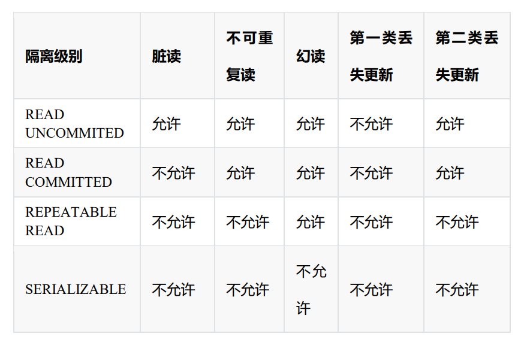

<!-- vscode-markdown-toc-config
	numbering=false
	autoSave=true
	/vscode-markdown-toc-config -->
<!-- /vscode-markdown-toc -->


## 事务
事务，即一系列将要发生或正在发生的连续操作。以 BEGIN TRANSACTION 开始，以 ROLLBACK/COMMIT 结束 多条 sql 语句，要么全部成功，要么全部失败。
一个数据库事务通常包含对数据库进行读或写的一个操作序列。它的存在包含有以下两个目的： 
1. 为数据库操作提供了一个从失败中恢复到正常状态的方法，同时提供了数据库即使在异常状态下仍能保持一致性的方法。  
2. 当多个应用程序在并发访问数据库时，可以在这些应用程序之间提供一个隔离方法，以防止彼此的操作互相干扰。 

### 事务特性 
一般来说，事务是必须满足 4 个条件（ACID）：原子性（Atomicity，或称不可分割性）、一致性（Consistency）、隔离性（Isolation，又称独立性）、持久性（Durability）。 

原子性（Atomicity）：一个事务（transaction）中的所有操作，要么全部完成，要么全部不完成，不会结束在中间某个环节。
事务在执行过程中发生错误，会被回滚（Rollback）到事务开始前的状态，就像这个事务从来没有执行过一样。 

一致性（Consistency）：在事务开始之前和事务结束以后，数据库的完整性没有被破坏。这表示写入的资料必须完全符合所有的预设规则，这包含资料的精确度、串联性以及后续数据库可以自发性地完成预定的工作。
事务执行的结果必须是使数据库从一个一致性状态变到另一个一致性状态。因此当数据库只包含成功事务提交的结果时，就说数据库处于一致性状态。
如果数据库系统运行中发生故障，有些事务尚未完成就被迫中断，这些未完成事务对数据库所做的修改有一部分已写入物理数据库，这时数据库就处于一种不正确的状态，或者说是不一致的状态。

隔离性（Isolation）：数据库允许多个并发事务同时对其数据进行读写和修改的能力，隔离性可以防止多个事务并发执行时由于交叉执行而导致数据的不一致。
事务隔离分为不同级别，包括读未提交（Read uncommitted）、读提交（read committed）、可重复读（repeatable read）和串行化（Serializable）。

持久性（Durability）：事务处理结束后，对数据的修改就是永久的，即便系统故障也不会丢失。 

### 事务控制语句
BEGIN 或 START TRANSACTION；显式地开启一个事务； 
COMMIT；也可以使用 COMMIT WORK，不过二者是等价的。COMMIT 会提交事务，并使已对数据库进行的所有修改成为永久性的； 
ROLLBACK；有可以使用 ROLLBACK WORK，不过二者是等价的。回滚会结束用户的事务，并撤销正在进行的所有未提交的修改； 
SAVEPOINT identifier；SAVEPOINT 允许在事务中创建一个保存点，一个事务中可以有多个 SAVEPOINT； 
RELEASE SAVEPOINT identifier；删除一个事务的保存点，当没有指定的保存点时，执行该语句会抛出一个异常； 
ROLLBACK TO identifier；把事务回滚到标记点； 
SET TRANSACTION；用来设置事务的隔离级别。InnoDB 存储引擎提供事务的
隔离级别有 READ UNCOMMITTED、READ COMMITTED、REPEATABLE READ 和 SERIALIZABLE。 

事务操作，分为两种：自动事务（默认的），手动事务。 


### MYSQL 事务处理主要有两种方法 
1、用 BEGIN, ROLLBACK, COMMIT 来显式实现
 BEGIN 开始一个事务 
 ROLLBACK 事务回滚 
 COMMIT 事务确认 
2、直接用 SET 来改变 MySQL 的自动提交模式: 
 SET AUTOCOMMIT=0 禁止自动提交,意味着如果你只执行一个 select 语句，这个事务就启动了，而且并不会自动提交。这个事务持续存在直到你主动执行 commit 或 rollback 语句，或者断开连接。 
 SET AUTOCOMMIT=1 开启自动提交 

### 事务过程
接下来，我们简单分析一下 MySQL 的操作过程： 
Step 1：客户端与服务端建立连接，同时开启一个临时的事务日志，此事务日志只作用于当前用户的当次连接； 
Step 2：在客户端用 SQL 语句执行写操作，客户端收到 SQL 语句，执行，将结果直接写入到数据表，并将数据表同步到数据库； 
Step 3：我们在客户端开启事务，则服务端原来的操作机制被改变，后续所有操作都会被先写入到临时日志文件； 
Step 4：在客户端执行 SQL 语句（例如写操作），服务端收到 SQL 语句，执行，将结果写入到临时日志文件，并不将结果同步到数据库； 
Step 5：在客户端执行查询操作，服务端直接从临时日志文件中捞取数据，返回给客户端； 
Step 6：在客户端执行 commit 或者 rollback 命令，清空临时日志文件，如果是commit 命令，则将结果同步到数据库；如果是 rollback 命令，则不同步。 
MySQL 使用的默认存储引擎是 InnoDB，而 InnoDB 默认使用的锁机制是行锁（锁住操作的当前行），但是如果在事务操作的过程中，我们没有使用索引字段，那么系统就会自动进行全表检索，也就是其自动将行锁升级为表锁（锁住操作的当前表）。  


### 事务的实现原理 
事务是基于重做日志文件(redo log)和回滚日志(undo log)实现的。 
每提交一个事务必须先将该事务的所有日志写入到重做日志文件进行持久化，数据库就可以通过重做日志来保证事务的原子性和持久性。 
每当有修改事务时，还会产生 undo log，如果需要回滚，则根据 undo log 的反向语句进行逻辑操作，比如 insert 一条记录就 delete 一条记录。
undo log 主要实现数据库的一致性。 

MySQL 事务日志介绍下 
innodb 事务日志包括 redo log 和 undo log。
undo log 指事务开始之前，在操作任何数据之前，首先将需操作的数据备份到一个地方。redo log 指事务中操作的任何数据，将最新的数据备份到一个地方。 
事务日志的目的：实例或者介质失败，事务日志文件就能派上用场。
redo log
redo log 不是随着事务的提交才写入的，而是在事务的执行过程中，便开始写入 redo 中。具体的落盘策略可以进行配置 。
防止在发生故障的时间点，尚有脏页未写入磁盘，在重启 MySQL 服务的时候，根据 redo log 进行重做，从而达到事务的未入磁盘数据进行持久化这一特性。RedoLog 是为了实现事务的持久性而出现的产物。 

MySQL 里经常说到的 WAL 技术，WAL 的全称是 Write-Ahead Logging，它的关键点就是先写日志，再写磁盘；
具体来说，当有一条记录需要更新的时候，InnoDB 引擎就会先把记录写到 redo log 里面，并更新内存，这个时候更新就算完成了。
同时，InnoDB 引擎会在适当的时候，将这个操作记录更新到磁盘里面，而这个更新往往是在系统比较空闲的时候做。
InnoDB 的 redo log 是固定大小的，比如可以配置为一组 4 个文件，每个文件的大小是 1GB，那么这块 redo log 总共就可以记录 4GB 的操作。
从头开始写，写到末尾就又回到开头循环写，如下面这个图所示。

write pos 是当前记录的位置，一边写一边后移，写到第 3 号文件末尾后就回到 0 号文件开头。
checkpoint 是当前要擦除的位置，也是往后推移并且循环的，擦除记录前要把记录更新到数据文件。
write pos 和 checkpoint 之间的是“粉板”上还空着的部分，可以用来记录新的操作。
如果 write pos 追上 checkpoint，表示“粉板”满了，这时候不能再执行新的更新，得停下来先擦掉一些记录，把 checkpoint 推进一下。 
有了 redo log，InnoDB 就可以保证即使数据库发生异常重启，之前提交的记录都不会丢失，这个能力称为 crash-safe。
redo log 主要节省的是随机写磁盘的 IO 消耗（转成顺序写），而 change buffer主要节省的则是随机读磁盘的 IO 消耗。
当内存数据页跟磁盘数据页内容不一致的时候，我们称这个内存页为“脏页”。内存数据写入到磁盘后，内存和磁盘上的数据页的内容就一致了，称为“干净页”。 
undo log
undo log 用来回滚行记录到某个版本。事务未提交之前，Undo 保存了未提交之前的版本数据，Undo 中的数据可作为数据旧版本快照供其他并发事务进行快照读。
是为了实现事务的原子性而出现的产物,在 MySQL innodb 存储引擎中用来实现多版本并发控制。 


### 3 类数据读取问题
#### 脏读 
如果一个事务 A 对数据进行了更改，但是还没有提交，而另一个事务 B 就可以读到事务 A 尚未提交的更新结果。
这样，当事务 A 进行回滚时，那么事务 B 开始读到的数据就是一笔脏数据。 

#### 不可重复读 
事务内多次查询相同条件返回的结果不同。指在一个事务内多次读同一数据。在这个事务还没有结束时，另一个事务也访问该数据。
那么，在第一个事务中的两次读数据之间，由于第二个事务的修改导致第一个事务两次读取的数据可能不太一样。
这就发生了在一个事务内两次读到的数据是不一样的情况，因此称为不可重复读。 

#### 幻读 
事务 A 在前后两次查询同一个范围的时候，后一次查询看到了前一次查询没有看到的行，发现其中插入了被事务 B 提交的行。 

不可重复读和幻读区别： 不可重复读的重点是修改。比如多次读取一条记录发现其中某些列的值被修改，幻读的重点在于新增或者删除比如多次读取一条记录发现记录增多或减少了。 

 
#### 幻读是怎么解决的
如图所示，分成了 3 个区间，(负无穷,10]、(10,30]、(30,正无穷]，在这 3 个区间是可以加间隙锁的。


我用下面的两个事务演示一下加锁过程。


在事务 A 提交之前，事务 B 的插入操作只能等待，这就是间隙锁起得作用。
当事务 A 执行 update user set name='风筝 2 号’ where age = 10; 的时候，由于条件where age =10，数据库不仅在 age =10 的行上添加了行锁，而且在这条记录的两
边，也就是(负无穷,10]、(10,30]这两个区间加了间隙锁，从而导致事务 B 插入操作无法完成，只能等待事务 A 提交。不仅插入 age =10 的记录需要等待事务 A 提交，age<10、10<age<30 的记录页无法完成，而大于等于 30 的记录则不受影响，这足以解决幻读问题了。 
这是有索引的情况，如果 age 不是索引列，那么数据库会为整个表加上间隙锁。
所以，如果是没有索引的话，不管 age 是否大于等于 30，都要等待事务 A 提交才可以成功插入。 

MySQL InnoDB 引擎的默认隔离级别虽然是「可重复读」，但是它很大程度上避免幻读现象（并不是完全解决了），解决的方案有两种：
1. 针对快照读（普通 select 语句），是通过 MVCC 方式解决了幻读，因为可重复读隔离级别下，事务执行过程中看到的数据，
一直跟这个事务启动时看到的数据是一致的，即使中途有其他事务插入了一条数据，是查询不出来这条数据的，所以就很好了避免幻读问题。
2. 针对当前读（select ... for update 等语句），是通过 next-key lock（记录锁+间隙锁）方式解决了幻读，
因为当执行 select ... for update 语句的时候，会加上 next-key lock，如果有其他事务在 next-key lock 锁范围内插入了一条记录，
那么这个插入语句就会被阻塞，无法成功插入，所以就很好了避免幻读问题。

下面这个场景也会发生幻读现象。(未完全解决幻读)
T1 时刻：事务 A 先执行「快照读语句」：select * from t_test where id > 100 得到了 3 条记录。
T2 时刻：事务 B 往插入一个 id= 200 的记录并提交；
T3 时刻：事务 A 再执行「当前读语句」 select * from t_test where id > 100 for update 就会得到 4 条记录，此时也发生了幻读现象。

### 2 类数据更新问题 
第 1 类丢失更新：事务 A 撤销时，把已经提交的事务 B 的更新数据覆盖了。 

第 2 类丢失更新：事务 A 覆盖事务 B 已经提交的数据，造成事务 B 所做的操作丢失。 

 
 
### 事务隔离级别
事务隔离机制的实现基于锁机制和并发调度。 
其中并发调度使用的是 MVCC（多版本并发控制），通过保存修改的旧版本信息来支持并发一致性读和回滚等特性。 
不同的隔离级别有不同的现象，并有不同的锁定/并发机制，隔离级别越高，数据库的并发性就越差。 
InnoDB 存储引擎在分布式事务的情况下一般会用到 SERIALIZABLE(可串行化)隔离级别。 

Read Uncommitted(读未提交)：可以读取其他 session 未提交的脏数据。一个事务还没提交时，它做的变更就能被别的事务看到。读取未提交的数据，也被称之为脏读（Dirty Read）。 

Read Committed(读已提交)：提交后，其他会话可以看到提交的数据。允许不可重复读取，但不允许脏读取。 

Repeatable Read(可重复读)：一个事务执行过程中看到的数据，总是跟这个事务在启动时看到的数据是一致的。
别人改数据的事务已经提交，我在我的事务中也不去读。可重复读隔离级别，事务 T 启动的时候会创建一个视图 read-view，之后事务 T 执行期间，即使有其他事务修改了数据，事务 T 看到的仍然跟在启动时看到的一样。
MySQL 默认采用的 REPEATABLE_READ 隔离级别。禁止不可重复读取和脏读取、以及幻读(innodb 独有)。 

Serializable(可串行化)：事务只能一个接着一个地执行，但不能并发执行。事务隔离级别最高。 

持久性是通过 redo log （重做日志）来保证的；
原子性是通过 undo log（回滚日志） 来保证的；
隔离性是通过 MVCC（多版本并发控制） 或锁机制来保证的；
一致性则是通过持久性+原子性+隔离性来保证；

查看事务隔离级别设置值 
mysql> show variables like 'transaction_isolation'; 
或者 

mysql> SELECT @@tx_isolation; 
+-----------------+ 
| @@tx_isolation | 
+-----------------+ 
| REPEATABLE-READ | 
+-----------------+


 
### 当前读和快照读 
当前读 
读取的是最新版本，像 UPDATE、DELETE、INSERT、SELECT ... LOCK IN SHARE MODE、SELECT ... FOR UPDATE 这些操作都是一种当前读。
为什么叫当前读？
就是它读取的是记录的最新版本，读取时还要保证其他并发事务不能修改当前记录，会对读取的记录进行加锁。 

快照读 
读取的是快照版本，也就是历史版本，像不加锁的 SELECT 操作就是快照读，即不加锁的非阻塞读；
快照读的前提是隔离级别不是未提交读和序列化读级别，因为未提交读总是读取最新的数据行，而不是符合当前事务版本的数据行，而序列化读则会对表加锁。 

共享锁 
多个事务对于同一数据可以共享一把锁，都能访问到数据，但是只能读不能修改。 

事务隔离级别
未提交读（RU）实现方式：事务对当前被读取的数据不加锁，都是当前读；事务在更新某数据的瞬间（就是发生更新的瞬间），必须先对其加行级共享锁，直到事务结束才释放。

提交读（RC） 实现方式：事务对当前被读取的数据不加锁，且是快照读；事务在更新某数据的瞬间（就是发生更新的瞬间），必须先对其加行级排他锁（Record），直到事务结束才释放。 通过快照，在这个级别 MySQL 就解决了不可重复读的问题

可重复读（RR）实现方式：事务对当前被读取的数据不加锁，且是快照读；事务在更新某数据的瞬间（就是发生更新的瞬间），必须先对其加行级排他锁（Record，GAP，Next-Key），直到事务结束才释放。通过间隙锁，在这个级别 MySQL 就解决了幻读的问题

序列化读（S）实现方式： 事务在读取数据时，必须先对其加表级共享锁，直到事务结束才释放，都是当前读；事务在更新数据时，必须先对其加表级排他锁，直到事务结束才释放。 

同一个事务的所有更新操作，都是可见的。事务隔离性，隔离的是其他事务，不隔离自己人。

对于「读提交」和「可重复读」隔离级别的事务来说，它们是通过 Read View 来实现的，它们的区别在于创建 Read View 的时机不同：
「读提交」隔离级别是在每个 select 都会生成一个新的 Read View，也意味着，事务期间的多次读取同一条数据，前后两次读的数据可能会出现不一致，因为可能这期间另外一个事务修改了该记录，并提交了事务。
「可重复读」隔离级别是启动事务时生成一个 Read View，然后整个事务期间都在用这个 Read View，这样就保证了在事务期间读到的数据都是事务启动前的记录。
这两个隔离级别实现是通过「事务的 Read View 里的字段」和「记录中的两个隐藏列」的比对，来控制并发事务访问同一个记录时的行为，这就叫 MVCC（多版本并发控制）。


### MVCC
MVCC 是为了解决事务操作中多线程并发安全问题的无锁并发控制技术，它的全称是 Multi-Version Concurrency Control，中文翻译过来就叫多版本并发控制，简称 MVCC。  
为什么需要 MVCC？ 
对于 MVCC 的理解，可以根据数据库的三种并发场景来分析。 
1. 第一种是读和读的并发，就是两个线程 A 和 B，同时进行读操作，这种情况下不会产生并发问题，也不需要并发控制。 
2. 第二种就是读写并发，就是两个线程 A 和 B 在同一时刻分别进行读写操作，这种情况下，可能会造成事务隔离性问题，还可能遇到脏读、幻读和不可重复读的问题。 
3. 第三种是写和写的并发，也就是两个线程 A 和 B 同时进行写操作，这种情况下可能出现数据更新丢失的问题； 
MVCC 相当于是为每个修改保存⼀个版本，版本与事务时间戳关联，读操作只读该事务开始前的数据库的快照。它是通过数据库记录中的隐式字段、Undo 日志、Read View 来实现的。 

MVCC 能解决什么问题？ 
根据以上的分析，我总结一下 MVCC 可以为数据库解决以下三个方面的问题 
1. 在并发读写数据库时，可以做到在读操作时不用阻塞写操作，写操作也不用阻塞读操作，从而提高数据库的并发读写的处理能力。 
2. 能实现读一致性，从而解决脏读、幻读、不可重复读等事务隔离问题，但是不能解决数据更新丢失的问题。 
3. 采用乐观锁或者悲观锁用来解决写和写的冲突，从而最大程度地去提高数据库的并发性能。 

MVCC 实现原理 
为了实现可重复读，Mysql 采用 MVCC(多版本并发控制)的方式； 
同一条记录在系统中可以存在多个版本，这就是 MVCC; 
MVCC 的实现，是通过保存数据在某个时间点的快照来实现的。根据事务开始的时间不同，每个事务对同一张表，同一时刻看到的数据可能是不一样的。 

对于 InnoDB ，聚簇索引记录中包含 3 个隐藏的列：
1. ROW ID：隐藏的自增 ID，如果表没有主键，InnoDB 会自动按 ROW ID 产生一个聚集索引树。 
2. 事务 ID：记录最后一次修改该记录的事务 ID。 
3. 回滚指针：指向这条记录的上一个版本。

我们拿上面的例子，对应解释下 MVCC 的实现原理，如下图：

如图，首先 insert 语句向表 t1 中插入了一条数据，a 字段为 1，b 字段为 1， ROW ID 也为 1 ，事务 ID 假设为 1，回滚指针假设为 null。
当执行 update t1 set b=666 where a=1 时，大致步骤如下： 
数据库会先对满足 a=1 的行加排他锁；然后将原记录复制到 undo 表空间中；修改 b 字段的值为 666，修改事务 ID 为 2； 
并通过隐藏的回滚指针指向 undo log 中的历史记录； 事务提交，释放前面对满足 a=1 的行所加的排他锁。 
在前面实验的第 6 步中，session2 查询的结果是 session1 修改之前的记录，这个记录就是来自 undolog 中。 

因此可以总结出 MVCC 实现的原理大致是： 
InnoDB 每一行数据都有一个隐藏的回滚指针，用于指向该行修改前的最后一个历史版本，这个历史版本存放在 undo log 中。
如果要执行更新操作，会将原记录放入 undo log 中，并通过隐藏的回滚指针指向 undo log 中的原记录。
其它事务此时需要查询时，就是查询 undo log 中这行数据的最后一个历史版本。 
update 语句，有索引情况，直接对行数据加锁；update user set age=11 where id = 1 
update 语句，无索引情况，MySQL 会为这张表中所有行加行锁，没错，是所有行。但是呢，在加上行锁后，MySQL 会进行一遍过滤，发现不满足的行就释放锁，最终只留下符合条件的行；update user set age=11 where age=10 


### read view在MVCC里如何工作？
Read View 有四个重要的字段：

m_ids：指的是在创建 Read View 时，当前数据库中「活跃事务」的事务 id 列表，注意是一个列表，“活跃事务”指的就是，启动了但还没提交的事务。

min_trx_id：指的是在创建 Read View 时，当前数据库中「活跃事务」中事务 id 最小的事务，也就是 m_ids 的最小值。

max_trx_id：这个并不是 m_ids 的最大值，而是创建 Read View 时当前数据库中应该给下一个事务的 id 值，也就是全局事务中最大的事务 id 值 + 1；

creator_trx_id：指的是创建该 Read View 的事务的事务 id。


对于使用 InnoDB 存储引擎的数据库表，它的聚簇索引记录中都包含下面两个隐藏列：
trx_id，当一个事务对某条聚簇索引记录进行改动时，就会把该事务的事务 id 记录在 trx_id 隐藏列里；
roll_pointer，每次对某条聚簇索引记录进行改动时，都会把旧版本的记录写入到 undo 日志中，然后这个隐藏列是个指针，指向每一个旧版本记录，于是就可以通过它找到修改前的记录。

一个事务去访问记录的时候，除了自己的更新记录总是可见之外，还有这几种情况：

如果记录的 trx_id 值小于 Read View 中的 min_trx_id 值，表示这个版本的记录是在创建 Read View 前已经提交的事务生成的，所以该版本的记录对当前事务可见。

如果记录的 trx_id 值大于等于 Read View 中的 max_trx_id 值，表示这个版本的记录是在创建 Read View 后才启动的事务生成的，所以该版本的记录对当前事务不可见。

如果记录的 trx_id 值在 Read View 的 min_trx_id 和 max_trx_id 之间，需要判断 trx_id 是否在 m_ids 列表中：

如果记录的 trx_id 在 m_ids 列表中，表示生成该版本记录的活跃事务依然活跃着（还没提交事务），所以该版本的记录对当前事务不可见。

如果记录的 trx_id 不在 m_ids列表中，表示生成该版本记录的活跃事务已经被提交，所以该版本的记录对当前事务可见。

这种通过「版本链」来控制并发事务访问同一个记录时的行为就叫 MVCC（多版本并发控制）。


### 可重复读下，快照是在什么时候生成的，是事务启动时，还是语句执行前
在 MySQL 有两种开启事务的命令，分别是：

第一种：begin/start transaction 命令；

第二种：start transaction with consistent snapshot 命令；

这两种开启事务的命令，创建 read view 的时机是不同的：

执行了 begin/start transaction 命令后，并不会创建 read view，只有在第一次执行 select 语句后， 才会创建 read view。

执行了 start transaction with consistent snapshot 命令，就会马上创建 read view。


## MySQL 执行查询的过程
1. 客户端通过 TCP 连接发送连接请求到 MySQL 连接器，连接器会对该请求进行权限验证及连接资源分配； 
2. 查缓存。（当判断缓存是否命中时，MySQL 不会进行解析查询语句，而是直接使用 SQL 语句和客户端发送过来的其他原始信息。所以，任何字符上的不同，例如空格、注解等都会导致缓存的不命中。在 MySQL 8.0 版本已经将查询缓存删除，也就是说 MySQL 8.0 版本后不存在此功能。） 
3. 分析器，对 SQL 进行词法分析和语法分析。 如何把语句给到预处理器，检查数据表和数据列是否存在，解析别名看是否存在歧义。此阶段只是做一些 SQL 解析，语法校验。所以一般语法错误在此阶段。判断查询的 SQL 字段是否存在也是在这步； 
4. 优化器。是否使用索引，生成执行计划。是在表里有多个索引的时候，决定使用哪个索引；或者一个语句中存在多表关联的时候（join），决定各个表的连接顺序。 
5. 执行器，去引擎层取数据，将数据保存到结果集中，同时会逐步将数据缓存到查询缓存中，最终将结果集返回给客户端。 


### 连接器
连接器负责跟客户端建立连接、获取权限、维持和管理连接。 
连接命令一般这样写： 
mysql -h$ip -P$port -u$user -p 
连接命令中的 mysql 是客户端工具，用来跟服务端建立连接。在完成经典的TCP 握手后，连接器就要开始认证你的身份，这个时候用的就是你输入的用户名和密码。 
 如果用户名或密码不对，你就会收到一个"Access denied for user"的错误，然后客户端程序结束执行。 
 如果用户名密码认证通过，连接器会到权限表里面查出你拥有的权限。之后，这个连接里面的权限判断逻辑，都将依赖于此时读到的权限。 
连接完成后，如果没有后续动作，这个连接处于空闲状态，show processlist 可以看到；Command 显示 sleep 表示现在系统中有个空闲连接； 
客户端长时间没有动静，连接器就会自动断开，这个参数由 wait_timeout 控制器； 数据库里面，长连接是指连接成功后，如果客户端持续有请求，则一直使用同一个连接。短连接则是指每次执行完很少的几次查询就断开连接，下次查询再重新建立一个。 

### 查询缓存
MySQL 拿到一个查询请求后，会先到查询缓存看看，之前是不是执行过这条语句。之前执行过的语句及其结果可能会以 key-value 对的形式，被直接缓存在内存中。
key 是查询的语句，value 是查询的结果。如果你的查询能够直接在这个缓存中找到 key，那么这个 value 就会被直接返回给客户端。 
如果语句不在查询缓存中，就会继续后面的执行阶段。执行完成后，执行结果会被存入查询缓存中。 
查询缓存的失效非常频繁，只要有对一个表的更新，这个表上所有的查询缓存都会被清空。因此很可能你费劲地把结果存起来，还没使用呢，就被一个更新全清空了。
对于更新压力大的数据库来说，查询缓存的命中率会非常低。除非你的业务就是有一张静态表，很长时间才会更新一次。比如，一个系统配置表，那这张表上的查询才适合使用查询缓存。好在 MySQL 也提供了这种“按需使用”的方式。
你可以将参数 query_cache_type设置成 DEMAND，这样对于默认的 SQL 语句都不使用查询缓存。
MySQL 8.0 版本直接将查询缓存的整块功能删掉了，也就是说 8.0 开始彻底没有这个功能了。


### 分析器 
分析器先会做“词法分析”。你输入的是由多个字符串和空格组成的一条 SQL 语句，MySQL 需要识别出里面的字符串分别是什么，代表什么。
MySQL 从你输入的"select"这个关键字识别出来，这是一个查询语句。它也要把字符串“T”识别成“表名 T”，把字符串“ID”识别成“列 ID”。
做完了这些识别以后，就要做“语法分析”。根据词法分析的结果，语法分析器会根据语法规则，判断你输入的这个 SQL 语句是否满足 MySQL 语法。 
如果你的语句不对，就会收到“You have an error in your SQL syntax”的错误提醒。
比如下面这个语句 select 少打了开头的字母“s”。 
mysql> elect * from t where ID=1; 
ERROR 1064 (42000): You have an error in your SQL syntax; check the manual that corresponds to your MySQL server version for the right syntax to use near 'elect * from t where ID=1' at line 1 
一般语法错误会提示第一个出现错误的位置，所以你要关注的是紧接“use near” 的内容。 


### 优化器 
经过了分析器，MySQL 就知道你要做什么了。在开始执行之前，还要先经过优化器的处理。
优化器是在表里面有多个索引的时候，决定使用哪个索引；或者在一个语句有多表关联（join）的时候，决定各个表的连接顺序。
选择索引是优化器的工作。优化器选择索引的目的，是找到一个最优的执行方案，并用最小的代价去执行语句。
在数据库里面，扫描行数是影响执行代价的因素之一。扫描的行数越少，意味着访问磁盘数据的次数越少，消耗的 CPU 资源越少。
扫描行数并不是唯一的判断标准，优化器还会结合是否使用临时表、是否排序等因素进行综合判断。
CREATE TABLE `t` (
  `id` int(11) NOT NULL, 
  `a` int(11) DEFAULT NULL, 
  `b` int(11) DEFAULT NULL, 
  PRIMARY KEY (`id`), 
  KEY `a` (`a`), 
  KEY `b` (`b`) 
) ENGINE=InnoDB； 

select * from t where a between 10000 and 20000; 
对于上面的 select 语句，优化器的选择逻辑是： 
如果使用索引 a，每次从索引 a 上拿到一个值，都要回到主键索引上查出整行数据，这个代价优化器也要算进去的。
而如果选择扫描 10 万行，是直接在主键索引上扫描的，没有额外的代价。 
优化器会估算这两个选择的代价，从结果看来，优化器认为直接扫描主键索引更快。当然，从执行时间看来，这个选择并不是最优的。 


### 执行器 
MySQL 通过分析器知道了你要做什么，通过优化器知道了该怎么做，于是就进入了执行器阶段，开始执行语句。 
开始执行的时候，要先判断一下你对这个表 T 有没有执行查询的权限，如果没有，就会返回没有权限的错误，
如下所示 (在工程实现上，如果命中查询缓存，会在查询缓存返回结果的时候，做权限验证。查询也会在优化器之前调用 precheck 验证权限)。 
mysql> select * from T where ID=10; 
ERROR 1142 (42000): SELECT command denied to user 'b'@'localhost' for table 'T' 
如果有权限，就打开表继续执行。打开表的时候，执行器就会根据表的引擎定义， 去使用这个引擎提供的接口。 
比如我们这个例子中的表 T 中，ID 字段没有索引，那么执行器的执行流程是这样的： 
1. 调用 InnoDB 引擎接口取这个表的第一行，判断 ID 值是不是 10，如果不是则跳过，如果是则将这行存在结果集中； 
2. 调用引擎接口取“下一行”，重复相同的判断逻辑，直到取到这个表的最后一行。 
3. 执行器将上述遍历过程中所有满足条件的行组成的记录集作为结果集返回给客户端。 
至此，这个语句就执行完成了。 
对于有索引的表，执行的逻辑也差不多。第一次调用的是“取满足条件的第一行”这个接口，之后循环取“满足条件的下一行”这个接口，这些接口都是引擎中已经定义好的。 
你会在数据库的慢查询日志中看到一个 rows_examined 的字段，表示这个语句执行过程中扫描了多少行。这个值就是在执行器每次调用引擎获取数据行的时候累加的。 
在有些场景下，执行器调用一次，在引擎内部则扫描了多行，因此引擎扫描行数跟 rows_examined 并不是完全相同的。 


## 索引 
索引指系统根据某种算法，将已有的数据（未来可能新增的数据），单独建立一个文件，这个文件能够实现快速匹配数据，并且能够快速的找到对应的记录 
官方介绍是帮助 Mysql 高效获取数据的数据结构；一般来说，索引本身也很大，不可能全部存储在内存中，索引往往存储在磁盘中的文件中(可能在单独的文件中，也可能是和数据一起存储在数据文件中。) 

使用索引的优点：
1. 大大加快了数据的检索速度； 
2. 可以显著减少查询中分组和排序的时间； 
3. 通过创建唯一性索引，可以保证数据库表中每一行数据的唯一性； 
4. 将随机 I/O 变为顺序 I/O（B+Tree 索引是有序的，会将相邻的数据都存储在一起） 

缺点：
1. 占用存储空间：索引会占用额外的存储空间，增加数据库的存储成本。
2. 维护成本高：随着数据的增删改查，索引需要不断更新和维护，增加数据库的维护成本。
3. 降低写入性能：对于频繁进行写操作的表，索引可能会降低写入性能，因为每次写入都需要更新索引。


### 索引的分类 
1. 普通索引 
2. 唯一索引 UNIQUE：索引列的值必须唯一，但允许有 null 且 null 可以出现多次； 
建表时，加上 unique(列名) 指定 
单独创建， create unique index idx_表名_列名 on 表名(列名) 
单独创建， alter table 表名 add unique 索引名(列名) 
3. 主键索引 PRIMARY KEY：数据库表中对储存数据对象予以唯一和完整标识的数据列或属性的组合。一个数据列只能有一个主键，必须唯一，不允许空值（是一种特殊的唯一索引；MySQL 创建主键时默认为聚集索引，但主键也可以是非聚集索引）； 
建表时，加上 primary key(列名) 指定 
4. 单列索引和多列索引/复合索引（Composite）：索引的列数； 
单列索引----即一个索引只包含单个列，一个表可以有多个单列索引； 
建表时，加上 key(列名) 指定 
单独创建， create index 索引名 on 表名(列名) 
单独创建， alter table 表名 add index 索引名(列名) 
复合索引----即一个索引包含多个列  
建表时，加上 key(列名列表) 指定 单独创建， create index 索引名 on 表名(列名列表) 
单独创建， alter table 表名 add index 索引名(列名列表) 
5. 覆盖（Covering）索引：索引包含了所有满足查询所需要的数据，查询的时候只需要读取索引而不需要回表读取数据； 
6. 聚集（Clustered）索引/非聚集索引：对磁盘上存放数据的物理地址重新组织以使这些数据按照指定规则排序的一种索引（数据的物理排列顺序和索引排列顺序一致）。因此每张表只能创建一个聚集索引（因为要改变物理存储顺序）。优点是
查询速度快，因为可以直接按照顺序得到需要数据的物理地址。缺点是进行修改的速度较慢。对于需要经常搜索范围的值很有效。非聚集索引只记录逻辑顺序，并不改变物理顺序； 
7. 虚拟索引（Virtual）：模拟索引的存在而不用真正创建一个索引，用于快速测试创建索引对执行计划的影响。没有相关的索引段，不增加存储空间的使用 

### 主键索引和唯一键索引区别 
1. 主键是一种约束，唯一索引是一种索引，两者在本质上是不同的。 
2. 主键创建后一定包含一个唯一性索引，唯一性索引并不一定就是主键。 
3. 唯一性索引列允许空值，而主键列不允许为空值。 
4. 主键列在创建时，已经默认为空值 + 唯一索引了。 
5. 主键可以被其他表引用为外键，而唯一索引不能。 
6. 一个表最多只能创建一个主键，但可以创建多个唯一索引。 
7. 主键更适合那些不容易更改的唯一标识，如自动递增列、身份证号等。 
8. 在 RBO 模式下，主键的执行计划优先级要高于唯一索引。 两者可以提高查询的速度。 

主键 超键 候选键 外键 
主键：数据库表中对存储数据对象予以唯一和完整标识的数据列或属性的组合。
一个数据列只能有一个主键，且主键的取值不能缺失，即不能为空值(Null). 
超键：在关系中能唯一标识元组的属性集称为关系模式的超键。一个属性可以作
为一个超键，多个属性组合在一起也可以作为一个超键。超键包含候选键和主键。 
候选键：是最小超键，即没有冗余元素的超键。 
外键：在一个表中存在的另一个表的主键称此表的外键。 
唯一键索引和普通索引的选择 
从这两种索引对查询语句和更新语句的性能影响来进行分析。 


### 创建索引时需要注意什么？ 
1. 只应建立在小字段上，而不要对大文本或图片建立索引（一页存储的数据越多一次 IO 操作获取的数据越大效率越高） 
2. 建立索引的字段应该非空，在 MySQL 中，含有空值的列很难进行查询优化，因为它们使得索引、索引的统计信息以及比较运算更加复杂。应该用 0、一个特殊的值或者一个空串代替 NULL； 
3. 选择数据密度大（唯一值占总数的百分比很大）的字段作索引； 
4. 当使用索引列进行查询的时候，尽量不要使用表达式，把计算放到业务层而不是数据库层; 
5. 尽量使用主键查询，而不是其它索引，因为主键查询不会触发回表操作； 
6. 使用索引扫描来进行排序； 
7. union、all、in、or 都能使用索引，但是推荐使用 in； 
8. 范围列可以使用到索引； 
9. 能使用 limit 的时候，尽量使用 limit； 
10. 单表索引建议控制在 5 个以内 
11. 单索引字段不允许超过 5 个（组合索引） 

## 在哪些地方适合创建索引？ 
某列经常作为最大最小值 MIN()， MAX()字段； 

经常被查询的字段； 

经常用作表连接的字段； 

在 where 里使用 >, >=, = , <, <=, is null 和 between 等字段。 

使用不以通配符开始的 like，where A like ‘China%’ 

经常出现在 ORDER BY/GROUP BY/DISDINCT 后面的字段 


## 为什么 MySQL 索引结构采用 B+树 
1、B 树和 B+树 
一般来说，数据库的存储引擎都是采用 B 树或者 B+树来实现索引的存储。首先来看 B 树，如图所示。

B 树是一种多路平衡树，用这种存储结构来存储大量数据，它的整个高度会相比二叉树来说，会矮很多。 
而对于数据库而言，所有的数据都将会保存到磁盘上，而磁盘 I/O 的效率又比较低，特别是在随机磁盘 I/O 的情况下效率更低。 
所以，高度决定了磁盘 I/O 的次数，磁盘 I/O 次数越少，对于性能的提升就越大，这也是为什么采用 B 树作为索引存储结构的原因，如图所示。
而 MySQL 的 InnoDB 存储引擎，它用了一种增强的 B 树结构，也就是 B+树来作为索引和数据的存储结构。相比较于 B 树结构来说，B+树做了两个方面的优化，如图所示。

1、B+树的所有数据都存储在叶子节点，非叶子节点只存储索引。 
2、叶子节点中的数据使用双向链表的方式进行关联。

MySQL 索引结构采用 B+树，有以下 4 个原因： 
1. 从磁盘 I/O 效率方面来看：B+树的非叶子节点不存储数据，所以树的每一层就能够存储更多的索引数量，
也就是说，B+树在层高相同的情况下，比 B 树的存储数据量更多，间接会减少磁盘 I/O 的次数。 
2. 从范围查询效率方面来看：B+树的所有存储在叶子节点的数据使用了双向链表来关联，所以 B+树在查询的时候只需查两个节点进行遍历就行，
而 B 树 需要获取所有节点，因此，B+树在范围查询上效率更高。 
3. 从全表扫描方面来看：因为，B+树的叶子节点存储所有数据，所以 B+树的全局扫描能力更强一些，因为它只需要扫描叶子节点。而 B 树需要遍历整个树。 
4. 从自增 ID 方面来看：基于 B+树的这样一种数据结构，如果采用自增的整型数据作为主键，还能更好的避免增加数据的时候，带来叶子节点分裂导致的大量运算的问题。 
 
 
## 为什么 B+ 树能够在 3 层容纳 2000 万条记录，以及为什么在 2000 万条数据上查询速度快
B+ 树是一种常用的数据库索引结构，它能够在大规模数据集上提供高效的查询性能。
下面解释为什么 B+ 树能够在 3 层容纳 2000 万条记录，以及为什么在 2000 万条数据上查询速度快。

1. B+ 树的结构特点：
   - B+ 树是一种平衡多路搜索树，每个节点可以包含多个键值对和指向子节点的指针。
   - B+ 树的阶数（order）决定了每个节点可以包含的最大键值对数量，通常用 m 表示。
   - 每个内部节点（非叶子节点）包含 m/2 到 m 个键值对，并且有 m/2+1 到 m+1 个子节点指针。
   - 所有的叶子节点都在同一层，并且通过指针连接成一个链表，便于范围查询和顺序遍历。

2. 容纳 2000 万条记录的原因：
   - 假设 B+ 树的阶数为 1000，即每个节点最多包含 1000 个键值对。
   - 在 3 层的 B+ 树中，根节点为第 1 层，叶子节点为第 3 层。
   - 第 1 层（根节点）：最多包含 1000 个键值对。
   - 第 2 层（内部节点）：最多包含 1000 × 1000 = 1,000,000 个键值对。
   - 第 3 层（叶子节点）：最多包含 1000 × 1000 × 1000 = 1,000,000,000 个键值对。
   - 因此，3 层的 B+ 树理论上可以容纳 10 亿条记录，远超 2000 万条。

3. 查询速度快的原因：
   - B+ 树的高度较低，通常只需要很少的节点访问次数就能找到目标数据。
   - 以 2000 万条记录为例，在 3 层的 B+ 树中，最坏情况下需要访问 3 个节点即可找到目标数据。
   - 每个节点的键值对是有序的，可以使用二分查找快速定位目标键值对。
   - 叶子节点之间通过指针连接，支持高效的范围查询和顺序遍历。
   - B+ 树的节点通常存储在磁盘上，但由于局部性原理，一次磁盘 I/O 可以读取整个节点的数据，减少了磁盘访问次数。

4. 与其他索引结构的比较：
   - 相比于二叉搜索树，B+ 树的阶数更高，每个节点可以包含更多的键值对，因此树的高度更低，查询效率更高。
   - 相比于哈希索引，B+ 树支持范围查询和顺序遍历，适用于更多的查询场景。
   - 相比于位图索引，B+ 树对于大规模数据集的查询性能更好，且支持动态插入和删除操作。

总之，B+ 树通过其多路平衡树的结构特点，以及高阶数和有序性的特性，能够在大规模数据集上提供高效的查询性能。


### 为什么使用 MySQL 的最左匹配原则 
最左匹配原则：最左优先，以最左边的为起点任何连续的索引都能匹配上。同时遇到范围查询(>、<、between、like)就会停止匹配。 
比如 a，b 建立索引时候，是先以 a 建立的索引，此时 b 是无序的，在以 a 建立之后的 a 的子树上再建立 b 的索引，所以对于整颗 b+树来说，a 是一定有序的，b 是不一定有序的 
当 b+树的数据项是复合的数据结构，比如(name,age,sex)的时候，b+数是按照从左到右的顺序来建立搜索树的，比如当(张三,20,F)这样的数据来检索的时候，b+树会优先比较 name 来确定下一步的所搜方向，如果 name 相同再依次比较 age 和 sex，最后得到检索的数据；
但当(20,F)这样的没有 name 的数据来的时候，b+ 树就不知道下一步该查哪个节点，因为建立搜索树的时候 name 就是第一个比较因子，必须要先根据 name 来搜索才能知道下一步去哪里查询。
比如当(张三,F)这样的数据来检索时，b+树可以用 name 来指定搜索方向，但下一个字段 age 的缺失，所以只能把名字等于张三的数据都找到，然后再匹配性别是 F 的数据了， 这个是非常重要的性质，即索引的最左匹配特性。 


### (A,B,C) 联合索引 select * from tbn where a=? and b in (?,?) and c>? 会走索引吗
对于给定的查询语句 `SELECT * FROM tbn WHERE a=? AND b IN (?,?) AND c>?`，让我们分析一下是否会走 (A,B,C) 联合索引。

1. 联合索引的特点：
   - 联合索引是按照多个列的顺序构建的索引。
   - 在查询时，联合索引可以用于匹配索引中的前缀列。
   - 联合索引的效率取决于查询条件与索引列的匹配程度。

2. 查询条件与索引的匹配情况：
   - 条件 `a=?` 匹配联合索引的第一个列 A，可以利用索引进行快速查找。
   - 条件 `b IN (?,?)` 匹配联合索引的第二个列 B，可以利用索引进行快速查找。
   - 条件 `c>?` 是一个范围条件，匹配联合索引的第三个列 C，可以利用索引进行范围扫描。

3. 是否会走索引的分析：
   - 给定的查询条件与联合索引的前缀列完全匹配，即条件 `a=?` 和 `b IN (?,?)` 匹配了索引的前两个列。
   - 条件 `c>?` 虽然是范围条件，但它匹配了索引的第三个列，可以在前两个条件的基础上进行范围扫描。
   - 由于查询条件与联合索引的匹配程度较高，数据库优化器很可能会选择走联合索引来加速查询。

4. 索引的使用效率：
   - 通过条件 `a=?` 和 `b IN (?,?)`，数据库可以快速定位到满足条件的索引范围。
   - 然后，在匹配的索引范围内，数据库可以根据条件 `c>?` 进行范围扫描，找到满足条件的记录。
   - 由于联合索引已经按照 (A,B,C) 的顺序排序，范围扫描可以高效地找到符合条件的记录。

综上所述，对于查询语句 `SELECT * FROM tbn WHERE a=? AND b IN (?,?) AND c>?`，如果表 `tbn` 存在联合索引 (A,B,C)，并且查询条件与索引的前缀列匹配，那么数据库优化器很可能会选择走该联合索引来加速查询。联合索引可以快速定位满足条件的记录范围，并通过范围扫描找到符合条件的记录，提高查询效率。

当然，实际的查询执行计划还会受到其他因素的影响，如表的数据量、数据分布、查询的选择性等。数据库优化器会根据统计信息和成本估算来选择最优的执行计划。但在给定的查询条件下，走联合索引 (A,B,C) 是一个很有可能被优化器选择的方案。


### 联合索引是什么?为什么需要注意联合索引中的顺序? 
MySQL 可以使用多个字段同时建立一个索引，做联合索引。
联合索引中,如果想要命中索引，要按照建立索引时的字段顺序挨个使用，则无法命中索引。  
具体原因为: MySQL 使用索引时需要索引有序，设现在建立了"name,age,school"
的联合索引,那么索引的排序为: 先按照 name 排序，如果 name 相同，按照 age 排序，如果 age 的值也相等,则按照 school 进行排序.
当进行查询时,此时索引仅仅按照 name 严格有序，此必须首先使用 name 字段进行等值查询,之后对于匹配到的列而言,其按照 age 字段严格有序，此时可以使用 age 字段用做索引查找,,,以此类推.
因此在建立联合索引的时候应该注意索引列的顺序，一般情况下，将查询需求频繁或者字段选择性高的列放在前面.
此外可以根据特例的查询或者表结构进行单独的调整。 

### mysql 的索引怎么使用（索引匹配方式） 
利用 B-Tree 索引进行全局关键字、关键字范围和关键字前缀的查询 

全值匹配 
全值匹配指的是和索引中所有的列进行匹配 
explain select * from staffs where name = 'July' and age = 23 and pos = 'dev' 
而我们建立了一个 包含 name、age、pos 的组合索引，使用上面的 SQL 语句，就会进行全值匹配 

匹配最左前缀 
只匹配前面的几列 
explain select * from staffs where name = 'July' and age = 23 
这个时候，只使匹配了前面两个列，而没有使用第三个列 

匹配列前缀 
可以匹配某一列值的开头部分 
explain select * from staffs where name = 'J%' 
explain select * from staffs where name = '%y' 

匹配范围值 
可以查找某个范围的数据 
explain select * from staffs where name > 'Mary' 
精确匹配某一列并范围匹配另外一列 
可以查询某一列的全部和第二列的部分 
explain select * from staffs where name = "July" and age > 25 

只访问索引的查询 
查询的时候值需要访问索引，不需要访问数据行，本质上就是索引覆盖 
explain select name,age,pos from staffs where name="July" and age=25 and pos = "dev" 


### 聚簇索引和非聚簇索引 
1、聚簇索引
所谓聚簇索引，就是指主索引文件和数据文件为同一份文件，聚簇索引主要用在Innodb 存储引擎中。
在该索引实现方式中 B+Tree 的叶子节点上的 data 就是数据本身，key 为主键，如果是一般索引的话，data 便会指向对应的主索引。 
在 InnoDB 中，只有主键索引是聚簇索引，如果没有主键，则挑选一个唯一键建立聚簇索引。如果没有唯一键，则隐式的生成一个键来建立聚簇索引。 
聚簇索引的优点 
 数据访问更快，因为聚簇索引将索引和数据保存在一个 B+树中，因此从聚簇索引中获取数据比非聚簇索引更快 
 聚簇索引对主键的排序和范围查找速度非常快 
聚簇索引的缺点 
 插入速度严重依赖于排序，按照主键的顺序插入是最快的方式，否者会出现页分裂，严重影响性能。因此，对于 InnoDB 表，我们一般都会定义一个自增的 ID 列作为主键 
 更新主键的代价很高，因为将会导致被更新的行移动，因此，对于 InnoDB 表，我们一般定义主键不可更新 
 二级索引访问需要两次索引查找，第一次找到主键值，第二次 根据主键值查找行数据，一般我们需要尽量避免出现索引的二次查找，这个时候，用到的就是索引的覆盖 
2、非聚簇索引 
非聚簇索引就是指 B+Tree 的叶子节点上的 data，并不是数据本身，而是数据存放的地址。主索引和辅助索引没啥区别，只是主索引中的 key 一定得是唯一的。
主要用在 MyISAM 存储引擎中。 非聚簇索引也被称为辅助索引，辅助索引在我们访问数据的时候总是需要两次查找。辅助索引叶子节点存储的不再是行的物理位置，而是主键值。通过辅助索引
首先找到主键值，然后在通过主键值找到数据行的数据页，在通过数据页中的Page Directory 找到数据行。 
InnoDB 辅助索引的叶子节点并不包含行记录的全部数据，叶子节点除了包含键值外，还包含了行数据的聚簇索引键。辅助索引的存在不影响数据在聚簇索引中的组织，所以一张表可以有多个辅助索引。在 InnoDB 中有时也称为辅助索引为二级索引  


### mysql 什么情况下不会使用索引 
1、如果 MySQL 估计使用索引比全表扫描更慢，则不适用索引， 
ex：列 key_part1 均匀的分布在 1-100 之间。下面的 sql 则不会使用索引 
select * from table_name where key_part1 > 1 and key_part1 <90 
2、如果使用 memory/heap 表，并且 where 语句中不适用“=”进行索引，则不会使用索引。heap 表只有在“=”的条件下，才使用索引。 
3、用 or 分割开的条件，如果 or 左右两个条件中有一个列没有索引，则不会使用索引。 
ex：select * from table_name where key1='a' or key2='b'；如果在 key1 上有索引而在 key2 上没有索引，则该查询也不会走索引 
4、复合索引，如果索引列不是复合索引的第一部分，则不使用索引（即不符合最左匹配原则/最左前缀原则，最左优先，eg：多列索引 col1、col2 和 col3，则索引生效的情形包括 col1 或 col1，col2 或 col1，col2，col3） 
ex：复合索引为(key1,key2) ，以下 sql 将不会使用索引 
select * from table_name where key2='b'； 
5、如果 like 是以‘%’开始的，则该列上的索引不会被使用。 
ex：select * from table_name where key1 like '%a'； 
6、如果列为字符串，则 where 条件中必须将字符常量值加引号，否则即使该列上存在索引，也不会被使用。 
ex：select * from table_name where key1=1; 如果 key1 列保存的是字符串，即使 key1 上有索引，也不会被使用。 
7、数据类型出现隐式转化（如varchar不加单引号的话可能会自动转换为int型）； 
8、使用不等于查询; 
9、列参与了数学运算或者函数; 
10、当使用联合索引,前面一个条件为范围查询,后面的即使符合最左前缀原则,也无法使用索引. 
从上面可以看出，即使我们建立了索引，也不一定会被使用，那么我们如何知道
我们索引的使用情况呢？ 在 MySQL 中，有 Handler_read_key 和 Handler_read_rnd_key 两个变量，
如果 Handler_read_key 值很高，而Handler_read_rnd_key 的值很低，则表明索引经常不被使用，应该重新考虑建立索引。
可以通过:show status like 'Handler_read%'来查看着连个参数的值. 


### 索引失效的情况
1. 对索引使用左或者左右模糊匹配；
当我们使用左或者左右模糊匹配的时候，也就是 like %xx 或者 like %xx% 这两种方式都会造成索引失效。
这是由于B+ 树是按照「索引值」有序排列存储的，只能根据前缀进行比较。
假设我们要查询 name 字段前缀为「林」的数据，也就是 name like '林%'，会在B+树的节点上依次比较索引值；
而使用 name like '%林' 方式来查询，因为查询的结果可能是「陈林、张林、周林」等之类的，所以不知道从哪个索引值开始比较，于是就只能通过全表扫描的方式来查询。
2. 对索引使用函数
select * from t_user where length(name)=6;  // name 为二级索引
因为索引保存的是索引字段的原始值，而不是经过函数计算后的值，自然就没办法走索引了。
3. 对索引进行表达式计算
select * from t_user where id + 1 = 10;
原因跟对索引使用函数差不多。
因为索引保存的是索引字段的原始值，而不是 id + 1 表达式计算后的值，所以无法走索引，只能通过把索引字段的取值都取出来，
然后依次进行表达式的计算来进行条件判断，因此采用的就是全表扫描的方式。
4. 对索引隐式类型转换
如果索引字段是字符串类型，但是在条件查询中，输入的参数是整型的话，你会在执行计划的结果发现这条语句会走全表扫描。
但是如果索引字段是整型类型，查询条件中的输入参数即使字符串，是不会导致索引失效，还是可以走索引扫描。
MySQL 在遇到字符串和数字比较的时候，会自动把字符串转为数字，然后再进行比较。
5. 联合索引非最左匹配
在联合索引的情况下，数据是按照索引第一列排序，第一列数据相同时才会按照第二列排序。
也就是说，如果我们想使用联合索引中尽可能多的列，查询条件中的各个列必须是联合索引中从最左边开始连续的列。如果我们仅仅按照第二列搜索，肯定无法走索引。
6. WHERE 子句中的 OR
在 WHERE 子句中，如果在 OR 前的条件列是索引列，而在 OR 后的条件列不是索引列，那么索引会失效。
这是因为 OR 的含义就是两个只要满足一个即可，因此只有一个条件列是索引列是没有意义的，只要有条件列不是索引列，就会进行全表扫描。


### 索引下推 
以市民表的联合索引（name, age）为例。
如果现在有一个需求：检索出表中“名字第一个字是张，而且年龄是 10 岁的所有男孩”。那么，SQL 语句是这么写的： 
mysql> select * from tuser where name like '张 %' and age=10 and ismale=1; 
这个语句在搜索索引树的时候，只能用 “张”，找到第一个满足条件的记录 ID3。
当然，这还不错，总比全表扫描要好。 然后呢？ 当然是判断其他条件是否满足。 
在 MySQL 5.6 之前，只能从 ID3 开始一个个回表。到主键索引上找出数据行，再对比字段值。 
而 MySQL 5.6 引入的索引下推优化（index condition pushdown)， 可以在索引遍历过程中，对索引中包含的字段先做判断，直接过滤掉不满足条件的记录，减少回表次数。 
图 3 和图 4，是这两个过程的执行流程图。 


在图 3 和 4 这两个图里面，每一个虚线箭头表示回表一次。 
图 3 中，在 (name,age) 索引里面我特意去掉了 age 的值，这个过程 InnoDB 并不会去看 age 的值，只是按顺序把“name 第一个字是’张’”的记录一条条取出来回表。因此，需要回表 4 次。 
图 4 跟图 3 的区别是，InnoDB 在 (name,age) 索引内部就判断了 age 是否等于 10，对于不等于 10 的记录，直接判断并跳过。在我们的这个例子中，只需要对 ID4、ID5 这两条记录回表取数据判断，就只需要回表 2 次。 


### 数据库主键使用自增主键、UUID、雪花算法ID 
##### 自增主键 
a. 字段长度较 uuid 小很多，可以是 bigint 甚至是 int 类型，占用空间小，易排序，在程序中传递也方便； 
b. 每次插入新的记录，记录就会索引到当前索引节点的位置，直接添加，要是一业务写满，就自动开辟一个新的页，提高写入的速度；
innodb 中的主键是聚簇索引，会把相邻主键的数据安放在相邻的物理存储上。它只需要一页一页地写，索引结构相对紧凑 0 磁盘碎片少，效率也高。
如果主键不是自增，而是随机的，那么频繁的插入会使 innodb 频繁地移动磁盘块，而影响写入性能。 
c. 如果通过非系统增加记录时，可以不用指定该字段，不用担心主键重复问题； 

缺点： 
a．如果存在大量的数据，可能会超出自增长的取值范围； 
b. 分库分表不友好； 
对于一些敏感数据，比如用户 id，订单 id，如果使用自增主键的话，外部通过抓包，很容易知道新进用户量，成单量这些信息，所以需要谨慎使用； 

##### UUID 
a. 地球唯一的 uuid，绝对不会冲突。数据拆分、合并存储的时候，能达到全局的唯一性； 
b. 可以在应用层生成，提高数据库吞吐能力； 
c. 是 string 类型，写代码的时候方便很多；

缺点： 
a. innodb 中的主键是聚簇索引，会把相邻主键的数据安放在相邻的物理存储上。 
如果主键不是自增，而是随机的，到来的 ID 与原来的大小不确定，会造成非常多的数据插入，那么频繁的插入会使 innodb 频繁地移动磁盘块，然后导致产生很多的内存碎片，而影响写入性能。 
b. uuid 占空间大， 如果你建的索引越多， 影响越严重； 
c. 读取出来的数据也是没有规律的，通常需要 order by，其实也很消耗数据库资源； 
分布式情况下，首选 uuid； 
 
##### SnowFlake
是一种介于自增长和 UUID 之间的一种主键（存储空间小、速度快、分布式、时间序列）它有如下优点 
1.所有生成的 id 按时间趋势递增； 
2.整个分布式系统内不会产生 ID 碰撞（重复 id，因为有 datacenterId 和 workerId来做区分）； 
3.id 生成的效率高； 


### 使用 B 树和 B+树的比较
InnoDB 的索引使用的是 B+树实现，B+树对比 B 树的好处： 
1. 磁盘 IO 次数少：B+树的非叶子节点只有其子树（根节点）中的最大（或最小）关键字和指向下一个节点的索引，数据都存在叶子结点中，所以同样大小的磁盘页可以容纳更多的节点元素，如此一来，相同数量的数据下，B+树就相对来说索引树更加矮胖，一次性读入内存中的需要查找的关键字也就越多； 
2. 范围查询效率更高：B+树所有叶子节点形成有序(自小而大)链表，便于范围查询。B 树需要中序遍历整个树，B+树只需要遍历叶结点中的链表； 
3. 查询效率更加稳定：B+树每次查询都需要从根结点到叶结点，路径长度相同，所以每次查询的效率都差不多，而 B 树每次查询则不一样，越靠近根节点的记录查找时间越快，只要找到关键字即可确定记录的存在，最好的情况是根节点，最坏的情况是叶子节点，没有 B+树稳定； 

磁盘 IO 
系统从磁盘读取数据到内存时是以磁盘块（block）为单位的，位于同一磁盘块中
的数据会被一次性读取出来，而不是需要什么取什么。InnoDB 存储引擎中有页
(Page)的概念，页是其磁盘管理的最小单位。InnoDB 每次申请磁盘空间时都会是
若干地址连续磁盘块来达到页的大小，InnoDB 在把磁盘数据读入到磁盘时会以
页为基本单位，在查询数据时如果一个页中每条数据都有助于定位数据记录的位
置，这将会减少磁盘 I/O 次数，提高效率。 
一句话说：就是多个块填充到一页大小 
 
B 树 

B+树 


### 使用哈希索引、有序数组、二叉搜索树、平衡二叉树、红黑树、B+树索引的比较

##### 哈希表 
哈希表是一种以键-值（key-value）存储数据的结构，我们只要输入待查找的值即key，就可以找到其对应的值即 Value。
哈希的思路很简单，把值放在数组里，用一个哈希函数把 key 换算成一个确定的位置，然后把 value 放在数组的这个位置。 
不可避免地，多个 key 值经过哈希函数的换算，会出现同一个值的情况。处理这种情况的一种方法是，拉出一个链表。 
数据存放不是有序的，增加元素速度很快，所以哈希索引做区间查询的速度是很慢的。
哈希表这种结构适用于只有等值查询的场景，比如 Memcached 及其他一些 NoSQL 引擎。
哈希索引能以 O(1) 时间进行查找，但是只支持精确查找，但是无法用于部分查找和范围查找，无法用于排序与分组； 
查询、插入、修改、删除的平均时间复杂度都是 O(1)；

1、哈希表是把索引字段映射成对应的哈希码然后再存放在对应的位置，这样的话，如果我们要进行模糊查找的话，显然哈希表这种结构是不支持的，只能遍历这个表。而 B+树则可以通过最左前缀原则快速找到对应的数据。  
2、如果我们要进行范围查找，例如查找 ID 为 100 ~ 400 的人，哈希表同样不支持，只能遍历全表。  
3、索引字段通过哈希映射成哈希码，如果很多字段都刚好映射到相同值的哈希码的话，那么形成的索引结构将会是一条很长的链表，这样的话，查找的时间就会大大增加。 
 
##### 有序数组
有序数组在等值查询和范围查询场景中的性能就都非常优秀。查询某个元素，用二分法就可以快速得到，这个时间复杂度是 O(log(N))。
同时很显然，这个索引结构支持范围查询。
如果仅仅看查询效率，有序数组就是最好的数据结构了。
但是，在需要更新数据的时候就麻烦了，你往中间插入一个记录就必须得挪动后面所有的记录，成本太高。
所以，有序数组索引只适用于静态存储引擎，比如你要保存的是 2017 年某个城市的所有人口信息，这类不会再修改的数据。 


##### 二叉搜索树 
二叉搜索树示意图如下所示： 

二叉搜索树的特点是：每个节点的左儿子小于父节点，父节点又小于右儿子。 
查询、插入、修改、删除的平均时间复杂度都是 O(log2 (n)) 
如果 ID 是持续递增的话，二叉搜索树又会退化到 O(n) 的时间复杂度。 


##### 平衡二叉树(AVL) 
可以是空树。假如不是空树，任何一个结点的左子树与右子树都是平衡二叉树，并且高度之差的绝对值不超过 1。 
结构图：

可以看出平衡二叉树的缺点就是维护平衡过程的成本代价很高，因为每次删除一个节点或者增加一个节点的话，需要一次或多次的左旋和右旋去维护平衡状态查询的效率不稳定，还要看运气的成分在里面； 
如果节点很多的话，那么这个 AVL 树的高度还是会很高的，查询效率会很低。 
从算法的数学逻辑来讲，二叉树的查找速度和比较次数都是最小的，那为什么我们选择 BTree?因为 AVL 还有一个问题，那就是磁盘 IO 的问题 
磁盘 IO 的次数，就是由树高来决定的，也即磁盘的 IO 次数最坏的情况下就等于树的高度。 
因为节点存储的数据太少，没有很好的利用操作系统和磁盘数据交换的特性，也没有利用好磁盘 IO 的预读能力。
因为操作系统和磁盘之间一次数据交换是以页为单位的，一页=4K，即每次 IO 操作系统会将 4K 数据加载镜像内存。
但是在二叉树每个节点的结构只保存一个关键字和数据区，两个子节点的引用，并不能填满 4K 的内容，辛辛苦苦的做了一次 IO 操作，却只加载了一个关键字，在树的高度很高，恰好要搜索的关键字位于叶子节点或支节点的时候，取一个关键字要做很多次的 IO。
因此平衡二叉树不太适合 MySQL 的查询结构。

解决方法 
我们需要解决的就是树的高度问题，导致磁盘 IO 过多，那么就需要将树进行压缩，也就是将原来的瘦高->矮胖，通过降低树的高度达到减少 IO 的次数。 

树可以有二叉，也可以有多叉。多叉树就是每个节点有多个儿子，儿子之间的大小保证从左到右递增。
二叉树是搜索效率最高的，但是实际上大多数的数据库存储却并不使用二叉树。其原因是，索引不止存在内存中，还要写到磁盘上。 
你可以想象一下一棵 100 万节点的平衡二叉树，树高 20。一次查询可能需要访问 20 个数据块。
在机械硬盘时代，从磁盘随机读一个数据块需要 10 ms 左右的寻址时间。
也就是说，对于一个 100 万行的表，如果使用二叉树来存储，单独访问一个行可能需要 20 个 10 ms 的时间，这个查询可真够慢的。 
为了让一个查询尽量少地读磁盘，就必须让查询过程访问尽量少的数据块。那么，我们就不应该使用二叉树，而是要使用“N 叉”树。
这里，“N 叉”树中的“N”取决于数据块的大小。 
以 InnoDB 的一个整数字段索引为例，这个 N 差不多是 1200。这棵树高是 4 的时候，就可以存 1200 的 3 次方个值，这已经 17 亿了。
考虑到树根的数据块总是在内存中的，一个 10 亿行的表上一个整数字段的索引，查找一个值最多只需要访问 3 次磁盘。其实，树的第二层也有很大概率在内存中，那么访问磁盘的平均次数就更少了。 
N 叉树由于在读写上的性能优点，以及适配磁盘的访问模式，已经被广泛应用在数据库引擎中了。 

##### 红黑树 


##### B+树 
在 InnoDB 中，表都是根据主键顺序以索引的形式存放的，这种存储方式的表称为索引组织表。 
每一个索引在 InnoDB 里面对应一棵 B+树。 
假设，我们有一个主键列为 ID 的表，表中有字段 k，并且在 k 上有索引。 
这个表的建表语句是： 
mysql> create table T( 
id int primary key,  
k int not null,  
name varchar(16), 
index (k))engine=InnoDB; 
表中 R1~R5 的 (ID,k) 值分别为 (100,1)、(200,2)、(300,3)、(500,5) 和 (600,6)，
两棵树的示例示意图如下。 

从图中不难看出，根据叶子节点的内容，索引类型分为主键索引和非主键索引。 
主键索引的叶子节点存的是整行数据。在 InnoDB 里，主键索引也被称为聚簇索引（clustered index）。 
非主键索引的叶子节点内容是主键的值。在 InnoDB 里，非主键索引也被称为二级索引（secondary index）。 

### 数据库为什么要用 B+树结构 
为什么使用 B+树？言简意赅，就是因为：
（1）索引文件很大，不可能全部存储在内存中，故要存储到磁盘上；
（2）索引的结构组织要尽量减少查找过程中磁盘 I/O 的存取次数（为什么使用B-/+Tree，还跟磁盘存取原理有关。） 
（3）局部性原理与磁盘预读，预读的长度一般为页（page）的整倍数，（在许多操作系统中，页得大小通常为 4k）。 
（4）数据库系统巧妙利用了磁盘预读原理，将一个节点的大小设为等于一个页，这样每个节点只需要一次 I/O 就可以完全载入，(由于节点中有两个数组，所以地址连续)。
而红黑树这种结构，h 明显要深的多。由于逻辑上很近的节点（父子）物理上可能很远，无法利用局部性。 
一般来说，索引本身也很大，不可能全部存储在内存中，因此索引往往以索引文件的形式存储的磁盘上。
当我们通过索引查找某行数据的时候，就需要先从磁盘读取索引到内存，再通过索引从磁盘中找到某行数据，然后读入到内存，也就是说查询过程中会发生多次磁盘 I/O，而磁盘 I/O 次数越多，所消耗的时间也就越大。
这样的话，索引查找过程中就要产生磁盘 I/O 消耗，相对于内存存取，I/O 存取的消耗要高几个数量级，所以评价一个数据结构作为索引的优劣最重要的指标就是在查找过程中磁盘 I/O 操作次数的渐进复杂度。
换句话说，索引的结构组织要尽量减少查找过程中磁盘 I/O 的存取次数。
对于 B-Tree 而言，可知检索一次最多需要访问 h 个节点。数据库系统的设计者巧妙利用了磁盘预读原理，将一个节点的大小设为等于一个页，这样每个节点只需要一次 I/O 就可以完全载入。
B 树的每个节点可以存储多个关键字，它将节点大小设置为磁盘页的大小，充分利用了磁盘预读的功能。每次读取磁盘页时就会读取一整个节点。
也正因每个节点存储着非常多个关键字，树的深度就会非常的小。进而要执行的磁盘读取操作次数就会非常少，更多的是在内存中对读取进来的数据进行查找。 
MySQL 默认的存储引擎 InnoDB 采用的是 B+ 作为索引的数据结构，原因有：
1. B+ 树的非叶子节点不存放实际的记录数据，仅存放索引，因此数据量相同的情况下，相比存储即存索引又存记录的 B 树，B+树的非叶子节点可以存放更多的索引，因此 B+ 树可以比 B 树更「矮胖」，查询底层节点的磁盘 I/O次数会更少。
2. B+ 树有大量的冗余节点（所有非叶子节点都是冗余索引），这些冗余索引让 B+ 树在插入、删除的效率都更高，比如删除根节点的时候，不会像 B 树那样会发生复杂的树的变化；
3. B+ 树叶子节点之间用链表连接了起来，有利于范围查询，而 B 树要实现范围查询，因此只能通过树的遍历来完成范围查询，这会涉及多个节点的磁盘 I/O 操作，范围查询效率不如 B+ 树。

### 为什么红黑树不适合做索引？
红黑树这种结构，h 明显要深的多。由于逻辑上很近的节点（父子）物理上可能很远，无法利用局部性，所以红黑树的 I/O 渐进复杂度也为 O(h)，效率明显比 B-Tree 差很多。
也就是说，使用红黑树（平衡二叉树）结构的话，每次磁盘预读中的很多数据是用不上的数据。因此，它没能利用好磁盘预读的提供的数据。
然后又由于深度大（较 B 树而言），所以进行的磁盘 IO 操作更多。 
B 树的查询，主要发生在内存中，而平衡二叉树的查询，则是发生在磁盘读取中。
因此，虽然 B 树查询查询的次数不比平衡二叉树的次数少，但是相比起磁盘 IO速度，内存中比较的耗时就可以忽略不计了。因此，B 树更适合作为索引。 
比 B 树更适合作为索引的结构是 B+树。MySQL 中也是使用 B+树作为索引。它是 B 树的变种，因此是基于 B 树来改进的。为什么 B+树会比 B 树更加优秀呢？ 
B 树：有序数组+平衡多叉树； B+树：有序数组链表+平衡多叉树； 
从 B-Tree 结构图中可以看到每个节点中不仅包含数据的 key 值，还有 data 值。
而每一个页的存储空间是有限的，如果 data 数据较大时将会导致每个节点（即一个页）能存储的 key 的数量很小，当存储的数据量很大时同样会导致 B-Tree 的深度较大，增大查询时的磁盘 I/O 次数，进而影响查询效率。
在 B+Tree 中，所有数据记录节点都是按照键值大小顺序存放在同一层的叶子节点上，而非叶子节点上只存储 key 值信息，这样可以大大加大每个节点存储的 key 值数量，降低B+Tree 的高度。 
B+树的关键字全部存放在叶子节点中，非叶子节点用来做索引，而叶子节点中有一个指针指向一下个叶子节点。做这个优化的目的是为了提高区间访问的性能。
而正是这个特性决定了 B+树更适合用来存储外部数据。
数据库索引采用 B+树的主要原因是 B 树在提高了磁盘 IO 性能的同时并没有解决元素遍历的效率低下的问题。正是为了解决这个问题，B+树应运而生。
B+树只要遍历叶子节点就可以实现整棵树的遍历。而且在数据库中基于范围的查询是非常频繁的，而 B 树不支持这样的操作（或者说效率太低）。 

### 回表 
建立几个索引，就会生成几棵 B+Tree，但是带有原始数据行的 B+Tree 只有一棵，另外一棵树上的叶子节点带的是主键值。 
当我们创建了两个索引时，一个是主键，一个是 name，它还会在生成一棵 B+Tree，这棵树的叶子节点存放的是主键。
当我们通过 name 进行查找的时候，会得到一个主键，然后在通过主键再去上面的这个主键 B+Tree 中进行查找，我们称这个操作为 ==回表== 
回表就是通过普通列的索引进行检索，然后再去主键列进行检索，这个操作就是回表。 
尽量避免回表，因为这会造成两次 B+Tree 的查询，假设一次 B+Tree 查询需要三次 IO 操作，那么查询两次 B+Tree 就需要六次 IO 操作。 

### 索引覆盖 
select name from tb where name = zhou 
上面的语句就是要输出的列中，就是我们的主键，当我们通过name建立的B+Tree进行查询的时候， 
我们可以直接找到我们的数据，并得到主键，但是因为我们要返回的就是 name，
此时说明数据存在了，那么就直接把当前的 name 进行返回，而不需要通过主键再去主键 B+Tree 中进行查询。 这样一个不需要进行回表操作的过程，我们称为索引覆盖。
explain select id from staffs where id = 1 ## 输出末尾子段 Extra 值是 Using index 表示使用索引覆盖 
explain select * from staffs where id = 1 ## extra 字段是 NULL，说明没有使用覆盖索引
由于覆盖索引可以减少树的搜索次数，显著提升查询性能，所以使用覆盖索引是一个常用的性能优化手段。 


### 索引怎么提高查询效率的？
构建了索引，索引的数据就是有序存储的，可以利用二分查找，可以快速定位需要查询的数据，减少数据扫描的时间。nnoDB 里的 B+ 树中的每个节点都是一个数据页，结构示意图如下：

我们再看看 B+ 树如何实现快速查找主键为 6 的记录，以上图为例子：

从根节点开始，通过二分法快速定位到符合页内范围包含查询值的页，因为查询的主键值为 6，在[1, 7)范围之间，所以到页 30 中查找更详细的目录项；
在非叶子节点（页30）中，继续通过二分法快速定位到符合页内范围包含查询值的页，主键值大于 5，所以就到叶子节点（页16）查找记录；
接着，在叶子节点（页16）中，通过槽查找记录时，使用二分法快速定位要查询的记录在哪个槽（哪个记录分组），定位到槽后，再遍历槽内的所有记录，找到主键为 6 的记录。

可以看到，在定位记录所在哪一个页时，也是通过二分法快速定位到包含该记录的页。定位到该页后，又会在该页内进行二分法快速定位记录所在的分组（槽号），最后在分组内进行遍历查找。


### mysql是怎么加锁的？
加锁的对象是针对索引；

用非唯一索引进行等值查询的时候：
因为存在两个索引，一个是主键索引，一个是非唯一索引（二级索引），所以在加锁时，同时会对这两个索引都加锁，
但是对主键索引加锁的时候，只有满足查询条件的记录才会对它们的主键索引加锁。

针对非唯一索引等值查询时，查询的记录存不存在，加锁的规则也会不同：

当查询的记录「存在」时，由于不是唯一索引，所以肯定存在索引值相同的记录，于是非唯一索引等值查询的过程是一个扫描的过程，
直到扫描到第一个不符合条件的二级索引记录就停止扫描，然后在扫描的过程中，对扫描到的二级索引记录加的是 next-key 锁，
而对于第一个不符合条件的二级索引记录，该二级索引的 next-key 锁会退化成间隙锁。同时，在符合查询条件的记录的主键索引上加记录锁。

当查询的记录「不存在」时，扫描到第一条不符合条件的二级索引记录，该二级索引的 next-key 锁会退化成间隙锁。
因为不存在满足查询条件的记录，所以不会对主键索引加锁。


## mysql数据存储
1. 每创建一个database（数据库）都会在/var/lib/mysql/目录里面创建一个以database为名的目录，然后保存表结构和表数据的文件都会存放在这个目录里； 
    db.opt，用来存储当前数据库的默认字符集和字符校验规则。 
    t_order.frm，t_order 的表结构会保存在这个文件。在 MySQL 中建立一张表都会生成一个.frm 文件，该文件是用来保存每个表的元数据信息的，主要包含表结构定义。
    t_order.ibd，t_order 的表数据会保存在这个文件。表数据既可以存在共享表空间文件（文件名：ibdata1）里，也可以存放在独占表空间文件（文件名：表名字.ibd）。
2. 表空间由段（segment）、区（extent）、页（page）、行（row）组成
    行：数据库表中的记录都是按行（row）进行存放的

    页：InnoDB 的数据是按「页」为单位来读写的，也就是说，当需要读一条记录的时候，并不是将这个行记录从磁盘读出来，而是以页为单位，将其整体读入内存。 
        默认每个页的大小为 16KB，也就是最多能保证 16KB 的连续存储空间。
        页是 InnoDB 存储引擎磁盘管理的最小单元，意味着数据库每次读写都是以 16KB 为单位的，一次最少从磁盘中读取 16K 的内容到内存中，一次最少把内存中的 16K 内容刷新到磁盘中。

    区：在表中数据量大的时候，为某个索引分配空间的时候就不再按照页为单位分配了，而是按照区（extent）为单位分配。
        每个区的大小为 1MB，对于 16KB 的页来说，连续的 64 个页会被划为一个区，这样就使得链表中相邻的页的物理位置也相邻，就能使用顺序 I/O 了。
    
    段：表空间是由各个段（segment）组成的，段是由多个区（extent）组成的。段一般分为数据段、索引段和回滚段等。
        索引段：存放 B + 树的非叶子节点的区的集合； 
        数据段：存放 B + 树的叶子节点的区的集合；
        回滚段：存放的是回滚数据的区的集合，MVCC 利用了回滚段实现了多版本查询数据。
3. varchar(n) 字段类型的 n 代表的是最多存储的字符数量，并不是字节大小；要算 varchar(n) 最大能允许存储的字节数，还要看数据库表的字符集，
    因为字符集代表着，1个字符要占用多少字节，比如 ascii 字符集， 1 个字符占用 1 字节，那么 varchar(100) 意味着最大能允许存储 100 字节的数据。
4. 存储字段类型为 varchar(n) 的数据时，其实分成了三个部分来存储：
    真实数据。
    真实数据占用的字节数。
    NULL 标识，如果不允许为NULL，这部分不需要。
5. 一行数据的最大字节数 65535，其实是包含「变长字段长度列表」和 「NULL 值列表」所占用的字节数的。
6. 字段是允许为 NULL 的，所以会用 1 字节来表示「NULL 值列表」。
7. 条件一：如果变长字段允许存储的最大字节数小于等于 255 字节，就会用 1 字节表示「变长字段长度」； 
   条件二：如果变长字段允许存储的最大字节数大于 255 字节，就会用 2 字节表示「变长字段长度」；
8. 如果一个数据页存不了一条记录，InnoDB 存储引擎会自动将溢出的数据存放到「溢出页」中。


## mysql buffer pool
buffer pool，缓存池--连续的16k大小的页；读取数据从buffer pool中取；修改数据时，如果数据存在buffer pool中，则直接在内存中修改，然后合适的时机再将此页数据写入磁盘；

buffer pool除了缓存页和数据页，还包括undo页，插入缓存、自适应哈希索引、锁信息等；
默认大小是128M，可以通过innodb_buffer_pool_size参数调整缓冲池的大小。


## mysql日志
### undo log(回滚日志)
Innodb存储引擎日志，用于事务回滚和MVCC；
当事务执行过程中发生异常或需要回滚时，回滚日志记录了事务的操作信息，可以用于撤销事务对数据库的修改，实现事务的原子性。

### redo log(重做日志)
Innodb存储引擎日志，用于掉电等故障恢复；

主要用于保证事务的持久性（ACID特性中的D：持久性）。

当数据库发生故障时，将数据库恢复到最近一次提交的状态。可以使用 Forcing InnoDB Recovery 来进行崩溃恢复，确保数据的一致性。

当有一条记录需要更新的时候，InnoDB 引擎就会先更新内存（同时标记为脏页），然后将本次对这个页的修改以 redo log 的形式记录下来，这个时候更新就算完成了。
后续，InnoDB 引擎会在适当的时候，由后台线程将缓存在 Buffer Pool 的脏页刷新到磁盘里，这就是 WAL （Write-Ahead Logging）技术。
WAL 技术指的是， MySQL 的写操作并不是立刻写到磁盘上，而是先写日志，然后在合适的时间再写到磁盘上。
redo log 是物理日志，记录的是在某个数据页做了什么修改，比如对 XXX 表空间中的 YYY 数据页 ZZZ 偏移量的地方做了AAA 更新；


### binlog(归档日志)
binlog日志是MySQL数据库的一种日志记录机制，server层日志，用于记录数据库的修改操作（如插入、更新、删除等），以便在需要时进行数据恢复、数据复制和数据同步等操作。

binlog日志的实现以下功能：

数据恢复：binlog日志可以用于回滚到之前的某个时间点，从而恢复数据。

数据复制：binlog日志可以用于在主从数据库之间复制数据，从而实现数据的高可用和负载均衡等功能。

MySQL的binlog日志有三种格式，分别是Statement格式、Row格式和Mixed格式。它们之间的区别如下：

STATEMENT：每一条修改数据的 SQL 都会被记录到 binlog 中（相当于记录了逻辑操作，所以针对这种格式， binlog 可以称为逻辑日志），主从复制中 slave 端再根据 SQL 语句重现。但 STATEMENT 有动态函数的问题，比如你用了 uuid 或者 now 这些函数，你在主库上执行的结果并不是你在从库执行的结果，这种随时在变的函数会导致复制的数据不一致；

ROW：记录行数据最终被修改成什么样了（这种格式的日志，就不能称为逻辑日志了），不会出现 STATEMENT 下动态函数的问题。但 ROW 的缺点是每行数据的变化结果都会被记录，比如执行批量 update 语句，更新多少行数据就会产生多少条记录，使 binlog 文件过大，而在 STATEMENT 格式下只会记录一个 update 语句而已；

MIXED：包含了 STATEMENT 和 ROW 模式，它会根据不同的情况自动使用 ROW 模式和 STATEMENT 模式；


redo log 是物理日志，记录的是“在某个数据页上做了什么修改”；binlog 是逻辑日志，记录的是这个语句的原始逻辑，比如“给 ID=2 这一行的 c 字段加 1 ”。 

redo log 是循环写的，空间固定会用完；binlog 是可以追加写入的。“追加写”是指 binlog 文件写到一定大小后会切换到下一个，并不会覆盖以前的日志。 


### 两阶段提交
事务的提交过程有两个阶段，就是将 redo log 的写入拆成了两个步骤：prepare 和 commit，中间再穿插写入binlog，具体如下：

prepare 阶段：将 XID（内部 XA 事务的 ID） 写入到 redo log，同时将 redo log 对应的事务状态设置为 prepare，然后将 redo log 持久化到磁盘（innodb_flush_log_at_trx_commit = 1 的作用）；

commit 阶段：把 XID 写入到 binlog，然后将 binlog 持久化到磁盘（sync_binlog = 1 的作用），接着调用引擎的提交事务接口，将 redo log 状态设置为 commit，此时该状态并不需要持久化到磁盘，只需要 write 到文件系统的 page cache 中就够了，因为只要 binlog 写磁盘成功，就算 redo log 的状态还是 prepare 也没有关系，一样会被认为事务已经执行成功；


### undo log 撤销过程具体是怎么撤销的?
每当 InnoDB 引擎对一条记录进行操作（修改、删除、新增）时，要把回滚时需要的信息都记录到 undo log 里，比如：

在插入一条记录时，要把这条记录的主键值记下来，这样之后回滚时只需要把这个主键值对应的记录删掉就好了；

在删除一条记录时，要把这条记录中的内容都记下来，这样之后回滚时再把由这些内容组成的记录插入到表中就好了；

在更新一条记录时，要把被更新的列的旧值记下来，这样之后回滚时再把这些列更新为旧值就好了。

在发生回滚时，就读取 undo log 里的数据，然后做原先相反操作。


## mysql主从复制过程
MySQL 集群的主从复制过程梳理成 3 个阶段：
1. 写入 Binlog：主库写 binlog 日志，提交事务，并更新本地存储数据。
2. 同步 Binlog：把 binlog 复制到所有从库上，每个从库把 binlog 写到暂存日志中。
3. 回放 Binlog：回放 binlog，并更新存储引擎中的数据。

具体详细过程如下：
1. MySQL 主库在收到客户端提交事务的请求之后，会先写入 binlog，再提交事务，更新存储引擎中的数据，事务提交完成后，返回给客户端“操作成功”的响应。
2. 从库会创建一个专门的 I/O 线程，连接主库的 log dump 线程，来接收主库的 binlog 日志，再把 binlog 信息写入 relay log 的中继日志里，再返回给主库“复制成功”的响应。
3. 从库会创建一个用于回放 binlog 的线程，去读 relay log 中继日志，然后回放 binlog 更新存储引擎中的数据，最终实现主从的数据一致性。


##### 主从同步延时问题
有两种场景：
1. 由于从库从主库拷贝日志以及串行执行 SQL 的特点，在高并发场景下，从库的数据一定会比主库慢一些，是有延时的。所以经常出现，刚写入主库的数据可能是读不到的，要过几十毫秒，甚至几百毫秒才能读取到。
2. 如果主库突然宕机，然后恰好数据还没同步到从库，那么有些数据可能在从库上是没有的，有些数据可能就丢失了。

解决方案：
1. 分库，将一个主库拆分为多个主库，每个主库的写并发就减少了几倍，此时主从延迟可以忽略不计。
2. 打开 MySQL 支持的并行复制，多个库并行复制。如果说某个库的写入并发就是特别高，单库写并发达到了 2000/s，并行复制还是没意义。
3. 重写代码，写代码的同学，要慎重，插入数据时立马查询可能查不到。

## 分库分表
中间件：
Cobar
TDDL
Atlas
Sharding-jdbc
Mycat

水平拆分：就是把一个表的数据给弄到多个库的多个表里去，但是每个库的表结构都一样，只不过每个库表放的数据是不同的，所有库表的数据加起来就是全部数据。

垂直拆分：就是把一个有很多字段的表给拆分成多个表，或者是多个库上去。

分库分表如何平滑过渡？
1. 停机迁移方案。写一个导数的一次性工具，在系统停掉下，将单库单表的数据哗哗哗读出来，写到分库分表里面去；
2. 双写迁移方案。除了对老库的增删改，都加上对新库的增删改；后台数据迁移工具读老库数据写新库，写的时候要根据 gmt_modified 这类字段判断这条数据最后修改的时间，除非是读出来的数据在新库里没有，或者是比新库的数据新才会写。

动态扩容步骤：
1. 设定好几台数据库服务器，每台服务器上几个库，每个库多少个表，推荐是 32 库 * 32 表，对于大部分公司来说，可能几年都够了。
2. 路由的规则，orderId 模 32 = 库，orderId / 32 模 32 = 表
3. 扩容的时候，申请增加更多的数据库服务器，装好 MySQL，呈倍数扩容，4 台服务器，扩到 8 台服务器，再到 16 台服务器。
4. 由 DBA 负责将原先数据库服务器的库，迁移到新的数据库服务器上去，库迁移是有一些便捷的工具的。
5. 我们这边就是修改一下配置，调整迁移的库所在数据库服务器的地址。
6. 重新发布系统，上线，原先的路由规则变都不用变，直接可以基于 n 倍的数据库服务器的资源，继续进行线上系统的提供服务。

分库分表id主键怎么处理？
使用雪花算法：
把一个64位的long型的id，1 个 bit 是不用的，用其中的 41 bits 作为毫秒数，用 10 bits 作为工作机器 id，12 bits 作为序列号。


### 不符合范式会出现哪些异常 
冗余数据：某些同样的数据多次出现（如学生姓名）； 
修改异常：修改了一个记录中的信息，另一个记录中相同的信息却没有修改； 
删除异常：删除一个信息，那么也会丢失其它信息（删除一个课程，丢失了一个
学生的信息）； 
插入异常：无法插入（插入一个还没有课程信息的学生） 


## 触发器
触发器：trigger，是指事先为某张表绑定一段代码，当表中的某些内容发生改变（增、删、改）的时候，系统会自动触发代码并执行。 
触发器包含三个要素，分别为： 
事件类型：增删改，即 insert、delete 和 update； 
触发时间：事件类型前和后，即 before 和 after； 
触发对象：表中的每一条记录（行），即整张表。 
-- 创建新触发器 
delimiter $$ -- 临时修改语句结束符 
create trigger after_order_new after insert on orders for each row 
begin -- 触发器内容开始 
-- 触发器内容主体，每行用分号结尾 
update goods set inventory = inventory - NEW.goods_number where id = 
NEW.goods_id; 
end -- 触发器内容结束
$$ -- 结束语句 
delimiter ; -- 恢复语句结束符 

触发器（TRIGGER）是由事件（比如 INSERT/UPDATE/DELETE）来触发运行的操作（不能被直接调用，不能接收参数）。
在数据库里以独立的对象存储，用于保证数据完整性（比如可以检验或转换数据）。 


## 存储过程 
存储过程是事先经过编译并存储在数据库中的一段 SQL 语句的集合。想要实现相应的功能时，只需要调用这个存储过程就行了（类似于函数，输入具有输出参数）。 
优点： 
预先编译，而不需要每次运行时编译，提高了数据库执行效率； 
封装了一系列操作，对于一些数据交互比较多的操作，相比于单独执行 SQL 语句，可以减少网络通信量； 
具有可复用性，减少了数据库开发的工作量； 
安全性高，可以让没有权限的用户通过存储过程间接操作数据库； 
更易于维护 

缺点： 
可移植性差，存储过程将应用程序绑定到了数据库上； 
开发调试复杂：没有好的 IDE； 
修改复杂，需要重新编译，有时还需要更新程序中的代码以更新调用 
 
### 存储过程例子 
建一个简单的表，表里有 a、b 两个字段，并分别建上索引： 
CREATE TABLE `t` ( 
  `id` int(11) NOT NULL, 
  `a` int(11) DEFAULT NULL, 
  `b` int(11) DEFAULT NULL, 
  PRIMARY KEY (`id`), 
  KEY `a` (`a`), 
  KEY `b` (`b`) 
) ENGINE=InnoDB； 
 
往表 t 中插入 10 万行记录，取值按整数递增，即：(1,1,1)，(2,2,2)，(3,3,3) 直到(100000,100000,100000)。用存储过程来插入数据: 
delimiter ;; 
create procedure idata() 
begin 
  declare i int; 
  set i=1; 
  while(i<=100000)do 
    insert into t values(i, i, i); 
    set i=i+1; 
  end while; 
end;; 
delimiter ; 
call idata(); 

## 触发器与存储过程区别 
触发器也是 SQL语句集，两者唯一的区别是触发器不能用 EXECUTE 语句调用，而是在用户执行 Transact-SQL 语句时自动触发（激活）执行。
触发器是在一个修改了指定表中的数据时执行的存储过程。通常通过创建触发器来强制实现不同表中的逻辑相关数据的引用完整性和一致性。
由于用户不能绕过触发器，所以可以用它来强制实施复杂的业务规则，以确保数据的完整性。
触发器不同于存储过程，触发器主要是通过事件执行触发而被执行的，而存储过程可以通过存储过程名称名字而直接调用。
当对某一表进行诸如 UPDATE、INSERT、DELETE 这些操作时，SQLSERVER 就会自动执行触发器所定义的 SQL 语句，从而确保对数据的处理必须符合这些 SQL 语句所定义的规则。 


 
四大特性： 
1.插入缓冲（insert buffer) 
2.二次写(double write) 
3.自适应哈希索引(ahi) 
4.预读(read ahead 
优点：支持事务，支持外键，并发量较大，适合大量 update。 缺点：查询数据相
对较快，不适合大量的 select。 
对于支持事务的 InnoDB 类型的表，影响速度的主要原因是 AUTOCOMMIT 默
认设置是打开的，而且程序没有显式调用 BEGIN 开始事务，导致每插入一条都
自动 Commit，严重影响了速度。可以在执行 sql 前调用 begin，多条 sql 形成一
个事物（即使 autocommit 打开也可以），将大大提高性能。 
应用场景： 
MyISAM 管理非事务表。它提供高速存储和检索，以及全文搜索能力。如果应用
中需要执行大量的 SELECT 查询，那么 MyISAM 是更好的选择。 
InnoDB 用于事务处理应用程序，具有众多特性，包括 ACID 事务支持。如果应
用中需要执行大量的 INSERT 或 UPDATE 操作，则应该使用 InnoDB，这样可以
提高多用户并发操作的性能。 
 
 
 
## mysql存储引擎
存储引擎说白了就是如何存储数据、如何为存储的数据建立索引和如何更新、查询数据等技术的实现方法。因为在关系数据库中数据的存储是以表的形式存储的，所以存储引擎也可以称为表类型（即存储和操作此表的类型）。 
```shell
show engines;         ## 查看 MySQL 提供的所有存储引擎
show variables like '%storage_engine%';          ## 查看 MySQL 当前默认的存储引擎
show table status like "table_name" ;            ## 查看表的存储引擎 
```

### 列出常见 MYSQL 数据存储引擎
InnoDB：支持事务处理，支持外键，支持崩溃修复能力和并发控制。如果需要对事务的完整性要求比较高（比如银行），要求实现并发控制（比如售票），那选择 InnoDB 有很大的优势。如果需要频繁的更新、删除操作的数据库，也可以选择 InnoDB，因为支持事务的提交（commit）和回滚（rollback）。 
MyISAM：插入数据快，空间和内存使用比较低。如果表主要是用于插入新记录和读出记录，那么选择 MyISAM 能实现处理高效率。如果应用的完整性、并发性要求比较低，也可以使用。 
MEMORY：所有的数据都在内存中，数据的处理速度快，但是安全性不高。如果需要很快的读写速度，对数据的安全性要求较低，可以选择 MEMOEY。它对表的大小有要求，不能建立太大的表。所以，这类数据库只使用在相对较小的数据库表。

 
### MyISAM 与 InnoDB 区别 
1. InnoDB 支持事务，MyISAM 不支持。事务是一种高级的处理方式，如在一些列增删改中只要哪个出错还可以回滚还原，而 MyISAM 就不可以了； 
2. MyISAM 适合查询以及插入为主的应用，InnoDB 适合频繁修改以及涉及到安全性较高的应用；
3. InnoDB 支持外键，MyISAM 不支持； 
4. 对于自增长的字段，InnoDB 中必须包含只有该字段的索引，但是在 MyISAM表中可以和其他字段一起建立联合索引； 
5. 清空整个表时，InnoDB 是一行一行的删除，效率非常慢。MyISAM 则会重建表； 
6. MyISAM 是默认引擎，InnoDB 需要指定； 
7. InnoDB 不支持 FULLTEXT 类型的索引； 
8. InnoDB 中不保存表的行数，如 select count(*) from table 时，InnoDB需要扫描一遍整个表来计算有多少行，但是 MyISAM 只要简单的读出保存好的行数即可。注意的是，当 count(*)语句包含 where 条件时 MyISAM 也需要扫描整个表； 
9. InnoDB 支持行锁（某些情况下还是锁整表，如 update table set a=1 where user like ‘%lee%’； 
10. Myisam 和 InnoDB 的数据存储方法也有所区别 

Myisam：表、数据和索引全部单独分开存储；每个 MyISAM 在磁盘上存储成三个文件。
my_myisam.frm：存储表的结构；
my_myisam.MYD：存储表的数据； 
my_myisam.MYI：存储表的索引。
在进行 update 时进行表锁，并发量相对较小。
如果执行大量的 SELECT，MyISAM 是更好的选择。 
MyISAM 的索引和数据是分开的，并且索引是有压缩的，内存使用率就对应提高了不少。
能加载更多索引，而 Innodb 是索引和数据是紧密捆绑的，没有使用压缩从而会造成 Innodb 比 MyISAM 体积庞大不少。 
MyISAM 缓存在内存的是索引，不是数据。而 InnoDB 缓存在内存的是数据，相对来说，服务器内存越大，InnoDB 发挥的优势越大。 
优点：查询数据相对较快，适合大量的 select，可以全文索引。 缺点：不支持事务，不支持外键，并发量较小，不适合大量 update。 

InnoDB：只有表结构，数据全部存储到 ibd 文件中。 
而 innodb 是由.frm 文件、表空间（分为独立表空间或者共享表空间）和日志文件（redo log）组成。 

## SQL

### MySQL 建表的约束条件有哪些
主键约束（Primay Key Coustraint） 唯一性，非空性

唯一约束 （Unique Counstraint）唯一性，可以空，但只能有一个

检查约束 (Check Counstraint) 对该列数据的范围、格式的限制

默认约束 (Default Counstraint) 该数据的默认值

外键约束 (Foreign Key Counstraint) 需要建立两表间的关系并引用主表的 


### SQL 约束有哪几种？
NOT NULL: 用于控制字段的内容一定不能为空（NULL）。

UNIQUE: 控制字段内容不能重复，一个表允许有多个 Unique 约束。

PRIMARY KEY: 也是用于控制字段内容不能重复，但它在一个表只允许出现一个。 

FOREIGN KEY: 用于预防破坏表之间连接的动作，也能防止非法数据插入外键列，因为它必须是它指向的那个表中的值之一。

CHECK: 用于控制字段的值范围。


### SQL 语句的优化 
1. 分析慢查询日志：记录了在 MySQL 中响应时间超过阀值 long_query_time 的SQL 语句，通过日志去找出 IO 大的 SQL 以及发现未命中索引的 SQL； 
2. 使用 Explain 进行分析：通过 explain 命令可以得到表的读取顺序、数据读取操作的操作类型、哪些索引可以使用；哪些索引被实际使用、表之间的引用以及被扫描的行数等问题； 
3. 应尽量避免在 where 子句中使用操作符或对字段进行 null 值判断，否则引擎将放弃使用索引而进行全表扫描； 如：select id from t where num is null 可以在num 上设置默认值 0，确保表中 num 列没有 null 值，然后这样查询：select id from t where num=0; 
4. 尽量减少子查询，使用关联查询（left join,right join,inner join）替代；
5. 减少使用 IN 或者 NOT IN ,使用 exists，not exists 或者关联查询语句替代； 
```shell
MySQL 对于 IN 做了相应的优化，即将 IN 中的常量全部存储在一个数组里面，而且这个数组是排好序的。 但是如果数值较多，产生的消耗也是比较大的。
再例如： select id from table_name where num in(1,2,3) 对于连续的数值，能用between 就不要用 in 了；再或者使用连接来替换。
select * from 表 A where id in (select id from 表 B)
上面 sql 语句相当于 
select * from 表 A where exists(select * from 表 B where 表 B.id=表 A.id) 
区分 in 和 exists 主要是造成了驱动顺序的改变（这是性能变化的关键），如果是 exists， 那么以外层表为驱动表，先被访问，
如果是 IN，那么先执行子查询。所以 IN 适合于外表大而内表小的情况；EXISTS 适合于外表小而内表大的情况。 
关于 not in 和 not exists，推荐使用 not exists，不仅仅是效率问题，not in 可能存在逻辑问题。
如何高效的写出一个替代 not exists 的 sql 语句？
原 sql 语句---select colname … from A 表 where a.id not in (select b.id from B 表)
高效的 sql 语句---select colname … from A 表 Left join B 表 on a.id = b.id where b.id is null 
```
6. or 的查询尽量用 union 或者 union all 代替(在确认没有重复数据或者不用剔除重复数据时，union all 会更好)； 
7. 应尽量避免在 where 子句中使用!=或<>操作符，否则引擎将放弃使用索引而进行全表扫描； 
8. 避免在 where 子句中对字段进行表达式操作
select user_id,user_project from table_name where age*2=36;
中对字段就行了算术运算，这会造成引擎放弃使用索引，建议改成
select user_id,user_project from table_name where age=36/2; 
9. 只返回必要的列：最好不要使用 SELECT * 语句；
SELECT *增加很多不必要的消耗（cpu、io、内存、网络带宽）；增加了使用覆盖索引的可能性；当表结构发生改变时，前端也需要更新。
所以要求直接在 select 后面接上字段名。只返回必要的行：使用 LIMIT 语句来限制返回的数据；这是为了使 EXPLAIN 中 type列达到 const 类型 
10. 将一个大连接查询分解成对每一个表进行一次单表查询，然后在应用程序中进行关联。
这样做的好处有：让缓存更高效。对于连接查询，如果其中一个表发生变化，那么整个查询缓存就无法使用。
而分解后的多个查询，即使其中一个表发生变化，对其它表的查询缓存依然可以使用；分解成多个单表查询，这些单表查询的缓存结果更可能被其它查询使用到，从而减少冗余的查询；减少锁竞争； 
11. 不使用 ORDER BY RAND;
select id from `table_name` order by rand() limit 1000;
上面的 sql 语句，可优化为
select id from `table_name` t1 join (select rand() * (select max(id) from `table_name`) as nid) t2 ont1.id > t2.nid limit 1000; 
12. 避免隐式类型转换 where 子句中出现 column 字段的类型和传入的参数类型不一致的时候发生的类型转换，建议先确定 where 中的参数类型。比如：type字段是 varchar，where type=34； 
13. 对于联合索引来说，要遵守最左前缀法则；
举列来说索引含有字段 id,name,school，可以直接用 id 字段，也可以 id,name 这样的顺序，但是 name;school 都无法使用这个索引。所以在创建联合索引的时候一定要注意索引字段顺序，常用的查询字段放在最前面； 
14. 必要时可以使用 force index 来强制查询走某个索引； 
有的时候 MySQL 优化器采取它认为合适的索引来检索 sql 语句，但是可能它所采用的索引并不是我们想要 的。
这时就可以采用 force index 来强制优化器使用我们制定的索引。 


### 数据库表结构的优化
 设计表时遵循三大范式； 

 选择合适的数据类型：尽可能不要存储 NULL 字段；使用简单的数据类型（int, varchar/ text）；

 表的水平切分（Sharding）：将同一个表中的记录拆分到多个结构相同的表中（策略：哈希取模；根据 ID 范围来分）。当一个表的数据不断增多时，Sharding 是必然的选择，它可以将数据分布到集群的不同节点上，从而缓解单个数据库的压力；

 表的垂直切分：将一张表按列切分成多个表。可以将不常用的字段单独放在同一个表中；把大字段独立放入一个表中；或者把经常使用的字段（关系密切的）放在一张表中。垂直切分之后业务更加清晰，系统之间整合或扩展容易，数据维护简单；

一个好的数据库设计方案对于数据库的性能往往会起到事半功倍的效果。需要考虑数据冗余、查询和更新的速度、字段的数据类型是否合理等多方面的内容。 
1. 将字段很多的表分解成多个表。
对于字段较多的表，如果有些字段的使用频率很低，可以将这些字段分离出来形成新表。因为当一个表的数据量很大时，会由于使用频率低的字段的存在而变慢。 
2. 增加中间表。
对于需要经常联合查询的表，可以建立中间表以提高查询效率。 
通过建立中间表，将需要通过联合查询的数据插入到中间表中，然后将原来的联合查询改为对中间表的查询。 
3. 增加冗余字段。 
设计数据表时应尽量遵循范式理论的规约，尽可能的减少冗余字段，让数据库设计看起来精致、优雅。但是，合理的加入冗余字段可以提高查询速度。 
表的规范化程度越高，表和表之间的关系越多，需要连接查询的情况也就越多，性能也就越差。 
注意： 
冗余字段的值在一个表中修改了，就要想办法在其他表中更新，否则就会导致数据不一致的问题。 


#### 设计MySQL的表结构要考虑什么问题？
1. 主键设计要合理：主键设计的话，最好不要与业务逻辑有所关联。有些业务上的字段，比如身份证，虽然是唯一的，一些开发者喜欢用它来做主键，但是不是很建议哈。
主键最好是毫无意义的一串独立不重复的数字，比如UUID，又或者Auto_increment自增的主键，或者是雪花算法生成的主键等等;

2. 优先考虑逻辑删除，而不是物理删除：给数据添加一个字段，比如is_deleted，以标记该数据已经逻辑删除，最好不要进行物理删除。
因为恢复数据很困难，而且物理删除会使自增主键不再连续。

3. 一张表的字段不宜过多：一般尽量不要超过 20 个字段，如果一张表的字段过多，表中保存的数据可能就会很大，查询效率就会很低。
当表的字段数非常多时，可以将表分成两张表，一张作为条件查询表，一张作为详细内容表。

4. 尽可能使用 not null 定义字段：首先，NOT NULL 可以防止出现空指针问题。
其次，NULL值存储也需要额外的空间的，它也会导致比较运算更为复杂，使优化器难以优化 SQL。NULL值有可能会导致索引失效

5. 设计表时，评估哪些字段需要加索引：区分度不高的字段，不能加索引，如性别等。
索引也不要建得太多，一般单表索引个数不要超过5个。因为创建过多的索引，会降低写得速度。索引创建完后，还是要注意避免索引失效的情况，
如使用 mysql 的内置函数，会导致索引失效的。索引过多的话，可以通过联合索引的话方式来优化。然后的话，索引还有一些规则，如覆盖索引，最左匹配原则等等。


### 系统配置的优化
操作系统：增加 TCP 支持的队列数； 
MySQL 配置文件优化：
缓存池大小和个数设置。

### 硬件的优化磁盘性能
固态硬盘； 
CPU：多核且高频； 
内存：增大内存 
1.优化索引、SQL 语句、分析慢查询； 
2.设计表的时候严格根据数据库的设计范式来设计数据库； 
3.使用缓存，把经常访问到的数据而且不需要经常变化的数据放在缓存中，能节约磁盘 IO； 
4.优化硬件；采用 SSD，使用磁盘队列技术(RAID0,RAID1,RDID5)等； 
5.采用 MySQL 内部自带的表分区技术，把数据分层不同的文件，能够提高磁盘的读取效率； 
6.垂直分表；把一些不经常读的数据放在一张表里，节约磁盘 I/O； 
7.主从分离读写；采用主从复制把数据库的读操作和写入操作分离开来； 
8.分库分表分机器（数据量特别大），主要的的原理就是数据路由； 
9.选择合适的表引擎，参数上的优化； 
10.进行架构级别的缓存，静态化和分布式； 
11.不采用全文索引； 
12.采用更快的存储方式，例如 NoSQL 存储经常访问的数据 


### 如何定位及优化 SQL 语句的性能问题？
对于低性能的 SQL 语句的定位，最重要也是最有效的方法就是使用执行计划，MySQL 提供了 explain 命令来查看语句的执行计划。 
我们知道，不管是哪种数据库，或者是哪种数据库引擎，在对一条 SQL 语句进行执行的过程中都会做很多相关的优化，对于查询语句，最重要的优化方式就是使用索引。
而执行计划，就是显示数据库引擎对于 SQL 语句的执行的详细情况，其中包含了是否使用索引，使用什么索引，使用的索引的相关信息等。

 
### 执行 SQL 响应比较慢，你有哪些排查思路？
如果执行 SQL 响应比较慢，我觉得可能有以下 4 个原因： 
1. 没有索引或者导致索引失效； 
2. 单表数据量数据过多，导致查询瓶颈； 
3. 网络原因或者机器负载过高； 
4. 热点数据导致单点负载不均衡。 

接下来，我针对以上几种情况，分别来聊一聊解决方案:

第 1 种情况：索引失效或者没有索引的情况 

首先，可以打开 MySQL 的慢查询日志，收集一段时间的慢查询日志内容，然后找出耗时最长的 SQL 语句，对这些 SQL 语句进行分析。 
比如可以利用执行计划 explain 去查看 SQL 是否有命中索引。如果发现慢查询的 SQL 没有命中索引，可以尝试去优化这些 SQL 语句，保证 SQL 走索引执行。
如果 SQL 结构没有办法优化的话，可以考虑在表上再添加对应的索引。我们在优化 SQL 或者是添加索引的时候，都需要符合最左匹配原则。 

第 2 种情况：单表数据量数据过多，导致查询瓶颈的情况。 

即使 SQL 语句走了索引，表现性能也不会特别好。这个时候我们需要考虑对表进行切分。
表切分规则一般分为两种，一种是水平切分，一种是垂直切分。 

水平切分指的是将同一个表中的记录拆分到多个结构相同的表中。 
比如说，把一张数据行数达到千万级别的大表，按照业务主键切分为多张小表，这些小表可能达到 100 张甚至 1000 张。已经拆分完 1000 表，然后，把后缀为 0-100 的表放到同一个数据库实例中，然后，100-200 的表放到另一个数据库实例中，依此类推把 1000 表存放到 10 个数据库实例中。
这样的话，我们就可以根据业务主键把请求路由到不同数据库实例，从而让每一个数据库实例承担的流量比较小，达到提高数据库性能的目的。 

表的垂直切分：将一张表按列切分成多个表。可以将不常用的字段单独放在同一个表中；把大字段独立放入一个表中；或者把经常使用的字段（关系密切的）放在一张表中。垂直切分之后业务更加清晰，系统之间整合或扩展容易，数据维护简单；  


第 3 种情况：网络原因或者机器负载过高的情况，我们可以进行读写分离。 
比如 MySQL 支持一主多从的分布式部署，我们可以将主库只用来处理写数据的操作，而多个从库只用来处理读操作。在流量比较大的场景中，可以增加从库来提高数据库的负载能力，从而提升数据库的总体性能。 


第 4 种情况：热点数据导致单点负载不均衡的情况 
这种情况下，除了对数据库本身的调整以外，还可以增加缓存。将查询比较频繁的热点数据预存到缓存当中，比如 Redis、MongoDB、ES 等，以此来缓解数据的压力，从而提高数据库的响应速度。 


### 超大分页怎么处理? 
数据库层面,这也是我们主要集中关注的(虽然收效没那么大)。

类似于 select * from table where age > 20 limit 1000000,10 这种查询其实也是有可以优化的余地的。

这条语句需要 load 1000000 数据然后基本上全部丢弃,只取 10 条当然比较慢。

当时我们可以修改为 select * from table where id in (select id from table where age > 20 limit 
1000000,10)。这样虽然也 load 了一百万的数据,但是由于索引覆盖,要查询的所有字段都在索引中,所以速度会很快。

解决超大分页,其实主要是靠缓存,可预测性的提前查到内容,缓存至 redis 等 k-V 数据库中,直接返回即可。

在阿里巴巴《Java 开发手册》中,对超大分页的解决办法是类似于上面提到的第一种。

【推荐】利用延迟关联或者子查询优化超多分页场景。 
说明：MySQL 并不是跳过 offset 行，而是取 offset+N 行，然后返回放弃前 offset行，返回 N 行，那当 offset 特别大的时候，效率就非常的低下，要么控制返回的
总页数，要么对超过特定阈值的页数进行 SQL 改写。 
正例：先快速定位需要获取的 id 段，然后再关联： 
SELECT a.* FROM 表 1 a, (select id from 表 1 where 条件 LIMIT 100000,20 ) b where a.id=b.id 


### 统计过慢查询吗？对慢查询都怎么优化过？ 
在业务系统中，除了使用主键进行的查询，其他的我都会在测试库上测试其耗时，慢查询的统计主要由运维在做，会定期将业务中的慢查询反馈给我们。 

慢查询的优化首先要搞明白慢的原因是什么？ 是查询条件没有命中索引？是 load 了不需要的数据列？还是数据量太大？

所以优化也是针对这三个方向来的， 
 首先分析语句，看看是否 load 了额外的数据，可能是查询了多余的行并且抛弃掉了，可能是加载了许多结果中并不需要的列，对语句进行分析以及重写。

 分析语句的执行计划，然后获得其使用索引的情况，之后修改语句或者修改索引，使得语句可以尽可能的命中索引。

 如果对语句的优化已经无法进行，可以考虑表中的数据量是否太大，如果是的话可以进行横向或者纵向的分表。

如何优化查询过程中的数据访问 
 访问数据太多导致查询性能下降

 确定应用程序是否在检索大量超过需要的数据，可能是太多行或列 

 确认 MySQL 服务器是否在分析大量不必要的数据行

 查询不需要的数据。解决办法：使用 limit 解决

 多表关联返回全部列。解决办法：指定列名

 总是返回全部列。解决办法：避免使用 SELECT *

 重复查询相同的数据。解决办法：可以缓存数据，下次直接读取缓存

 是否在扫描额外的记录。解决办法： 使用 explain 进行分析，如果发现查询需要扫描大量的数据，但只返回少数的行，可以通过如下技巧去优化： 使用索引覆盖扫描，把所有的列都放到索引中，这样存储引擎不需要回表获取对应行就可以返回结果。

 改变数据库和表的结构，修改数据表范式

 重写 SQL 语句，让优化器可以以更优的方式执行查询。 


如何优化关联查询 
 确定 ON 或者 USING 子句中是否有索引。 

 确保 GROUP BY 和 ORDER BY 只有一个表中的列，这样 MySQL 才有可能使用索引。 


### MySQL 数据库 cpu 飙升到 500%的话他怎么处理？ 
当 cpu 飙升到 500%时，先用操作系统命令 top 命令观察是不是 mysqld 占用导致的，如果不是，找出占用高的进程，并进行相关处理。 
如果是 mysqld 造成的， show processlist，看看里面跑的 session 情况，是不是有消耗资源的 sql 在运行。
找出消耗高的 sql，看看执行计划是否准确， index是否缺失，或者实在是数据量太大造成。 
一般来说，肯定要 kill 掉这些线程(同时观察 cpu 使用率是否下降)，等进行相应的调整(比如说加索引、改 sql、改内存参数)之后，再重新跑这些 SQL。 
也有可能是每个 sql 消耗资源并不多，但是突然之间，有大量的 session 连进来导致 cpu 飙升，这种情况就需要跟应用一起来分析为何连接数会激增，再做出相应的调整，比如说限制连接数等。 


### 大表怎么优化 
类似的问题：某个表有近千万数据，CRUD 比较慢，如何优化？分库分表了是怎么做的？分表分库了有什么问题？有用到中间件么？他们的原理知道么？ 
当 MySQL 单表记录数过大时，数据库的 CRUD 性能会明显下降，一些常见的优化措施如下： 
 限定数据的范围： 务必禁止不带任何限制数据范围条件的查询语句。比如：我们当用户在查询订单历史的时候，我们可以控制在一个月的范围内；

 优化 schema、sql 语句+索引； 

 主从复制，读写分离： 经典的数据库拆分方案，主库负责写，从库负责读； 

 缓存： 使用 MySQL 的缓存，另外对重量级、更新少的数据可以考虑；memcached, redis； 

 通过分库分表的方式进行优化，主要有垂直分表和水平分表。

 垂直拆分: 根据数据库里面数据表的相关性进行拆分。 
例如，用户表中既有用户的登录信息又有用户的基本信息，可以将用户表拆分成两个单独的表，甚至放到单独的库做分库。 
简单来说垂直拆分是指数据表列的拆分，把一张列比较多的表拆分为多张表。
根据你模块的耦合度，将一个大的系统分为多个小的系统，也就是分布式系统；

垂直拆分的优点： 可以使得列数据变小，在查询时减少读取的 Block 数，减少 I/O 次数。此外，垂直分区可以简化表的结构，易于维护。 

垂直拆分的缺点： 主键会出现冗余，需要管理冗余列，并会引起 Join 操作，可以通过在应用层进行 Join 来解决。此外，垂直分区会让事务变得更加复杂；

 水平切分，针对数据量大的表，这一步最麻烦，最能考验技术水平，要选择一个合理的 sharding key, 为了有好的查询效率，表结构也要改动，做一定的冗余，应用也要改，sql 中尽量带 sharding key，将数据定位到限定的表上去查，而不是扫描全部的表；
保持数据表结构不变，通过某种策略存储数据分片。这样每一片数据分散到不同的表或者库中，达到了分布式的目的。水平拆分可以支撑非常大的数据量。

水平拆分是指数据表行的拆分，表的行数超过 200 万行时，就会变慢，这时可以把一张的表的数据拆成多张表来存放。

举个例子：我们可以将用户信息表拆分成多个用户信息表，这样就可以避免单一表数据量过大对性能造成影响。

水平拆分可以支持非常大的数据量。需要注意的一点是：分表仅仅是解决了单一表数据过大的问题，但由于表的数据还是在同一台机器上，其实对于提升 MySQL 并发能力没有什么意义，所以水平拆分最好分库。

水平拆分能够支持非常大的数据量存储，应用端改造也少，但分片事务难以解决，跨节点 Join 性能 较差，逻辑复杂。
《Java 工程师修炼之道》的作者推荐 尽量不要对数据进行分片，
因为拆分会带来逻辑、部署、运维的各种复杂度，一般的数据表在优化得当的情况下支撑千万以下的数据量是没有太大问题的。
如果实在要分片，尽量选择客户端分片架构，这样可以减少一次和中间件的网络 I/O。 


### 分库分表 
为什么要分库分表？ 
分表 
比如你单表都几千万数据了，你确定你能扛住么？绝对不行，单表数据量太大，会极大影响你的 sql 执行的性能，到了后面你的 sql 可能就跑的很慢了。
一般来说，就以我的经验来看，单表到几百万的时候，性能就会相对差一些了，你就得分表了。

分表就是把一个表的数据放到多个表中，然后查询的时候你就查一个表。比如按照用户 id 来分表，将一个用户的数据就放在一个表中。 
然后操作的时候你对一个用户就操作那个表就好了。这样可以控制每个表的数据量在可控的范围内，比如每个表就固定在 200 万以内。 

分库
分库就是你一个库一般我们经验而言，最多支撑到并发 2000，一定要扩容了，而且一个健康的单库并发值你最好保持在每秒 1000 左右，不要太大。
那么你可以将一个库的数据拆分到多个库中，访问的时候就访问一个库好了。
这就是所谓的分库分表。 

用过哪些分库分表中间件？不同的分库分表中间件都有什么优点和缺点？ 这个其实就是看看你了解哪些分库分表的中间件，各个中间件的优缺点是啥？然后你用过哪些分库分表的中间件。 

比较常见的包括： 
 cobar

 TDDL

 atlas

 sharding-jdbc

 mycat 

cobar 
阿里 b2b 团队开发和开源的，属于 proxy 层方案。早些年还可以用，但是最近几年都没更新了，基本没啥人用，差不多算是被抛弃的状态吧。而且不支持读写分离、存储过程、跨库 join 和分页等操作。 

TDDL 
淘宝团队开发的，属于 client 层方案。支持基本的 crud 语法和读写分离，但不支持 join、多表查询等语法。目前使用的也不多，因为还依赖淘宝的 diamond 配置管理系统。 

atlas 
360 开源的，属于 proxy 层方案，以前是有一些公司在用的，但是确实有一个很大的问题就是社区最新的维护都在 5 年前了。所以，现在用的公司基本也很少了。 

sharding-jdbc 
当当开源的，属于 client 层方案。确实之前用的还比较多一些，因为 SQL 语法支持也比较多，没有太多限制，而且目前推出到了 2.0 版本，支持分库分表、读写分离、分布式 id 生成、柔性事务（最大努力送达型事务、TCC 事务）。
而且确实之前使用的公司会比较多一些（这个在官网有登记使用的公司，可以看到从2017 年一直到现在，是有不少公司在用的），目前社区也还一直在开发和维护，还算是比较活跃，个人认为算是一个现在也可以选择的方案。 

mycat 
基于 cobar 改造的，属于 proxy 层方案，支持的功能非常完善，而且目前应该是非常火的而且不断流行的数据库中间件，社区很活跃，也有一些公司开始在用了。
但是确实相比于 sharding jdbc 来说，年轻一些，经历的锤炼少一些。 
 
简述 mysql 和 redis 区别 
redis： 内存型非关系数据库，数据保存在内存中，速度快 
mysql：关系型数据库，数据保存在磁盘中，检索的话，会有一定的 Io 操作，访问速度相对慢 
 

## mysql数据字典
MySQL的数据字典是一组用于存储数据库元数据的系统表和视图。
它提供了关于数据库对象的信息，如表、列、索引、约束、用户权限等。
数据字典在MySQL中也被称为"系统目录"或"信息模式（Information Schema）"。

MySQL的数据字典主要包含以下几个部分：

1. 信息模式（Information Schema）：
   - 信息模式是一个虚拟数据库，它包含了描述MySQL服务器中所有数据库的元数据信息。
   - 通过查询信息模式中的表，可以获取关于数据库、表、列、索引、约束、用户权限等的详细信息。
   - 常用的信息模式表包括：
     - TABLES：提供关于数据库中所有表的信息，如表名、存储引擎、创建时间等。
     - COLUMNS：提供关于表中所有列的信息，如列名、数据类型、是否可为空等。
     - STATISTICS：提供关于表的索引信息，如索引名、索引列、索引类型等。
     - KEY_COLUMN_USAGE：提供关于表的约束信息，如主键、外键等。
     - USER_PRIVILEGES：提供关于用户权限的信息，如用户名、权限类型等。

2. MySQL系统表：
   - MySQL还维护了一组系统表，用于存储服务器的配置信息、用户账户、权限等。
   - 这些系统表位于MySQL的系统数据库中，如mysql、performance_schema和sys数据库。
   - 常用的系统表包括：
     - mysql.user：存储用户账户信息和全局权限。
     - mysql.db：存储数据库级别的权限信息。
     - mysql.tables_priv：存储表级别的权限信息。
     - mysql.columns_priv：存储列级别的权限信息。
     - mysql.proc：存储存储过程和函数的信息。

3. 性能模式（Performance Schema）：
   - 性能模式是MySQL 5.5引入的一个特性，用于监控MySQL服务器的性能和资源使用情况。
   - 它提供了一组表和视图，用于收集和查询MySQL服务器的性能数据，如语句执行时间、锁等待时间、内存使用情况等。
   - 通过查询性能模式中的表，可以获取有关MySQL服务器性能的详细信息，帮助进行性能调优和问题诊断。

使用MySQL的数据字典，可以通过SQL查询来获取关于数据库对象的元数据信息。例如：

```sql
-- 查询数据库中所有表的信息
SELECT * FROM information_schema.TABLES;

-- 查询某个表的列信息
SELECT * FROM information_schema.COLUMNS WHERE TABLE_NAME = 'your_table_name';

-- 查询某个表的索引信息
SELECT * FROM information_schema.STATISTICS WHERE TABLE_NAME = 'your_table_name';

-- 查询用户权限信息
SELECT * FROM mysql.user;
```

通过查询数据字典，可以获取关于数据库对象的详细信息，如表结构、列属性、索引定义、用户权限等。这对于数据库管理、应用开发和性能优化非常有帮助。

需要注意的是，访问数据字典需要相应的权限，通常需要具有管理员权限或相关的访问权限才能查询这些系统表和视图。


## NoSQL和关系型数据库的区别
NoSQL和关系型数据库是两种不同的数据库类型，它们具有一些显著的区别。以下是从多个角度分析这两种数据库类型的区别：

数据模型：关系型数据库采用表格模型来存储数据，表格中的每行都代表一个记录，每列代表一个属性或字段。而NoSQL数据库则采用不同的数据模型，如文档、键值对、图形和列式等。
数据结构：关系型数据库的数据结构严格，要求每个表都必须有一个预定义的模式（schema），包括数据类型、大小、关系等。而NoSQL数据库没有这种限制，允许数据结构的动态变化。
可扩展性：NoSQL数据库通常具有很好的可扩展性，可以通过添加更多的节点来水平扩展，以应对大规模数据处理和高并发访问的需求。关系型数据库也可以进行垂直扩展，即增加更多的处理能力和存储空间，但这种方式的扩展存在一定的局限性。
ACID特性：关系型数据库通常具有ACID特性（原子性、一致性、隔离性和持久性），它们可以确保数据的完整性和一致性。而NoSQL数据库通常不支持完全的ACID特性，但提供了更高的可用性和性能。
查询语言：关系型数据库通常使用SQL语言来查询和操作数据，这种语言简单易学，能够完成复杂的数据查询和统计分析。而NoSQL数据库则使用不同的查询语言，如MongoDB的Mongo Query和Cassandra的CQL等。


 
## mysql基础

### 三范式 
第一范式（1NF，Normal Form）：属性不应该是可分的。举例：如果将“电话”作为一个属性（一列），是不符合 1NF 的，因为电话这个属性可以分解为家庭电话和移动电话。如果将“移动电话”作为一个属性，就符合 1NF； 

第二范式 2NF：每个非主属性完全依赖于主属性集（候选键集）； 
B 完全依赖于 A，就是说 A 中的所有属性唯一决定 B，属性少了就不能唯一决定，属性多了则有冗余（叫依赖不叫完全依赖）。
举例：（学号，课程名）这个主属性集可以唯一决定成绩，但是对于学生姓名这个属性，（学号，课程名）这个属性集就是冗余的，所以学生姓名不完全依赖于（学号，课程名）这一属性集； 
可以通过分解来满足 2NF：将（学号，课程名，成绩）做成一张表；（学号，学生姓名）做成另一张表，避免大量的数据冗余； 
满足 1NF 后，要求表中的所有列，都必须依赖于主键，而不能有任何一列与主键没有关系，也就是说一个表只描述一件事情； 

第三范式 3NF：在 2NF 的基础上，非主属性不传递依赖于主属性。
传递依赖：如果 C 依赖于 B，B 依赖于 A，那么 C 传递依赖于 A； 
3NF 在 2NF 的基础上，消除了非主属性之间的依赖；比如一个表中，主属性有（学号），非主属性有（姓名，院系，院长名），可以看到院长名这个非主属性依赖于院系，传递依赖于学号。消除的办法是分解。 必须先满足第二范式（2NF）， 
要求：表中的每一列只与主键直接相关而不是间接相关，（表中的每一列只能依赖于主键）； 
 

### mysql 语句 
#### show操作
mysql -h 地址 -P 端口 -u 用户名 -p 密码                    #### /* 连接与断开服务器 */ 
SHOW PROCESSLIST -- 显示哪些线程正在运行 
SHOW VARIABLES -- 显示系统变量信息 
SELECT DATABASE();                                   ## -- 查看当前数据库 
SELECT now(), user(), version();                     ## -- 显示当前时间、用户名、数据库版本 
SHOW ENGINES -- 显示存储引擎的状态信息
SHOW ENGINE 引擎名 {LOGS|STATUS} -- 显示存储引擎的日志或状态信息  


#### 数据库操作
CREATE DATABASE[ IF NOT EXISTS] 数据库名 数据库选项     ## -- 创建库 
数据库选项： 
CHARACTER SET charset_name 
COLLATE collation_name 

SHOW DATABASES[ LIKE 'PATTERN']                      ## -- 查看已有库
SHOW CREATE DATABASE 数据库名                          ## -- 查看当前库信息
ALTER DATABASE 库名 选项信息                            ## -- 修改库的选项信息
DROP DATABASE[ IF EXISTS] 数据库名                     ## -- 删除库，同时删除该数据库相关的目录及其目录内容

#### 表操作
CREATE [TEMPORARY] TABLE[ IF NOT EXISTS] [库名.]表名 ( 表的结构定义 )[ 表选项]         ## -- 创建表 
每个字段必须有数据类型 
最后一个字段后不能有逗号 
TEMPORARY 临时表，会话结束时表自动消失 
对于字段的定义： 
字段名 数据类型 [NOT NULL | NULL] [DEFAULT default_value] 
[AUTO_INCREMENT] [UNIQUE [KEY] | [PRIMARY] KEY] [COMMENT 'string']         -- 表选项 
CHARSET = charset_name，如果表没有设定，则使用数据库字符集                        -- 字符集

存储引擎
ENGINE = engine_name 表在管理数据时采用的不同的数据结构，结构不同会导致处理方式、提供的特性操作等不同
AUTO_INCREMENT = 行数            -- 自增起始数
DATA DIRECTORY = '目录'          -- 数据文件目录
INDEX DIRECTORY = '目录'         -- 索引文件目录
COMMENT = 'string'              -- 表注释 
PARTITION BY ...                -- 分区选项
SHOW TABLES[ LIKE 'pattern']    -- 查看所有表
SHOW TABLES FROM 库名
SHOW CREATE TABLE 表名           -- 查看表结构 
DESC 表名 / DESCRIBE 表名 / EXPLAIN 表名 / SHOW COLUMNS FROM 表名 [LIKE 'PATTERN'] 
SHOW TABLE STATUS [FROM db_name] [LIKE 'pattern']

ALTER TABLE 表名 表的选项                        -- 修改表
eg: ALTER TABLE 表名 ENGINE=MYISAM;             -- 修改表本身的选项  
RENAME TABLE 原表名 TO 新表名                    -- 对表进行重命名
RENAME TABLE 原表名 TO 库名.表名 （可将表移动到另一个数据库）   -- RENAME 可以交换两个表名

ALTER TABLE 表名 操作名                                   -- 修改表的字段结构
操作名
ADD[ COLUMN] 字段定义 -- 增加字段 
AFTER 字段名 -- 表示增加在该字段名后面 
FIRST -- 表示增加在第一个 
ADD PRIMARY KEY(字段名) -- 创建主键 
ADD UNIQUE [索引名] (字段名)-- 创建唯一索引 
ADD INDEX [索引名] (字段名) -- 创建普通索引 
DROP[ COLUMN] 字段名 -- 删除字段 
MODIFY[ COLUMN] 字段名 字段属性 -- 支持对字段属性进行修改，不能修改字段名(所有原有属性也需写上) 
CHANGE[ COLUMN] 原字段名 新字段名 字段属性 -- 支持对字段名修改 
DROP PRIMARY KEY -- 删除主键(删除主键前需删除其 AUTO_INCREMENT属性) 
DROP INDEX 索引名 -- 删除索引 
DROP FOREIGN KEY 外键 -- 删除外键 

-- 删除表 
DROP TABLE[ IF EXISTS] 表名 ... 

-- 清空表数据 
TRUNCATE [TABLE] 表名 

-- 复制表结构 
CREATE TABLE 表名 LIKE 要复制的表名 

-- 复制表结构和数据 
CREATE TABLE 表名 [AS] SELECT * FROM 要复制的表名 

-- 检查表是否有错误 
CHECK TABLE tbl_name [, tbl_name] ... [option] ... 

-- 优化表 
OPTIMIZE [LOCAL | NO_WRITE_TO_BINLOG] TABLE tbl_name [, tbl_name] ... 

-- 修复表 
REPAIR [LOCAL | NO_WRITE_TO_BINLOG] TABLE tbl_name [, tbl_name] ... 
[QUICK] 
[EXTENDED] [USE_FRM] 

-- 分析表 
ANALYZE [LOCAL | NO_WRITE_TO_BINLOG] TABLE tbl_name [, tbl_name] ... 

-- 增加数据 
INSERT [INTO] 表名 [(字段列表)] VALUES (值列表)[, (值列表), ...] 
-- 如果要插入的值列表包含所有字段并且顺序一致，则可以省略字段列表。 
-- 可同时插入多条数据记录！ 
REPLACE 与 INSERT 完全一样，可互换。 
INSERT [INTO] 表名 SET 字段名=值[, 字段名=值, ...] 

-- 查 
SELECT 字段列表 FROM 表名[ 其他子句] 
-- 可来自多个表的多个字段 
-- 其他子句可以不使用 
-- 字段列表可以用*代替，表示所有字段 

-- 删 
DELETE FROM 表名[ 删除条件子句] 
没有条件子句，则会删除全部 

-- 改
UPDATE 表名 SET 字段名=新值[, 字段名=新值] [更新条件] 

#### select 语句
SELECT [ALL|DISTINCT] select_expr FROM -> WHERE -> GROUP BY [合计函数] -> HAVING -> ORDER BY -> LIMIT 
##### a. select_expr 
-- 可以用 * 表示所有字段。 select * from tb; 
-- 可以使用表达式（计算公式、函数调用、字段也是个表达式） 
select stu, 29+25, now() from tb; 
-- 可以为每个列使用别名。适用于简化列标识，避免多个列标识符重复。 
- 使用 as 关键字，也可省略 as. 
select stu+10 as add10 from tb;

##### b. FROM 子句 
用于标识查询来源。 
-- 可以为表起别名。使用 as 关键字。 
SELECT * FROM tb1 AS tt, tb2 AS bb; 
-- from 子句后，可以同时出现多个表。 
-- 多个表会横向叠加到一起，而数据会形成一个笛卡尔积。
SELECT * FROM tb1, tb2;
-- 向优化符提示如何选择索引
USE INDEX、IGNORE INDEX、FORCE INDEX 
SELECT * FROM table1 USE INDEX (key1,key2) WHERE key1=1 AND key2=2 AND key3=3; 
SELECT * FROM table1 IGNORE INDEX (key3) WHERE key1=1 AND key2=2 AND key3=3; 

##### c. WHERE 子句 
-- 从 from 获得的数据源中进行筛选。 
-- 整型 1 表示真，0 表示假。 
-- 表达式由运算符和运算数组成。 
-- 运算数：变量（字段）、值、函数返回值 
-- 运算符： 
=, <=>, <>, !=, <=, <, >=, >, !, &&, ||, 
in (not) null, (not) like, (not) in, (not) between and, is (not), 
and, or, not, xor 
is/is not 加上 ture/false/unknown，检验某个值的真假 
<=>与<>功能相同，<=>可用于 null 比较 

##### d. GROUP BY 子句, 分组子句 
GROUP BY 字段/别名 [排序方式] 
分组后会进行排序。升序：ASC，降序：DESC 
以下[合计函数]需配合 GROUP BY 使用： 
count 返回不同的非 NULL 值数目 count(*)、count(字段) 
sum 求和 
max 求最大值 
min 求最小值 
avg 求平均值 
group_concat 返回带有来自一个组的连接的非 NULL 值的字符串结果。组内字符串连接。 
 
##### e. HAVING 子句，条件子句 
与 where 功能、用法相同，执行时机不同。 
where 在开始时执行检测数据，对原数据进行过滤。
having 对筛选出的结果再次进行过滤。
having 字段必须是查询出来的，where 字段必须是数据表存在的。
where 不可以使用字段的别名，having 可以。因为执行 WHERE 代码时，可能尚未确定列值。 
where 不可以使用合计函数。一般需用合计函数才会用 having 
SQL 标准要求 HAVING 必须引用 GROUP BY 子句中的列或用于合计函数中的列。 


##### f. ORDER BY 子句，排序子句 
order by 排序字段/别名 排序方式 [,排序字段/别名 排序方式]... 
升序：ASC，降序：DESC 
支持多个字段的排序。

##### g. LIMIT 子句，限制结果数量子句
仅对处理好的结果进行数量限制。将处理好的结果的看作是一个集合，按照记录出现的顺序，索引从 0 开始。 
limit 起始位置, 获取条数
省略第一个参数，表示从索引 0 开始。limit 获取条数 

##### h. DISTINCT, ALL 选项 
distinct 去除重复记录 
默认为 all, 全部记录 

##### RANK
简单的RANK示例
SELECT name, score, RANK() OVER (ORDER BY score DESC) 'rank' FROM students;
这会按照score列从高到低排序,并为每个学生计算排名。相同分数的学生排名相同。

PARTITION BY的使用
SELECT name, subject, score, RANK() OVER (PARTITION BY subject ORDER BY score DESC) 'rank' FROM student_scores;
这里按subject分组,每个科目内部按score排名。不同科目的排名是独立的。


##### i. UNION 
将多个 select 查询的结果组合成一个结果集合。 
SELECT ... UNION [ALL|DISTINCT] SELECT ... 
默认 DISTINCT 方式，即所有返回的行都是唯一的 
建议，对每个 SELECT 查询加上小括号包裹。 
ORDER BY 排序时，需加上 LIMIT 进行结合。 
需要各 select 查询的字段数量一样。 
每个 select 查询的字段列表(数量、类型)应一致，因为结果中的字段名以第一条select 语句为准。 


##### j. 子查询 
- 子查询需用括号包裹。 
-- from 型 
from 后要求是一个表，必须给子查询结果取个别名。 
- 简化每个查询内的条件。 
- from 型需将结果生成一个临时表格，可用以原表的锁定的释放。 
- 子查询返回一个表，表型子查询。 
select * from (select * from tb where id>0) as subfrom where id>1; 
-- where 型 
- 子查询返回一个值，标量子查询。 
- 不需要给子查询取别名。 
- where 子查询内的表，不能直接用以更新。 
select * from tb where money = (select max(money) from tb); 
-- 列子查询 
如果子查询结果返回的是一列。 
使用 in 或 not in 完成查询 
exists 和 not exists 条件 
如果子查询返回数据，则返回 1 或 0。常用于判断条件。 
select column1 from t1 where exists (select * from t2); 
-- 行子查询 
查询条件是一个行。 
select * from t1 where (id, gender) in (select id, gender from t2); 
行构造符：(col1, col2, ...) 或 ROW(col1, col2, ...) 
行构造符通常用于与对能返回两个或两个以上列的子查询进行比较。 
-- 特殊运算符 
!= all() 相当于 not in 
= some() 相当于 in。any 是 some 的别名 
!= some() 不等同于 not in，不等于其中某一个。 
all, some 可以配合其他运算符一起使用。 
 
 
##### k. 连接查询(join) 
将多个表的字段进行连接，可以指定连接条件。 
-- 内连接(inner join)
默认就是内连接，可省略 inner。
只有数据存在时才能发送连接。即连接结果不能出现空行。 
on 表示连接条件。其条件表达式与 where 类似。也可以省略条件（表示条件永远为真） 
也可用 where 表示连接条件。 
还有 using, 但需字段名相同。using(字段名) 

-- 交叉连接 cross join 
即，没有条件的内连接。 
select * from tb1 cross join tb2; 

-- 外连接(outer join)
如果数据不存在，也会出现在连接结果中。 

-- 左外连接 left join 
如果数据不存在，左表记录会出现，而右表为 null 填充 

-- 右外连接 right join 
如果数据不存在，右表记录会出现，而左表为 null 填充 

-- 自然连接(natural join) 
自动判断连接条件完成连接。 
相当于省略了 using，会自动查找相同字段名。 
natural join 
natural left join 
natural right join 
select info.id, info.name, info.stu_num, extra_info.hobby, extra_info.sex from 
info, extra_info where info.stu_num = extra_info.stu_id; 
 
selete * from testtable limit 2,1; 
selete * from testtable limit 2 offset 1; 
 
1.数据库数据计算是从 0 开始的 
2.offset X 是跳过 X 个数据，limit Y 是选取 Y 个数据 
3.limit X,Y 中 X 表示跳过 X 个数据，读取 Y 个数据 
IFNULL 语法：IFNULL(A,B)，如果不为空返回第一个参数 A，为空返回参数 B 

##### 消除重复行 
数据表 student 有 id,name,score,city 字段，其中 name 中的名字可有重复，需要消除重复行,请写 sql 语句 
select distinct name from student;

##### 举例
1. 查询所有教师和同学的 name、sex 和 birthday. 
SELECT Sname,Ssex,Sbirthday FROM Students UNION SELECT Tname,Tsex,Tbirthday FROM Teachers; 

2. 查询所有“女”教师和“女”同学的 name、sex 和 birthday. 
SELECT Sname,Ssex,Sbirthday FROM Students WHERE Ssex='女' UNION SELECT Tname,Tsex,Tbirthday FROM Teachers WHERE Tsex='女'; 

3. 查询成绩比该课程平均成绩低的同学的成绩表。 
SELECT s1.* FROM Scores AS s1 INNER JOIN (SELECT Cno,AVG(Degree) AS 
aDegree FROM Scores GROUP BY Cno) s2 ON(s1.Cno=s2.Cno AND s1.Degree<s2.aDegree);  

4. 查询所有任课教师的 Tname 和 Depart.
SELECT Tname,Depart FROM Teachers WHERE Tno IN( SELECT Tno FROM Courses); 

5. 查询所有未讲课的教师的 Tname 和 Depart.
SELECT Tname,Depart FROM Teachers WHERE Tno NOT IN( SELECT Tno FROM Courses); 

6. 查询至少有 2 名男生的班号。
SELECT Class,COUNT(1) AS boyCount FROM Students WHERE Ssex='男' GROUP BY Class HAVING boyCount>=2; 

7. 查询 Student 表中不姓“王”的同学记录。
SELECT * FROM Students WHERE Sname NOT LIKE '王%'; 

8. 查询 Student 表中每个学生的姓名和年龄。 
SELECT Sname,YEAR(NOW())-YEAR(Sbirthday) AS Sage FROM Students; 

9. 查询 Student 表中最大和最小的 Sbirthday 日期值。 
SELECT MIN(Sbirthday),MAX(Sbirthday) FROM Students; 

10. 以班号和年龄从大到小的顺序查询 Student 表中的全部记录。
SELECT * FROM Students ORDER BY Class DESC,Sbirthday ASC; 

11. 查询“男”教师及其所上的课程。
SELECT Teachers.Tname,Courses.Cname FROM Teachers JOIN Courses ON(Teachers.Tno=Courses.Tno) WHERE Teachers.Tsex='男'; 

12. 查询最高分同学的 Sno、Cno 和 Degree 列。
SELECT * FROM Scores GROUP BY Cno HAVING Degree=Max(Degree); 

13. 查询和“李军”同性别的所有同学的 Sname.
SELECT s1.Sname FROM Students AS s1 INNER JOIN Students AS s2 ON(s1.Ssex=s2.Ssex) WHERE s2.Sname='李军'; 

14. 查询和“李军”同性别并同班的同学 Sname. 
SELECT s1.Sname FROM Students AS s1 INNER JOIN Students AS s2 ON(s1.Ssex=s2.Ssex AND s1.Class=s2.Class) WHERE s2.Sname='李军'; 

15. 查询所有选修“计算机导论”课程的“男”同学的成绩表 
SELECT * FROM Scores WHERE Sno IN ( SELECT Sno FROM Students WHERE Ssex='男') AND Cno IN ( SELECT Cno FROM Courses WHERE Cname=' 计算机导论'); 

16. 查看列上有多个不同的值 
select count(distinct email) as L from SUser;

17. 查看 4~7 个字节的前缀索引 
select count(distinct left(email,4)）as L4, 
  count(distinct left(email,5)）as L5, 
  count(distinct left(email,6)）as L6, 
  count(distinct left(email,7)）as L7, 
from SUser; 

18. 输出第一个名字(First_name)包含'o'的所有雇员信息,并按薪资降序排序； 
员工薪资表 Employee Employee_id,First_name,Last_name,Salary,Department
select * from Employee where First_name like "%o%" order by salart desc; 
输出总支出工资大于 1500000 的部门和对应的支出,并按降序排序； 
select Department,sum(salary) as sum_s from Employee group by Department having sum_s > 1500000 order by sum_s desc 

19. 学生表(XS)：学生代码(XSDM)、学生名称（XSMC）；
学科表（XK）:学科代码（XKDM）、学科名称（XKMC）;
成绩表（CJ）：学生代码（XSDM）、学科代码（XKDM）、成绩（CJ）；
a. 统计每个学生的总分；
SELECT XS.XSDM, XS.XSMC, SUM(CJ.CJ) AS 总分 FROM XS JOIN CJ ON XS.XSDM = CJ.XSDM GROUP BY XS.XSDM, XS.XSMC;
b. 列出没有不及格（>=60）的学生姓名及平均分； 
SELECT XS.XSMC, AVG(CJ.CJ) AS 平均分 FROM XS JOIN CJ ON XS.XSDM = CJ.XSDM JOIN XK ON CJ.XKDM = XK.XKDM WHERE CJ.CJ >= 60 GROUP BY XS.XSMC;

20. 查询各科成绩最高分、最低分和平均分：以如下形式显示：课程 ID，课程 name，最高分，最低分，平均分，及格率，中等率，优良率，优秀率；及格：>=60，中等为：70-80，优良为：80-90，优秀为：>=90
-- 课 程 表
 CREATE TABLE `Course`(
 `c_id` VARCHAR(20),
 `c_name` VARCHAR(20) NOT NULL DEFAULT '',
 `t_id` VARCHAR(20) NOT NULL,
 PRIMARY KEY(`c_id`)
 );

 -- 成 绩 表
 CREATE TABLE `Score`(
 `s_id` VARCHAR(20),
 `c_id` VARCHAR(20),
 `s_score` INT(3),
 PRIMARY KEY(`s_id`,`c_id`)
 );
```shell
select
 s.c_id
 ,c.c_name
 ,max(s.s_score)
 ,min(s.s_score)
 ,round(avg(s.s_score), 2)
 ,round(100 * (sum(case when s.s_score >= 60 then 1 else 0 end) / sum(case
when s.s_score then 1 else 0 end)), 2) as 及 格 率
 ,round(100 * (sum(case when s.s_score >= 70 and s.s_score <= 80 then 1 else
0 end) / sum(case when s.s_score then 1 else 0 end)), 2) as 中 等 率
 ,round(100 * (sum(case when s.s_score >= 80 and s.s_score <= 90 then 1 else
0 end) / sum(case when s.s_score then 1 else 0 end)), 2) as 优 良 率
 ,round(100 * (sum(case when s.s_score >= 90 then 1 else 0 end) / sum(case
when s.s_score then 1 else 0 end)), 2) as 优 秀 率
 from Score s
 left join Course c
 on s.c_id = c.c_id
 group by s.c_id, c.c_name;
```

21. 将每科的成绩单独进行排名
```shell
select c.c_id, c.c_name, s.s_score, RANK() OVER (Partition BY s.c_id ORDER BY s.s_score DESC) 'rank'  from Score as s JOIN Course as c on s.c_id = c.c_id;
```

22. 查询学生的平均成绩及名次
a. select t1.s_id, t1.s_name, t1.avg_score, (select count(distinct t2.avg_score) from (select s.s_id, s.s_name, ROUND(AVG(s_score), 2) as avg_score from Student as s join Score as a on s.s_id = a.s_id GROUP BY s.s_id, s_name) t2 where t2.avg_score >= t1.avg_score) rank from (select s.s_id, s.s_name, ROUND(AVG(s_score), 2) as avg_score from Student as s join Score as a on s.s_id = a.s_id GROUP BY s.s_id, s_name) t1 order by t1.avg_score desc;

b. select s.s_id, s.s_name, a.avg_score, a.rank from Student as s right join (select s_id, Round(AVG(s_score), 2) as avg_score, RANK() over (order by avg_score desc) rank from Score GROUP BY s_id) as a on s.s_id = a.s_id;

23. 查询各科成绩前三名的记录
a. select a.s_id, a.c_id, a.s_score from Score as a join Score as b on a.c_id = b.c_id and a.s_score <= b.s_score GROUP BY 1, 2, 3 HAVING count(b.s_id) <= 3 ORDER BY 2, 3 desc;
解释：

首先，我们将表Score与自身进行连接（自连接），连接条件是两个表的课程ID相同，且a表的成绩小于等于b表的成绩。这样，对于a表中的每一条记录，我们就可以找到所有成绩大于等于它的记录。

然后，我们使用GROUP BY 1, 2, 3对结果进行分组，这里的1、2、3分别对应SELECT子句中的第1、2、3个字段，即a.s_id、a.c_id和a.s_score。这样就可以对每个学生的每门课程的成绩进行分组。

接下来，我们使用HAVING COUNT(b.s_id) <= 3筛选出每个分组中b表学生ID数量小于等于3的记录。这意味着，对于每个学生的每门课程，如果有3个或更少的学生成绩大于等于他，那么他就是该课程的前三名之一。

最后，我们使用ORDER BY 2, 3 DESC对结果按照课程ID和成绩降序排序，使输出更加清晰。

b. SELECT s.s_id, s.c_id, s.s_score
FROM Score s
JOIN (
    SELECT c_id, s_score, RANK() OVER (PARTITION BY c_id ORDER BY s_score DESC) AS ranking
    FROM Score
) r ON s.c_id = r.c_id AND s.s_score = r.s_score
WHERE r.ranking <= 3
ORDER BY s.c_id, r.ranking;

24. 行转列
在SQL中，可以使用CASE语句或者PIVOT子句来实现行转列。下面是两种方式的示例：

使用CASE语句：

假设有一个名为`sales`的表，包含以下数据：

```
year    product    revenue
----    -------    -------
2022    A          1000
2022    B          2000
2023    A          1500
2023    B          2500
```

可以使用CASE语句将行转换为列：

```sql
SELECT 
    year,
    SUM(CASE WHEN product = 'A' THEN revenue ELSE 0 END) AS product_A,
    SUM(CASE WHEN product = 'B' THEN revenue ELSE 0 END) AS product_B
FROM 
    sales
GROUP BY 
    year;
```

输出结果：

```
year    product_A    product_B
----    ---------    ---------
2022    1000         2000
2023    1500         2500
```

使用PIVOT子句（适用于SQL Server等支持PIVOT的数据库）：

使用与上面相同的`sales`表，可以使用PIVOT子句将行转换为列：

```sql
SELECT 
    year, 
    [A] AS product_A, 
    [B] AS product_B
FROM 
    (SELECT year, product, revenue FROM sales) AS SourceTable
PIVOT 
    (SUM(revenue) FOR product IN ([A], [B])) AS PivotTable;
```

输出结果与使用CASE语句相同。

PIVOT子句首先将原始表格转换为一个子查询（SourceTable），然后根据指定的列（product）和聚合函数（SUM(revenue)）进行透视操作，生成新的列（[A]和[B]）。

这两种方式都可以实现将行转换为列的目的，具体选择哪种方式取决于所使用的数据库系统和个人偏好。CASE语句更加通用，而PIVOT子句在支持的数据库中使用起来更加简洁。

### MySQL 内部执行 `GROUP BY` 语句的原理

1. **分组阶段**:
   - MySQL 首先会对数据进行分组,具体步骤如下:
     - 为每个分组创建一个内部数据结构(如哈希表或排序缓冲区)来存储分组信息。
     - 遍历原始数据,根据 `GROUP BY` 子句中的列值将数据分配到对应的分组中。
     - 对于每个分组,维护相关的统计信息,如分组大小、聚合值等。

2. **聚合阶段**:
   - 在分组完成后,MySQL 会对每个分组应用聚合函数,计算出聚合结果。
   - 对于不同的聚合函数,MySQL 会采取不同的计算策略:
     - `SUM`、`AVG` 等聚合函数会直接累加分组内的值。
     - `COUNT` 会统计分组内的记录数。
     - `MIN`、`MAX` 会找出分组内的最小或最大值。

3. **输出阶段**:
   - 最后,MySQL 会将分组信息和聚合结果输出到最终的结果集中。
   - 如果 `SELECT` 语句中包含 `GROUP BY` 子句以外的列,MySQL 会检查这些列是否出现在聚合函数中。
     - 如果出现,则允许输出;否则会报错。

4. **优化策略**:
   - MySQL 可能会采取一些优化策略来提高 `GROUP BY` 的执行效率:
     - 如果 `GROUP BY` 列上有索引,MySQL 可以利用索引进行快速分组。
     - 对于小数据量,MySQL 可以直接在内存中完成分组和聚合。
     - 对于大数据量,MySQL 可能会使用临时表或外部排序来完成分组和聚合。

总的来说,MySQL 内部执行 `GROUP BY` 的核心思路是:先进行分组,然后对每个分组应用聚合函数计算,最后输出分组结果。MySQL 会根据具体的查询情况采取各种优化策略,以提高 `GROUP BY` 语句的执行效率。


#### 数据类型（列类型） 
##### 1. 数值类型 
-- a. 整型 ---------- 
类型 字节 范围（有符号位） 
tinyint 1 字节 -128 ~ 127 无符号位：0 ~ 255 
smallint 2 字节 -32768 ~ 32767 
mediumint 3 字节 -8388608 ~ 8388607 
int 4 字节 
bigint 8 字节 
int(M) M 表示总位数 
- 默认存在符号位，unsigned 属性修改 
- 显示宽度，如果某个数不够定义字段时设置的位数，则前面以 0 补填，zerofill 
属性修改 
例：int(5) 插入一个数'123'，补填后为'00123' 
- 在满足要求的情况下，越小越好。 
- 1 表示 bool 值真，0 表示 bool 值假。MySQL 没有布尔类型，通过整型 0 和 1 表示。常用 tinyint(1)表示布尔型。 
-- b. 浮点型 ---------- 
类型 字节 范围 
float(单精度) 4 字节 
double(双精度) 8 字节 
浮点型既支持符号位 unsigned 属性，也支持显示宽度 zerofill 属性。 
不同于整型，前后均会补填 0. 
定义浮点型时，需指定总位数和小数位数。 
float(M, D) double(M, D) 
M 表示总位数，D 表示小数位数。 
M 和 D 的大小会决定浮点数的范围。不同于整型的固定范围。 
M 既表示总位数（不包括小数点和正负号），也表示显示宽度（所有显示符号均包括）。 
支持科学计数法表示。 
浮点数表示近似值。 
-- c. 定点数 ---------- 
decimal -- 可变长度 
decimal(M, D) M 也表示总位数，D 表示小数位数。 
保存一个精确的数值，不会发生数据的改变，不同于浮点数的四舍五入。 
将浮点数转换为字符串来保存，每 9 位数字保存为 4 个字节。 

##### 2. 字符串类型
-- a. char, varchar ---------- 
char 定长字符串，速度快，但浪费空间 
varchar 变长字符串，速度慢，但节省空间 
M 表示能存储的最大长度，此长度是字符数，非字节数。 
不同的编码，所占用的空间不同。 
char,最多 255 个字符，与编码无关。 
varchar,最多 65535 字符，与编码有关。 
一条有效记录最大不能超过 65535 个字节。 
utf8 最大为 21844 个字符，gbk 最大为 32766 个字符，latin1 最大为 65532 个字符 
varchar 是变长的，需要利用存储空间保存 varchar 的长度，如果数据小于 255个字节，则采用一个字节来保存长度，反之需要两个字节来保存。 
varchar 的最大有效长度由最大行大小和使用的字符集确定。 
最大有效长度是 65532 字节，因为在 varchar 存字符串时，第一个字节是空的，不存在任何数据，然后还需两个字节来存放字符串的长度，所以有效长度是 65535-1-2=65532 字节。 
例：若一个表定义为 CREATE TABLE tb(c1 int, c2 char(30), c3 varchar(N)) 
charset=utf8; 问 N 的最大值是多少？ 答：(65535-1-2-4-30*3)/3 
-- b. blob, text ---------- 
blob 二进制字符串（字节字符串） 
tinyblob, blob, mediumblob, longblob 
text 非二进制字符串（字符字符串） 
tinytext, text, mediumtext, longtext 
text 在定义时，不需要定义长度，也不会计算总长度。 
text 类型在定义时，不可给 default 值 
-- c. binary, varbinary ---------- 
类似于 char 和 varchar，用于保存二进制字符串，也就是保存字节字符串而非字符字符串。 
char, varchar, text 对应 binary, varbinary, blob. 

##### 3. 日期时间类型 
一般用整型保存时间戳，因为 PHP 可以很方便的将时间戳进行格式化。 
datetime 8 字节 日期及时间 1000-01-01 00:00:00 到 9999-12-31 23:59:59
列属性（列约束） 
date 3 字节 日期 1000-01-01 到 9999-12-31 
timestamp 4 字节 时间戳 19700101000000 到 2038-01-19 03:14:07 
time 3 字节 时间 -838:59:59 到 838:59:59 
year 1 字节 年份 1901 - 2155 
datetime YYYY-MM-DD hh:mm:ss 
timestamp YY-MM-DD hh:mm:ss 
YYYYMMDDhhmmss 
YYMMDDhhmmss 
YYYYMMDDhhmmss 
YYMMDDhhmmss 
date YYYY-MM-DD 
YY-MM-DD 
YYYYMMDD 
YYMMDD 
YYYYMMDD 
YYMMDD 
time hh:mm:ss 
hhmmss 
hhmmss 
year YYYY 
YY 
YYYY 
YY 

##### 4. 枚举和集合 
-- 枚举(enum) ---------- 
enum(val1, val2, val3...) 
在已知的值中进行单选。最大数量为 65535. 
枚举值在保存时，以 2 个字节的整型(smallint)保存。每个枚举值，按保存的位置
顺序，从 1 开始逐一递增。 
表现为字符串类型，存储却是整型。 
NULL 值的索引是 NULL。 
空字符串错误值的索引值是 0。 
-- 集合（set） ---------- 
set(val1, val2, val3...) 
create table tab ( gender set('男', '女', '无') ); 
insert into tab values ('男, 女'); 
最多可以有 64 个不同的成员。以 bigint 存储，共 8 个字节。采取位运算的形式。 
当创建表时，SET 成员值的尾部空格将自动被删除。 
 
 
#### 列属性（列约束） 
##### 1. PRIMARY 主键 
- 能唯一标识记录的字段，可以作为主键。 
- 一个表只能有一个主键。 
- 主键具有唯一性。 
- 声明字段时，用 primary key 标识。 
也可以在字段列表之后声明 
例：create table tab ( id int, stu varchar(10), primary key (id)); 
- 主键字段的值不能为 null。 
- 主键可以由多个字段共同组成。此时需要在字段列表后声明的方法。 
例：create table tab ( id int, stu varchar(10), age int, primary key(stu, age)); 

##### 2. UNIQUE 唯一索引（唯一约束）
使得某字段的值也不能重复。 

##### 3. NULL 约束 
null 不是数据类型，是列的一个属性。 
表示当前列是否可以为 null，表示什么都没有。 
null, 允许为空。默认。 
not null, 不允许为空。 
insert into tab values (null, 'val'); 
-- 此时表示将第一个字段的值设为 null, 取决于该字段是否允许为 null 

##### 4. DEFAULT 默认值属性 
当前字段的默认值。 
insert into tab values (default, 'val'); -- 此时表示强制使用默认值。 
create table tab ( add_time timestamp default current_timestamp ); 
-- 表示将当前时间的时间戳设为默认值。 
current_date, current_time 

##### 5. AUTO_INCREMENT 自动增长约束 
自动增长必须为索引（主键或 unique） 
只能存在一个字段为自动增长。 
默认为 1 开始自动增长。可以通过表属性 auto_increment = x 进行设置，或 alter 
table tbl 
auto_increment = x; 

##### 6. COMMENT 注释 
例：create table tab ( id int ) comment '注释内容'; 

##### 7. FOREIGN KEY 外键约束 
用于限制主表与从表数据完整性。 
alter table t1 add constraint `t1_t2_fk` foreign key (t1_id) references t2(id); 
-- 将表 t1 的 t1_id 外键关联到表 t2 的 id 字段。 
-- 每个外键都有一个名字，可以通过 constraint 指定 
存在外键的表，称之为从表（子表），外键指向的表，称之为主表（父表）。 
作用：保持数据一致性，完整性，主要目的是控制存储在外键表（从表）中的数据。 
MySQL 中，可以对 InnoDB 引擎使用外键约束： 
语法：
foreign key (外键字段） references 主表名 (关联字段) [主表记录删除时的动作][主表记录 更新时的动作] 
此时需要检测一个从表的外键需要约束为主表的已存在的值。外键在没有关联的情况下，可以设置为 null.前提是该外键列，没有 not null。 
可以不指定主表记录更改或更新时的动作，那么此时主表的操作被拒绝。 
如果指定了 on update 或 on delete：在删除或更新时，有如下几个操作可以选择： 
1. cascade，级联操作。主表数据被更新（主键值更新），从表也被更新（外键值
更新）。主表记录被 
删除，从表相关记录也被删除。 
2. set null，设置为 null。主表数据被更新（主键值更新），从表的外键被设置为 null。
主表记录被删除，从表相关记录外键被设置成 null。但注意，要求该外键列，没有 not null属性约束。 
3. restrict，拒绝父表删除和更新。 
注意，外键只被 InnoDB 存储引擎所支持。其他引擎是不支持的。 
 
#### TRUNCATE 
TRUNCATE [TABLE] tbl_name 
清空数据 
删除重建表 
区别： 
1，truncate 是删除表再创建，delete 是逐条删除 
2，truncate 重置 auto_increment 的值。而 delete 不会 
3，truncate 不知道删除了几条，而 delete 知道。 
4，当被用于带分区的表时，truncate 会保留分区 
 
 
 
#### 备份与还原 
备份，将数据的结构与表内数据保存起来。 
利用 mysqldump 指令完成。 
-- 导出 
mysqldump [options] db_name [tables] 
mysqldump [options] ---database DB1 [DB2 DB3...] 
mysqldump [options] --all--database 
1. 导出一张表 
mysqldump -u 用户名 -p 密码 库名 表名 > 文件名(D:/a.sql) 
2. 导出多张表 
mysqldump -u 用户名 -p 密码 库名 表 1 表 2 表 3 > 文件名(D:/a.sql) 
3. 导出所有表 
mysqldump -u 用户名 -p 密码 库名 > 文件名(D:/a.sql) 
4. 导出一个库 
mysqldump -u 用户名 -p 密码 --lock-all-tables --database 库名 > 文件名(D:/a.sql) 
可以-w 携带 WHERE 条件 
-- 导入 
1. 在登录 mysql 的情况下： 
source 备份文件 
2. 在不登录的情况下 
mysql -u 用户名 -p 密码 库名 < 备份文件 

#### 修改表字段
alter table backups extra_attrs extra_attributes varchar(1000); 

#### 表中增加字段
alter table blog_article add cover_image_url varchar(255) DEFAULT '' COMMENT '封面图片地址';

#### 修改表中值
update quota_usages set in_use=0 where id=5;

#### 插入数据
INSERT INTO users (name, email) VALUES ('John Doe', 'johndoe@example.com');

##### 查看表的schema
show create table <table_name>


### 锁表 
表锁定只用于防止其它客户端进行不正当地读取和写入 
MyISAM 支持表锁，InnoDB 支持行锁 
-- 锁定 
LOCK TABLES tbl_name [AS alias] 
-- 解锁 
UNLOCK TABLES 
 
 
 
### 用户和权限管理 
-- root 密码重置 
1. 停止 MySQL 服务 
2. [Linux] /usr/local/mysql/bin/safe_mysqld --skip-grant-tables & 
[Windows] mysqld --skip-grant-tables 
3. use mysql; 
4. UPDATE `user` SET PASSWORD=PASSWORD("密码") WHERE `user` = "root"; 
5. FLUSH PRIVILEGES; 
用户信息表：mysql.user 
-- 刷新权限 
FLUSH PRIVILEGES; 
-- 增加用户 
CREATE USER 用户名 IDENTIFIED BY [PASSWORD] 密码(字符串) 
- 必须拥有 mysql 数据库的全局 CREATE USER 权限，或拥有 INSERT 权限。 
- 只能创建用户，不能赋予权限。 
- 用户名，注意引号：如 'user_name'@'192.168.1.1' 
- 密码也需引号，纯数字密码也要加引号 
- 要在纯文本中指定密码，需忽略 PASSWORD 关键词。要把密码指定为由
PASSWORD()函数返回的混编 
值，需包含关键字 PASSWORD 
-- 重命名用户 
RENAME USER old_user TO new_user 
-- 设置密码 
SET PASSWORD = PASSWORD('密码') -- 为当前用户设置密码 
SET PASSWORD FOR 用户名 = PASSWORD('密码') -- 为指定用户设置密码 
-- 删除用户 
DROP USER 用户名 
-- 分配权限/添加用户 
GRANT 权限列表 ON 表名 TO 用户名  [IDENTIFIED BY [PASSWORD] 'password'] 
- all privileges 表示所有权限 
- *.* 表示所有库的所有表 
- 库名.表名 表示某库下面的某表 
GRANT ALL PRIVILEGES ON `pms`.* TO 'pms'@'%' IDENTIFIED BY 'pms0817'; 
-- 查看权限 
SHOW GRANTS FOR 用户名 
-- 查看当前用户权限 
SHOW GRANTS; 或  SHOW GRANTS FOR CURRENT_USER; 或  SHOW 
GRANTS FOR 
CURRENT_USER(); 
-- 撤消权限 
REVOKE 权限列表 ON 表名 FROM 用户名 
REVOKE ALL PRIVILEGES, GRANT OPTION FROM 用户名 -- 撤销所有权限 
-- 权限层级 
-- 要使用 GRANT 或 REVOKE，您必须拥有 GRANT OPTION 权限，并且您必
须用于您正在授予或撤销的权限。 
全局层级：全局权限适用于一个给定服务器中的所有数据库，mysql.user 
GRANT ALL ON *.*和 REVOKE ALL ON *.*只授予和撤销全局权限。 
数据库层级：数据库权限适用于一个给定数据库中的所有目标，mysql.db, mysql.host 
GRANT ALL ON db_name.*和 REVOKE ALL ON db_name.*只授予和撤销数据库权限。 
表层级：表权限适用于一个给定表中的所有列，mysql.talbes_priv 
GRANT ALL ON db_name.tbl_name 和 REVOKE ALL ON db_name.tbl_name 只授予和撤销表权限。 
列层级：列权限适用于一个给定表中的单一列，mysql.columns_priv 
当使用 REVOKE 时，您必须指定与被授权列相同的列。 
-- 权限列表 
ALL [PRIVILEGES] -- 设置除 GRANT OPTION 之外的所有简单权限 
ALTER -- 允许使用 ALTER TABLE 
ALTER ROUTINE -- 更改或取消已存储的子程序 
CREATE -- 允许使用 CREATE TABLE 
CREATE ROUTINE -- 创建已存储的子程序 
CREATE TEMPORARY TABLES -- 允许使用 CREATE TEMPORARY TABLE 
CREATE USER -- 允许使用 CREATE USER, DROP USER, RENAME USER 和
REVOKE ALL 
PRIVILEGES。 
CREATE VIEW -- 允许使用 CREATE VIEW 
DELETE -- 允许使用 DELETE 
DROP -- 允许使用 DROP TABLE 
EXECUTE -- 允许用户运行已存储的子程序 
FILE -- 允许使用 SELECT...INTO OUTFILE 和 LOAD DATA INFILE 
INDEX -- 允许使用 CREATE INDEX 和 DROP INDEX 
INSERT -- 允许使用 INSERT 
LOCK TABLES -- 允许对您拥有 SELECT 权限的表使用 LOCK TABLES 
PROCESS -- 允许使用 SHOW FULL PROCESSLIST 
REFERENCES -- 未被实施 
RELOAD -- 允许使用 FLUSH 
REPLICATION CLIENT -- 允许用户询问从属服务器或主服务器的地址 
REPLICATION SLAVE -- 用于复制型从属服务器（从主服务器中读取二进制日
志事件） 
SELECT -- 允许使用 SELECT 
SHOW DATABASES -- 显示所有数据库 
SHOW VIEW -- 允许使用 SHOW CREATE VIEW 
SHUTDOWN -- 允许使用 mysqladmin shutdown 
SUPER -- 允许使用 CHANGE MASTER, KILL, PURGE MASTER LOGS 和 SET 
GLOBAL 语句， 
mysqladmin debug 命令；允许您连接（一次），即使已达到 max_connections。 
UPDATE -- 允许使用 UPDATE  
USAGE -- “无权限”的同义词 
GRANT OPTION -- 允许授予权限 
 

 
### 为什么 SELECT COUNT(*) FROM table 在 InnoDB 比 MyISAM 慢  
对于 SELECT COUNT(*) FROM table 语句，在没有 WHERE 条件的情况下，InnoDB 比 MyISAM 可 能会慢很多，尤其在大表的情况下。因为，InnoDB 是
去实时统计结果，会全表扫描；而 MyISAM 内部维持了一个计数器，预存了结果，所以直接返回即可。 

### explain
是什么 
查看执行计划：使用 EXPLAIN 关键字可以模拟优化器执行 SQL 查询语句，从而知道 MySQL 是如何处理 SQL 语句的。分析查询语句或是表结构的性能瓶颈。  

能干嘛
表的读取顺序 数据读取操作的操作类型 哪些索引可以使用 哪些索引被实际使用 表之间的引用 每张表有多少行被优化器查询  

怎么玩  
Explain + SQL 语句。 
explain 显示了 mysql 如何使用索引来处理 select 语句以及连接表。 
explain 输出结果共有 id, select_type, table, type, possible_keys, key,key_len,ref,rows和 Extra 几列。 
select_type 表示查询中每个 select 语句的类型，可以有下面几种 
a.SIMPLE：最简单的 SELECT 查询，没有使用 UNION 或子查询，  
b.PRIMARY：在嵌套的查询中是最外层的 SELECT 语句，在 UNION 查询中是最前面的 SELECT 语句。 
c.UNION：UNION 中第二个以及后面的 SELECT 语句。 
d.DERIVED：派生表 SELECT 语句中 FROM 子句中的 SELECT 语句。 
e.UNION RESULT：一个 UNION 查询的结果。 
f.DEPENDENT UNION：顾名思义，首先需要满足 UNION 的条件，及 UNION 中第二个以及后面的 SELECT 语句，同时该语句依赖外部的查询。 
g.SUBQUERY：子查询中第一个 SELECT 语句table：显示的这一行信息是关于哪一张表的。type，是用来说明表与表之间是如何进行关联操作的，有没有使用索引。 
各字段解释 

1. id：select 查询的序列号，包含一组数字，表示查询中执行 select 子句或操作表的顺序。 
id 相同，执行顺序由上至下 
id 不同，如果是子查询，id 的序号会递增，id 值越大优先级越高，越先被执行 
id 有相同也有不同：id 如果相同，可以认为是一组，从上往下顺序执行；在所有组中，id 值越大，优先级越高，越先执行 
id 号每个号码，表示一趟独立的查询。一个 sql 的查询趟数越少越好。 
2. select_type：代表查询的类型，主要是用于区别普通查询、联合查询、子查询等的复杂查询，取值 
范围如下： 
simple：简单的 select 查询，查询中不包含子查询或者 UNION 
primary：查询中若包含任何复杂的子部分，最外层查询则被标记为 primary 
derived：在 FROM 列表中包含的子查询被标记为 DERIVED (衍生)，MySQL 会递归执行这些子查询, 把结果放在临时表里。 
subquery：在 SELECT 或 WHERE 列表中包含了子查询 
depedent subquery：在 SELECT 或 WHERE 列表中包含了子查询，子查询基于外层 
uncacheable subquery：无法使用缓存的子查询 
union：若第二个 SELECT 出现在 UNION 之后，则被标记为 UNION；若 UNION 包含在FROM 子句的子查询中，外层 SELECT 将被标记为：DERIVED union result：从 UNION 表获取结果的 SELECT 
3. table：这个数据是基于哪张表的。 
4. type：是查询的访问类型。是较为重要的一个指标，结果值从最好到最坏依次是：
system > const > eq_ref > ref > fulltext > ref_or_null > index_merge > unique_subquery > index_subquery > 
range > index > ALL，一般来说，得保证查询至少达到 range 级别，最好能达到 ref。 
只需要记住：system > const > eq_ref > ref > range > index > ALL 就行了，其他的不常见。 
system：表只有一行记录（等于系统表），这是 const 类型的特列，平时不会出现，这个也可以忽略不计。 
const：表示通过索引一次就找到了，const 用于比较 primary key 或者 unique 索引。 因为只匹配一行数据，所以很快。如将主键置于 where 列表中，MySQL 就能将该查询转换为一个常量。 
eq_ref：唯一性索引扫描，对于每个索引键，表中只有一条记录与之匹配。常见于主键或唯一索引扫描。 
ref：非唯一性索引扫描，返回匹配某个单独值的所有行。本质上也是一种索引访问，它返回 
所有匹配某个单独值的行，然而，它可能会找到多个符合条件的行，所以他应该属于查找和扫描的混合体。 
range：只检索给定范围的行，使用一个索引来选择行。key 列显示使用了哪个索引一般就是在 where 语句中出现了 between、<、>、in 等的查询这种范围扫描索引扫描比全表扫描要好，因为它只需要开始于索引的某一点，而结束语另一点，不用扫描全部索引。 
index：出现 index 是 sql 使用了索引但是没用索引进行过滤，一般是使用了覆盖索引或者是利用索引进行了排序分组。
all：将遍历全表以找到匹配的行。 
其他 type 如下： 
index_merge：在查询过程中需要多个索引组合使用，通常出现在有 or 关键字的 sql 中。 
ref_or_null：对于某个字段既需要过滤条件，也需要 null 值的情况下。查询优化器会选择用ref_or_null 连接查询。 
index_subquery：利用索引来关联子查询，不再全表扫描。 
unique_subquery：该联接类型类似于 index_subquery。子查询中的唯一索引。 
5. possible_keys：显示可能应用在这张表中的索引，一个或多个。查询涉及到的字段上若存在索引，则该索引将被列出，但不一定被查询实际使用。 
6. key：实际使用的索引。如果为 NULL，则没有使用索引。 
7. key_len：表示索引中使用的字节数，可通过该列计算查询中使用的索引的长度。
key_len 显示的值 
为索引字段的最大可能长度，并非实际使用长度。如何计算 key_len？ 
先看索引上字段的类型 + 长度，比如：int=4; varchar(20)=20; char(20)=20 
如果是 varchar 或者 char 这种字符串字段，视字符集要乘不同的值，比如 utf-8 要乘3，GBK 要乘 2varchar 这种动态字符串要加 2 个字节允许为空的字段要加 1 个字节 
8. ref：显示索引的哪一列被使用了，如果可能的话，是一个常数。哪些列或常量被用于查找索引列上的值。 
9. rows：显示 MySQL 认为它执行查询时必须检查的行数。越少越好！ 
10. Extra：其他的额外重要的信息。 
Using filesort：说明 mysql 会对数据使用一个外部的索引排序，而不是按照表内的索引顺序进行读取。
MySQL 中无法利用索引完成的排序操作称为“文件排序”。排序字段若通过索引去访问将大大提高排序速度。 
Using temporary：使用临时表保存中间结果，MySQL 在对查询结果排序时使用临时表。常见于排序 order by 和分组查询 group by。 
Using index：表示相应的 select 操作中使用了覆盖索引 (Covering Index)，避免访问了表的数据行，效率不错！如果同时出现 using where，表明索引被用来执行索引键值的查找；
如果没有同时出现 using where，表明索引只是用来读取数据而非利用索引执行查找。 
Using where：表明使用了 where 过滤。 
Using join buffer：使用了连接缓存。 
impossible where：where 子句的值总是 false，不能用来获取任何数据。 
select tables optimized away：在没有 group by 子句的情况下，基于索引优化 MIN/MAX操作或者对于 MyISAM 存储引擎优化 COUNT(*) 操作，不必等到执行阶段再进行计算，查询执行计划生成的阶段即完成优化。 
distinct：优化 distinct 操作，在找到第一匹配的元祖后即停止找同样值的动作。 
analyze table t 命令可以用来重新统计索引信息。 
在实践中，如果你发现 explain 的结果预估的 rows 值跟实际情况差距比较大，可以采用这个方法来处理。 
 从 MySQL 5.6 版本开始，alter table t engine = InnoDB（也就是 recreate）默认的就是上面图 4 的流程了； 
 analyze table t 其实不是重建表，只是对表的索引信息做重新统计，没有修改数据，这个过程中加了 MDL 读锁； 
 optimize table t 等于 recreate+analyze。 
 MySQL提供了 explain 命令来查看语句的执行计划,MySQL在执行某个语句之前,会将该语句过一遍查询优化器,
之后会拿到对语句的分析,也就是执行计划,其中包含了许多信息. 可以通过其中和索引有关的信息来 分析是否命中了索引,
例如possilbe_key,key,key_len 等字段,分别说明了此语句可能会使用的索引,实际使用的索引以及使用的索引长度. 
 

### count(*) 
在不同的 MySQL 引擎中，count(*) 有不同的实现方式。select count(*) from t 
 MyISAM 引擎把一个表的总行数存在了磁盘上，因此执行 count(*) 的时候会直接返回这个数，效率很高； 
 而 InnoDB 引擎就麻烦了，它执行 count(*) 的时候，需要把数据一行一行地从引擎里面读出来，然后累积计数。 
show table status命令的话，发现这个命令的输出结果里面也有一个TABLE_ROWS，用于显示这个表当前有多少行，这个命令执行挺快的。
索引统计的值是通过采样来估算的。实际上，TABLE_ROWS 就是从这个采样估算得来的，因此它也很不准。 
有多不准呢，官方文档说误差可能达到 40% 到 50%。所以，show table status 命令显示的行数也不能直接使用。 
假设表 t 中现在有 10000 条记录，我们设计了三个用户并行的会话。 
 会话 A 先启动事务并查询一次表的总行数；
 会话 B 启动事务，插入一行后记录后，查询表的总行数；
 会话 C 先启动一个单独的语句，插入一行记录后，查询表的总行数。
我们假设从上到下是按照时间顺序执行的，同一行语句是在同一时刻执行的。
你会看到，在最后一个时刻，三个会话 A、B、C会同时查询表 t 的总行数，但拿到的结果却不同。 
这和 InnoDB 的事务设计有关系，可重复读是它默认的隔离级别，在代码上就是通过多版本并发控制，也就是 MVCC 来实现的。
每一行记录都要判断自己是否对这个会话可见，因此对于 count(*) 请求来说，InnoDB 只好把数据一行一行地读出依次判断，
可见的行才能够用于计算“基于这个查询”的表的总行数。 
InnoDB 是索引组织表，主键索引树的叶子节点是数据，而普通索引树的叶子节点是主键值。所以，普通索引树比主键索引树小很多。
对于 count(*) 这样的操作，遍历哪个索引树得到的结果逻辑上都是一样的。
因此，MySQL 优化器会找到最小的那棵树来遍历。在保证逻辑正确的前提下，尽量减少扫描的数据量，是数据库系统设计的通用法则之一。 

count() 是一个聚合函数，该函数作用是统计符合查询条件的记录中，函数指定的参数不为 NULL 的记录有多少个。
对于返回的结果集，一行行地判断，如果 count 函数的参数不是 NULL，累计值就加 1，否则不加。最后返回累计值。 
count(*)、count(主键 id) 和 count(1) 都表示返回满足条件的结果集的总行数；
在通过 count 函数统计有多少个记录时，MySQL 的 server 层会维护一个名叫 count 的变量。
server 层会循环向 InnoDB 读取一条记录，如果 count 函数指定的参数不为 NULL，那么就会将变量 count 加 1，
直到符合查询的全部记录被读完，就退出循环。 最后将 count 变量的值发送给客户端。

count(主键字段)执行过程：
如果表里只有主键索引，没有二级索引时，那么，InnoDB 循环遍历聚簇索引，将读取到的记录返回给 server 层，然后读取记录中的 id 值，就会 id 值判断是否为 NULL，如果不为 NULL，就将 count 变量加 1。
如果表里有二级索引时，InnoDB 循环遍历的对象就不是聚簇索引，而是二级索引。
这是因为相同数量的二级索引记录可以比聚簇索引记录占用更少的存储空间，所以二级索引树比聚簇索引树小，这样遍历二级索引的 I/O 成本比遍历聚簇索引的 I/O 成本小，因此「优化器」优先选择的是二级索引。

count(1) 执行过程：
InnoDB 循环遍历聚簇索引（主键索引），将读取到的记录返回给 server 层，但是不会读取记录中的任何字段的值，因为 count 函数的参数是 1，不是字段，
所以不需要读取记录中的字段值。参数 1 很明显并不是 NULL，因此 server 层每从 InnoDB 读取到一条记录，就将 count 变量加 1。
可以看到，count(1) 相比 count(主键字段) 少一个步骤，就是不需要读取记录中的字段值，所以通常会说 count(1) 执行效率会比 count(主键字段) 高一点。
但是，如果表里有二级索引时，InnoDB 循环遍历的对象就二级索引了。

count(*)执行过程：
count(\*) 其实等于 count(0)，也就是说，当你使用 count(*) 时，MySQL 会将 * 参数转化为参数 0 来处理。
count(*) 执行过程跟 count(1) 执行过程基本一样的，性能没有什么差异。

count(字段)执行过程：
对于这个查询来说，会采用全表扫描的方式来计数，所以它的执行效率是比较差的。

而 count(字段），则表示返回满足条件的数据行里面，参数“字段”不为 NULL 的总个数。 
对于 count(主键 id) 来说，InnoDB 引擎会遍历整张表，把每一行的 id 值都取出来，返回给 server 层。server 层拿到 id 后，判断是不可能为空的，就按行累加。 
对于 count(1) 来说，InnoDB 引擎遍历整张表，但不取值。server 层对于返回的每一行，放一个数字“1”进去，判断是不可能为空的，按行累加。 
单看这两个用法的差别的话，你能对比出来，count(1) 执行得要比 count(主键 id)快。
因为从引擎返回 id 会涉及到解析数据行，以及拷贝字段值的操作。 
对于 count(字段) 来说： 
1. 如果这个“字段”是定义为 not null 的话，一行行地从记录里面读出这个字段，判断不能为 null，按行累加； 
2. 如果这个“字段”定义允许为 null，那么执行的时候，判断到有可能是 null，还要把值取出来再判断一下，不是 null 才累加。 
但是 count(*) 是例外，并不会把全部字段取出来，而是专门做了优化，不取值。
count(*) 肯定不是 null，按行累加。 
按照效率排序的话，count(字段)<count(主键 id)<count(1)≈count(*) 


### drop,delete 与 truncate 的区别 
drop 直接删掉表
truncate 删除表中数据，再插入时自增长 id 又从 1 开始
delete 删除表中数据，可以加 where 字句。 
1. delete 语句执行删除的过程是每次从表中删除一行，并且同时将该行的删除操作作为事务记录在日志中保存以便进行回滚操作。
truncate table 则一次性地从表中删除所有的数据并不把单独的删除操作记录记入日志保存，删除行是不能恢复的。并且在删除的过程中不会激活与表有关的删除触发器，执行速度快。 
2. 表和索引所占空间。当表被 truncate 后，这个表和索引所占用的空间会恢复到初始大小，
而 delete 操作不会减少表或索引所占用的空间。
drop 语句将表所占用的空间全释放掉。 
3. 一般而言，drop>truncate>delete 
4. 应用范围。truncate 只能对 table，delete 可以是 table 和 view 
5. truncate 和 delete 只删除数据，而 drop 则删除整个表（结构和数据) 
6. truncate 与不带 where 的 delete:只删除数据，而不删除表的结构（定义）drop 语句将删除表的结构被依赖的约束(constrain),触发器（trigger)索引(index);
依赖于该表的存储过程/函数将被保留，但其状态会变为:invalid. 


### 基于 Redis 和 Mysql 的架构，如何保证数据一致性 
一般情况下，Redis 是作为应用程序和数据库之间读操作的缓存，主要目的是减少数据库 IO，还可以提升数据查询性能。 
流程：命中缓存，从缓存 redis 中加载数据；没有缓存命中缓存，从 mysql 数据库中加载数据；加载到的数据写入缓存； 
出现问题：当数据发生变化时，需要同时更新 Redis 和 Mysql。可能出现一方更新失败，一方更新成功的情况，从而出现数据一致性问题。 
解决： 
1. 先更新数据库，再更新缓存；但是会出现问题，假设缓存更新失败，就会导致数据库和缓存中数据不一致。 
2. 先删除缓存，再更新数据库； 
理想情况下，应用程序下次访问 Redis 的时候，发现 Redis 中数据是空的，就从数据库中去加载，然后再保存到 Redis 中，那么数据是一致的。
但是在极端情况下，并不能保证删除 Redis 中的数据和更新数据库是原子性的。
如果在这个过程中有其它线程来访问，还是会存在数据一致性问题。
所以在极端情况下仍要保证Redis 和 Mysql 的数据一致性，只能采用最终一致性方案----基于 RocketMQ 的可靠性通信，来实现最终的一致性。
可以通过 Cancel 组件监控 Mysql 中的 binlog日志，把更新后的数据同步到 Redis 中。 

#### 多级缓存如何保证数据一致性？
数据库缓存一致的5个方案：
1. 方案一
通过redis的过期时间来更新缓存，mysql 数据库更新不会触发redis 更新，只有当redis的key过期后才会重新加载
这种方案的缺点：
数据不一致的时间较长，会造成一定的脏数据
完全依赖过去时间，过期时间太短缓存更新太频繁，过长容易有太长时间更新延迟。

2. 方案二
在方案一的基础上扩展，让key 的过期时间做兜底，在更新mysql 的同时也会更新redis.
这种方案的缺点：如果更新mysql 成功，更新redis 失败，又会成为方案一。

3. 方案三
在方案二的基础上，对redis 的更新操作进行优化，增加消息队列，转为异步更新redis 数据， 将redis 的更新操作交给MQ ，队列来保证可靠性，异步更新redis。
这种方案的缺点：
解决不了时序的问题，如果有多个业务实例对同一条数据进行更新，数据更新的先后顺序可能会乱。
引入mq ,增加的系统复杂性，增加mq的维护成本。

4. 方案四
将mysql和redis更新放在一个事务中操作，这样能保证达到强一致性。
这种方案的缺点：
mysql或者redis任何一个环节出问题，都会造成数据回滚或者撤销。
如果网络出现超时，不仅可能会造成数据回滚或者撤销，还会有并发问题。

5. 方案五：
通过订阅mysql的Binlog 日志来更新redis, 把我们搭建的mq消费服务，作为mysql的一个salve ，订阅Binlog，解析出更新的内容，再更新redis
这种方案的缺点：要单独搭建一个同步服务，并且来引入BinLog同步机制，成本较大。


### MySQL 中 in 和 exists 区别 
MySQL 中的 in 语句是把外表和内表作 hash 连接
而 exists 语句是对外表作 loop循环，每次 loop 循环再对内表进行查询。
一直大家都认为 exists 比 in 语句的效率要高，这种说法其实是不准确的。这个是要区分环境的。 
如果查询的两个表大小相当，那么用 in 和 exists 差别不大。 
如果两个表中一个较小，一个是大表，则子查询表大的用 exists，子查询表小的用 in。 
not in 和 not exists：如果查询语句使用了 not in，那么内外表都进行全表扫描，没有用到索引；
而 not extsts 的子查询依然能用到表上的索引。所以无论那个表大，用 not exists 都比 not in 要快。 
存储时期Datatime： 以 YYYY-MM-DD HH:MM:SS 格式存储时期时间，精确到秒，占用 8 个字节得存储空间， datatime 类型与时区无关  
Timestamp： 以时间戳格式存储，占用 4 个字节，范围小 1970-1-1 到 2038-1-19，显示依赖于所指定得时区， 默认在第一个列行的数据修改时可以自动得
修改 timestamp 列得值Date（ 生日）： 占用得字节数比使用字符串.datatime.int 储存要少， 使用 date 
只需要 3 个字节， 存储日期月份， 还 可以利用日期时间函数进行日期间得计算 Time:存储时间部分得数据  
注意:不要使用字符串类型来存储日期时间数据（ 通常比字符串占用得储存空间小， 在进行查找过滤可 以利用日期得函数）使用 int 存储日期时间不如使用timestamp 类型 


### 举例说明 SQL 注入和解决办法 
当以字符串格式化书写方式的时候，如果用户输入的有;+SQL 语句，后面的 SQL
语句会执行，比如例子中的 SQL 注入会删除数据库 demo 
```shell
>>> input_para = 'dx' 
>>> sql = 'select * from book where name = %s' % input_para 
>>> input_para = 'dx;drop database demo' 
>>> sql01 = 'select * from book where name = %s' % input_para 
```
解决方式：通过传参数方式解决 SQL 注入 
SQL 注入产生的原因： 程序开发过程中不注意规范书写 sql 语句和对特殊字符进行过滤，导致客户端可 以通过全局变量 POST 和 GET 提交一些 sql 语句正常执行。 
防止SQL注入的方式：开启配置文件中的  magic_quotes_gpc 和magic_quotes_runtime 设置  
执行 sql 语句时使用 addslashes 进行 sql 语句转换 
Sql 语句书写尽量不要省略双引号和单引号。  
过滤掉 sql 语句中的一些关键词： update、insert、delete、select、 * 。  
提高数据库表和字段的命名技巧， 对一些重要的字段根据程序的特点命名， 取不易被猜到的； 


### 关联查询(内连接、左连接、右连接) 
将多个表联合起来进行查询，主要有内连接、左连接、右连接、全连接（外连接）
列举几种表连接方式
1. 内连接（Inner Join）：仅将两个表中满足连接条件的行组合起来作为结果集 
2. 自然连接：只考虑属性相同的元组对； 
3. 等值连接：给定条件进行查询 
4. 外连接（Outer Join） 
5. 左连接：左边表的所有数据都有显示出来，右边的表数据只显示共同有的那部分，没有对应的部分补 NULL； 
6. 右连接：和左连接相反； 
7. 全外连接（Full Outer Join）：查询出左表和右表所有数据，但是去除两表的重复数据 
8. 交叉连接（Cross Join）：返回两表的笛卡尔积（对于所含数据分别为 m、n 的表，返回 m*n 的结果） 


### InnoDB 引擎的行锁是怎么实现的？ 
InnoDB 是基于索引来完成行锁 
例: select * from tab_with_index where id = 1 for update; 
for update 可以根据条件来完成行锁锁定，并且 id 是有索引键的列，如果 id 不是索引键那么 InnoDB 将完成表锁，并发将无从谈起。 
MyISAM 和 InnoDB 存储引擎使用的锁 
 MyISAM 采用表级锁(table-level locking)。 
 InnoDB 支持行级锁(row-level locking)和表级锁，默认为行级锁 


### 请写一段 Python 连接 Mysql 数据库的代码 
conn = pymysql.connect(host='localhost', port=3306, user='root', passwd='1234', db='user', charset='utf8mb4')##声明 mysql 连接对象 
cursor = conn.cursor(cursor=pymysql.cursors.DictCursor)##查询结果以字典的形式 
cursor.execute(sql 语句字符串)##执行 sql 语句 
conn.close()##关闭链接 


### Mysql 基本知识点 
至于关系模型，则是一种所谓建立在关系上的模型，其包含三个方面，分别为： 
数据结构：数据存储的形式，二维表（行和列）； 
操作指令集合：所有的 SQL 语句； 
完整性约束：表内数据约束（字段与字段）和表与表之间的约束（外键）。 
非关系型数据库：Memcached、MongoDB 和 Redis 等。 
将 MySQL 数据库服务器的内部对象分为四层，分别为：数据管理系统（DBMS）
–> 数据库（DB）–> 表（Table）–> 字段（Filed） 
计算机仅识别二进制数据，而且人类则更倾向于识别字符（符号），因此就需要
一个二进制与字符的对应关系，也就是字符集。 
SQL 主要分为三种： 
DDL：Data Definition Language，数据定义语言，用来维护存储数据的结构（数据库、表），代表指令为 create、drop 和 alter 等。 
DML：Data Manipulation Language，数据操作语言，用来对数据进行操作（表中的内容）代表指令为 insert、delete 和 update 等，
不过在 DML 内部又单独进行了一个分类，即 DQL（Data Query Language），数据查询语言，代表指令为 select. 
DCL：Data Control Language，数据控制语言，主要是负责（用户）权限管理，代表指令为 grant 和 revoke 等。 
列属性有很多，例如：null、not null、default、primary key、unique key、auto_increment 和 comment 等 
mysql 功能模块 
大体来说，MySQL 可以分为 Server 层和存储引擎层两部分。 
Server 层包括连接器、查询缓存、分析器、优化器、执行器等，涵盖 MySQL 的
大多数核心服务功能，以及所有的内置函数（如日期、时间、数学和加密函数等），
所有跨存储引擎的功能都在这一层实现，比如存储过程、触发器、视图等。 
而存储引擎层负责数据的存储和提取。其架构模式是插件式的，支持 InnoDB、
MyISAM、Memory 等多个存储引擎。现在最常用的存储引擎是 InnoDB，它从 
MySQL 5.5.5 版本开始成为了默认存储引擎。 
也就是说，你执行 create table 建表的时候，如果不指定引擎类型，默认使用的
就是 InnoDB。不过，你也可以通过指定存储引擎的类型来选择别的引擎，比如
在 create table 语句中使用 engine=memory, 来指定使用内存引擎创建表。不同
存储引擎的表数据存取方式不同，支持的功能也不同。 
从图中不难看出，不同的存储引擎共用一个 Server 层，也就是从连接器到执行器的部分。 


### 查询过程
执行查询的语句是 select id from T where k=5。这个查询语句在索引树上查找的过程，
先是通过 B+ 树从树根开始，按层搜索到叶子节点，也就是图中右下角的这个数据页，然后可以认为数据页内部通过二分法来定位记录。 
 对于普通索引来说，查找到满足条件的第一个记录 (5,500) 后，需要查找下一个记录，直到碰到第一个不满足 k=5 条件的记录。 
 对于唯一索引来说，由于索引定义了唯一性，查找到第一个满足条件的记录后，就会停止继续检索。 
那么，这个不同带来的性能差距会有多少呢？答案是，微乎其微。
InnoDB 的数据是按数据页为单位来读写的。也就是说，当需要读一条记录的时候，并不是将这个记录本身从磁盘读出来，
而是以页为单位，将其整体读入内存。在 InnoDB 中，每个数据页的大小默认是 16KB。 

### 更新过程
当需要更新一个数据页时，如果数据页在内存中就直接更新，而如果这个数据页还没有在内存中的话，
在不影响数据一致性的前提下，InnoDB 会将这些更新操作缓存在 change buffer 中，这样就不需要从磁盘中读入这个数据页了。
在下次查询需要访问这个数据页的时候，将数据页读入内存，然后执行 change buffer 中与这个页有关的操作。
通过这种方式就能保证这个数据逻辑的正确性。 虽然名字叫作 change buffer，实际上它是可以持久化的数据。
也就是说，change buffer 在内存中有拷贝，也会被写入到磁盘上。
将 change buffer 中的操作应用到原数据页，得到最新结果的过程称为 merge。
除了访问这个数据页会触发 merge 外，系统有后台线程会定期 merge。在数据库正常关闭（shutdown）的过程中，也会执行 merge 操作。 
显然，如果能够将更新操作先记录在 change buffer，减少读磁盘，语句的执行速度会得到明显的提升。
而且，数据读入内存是需要占用 buffer pool 的，所以这种方式还能够避免占用内存，提高内存利用率。 
那么，什么条件下可以使用 change buffer 呢？ 
对于唯一索引来说，所有的更新操作都要先判断这个操作是否违反唯一性约束。
比如，要插入 (4,400) 这个记录，就要先判断现在表中是否已经存在 k=4 的记录，而这必须要将数据页读入内存才能判断。
如果都已经读入到内存了，那直接更新内存会更快，就没必要使用 change buffer 了。 
因此，唯一索引的更新就不能使用 change buffer，实际上也只有普通索引可以使用。 
change buffer 用的是 buffer pool 里的内存，因此不能无限增大。
change buffer 的大小，可以通过参数 innodb_change_buffer_max_size 来动态设置。
这个参数设置为 50 的时候，表示 change buffer 的大小最多只能占用 buffer pool 的 50%。 
如果要在这张表中插入一个新记录 (4,400) 的话，InnoDB 的处理流程是怎样的。 
第一种情况是，这个记录要更新的目标页在内存中。这时，InnoDB 的处理流程
如下： 
 对于唯一索引来说，找到 3 和 5 之间的位置，判断到没有冲突，插入这个值，语句执行结束； 
 对于普通索引来说，找到 3 和 5 之间的位置，插入这个值，语句执行结束。 
第二种情况是，这个记录要更新的目标页不在内存中。这时，InnoDB 的处理流程如下： 
 对于唯一索引来说，需要将数据页读入内存，判断到没有冲突，插入这个值，语句执行结束； 
 对于普通索引来说，则是将更新记录在 change buffer，语句执行就结束了。 
将数据从磁盘读入内存涉及随机 IO 的访问，是数据库里面成本最高的操作之一。
change buffer 因为减少了随机磁盘访问，所以对更新性能的提升是会很明显的。 
对于写多读少的业务来说，页面在写完以后马上被访问到的概率比较小，此时change buffer 的使用效果最好。
这种业务模型常见的就是账单类、日志类的系统。 
反过来，假设一个业务的更新模式是写入之后马上会做查询，那么即使满足了条件，将更新先记录在 change buffer，
但之后由于马上要访问这个数据页，会立即触发 merge 过程。
这样随机访问 IO 的次数不会减少，反而增加了 change buffer的维护代价。
所以，对于这种业务模式来说，change buffer 反而起到了副作用。 
普通索引和唯一索引应该怎么选择。其实，这两类索引在查询能力上是没差别的，主要考虑的是对更新性能的影响。
所以，我建议你尽量选择普通索引。 


## 主从复制
什么是 MySQL 主从同步？
主从同步使得数据可以从一个数据库服务器复制到其他服务器上，在复制数据时，
一个服务器充当主服务器（master），其余的服务器充当从服务器（slave）。 
因为复制是异步进行的，所以从服务器不需要一直连接着主服务器，从服务器甚至可以通过拨号断断续续地连接主服务器。
通过配置文件，可以指定复制所有的数据库，某个数据库，甚至是某个数据库上的某个表。
MySQL 主从同步的目的？为什么要做主从同步？
1. 通过增加从服务器来提高数据库的性能，在主服务器上执行写入和更新，在从服务器上向外提供读功能，可以动态地调整从服务器的数量，从而调整整个数据库的性能。 
2. 提高数据安全-因为数据已复制到从服务器，从服务器可以终止复制进程，所以，可以在从服务器上备份而不破坏主服务器相应数据 
3. 在主服务器上生成实时数据，而在从服务器上分析这些数据，从而提高主服务器的性能 
4. 数据备份。一般我们都会做数据备份，可能是写定时任务，一些特殊行业可能还
需要手动备份，有些行业要求备份和原数据不能在同一个地方，所以主从就能很
好的解决这个问题，不仅备份及时，而且还可以多地备份，保证数据的安全 

如何实现 MySQL 的读写分离？
其实很简单，就是基于主从复制架构，简单来说，就搞一个主库，挂多个从库，
然后我们就单单只是写主库，然后主库会自动把数据给同步到从库上去。 
MySQL 主从复制流程和原理？
基本原理流程，是 3 个线程以及之间的关联 
主：binlog 线程——记录下所有改变了数据库数据的语句，放进 master 上的 binlog中； 
从：io 线程——在使用 start slave 之后，负责从 master 上拉取 binlog 内容，放进自己的 relay log 中； 
从：sql 执行线程——执行 relay log 中的语句； 
复制过程如下： 
Binary log：主数据库的二进制日志 
Relay log：从服务器的中继日志 
第一步：master 在每个事务更新数据完成之前，将该操作记录串行地写入到 binlog文件中。 
第二步：salve 开启一个 I/O Thread，该线程在 master 打开一个普通连接，主要工作是 binlog dump process。
如果读取的进度已经跟上了 master，就进入睡眠状态并等待 master 产生新的事件。I/O 线程最终的目的是将这些事件写入到中继日志中。 
第三步：SQL Thread 会读取中继日志，并顺序执行该日志中的 SQL 事件，从而与主数据库中的数据保持一致。 

MySQL 主从同步延时问题如何解决？ 
MySQL 实际上在有两个同步机制，一个是半同步复制，用来解决主库数据丢失问题；一个是并行复制，用来解决主从同步延时问题。 
 半同步复制，也叫 semi-sync 复制，指的就是主库写入 binlog 日志之后，就会
将强制此时立即将数据同步到从库，从库将日志写入自己本地的 relay log 之后，
接着会返回一个 ack 给主库，主库接收到至少一个从库的 ack 之后才会认为写操作完成了。 
 并行复制，指的是从库开启多个线程，并行读取 relay log 中不同库的日志，然后并行重放不同库的日志，这是库级别的并行。 

什么是主从复制？实现原理是什么？ 
主从复制（Replication）是指数据可以从一个 MySQL 数据库主服务器复制到一
个或多个从服务器，从服务器可以复制主服务器中的所有数据库或者特定的数据
库，或者特定的表。默认采用异步模式。 
实现原理： 
 主服务器 binary log dump 线程：将主服务器中的数据更改（增删改）日志写入Binary log 中； 
 从服务器 I/O 线程：负责从主服务器读取 binary log，并写入本地的 Relay log； 
 从服务器 SQL 线程：负责读取 Relay log，解析出主服务器已经执行的数据更 改，并在从服务器中重新执行（Replay），保证主从数据的一致性 

为什么要主从复制？
 读写分离：主服务器负责写，从服务器负责读 
o 缓解了锁的争用，即使主服务器中加了锁，依然可以进行读操作； 
o 从服务器可以使用 MyISAM，提升查询性能以及节约系统开销； 
o 增加冗余，提高可用性 
 数据实时备份，当系统中某个节点发生故障时，可以方便的故障切换 
 降低单个服务器磁盘 I/O 访问的频率，提高单个机器的 I/O 性能 
 
mysql 怎么实现主从复制 
Master 开启 bin-log 功能，服务器配置二进制日志（binlog 日志），只保留 update
等的数据。 需要开启三个线程，Master：I/O 线程；Slave：I/O 线程，SQL 线程。 
从数据库会请求主数据库的 binlog 日志，将 bin-log 日志内容写入到 relay-log 中
继日志，创建一个 master.info 文件，然后按日志执行 Slave 已经开启了 sql 线程，
由 sql 线程实时监测 relay-log 日志内容是否有更新，如果有更新，则解析文件中
的 sql 语句，并在 Slave 数据库中执行相同的操作语句。 


## mysql数据库锁
### 为什么要加锁? 
当多个用户并发地存取数据时，在数据库中就会产生多个事务同时存取同一数据的情况。
若对并发操作不加控制就可能会读取和存储不正确的数据，破坏数据库的一致性。 
保证多用户环境下保证数据库完整性和一致性。


### 按照锁的粒度分数据库锁有哪些？
在关系型数据库中，可以按照锁的粒度把数据库锁分为行级锁(INNODB 引擎)、表级锁(MYISAM 引擎)和页级锁(BDB 引擎 )。 

1. 行级锁
行级锁是 MySQL 中锁定粒度最细的一种锁，表示只针对当前操作的行进行加锁。
行级锁分为共享锁 和 排他锁。 
优点：行级锁能大大减少数据库操作的冲突。
缺点：开销大，加锁慢；会出现死锁；锁定粒度最小，发生锁冲突的概率最低，并发度也最高。 

2. 表级锁 
表级锁是 MySQL 中锁定粒度最大的一种锁，表示对当前操作的整张表加锁，它实现简单，资源消耗较少，被大部分 MySQL 引擎支持。
最常使用的 MYISAM 与 INNODB 都支持表级锁定。表级锁定分为表共享读锁（共享锁）与表独占写锁（排他锁）。
优缺点：开销小，加锁快；不会出现死锁；锁定粒度大，发出锁冲突的概率最高，并发度最低。 

3. 页级锁
页级锁是 MySQL 中锁定粒度介于行级锁和表级锁中间的一种锁。表级锁速度快，但冲突多，行级冲突少，但速度慢。
所以取了折衷的页级，一次锁定相邻的一组记录。BDB 支持页级锁 
开销和加锁时间界于表锁和行锁之间；会出现死锁；锁定粒度界于表锁和行锁之间，并发度一般 

MyISAM 和 InnoDB 存储引擎使用的锁： 
 MyISAM 采用表级锁(table-level locking)。 
 InnoDB 支持行级锁(row-level locking)和表级锁，默认为行级锁 


### 从锁的类别上分 MySQL 都有哪些锁呢？ 
从锁的类别上来讲，有共享锁和排他锁。
1. 共享锁: 又叫做读锁。 当用户要进行数据的读取时，对数据加上共享锁。共享锁可以同时加上多个。 
2. 排他锁: 又叫做写锁。 当用户要进行数据的写入时，对数据加上排他锁。排他锁只可以加一个，他和其他的排他锁，共享锁都相斥。

锁的粒度取决于具体的存储引擎，InnoDB 实现了行级锁，页级锁，表级锁。
他们的加锁开销从大到小，并发能力也是从大到小。 


### 根据加锁的范围，MySQL 里面的锁大致可以分成全局锁、表级锁和行锁三类 

#### 全局锁
MySQL 提供了一个加全局读锁的方法，命令是 Flush tables with read lock(FTWRL)。

当你需要让整个库处于只读状态的时候，可以使用这个命令，之后其他线程的以下语句会被阻塞：数据更新语句（数据的增删改）、数据定义语句（包括建表、修改表结构等）和更新类事务的提交语句。 

全局锁的典型使用场景是，做全库逻辑备份。也就是把整库每个表都 select 出来存成文本。

mysqldump 使用参数–single-transaction 的时候，导数据之前就会启动一个事务，来确保拿到一致性视图。而由于 MVCC 的支持，这个过程中数据是可以正常更新的。
single-transaction 方法只适用于所有的表使用事务引擎的库。

既然要全库只读，为什么不使用 set global readonly=true 的方式呢？ 
1. 一是，在有些系统中，readonly 的值会被用来做其他逻辑，比如用来判断一个库是主库还是备库。因此，修改 global 变量的方式影响面更大，我不建议你使用。 
2. 二是，在异常处理机制上有差异。如果执行 FTWRL 命令之后由于客户端发生异常断开，那么 MySQL 会自动释放这个全局锁，整个库回到可以正常更新的状态。
而将整个库设置为 readonly 之后，如果客户端发生异常，则数据库就会一直保持 readonly 状态，这样会导致整个库长时间处于不可写状态，风险较高。


#### 表级锁
表锁；
元数据锁（MDL）;
意向锁；
AUTO-INC 锁；

##### 表锁
表锁的语法是 lock tables … read/write。
lock tables 语法除了会限制别的线程的读写外，也限定了本线程接下来的操作对象。 

举个例子, 如果在某个线程 A 中执行 lock tables t1 read, t2 write; 这个语句，则
其他线程写 t1、读写 t2 的语句都会被阻塞。同时，线程 A 在执行 unlock tables之前，也只能执行读 t1、读写 t2 的操作。
连写 t1 都不允许，自然也不能访问其他表。 

在还没有出现更细粒度的锁的时候，表锁是最常用的处理并发的方式。
而对于 InnoDB 这种支持行锁的引擎，一般不使用 lock tables 命令来控制并发，毕竟锁住整个表的影响面还是太大。 


##### MDL（metadata lock，元数据锁)
MDL 不需要显式使用，在访问一个表的时候会被自动加上。MDL 的作用是，保证读写的正确性。

你可以想象一下，如果一个查询正在遍历一个表中的数据，而执行期间另一个线程对这个表结构做变更，删了一列，那么查询线程拿到的结果跟表结构对不上，肯定是不行的。
因此，在 MySQL 5.5 版本中引入了 MDL。

当对一个表做增删改查操作的时候，加 MDL 读锁；当要对表做结构变更操作的时候，加 MDL 写锁。 

 读锁之间不互斥，因此你可以有多个线程同时对一张表增删改查。 

 读写锁之间、写锁之间是互斥的，用来保证变更表结构操作的安全性。

因此，如果有两个线程要同时给一个表加字段，其中一个要等另一个执行完才能开始执行。 
事务中的 MDL 锁，在语句执行开始时申请，但是语句结束后并不会马上释放，而会等到整个事务提交后再释放。 


##### 意向锁
在使用 InnoDB 引擎的表里对某些记录加上「共享锁」之前，需要先在表级别加上一个「意向共享锁」；
在使用 InnoDB 引擎的表里对某些纪录加上「独占锁」之前，需要先在表级别加上一个「意向独占锁」；

//先在表上加上意向共享锁，然后对读取的记录加共享锁
select ... lock in share mode;
//先表上加上意向独占锁，然后对读取的记录加独占锁
select ... for update;

意向共享锁和意向独占锁是表级锁，不会和行级的共享锁和独占锁发生冲突，而且意向锁之间也不会发生冲突，
只会和共享表锁（lock tables ... read）和独占表锁（lock tables ... write）发生冲突。

有了「意向锁」，由于在对记录加独占锁前，先会加上表级别的意向独占锁，那么在加「独占表锁」时，直接查该表是否有意向独占锁，
如果有就意味着表里已经有记录被加了独占锁，这样就不用去遍历表里的记录。
所以，意向锁的目的是为了快速判断表里是否有记录被加锁。


##### AUTO-INC锁
表里的主键通常都会设置成自增的，这是通过对主键字段声明 AUTO_INCREMENT 属性实现的。
之后可以在插入数据时，可以不指定主键的值，数据库会自动给主键赋值递增的值，这主要是通过 AUTO-INC 锁实现的。

AUTO-INC 锁是特殊的表锁机制，锁不是再一个事务提交后才释放，而是再执行完插入语句后就会立即释放。

在插入数据时，会加一个表级别的 AUTO-INC 锁，然后为被 AUTO_INCREMENT 修饰的字段赋值递增的值，等插入语句执行完成后，才会把 AUTO-INC 锁释放掉。
那么，一个事务在持有 AUTO-INC 锁的过程中，其他事务的如果要向该表插入语句都会被阻塞，从而保证插入数据时，被 AUTO_INCREMENT 修饰的字段的值是连续递增的。

但是， AUTO-INC 锁再对大量数据进行插入的时候，会影响插入性能，因为另一个事务中的插入会被阻塞。
因此， 在 MySQL 5.1.22 版本开始，InnoDB 存储引擎提供了一种轻量级的锁来实现自增。
一样也是在插入据的时候，会为被 AUTO_INCREMENT 修饰的字段加上轻量级锁，然后给该字段赋值一个自增的值，就把这个轻量级锁释放了，而不需要等待整个插入语句执行完后才释放锁。

InnoDB 存储引擎提供了个 innodb_autoinc_lock_mode 的系统变量，是用来控制选择用 AUTO-INC 锁，还是轻量级的锁。
当 innodb_autoinc_lock_mode = 0，就采用 AUTO-INC 锁，语句执行结束后才释放锁；
当 innodb_autoinc_lock_mode = 2，就采用轻量级锁，申请自增主键后就释放锁，并不需要等语句执行后才释放。
当 innodb_autoinc_lock_mode = 1：
普通 insert 语句，自增锁在申请之后就马上释放；
类似 insert … select 这样的批量插入数据的语句，自增锁还是要等语句结束后才被释放；


#### 行锁 
行级锁的类型主要有三类：
Record Lock，记录锁，也就是仅仅把一条记录锁上；
Gap Lock，间隙锁，锁定一个范围，但是不包含记录本身；
Next-Key Lock：Record Lock + Gap Lock 的组合，锁定一个范围，并且锁定记录本身。

##### Record Lock
Record Lock 称为记录锁，锁住的是一条记录。而且记录锁是有 S 锁和 X 锁之分的：

##### Gap Lock
称为间隙锁，只存在于可重复读隔离级别，目的是为了解决可重复读隔离级别下幻读的现象。
间隙锁虽然存在 X 型间隙锁和 S 型间隙锁，但是并没有什么区别，间隙锁之间是兼容的，
即两个事务可以同时持有包含共同间隙范围的间隙锁，并不存在互斥关系，因为间隙锁的目的是防止插入幻影记录而提出的。

##### Next-Key Lock
Next-Key Lock 称为临键锁，是 Record Lock + Gap Lock 的组合，锁定一个范围，并且锁定记录本身。
所以，next-key lock 即能保护该记录，又能阻止其他事务将新纪录插入到被保护记录前面的间隙中。

next-key lock 是包含间隙锁+记录锁的，如果一个事务获取了 X 型的 next-key lock，那么另外一个事务在获取相同范围的 X 型的 next-key lock 时，是会被阻塞的。


### 数据库的乐观锁和悲观锁是什么？怎么实现的？ 
数据库管理系统（DBMS）中的并发控制的任务是确保在多个事务同时存取数据库中同一数据时不破坏事务的隔离性和统一性以及数据库的统一性。

乐观并发控制（乐观锁）和悲观并发控制（悲观锁）是并发控制主要采用的技术手段。
1. 悲观锁：假定会发生并发冲突，屏蔽一切可能违反数据完整性的操作。在查询完数据的时候就把事务锁起来，直到提交事务。
实现方式：使用数据库中的锁机制；应用于数据更新比较频繁的场景 
使用 select ... for update 锁定行数据，更新完提交数据后自动释放行数据，此期间其它事务无法更新行数据；

2. 乐观锁：假设不会发生并发冲突，只在提交操作时检查是否违反数据完整性。
在修改数据的时候把事务锁起来，通过 version 的方式来进行锁定。适用于读多写少的场景。
实现方式：乐观锁一般会使用版本号机制或 CAS 算法实现。

乐观锁的实现方式有：
1. 加一个版本号或者时间戳字段，每次数据更新时同时更新这个字段；
2. 先读取想要更新的字段或者所有字段，更新的时候比较一下，只有字段没有变化才进行更新。 
update set data=?,v=v+1 where id=1 and v=2; 

在表中添加一个version字段，每次更新记录时，将这个版本号加一。更新操作时，检查版本号是否与数据库中的版本号一致，如果一致，执行更新并将版本号加一；如果不一致，表示记录已经被其他事务更新，此次更新失败。

假设有一个articles表，包含字段article_id, title, content, version。
```shell
CREATE TABLE articles (
  article_id INT PRIMARY KEY AUTO_INCREMENT,
  title VARCHAR(255),
  content TEXT,
  version INT DEFAULT 1
);
```
当你想更新一篇文章时，你会同时检查article_id和version字段，确保没有其他人在你读取数据后更新了它。
```shell
UPDATE articles SET
  title = '新标题',
  content = '新内容',
  version = version + 1
WHERE article_id = 1 AND version = ?;
```
这里的?是你从数据库读取记录时获取的当前版本号。如果version字段的值已经改变（意味着其他事务已经更新了这条记录），这个更新操作将不会影响任何记录（因为WHERE条件不满足），你可以据此判断更新是否成功。
在应用程序中，执行上述SQL后，检查更新操作影响的行数。如果影响行数为0，表示更新失败，可能因为记录已被其他事务修改。

乐观锁适用于读多写少的场景，可以有效减少数据库锁的开销，提高系统的并发性能。但在高冲突环境下，可能会导致大量的更新操作失败，需要重试，从而影响性能。

两种锁的使用场景
从上面对两种锁的介绍，我们知道两种锁各有优缺点，不可认为一种好于另一种，
像乐观锁适用于写比较少的情况下（多读场景），即冲突真的很少发生的时候，
这样可以省去了锁的开销，加大了系统的整个吞吐量。 
但如果是多写的情况，一般会经常产生冲突，这就会导致上层应用会不断的进行retry，这样反倒是降低了性能，
所以一般多写的场景下用悲观锁就比较合适。 


### InnoDB 引擎的行锁是怎么实现的？ 
InnoDB 是基于索引来完成行锁 
例: select * from tab_with_index where id = 1 for update; 
for update 可以根据条件来完成行锁锁定，并且 id 是有索引键的列，如果 id 不是索引键那么 InnoDB 将完成表锁，并发将无从谈起 


### 什么是死锁？怎么解决？ 
死锁是指两个或多个事务在同一资源上相互占用，并请求锁定对方的资源，从而导致恶性循环的现象。

常见的解决死锁的方法 
1. 如果不同程序会并发存取多个表，尽量约定以相同的顺序访问表，可以大大降低死锁机会。 
2. 在同一个事务中，尽可能做到一次锁定所需要的所有资源，减少死锁产生概率； 
3. 对于非常容易产生死锁的业务部分，可以尝试使用升级锁定颗粒度，通过表级锁定来减少死锁产生的概率； 

如果业务处理不好可以用分布式事务锁或者使用乐观锁


### 隔离级别与锁的关系
在 Read Uncommitted 级别下，读取数据不需要加共享锁，这样就不会跟被修改的数据上的排他锁冲突
在 Read Committed 级别下，读操作需要加共享锁，但是在语句执行完以后释放 共享锁；
在 Repeatable Read 级别下，读操作需要加共享锁，但是在事务提交之前并不释放共享锁，也就是必须等待事务执行完毕以后才释放共享锁。 
SERIALIZABLE 是限制性最强的隔离级别，因为该级别锁定整个范围的键，并一直持有锁，直到事务完成。


### 优化锁方面的意见？
1. 使用较低的隔离级别
2. 设计索引，尽量使用索引去访问数据，加锁更加精确，从而减少锁冲突 
3. 选择合理的事务大小，给记录显示加锁时，最好一次性请求足够级别的锁。
例如，修改数据的话，最好申请排他锁，而不是先申请共享锁，修改时在申请排他锁，这样会导致死锁 
4. 不同的程序访问一组表的时候，应尽量约定一个相同的顺序访问各表，对于一个表而言，尽可能的固定顺序的获取表中的行。这样大大的减少死锁的机会。 
5. 尽量使用相等条件访问数据，这样可以避免间隙锁对并发插入的影响 
6. 不要申请超过实际需要的锁级别 
7. 数据查询的时候不是必要，不要使用加锁。MySQL 的 MVCC 可以实现事务中的 查询不用加锁，优化事务性能：
MVCC 只在 committed read（读提交）和 repeatable read （可重复读）两种隔离级别 
8. 对于特定的事务，可以使用表锁来提高处理速度活着减少死锁的可能。 


### 死锁和死锁检测
当并发系统中不同线程出现循环资源依赖，涉及的线程都在等待别的线程释放资源时，就会导致这几个线程都进入无限等待的状态，称为死锁。 

当出现死锁以后，有两种策略： 
1. 一种策略是，直接进入等待，直到超时。这个超时时间可以通过参数innodb_lock_wait_timeout 来设置。 
2. 另一种策略是，发起死锁检测，发现死锁后，主动回滚死锁链条中的某一个事务，让其他事务得以继续执行。将参数 innodb_deadlock_detect 设置为 on，表示开启这个逻辑。

在 InnoDB 中，innodb_lock_wait_timeout 的默认值是 50s，意味着如果采用第一个策略，当出现死锁以后，第一个被锁住的线程要过 50s 才会超时退出，然后
其他线程才有可能继续执行。对于在线服务来说，这个等待时间往往是无法接受的。 
但是，我们又不可能直接把这个时间设置成一个很小的值，比如 1s。这样当出
现死锁的时候，确实很快就可以解开，但如果不是死锁，而是简单的锁等待呢？
所以，超时时间设置太短的话，会出现很多误伤。
所以，正常情况下我们还是要采用第二种策略，即：主动死锁检测，而且 
innodb_deadlock_detect 的默认值本身就是 on。主动死锁检测在发生死锁的时候，是能够快速发现并进行处理的，但是它也是有额外负担的。 
你可以想象一下这个过程：每当一个事务被锁的时候，就要看看它所依赖的线程
有没有被别人锁住，如此循环，最后判断是否出现了循环等待，也就是死锁。 
那如果是我们上面说到的所有事务都要更新同一行的场景呢？
每个新来的被堵住的线程，都要判断会不会由于自己的加入导致了死锁，这是一
个时间复杂度是 O(n) 的操作。假设有 1000 个并发线程要同时更新同一行，那么死锁检测操作就是 100 万这个量级的。
虽然最终检测的结果是没有死锁，但是这期间要消耗大量的 CPU 资源。因此，你就会看到 CPU 利用率很高，但是每秒却执行不了几个事务。 


### 说说什么是锁升级？  
MySQL 行锁只能加在索引上，如果操作不走索引，就会升级为表锁。

因为InnoDB 的行锁是加在索引上的，如果不走索引，自然就没法使用行锁了，原因是 InnoDB 是将 primary key index 和相关的行数据共同放在 B+ 树的叶节点。

InnoDB 一定会有一个 primary key，secondary index 查找的时候，也是通过找到对应的 primary，再找对应的数据行。当非唯一索引上记录数超过一定数量时，行锁也会升级为表锁。

测试发现当非唯一索引相同的内容不少于整个表记录的二分之一时会升级为表锁。
因为当非唯一索引相同的内容达到整个记录的二分之一时，索引需要的性能比全文检索还要大，查询语句优化时会选择不走索引，造成索引失效，行锁自然就会升级为表锁。 


### 什么是三级封锁协议？ 
1. 一级封锁协议：事务在修改数据之前必须先对其加 X 锁，直到事务结束才释放。可以解决丢失修改问题（两个事务不能同时对一个数据加 X 锁，避免了修改被覆盖）； 
2. 二级封锁协议：在一级的基础上，事务在读取数据之前必须先加 S 锁，读完后释放。可以解决脏读问题（如果已经有事务在修改数据，就意味着已经加了 X 锁，此时想要读取数据的事务并不能加 S 锁，也就无法进行读取，避免了读取脏数据）； 
3. 三级封锁协议：在二级的基础上，事务在读取数据之前必须先加 S 锁，直到事务结束才能释放。可以解决不可重复读问题（避免了在事务结束前其它事务对数据加 X 锁进行修改，保证了事务期间数据不会被其它事务更新） 


### 什么是两段锁协议？ 
事务必须严格分为两个阶段对数据进行加锁和解锁的操作，第一阶段加锁，第二阶段解锁。也就是说一个事务中一旦释放了锁，就不能再申请新锁了。 
可串行化调度是指，通过并发控制，使得并发执行的事务结果与某个串行执行的事务结果相同。事务遵循两段锁协议是保证可串行化调度的充分条件。 


## 视图 
视图：view，是一种结构（有行有列），但没有结果（结构中不真实存放数据）的虚拟表，虚拟表的结构来源不是自己定义的，而是从对应的基表（视图的数据来源）中产生的。 

视图：从数据库的基本表中通过查询选取出来的数据组成的。

CREATE VIEW <视图名> AS <SELECT 语句> 
在 tb_students_info 表上创建一个名为 view_students_info 的视图CREATE VIEW view_students_info -> AS SELECT * FROM tb_students_info; 

修改视图ALTER VIEW view_students_info AS SELECT id,name,age FROM tb_students_info; 

用户可以通过视图来插入、更新、删除表中的数据，因为视图是一个虚拟的表，没有数据。通过视图更新时转到基本表上进行更新，如果对视图增加或删除记录，实际上是对基本表增加或删除记录。

DROP VIEW IF EXISTS v_students_info;  ## 删除视图
 
虚拟表（数据库中存放视图的定义）。可以对其进行增/删/改/查等操作。视图是
对若干张基本表的引用，一张虚表，查询语句执行的结果，不存储具体的数据（基本表数据发生了改变，视图也会跟着改变）；可以跟基本表一样，进行增删改查
操作(ps:增删改操作有条件限制)；如连表查询产生的视图无法进行，对视图的增删改会影响原表的数据。

好处：通过只给用户访问视图的权限，保证数据的安全性；简化复杂的 SQL 操作，隐藏数据的复杂性（比如复杂的连接）； 

游标（Cursor）：用于定位在查询返回的结果集的特定行，以对特定行进行操作。
使用游标可以方便地对结果集进行移动遍历，根据需要滚动或对浏览/修改任意行中的数据。主要用于交互式应用。 

在 MySQL 里，有两个“视图”的概念：
1. 一个是 view。它是一个用查询语句定义的虚拟表，在调用的时候执行查询语句并生成结果。创建视图的语法是 create view … ，而它的查询方法与表一样。 
2. 另一个是 InnoDB 在实现 MVCC 时用到的一致性读视图，即 consistent read view，用于支持 RC（Read Committed，读提交）和 RR（Repeatable Read，可重复读）隔离级别的实现。


### 视图的作用，视图可以更改么？ 
视图是虚拟的表，与包含数据的表不一样，视图只包含使用时动态检索数据的查询;不包含任何列或数据。使用视图可以简化复杂的 sql 操作，隐藏具体的细节，保护数据;视图创建后，可以使用与表相同的方式利用它们。 

视图不能被索引，也不能有关联的触发器或默认值，如果视图本身内有 order by 则对视图再次 order by 将被覆盖。 

对于某些视图比如未使用联结子查询分组聚集函数 Distinct Union 等，是可以对其更新的，对视图的更新将对基表进行更新;但是视图主要用于简化检索，保护数据，并不用于更新，而且大部分视图都不可以更新。

## MySQL 如何做到高可用方案？  
MySQL 高可用，意味着不能一台 MySQL 出了问题，就不能访问了。  
1. MySQL 高可用：分库分表，通过 MyCat 连接多个 MySQL  
2. MyCat 也得高可用：Haproxy，连接多个 MyCat  
3. Haproxy 也得高可用：通过 keepalived 辅助 Haproxy

