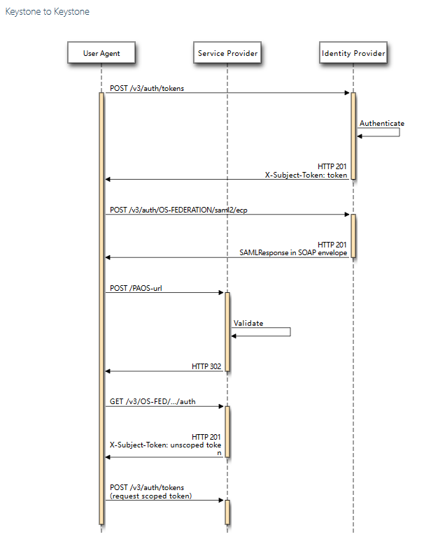

# nova
nova get-vnc-console <server> novnc      # 获取vnc地址
nova rescue <server> --password <password>
nova unrescue <server>
rescue用指定的image作为系统启动盘引导instance，而把instance原先的系统作为第二个磁盘挂载到系统上，
相当于把故障电脑磁盘拿出，插到另一台正在运行的电脑上，进而再进行一些拯救工作。
openstack server restore <server>    # 将软删除的虚机进行恢复


1. nova的反亲和机制指的是创建一组虚拟机实例，确保他们不会被调度到同一物理主机上；


## openstack CLI
openstack server create --host SCDA0052.uat.local --network ae468023-489f-49e1-856e-4aa3d5692aa7 --image mysql8028-uat-v0702 --flavor fc98f1ef-7c74-47db-a431-1cea0f2cc78a dx_vm1 --os-compute-api-version 2.74

openstack baremetal node list   # 查看裸金属的节点
openstack baremetal node console show <node>   # 查看裸金属控制台信息
nova interface-list dx_vm1     # 查看虚机的接口，包含port_id，ip


## 裸金属Ironic
所谓裸机，就是指没有配置操作系统的计算机。从裸机到应用还需要进行以下操作：
（1）硬盘RAID、分区和格式化；
（2）安装操作系统、驱动程序；
（3）安装应用程序。
Ironic实现的功能，就是可以很方便的对指定的一台或多台裸机，执行以上一系列的操作。例如部署大数据群集需要同时部署多台物理机，就可以使用Ironic来实现。
Ironic可以实现硬件基础设施资源的快速交付。

在OpenStack体系结构中，Ironic还是通过Nova来调用的，模拟Nova的一个虚拟化驱动（其它的虚拟化驱动还有KVM、VMware、Xen等），实现基于Ironic的虚拟化驱动。
预先配置好PXE、IPMI等服务，完成Ironic的相关配置之后，用户就可以使用Nova API来实现一个物理机实例的创建。Nova用于管理虚拟机的生命周期；
Ironic则是用于管理物理机的生命周期，它给Nova提供管理物理机的API接口。

裸金属管理服务的基本原理是：PXE服务器提供DHCP服务和TFTP服务，指示多台裸金属设备由PXE网卡启动并分配动态IP，
裸金属设备从PXE服务器中下载相关软件包，用于裸金属主机的系统安装。

裸金属虚机创建
nova   boot  ironic-test  --flavor 004008   --security-groups default --block-device source=image,device=sda,dest=volume,id=7a09baa5-897e-4217-8a3a-47e0ba978b9e,size=40,bootindex=0,bus=virtio,type=disk --nic net-id=9d893658-59c6-4ec6-a133-6dc6678705c1

socat网络工具


ompute节点日志： Instance xxx has allocations against this compute host but is not found in the database.
su -s /bin/sh -c "nova-manage cell_v2 discover_hosts --verbose" nova


### ironic部署三阶段
1. 入云阶段（Inspection）：裸金属服务器接入网络后，通过PXE启动加载启动镜像，将自身的主机信息汇报给裸金属管理节点，使其进入可调度状态。
Inspector阶段完成了OpenStack对接入的物理服务器硬件信息的收集，控制节点可以根据收集到的配置信息创建对应的“实例类型”，
便于根据用户申请资源要求调度指定物理服务器创建裸金属实例。
ironic-dnsmasq作为dhcp服务，第一阶段裸金属服务器安装操作系统时需要从其拿到IP；
在控制节点配置dhcp服务的网段IP；(192.168.130.0/24)
第一阶段也需要根据image安装系统，并且是通过ramdisk
baremetal node create
baremetal node manage
baremetal node inspect
2. 部署阶段（Provision）：租户向云平台申请裸金属资源，云平台启动被选中服务器，通过PXE启动加载启动镜像，之后部署系统镜像，完成裸金属服务器操作系统安装。
openstack创建vxlan内网192.168.140.0/24，创建路由关联子网192.168.140.0/24并且配置静态路（10.50.31.0/24--控制节点网段,192.168.140.254--交换机接口）；
之后通过sdn打通。
baremetal node provide
3. 运行阶段（Running）：服务器重启加载操作系统，通过DHCP获取IP地址，完成裸金属实例部署。
openstack server create


从PXE或者UEFI启动裸机需要在ironic-conductor节点配置TFTP服务器;
### provision network
1. 通过DHCP获得tftp-server地址；
2. 从tftp-server下载启动文件；
3. 根据下载的文件进行启动；


### 裸金属节点clean
openstack baremetal node clean <node>   --clean-steps '[{"interface": "deploy", "step": "erase_devices_metadata"}]'
1. provision state先从active变成deleting；
2. 解绑裸金属虚机的port；
3. provision state先从deleting变成cleaning；
4. 最终clean完毕的状态是available；


### 裸金属虚机创建流程
PUT /v1/nodes/17d1f5b7-feca-44c2-bbb8-4977b026000e/states/provision
{
    "target": "active",
    "deploy_steps": [
        {
            "interface": "deploy",
            "step": "deploy",
            "args": {
                "force": "True"
            },
            "priority": 100
        }
    ]
}
1. node的provision_state从availabe置成deploying
2. 根据租户网络创建port；tenant_port--fa:16:3e:24:9f:c9
2023-11-10 11:11:27.349 30 DEBUG neutron.api.v2.base [req-04e18759-5338-4d28-8bbf-ebcec52d6b66 8f8255c9a7bf4da2b2fd2d4398a6c510 125e20b258f548f1aea581d10d73a482 - default default] [None] Request body: {u'port': {u'network_id': u'e3c00e34-3520-43e9-b746-f1568e2345ce', u'port_security_enabled': True, u'name': u'ceshidandugoumai', u'security_groups': [u'0ca325a7-3ef6-4c15-8ff1-0a90488eb71d'], u'qos_policy_id': u'4081904e-4bde-47ad-97ee-a4bf540e93d1'}} prepare_request_body /var/lib/kolla/venv/lib/python2.7/site-packages/neutron/api/v2/base.py:726
tenant_port
2023-11-10 11:11:31.760 30 DEBUG neutron.api.v2.base [req-9c58fcf0-0718-4c3d-852f-6667b4edb2bb 174971a889b344dea163dfd828445cea fc7d407eaa3e45c1b35f523abbb6e0a9 - default default] [req-e56abbe1-931e-4ed2-a645-b945bc4e03f2] Request body: {u'port': {u'device_owner': u'compute:nova', u'binding:host_id': None, u'device_id': u'24800c87-bda6-417c-80ed-dc64fbf38606'}}
tenant_port
2023-11-10 11:11:38.218 31 DEBUG neutron.api.v2.base [req-5e417416-d892-4e08-bcba-6dc73d777314 7ceb97a1bbac4095916c939c7c828c8d fc7d407eaa3e45c1b35f523abbb6e0a9 - default default] [req-27d0df23-b877-4b9e-be71-8532b5d60f5a] Request body: {u'port': {u'mac_address': u'78:17:be:71:97:cb'}}
tenant_port
2023-11-10 11:11:48.283 31 DEBUG neutron.api.v2.base [req-de81c526-c35d-4f6a-9e67-91bea5113cd6 7ceb97a1bbac4095916c939c7c828c8d fc7d407eaa3e45c1b35f523abbb6e0a9 - default default] [req-7b08c2fc-30dc-46b3-90dc-56a50c5f695b] Request body: {u'port': {u'binding:profile': {}, u'binding:host_id': u''}} prepare_request_body /var/lib/kolla/venv/lib/python2.7/site-packages/neutron/api/v2/base.py:726
tenant_port

3. 根据provision network创建port；
2023-11-10 11:11:49.518 31 DEBUG neutron.api.v2.base [req-d7f6cc7c-ed5e-403d-b1a0-592d9ef28b67 7ceb97a1bbac4095916c939c7c828c8d fc7d407eaa3e45c1b35f523abbb6e0a9 - default default] [req-7b08c2fc-30dc-46b3-90dc-56a50c5f695b] Request body: {u'port': {u'mac_address': None}} prepare_request_body /var/lib/kolla/venv/lib/python2.7/site-packages/neutron/api/v2/base.py:726
provision_port e52ee445-0d37-4a72-971e-1bf200ece536
2023-11-10 11:11:54.456 31 DEBUG neutron.api.v2.base [req-eaaa870f-5690-47c7-b949-bfa4b3181c21 7ceb97a1bbac4095916c939c7c828c8d fc7d407eaa3e45c1b35f523abbb6e0a9 - default default] [req-7b08c2fc-30dc-46b3-90dc-56a50c5f695b] Request body: {u'port': {u'binding:host_id': u'17d1f5b7-feca-44c2-bbb8-4977b026000e', u'admin_state_up': True, u'network_id': u'289a327a-1625-4dab-bd5b-29c32d4b3fb0', u'binding:vnic_type': u'baremetal', u'device_owner': u'baremetal:none', u'mac_address': u'78:17:be:71:97:cb', u'binding:profile': {u'local_link_information': [{u'port_id': u'10GE1/0/8', u'switch_id': u'c8:33:e5:a2:52:a1'}]}, u'device_id': u'24800c87-bda6-417c-80ed-dc64fbf38606'}}
provision_port
2023-11-10 11:11:57.666 31 DEBUG neutron.api.v2.base [req-31478585-1ea9-41b8-8919-d236cc9ad4c2 7ceb97a1bbac4095916c939c7c828c8d fc7d407eaa3e45c1b35f523abbb6e0a9 - default default] [req-7b08c2fc-30dc-46b3-90dc-56a50c5f695b] Request body: {u'port': {u'extra_dhcp_opts': [{u'opt_value': u'undionly.kpxe', u'ip_version': 4, u'opt_name': u'tag:!ipxe,67'}, {u'opt_value': u'http://10.50.31.1:8089/boot.ipxe', u'ip_version': 4, u'opt_name': u'tag:ipxe,67'}, {u'opt_value': u'10.50.31.1', u'ip_version': 4, u'opt_name': u'66'}, {u'opt_value': u'10.50.31.1', u'ip_version': 4, u'opt_name': u'150'}, {u'opt_value': u'10.50.31.1', u'ip_version': 4, u'opt_name': u'server-ip-address'}]}} prepare_request_body /var/lib/kolla/venv/lib/python2.7/site-packages/neutron/api/v2/base.py:726
4. 在node上执行deploy Executing {'priority': 100, 'interface': 'deploy', 'step': 'deploy', 'argsinfo': None}
5. 从deploying状态置成wait call-back
POST /v1/heartbeat/17d1f5b7-feca-44c2-bbb8-4977b026000e
6. 将config driver文件拷贝到node分区/dev/disk/by-path/ip-10.50.102.213:3260-iscsi-iqn.2008-10.org.openstack:17d1f5b7-feca-44c2-bbb8-4977b026000e-lun-1-part2
7. 移除node上的网络Removing provisioning network
删除provision_port
2023-11-10 11:20:16.827 Deleting port e52ee445-0d37-4a72-971e-1bf200ece536
8. 配置租户网络；{u'port': {u'binding:profile': {u'local_link_information': [{u'port_id': u'10GE1/0/8', u'switch_id': u'c8:33:e5:a2:52:a1'}]}, u'binding:vnic_type': u'baremetal', u'binding:host_id': u'17d1f5b7-feca-44c2-bbb8-4977b026000e', u'mac_address': u'78:17:be:71:97:cb'}}
9. 在node上deploy虚机Executing deploying on node 17d1f5b7-feca-44c2-bbb8-4977b026000e, remaining steps: []


## 虚机filter
AggregateInstanceExtraSpecsFilter----在指定的HostAggregate中选定一个主机分配虚拟机
需要在HostAggregate打上flavor的对应标签，就是HostAggreagate和flavor要设置相同的metadata(key，value)，比如两个都增加ssd=true的key-value metadata，则表明只在存储为固态硬盘的主机分配虚拟机规格为flavor的虚拟机；
1. 创建主机聚合nova aggregate-create agg nova；
2. 把主机加入到主机聚合中nova aggregate-add-host agg compute1；
3. 定义元数据nova aggregate-set-metadata agg ssd=true；
4. 主机flavor加入元数据nova flavor-key m1.nano set ssd=true；


## 虚机创建
1. 虚机创建报错Port 0d1f4c34-2dc8-43e6-a769-9569cb68902f not usable for instance，由于虚机和port不属于同一个租户；
2. nova_api.request_specs表---虚拟机调度需要的信息，如虚拟机个数,uuid,类型,安全组等;
3. nova_api.build_requests表---初始化数据；
4. nova_api.instance_mappings---实例映射表，不同cell之间的实例映射；


## 虚机重建
1. 原系统盘volume先detach（带attachment in-use）;
2. 数据盘detach;
3. 创建新系统盘volume;
4. 原系统盘volume删除;
5. 新系统盘volume attach;
6. 原数据盘attach;
7. 虚机重建成功。


重装系统rebuild--->三个过程power_off/rebuild/power_on
虚机rebuild前状态是stopped时，在rebuild流程走完前会有一步stop_instance的操作,也就是将状态回到rebuild前


openstack server rebuild <server_uuid> --image <image>
1. 根据bdm的boot_index==0判断虚机是否是volume_backend；
2. image是必传项；
3. 可以实现密码、key-name、属性、镜像的更换；
4. 重建过程中修改密码时传参是adminPass和user_data；


## 主机疏散
nova host-evacuate <host> --target_host <target_host>


## 虚机创建快照
1. 如果根据虚机生成的镜像快照创建虚机时报错Volume is smaller than the minimum size specified in image，则将镜像快照的min_disk设置成0，即无限制；


## 挂载网卡
/v2.1/servers/f8ff90f2-ea91-4364-b6ea-23deebcb05cb/os-interface/3086a848-b523-45fc-9845-c3bbf18da9b4
1. 先创建port；
2. 更新port进行bound;
3. 将新的网卡信息更新到instance_info_cache中；
4. 构造vif对象，然后调用nova.virt.libvirt.driver进行attach_interface;
5. 通过os_vif将plug vif VIFOPenvSwitch；
6. 构建虚机的网卡元数据；


## 卸载网卡
DELETE /v2.1/servers/f8ff90f2-ea91-4364-b6ea-23deebcb05cb/os-interface/084dbf71-9beb-4955-9d0e-480d68b7f220
先unplug，然后delete port；
虚机在删除中再调用卸载网卡接口，报错cannot detach_interface instance <instance_uuid> while it is in task_state deleting


## GPU设备
1. 计算节点执行：lspci -nn | grep -i nvidia，获取到显卡的vendorid和product_id，并将其相应的写到nova的配置文件里面；
2. 在gpu计算节点的nova-compute和控制节点的nova-api，nova-schedule,nova-conductor配置文件下添加：
[pci]
passthrough_whitelist = { "vendor_id": "10de", "product_id": "2204" }
alias = { "vendor_id":"10de", "product_id":"2204","device_type":"type-PCI","name":"g3090" }
3. 创建flavor 
openstack flavor create 4c4g16g.3090 --ram 4096 --disk 16 --vcpus 4 --public --property "pci_passthrough:alias=g3090:1"
其中g3090与配置文件中的alias对应，后面跟的为该flavor对应的gpu数量


## nova attach volume
1. _prep_block_device-->attach_block_devices;
2. 调用nova virt block_device的attach；
3. 通过cinderclient调用cinder volume api的attach；
4. 然后api通过amqp发到rabbitmq；
5. cinder volume manager调用driver进行attach。


## vnc console原理
1. 先通过/servers/{server_id}/remote-consoles创建一个console；
2. 然后拿着这个console通过浏览器访问；
3. 实际通信过程通过websocket---ws://10.50.1.251:6080/?token=<token>。
console日志在var/lib/nova/instances/<instance_uuid>或
xml路径/var/lib/docker/volumes/nova_libvirt_qemu/_data


## 给实例注入一个密钥对并通过密钥对来访问实例
1. 创建秘钥对
$ openstack keypair create test > test.pem
$ chmod 600 test.pem
2. 启动实例
$ openstack server create --image cirros-0.3.5-x86_64 --flavor m1.small \
  --key-name test MyFirstServer
3. 使用ssh连接到实例
ip netns exec qdhcp-98f09f1e-64c4-4301-a897-5067ee6d544f ssh -i test.pem cirros@10.0.0.4


## nova_ssh免密ssh互访
在hypervisor节点之间进行resize或者迁移实例时，确保每个计算节点配置SSH key认证，以能使计算服务使用ssh进行disk移动；
主要流程就是生成公钥和私钥，将私钥拷贝到/var/lib/nova/.ssh/id_rsa，公钥拷贝到远端节点，切换nova账户即可不需密码登录到远端节点
https://docs.openstack.org/nova/pike/admin/ssh-configuration.html


## 冷迁移
1. 基于ssh；
2. 迁移过程：首先把实例先关机，然后重命名实例文件夹为instanceid_resize, ssh把实例文件给拷贝过去，数据库更改，
    在新计算节点上启动实例，此时可以revert实例，即复原迁移。确认后删除原实例文件，删除老节点qemu下xml文件并在新节点上新建；
3. 

## 热迁移
1. --block-migrate=False不需要共享存储，如NFS存储后端，也可以设置共享存储置成True；
2. 基于qemu+tcp；
3. 计算节点16509端口用于libvirtd的tcp连接监听；


## 软重启
软重启是通过向虚拟机发送重启指令实现的，类似于操作系统的正常重启。
在软重启期间，虚拟机的虚拟硬件设备不会被关闭或重置。
软重启尝试保留虚拟机的网络连接和内存状态，以便恢复到重启前的状态。
软重启通常比硬重启快速，因为它只涉及到虚拟机的操作系统层面并避免了关机和启动的过程。


## 硬重启
硬重启是通过直接重启虚拟机的底层实例实现的，类似于物理计算机的冷启动。
在硬重启期间，虚拟机的虚拟硬件设备会被关闭，并从头开始引导启动。
硬重启会中断虚拟机的所有网络连接和内存状态，相当于完全关闭和重新启动虚拟机。
硬重启可能需要较长时间，在底层重新启动虚拟机的整个过程中，可能需要重新分配资源、加载虚拟硬盘和重启操作系统。


## kvm
1. 虚机支持kvm虚拟化  nova_compute/nova.conf中
[DEFAULT]
cpu_mode = host-passthrough
2. kvm内核是否加载
lsmod | grep kvm 


## 169.254.169.254
1. 虚机内部执行curl -i http://169.254.169.254/openstack/latest；
包括meta_data.json/user_data/password/network_data.json
2. curl -i http://169.254.169.254/latest/meta-data 包括instance-id/instance-type/local-hostname/security-groups
云主机访问169.254.169.254时，数据包走到网关(自己所在dhcp命名空间)，然后neutron-ns-metadata-proxy 将请求通过 unix domain socket 发给 neutron-metadata-agent，后者再通过管理网络发给 nova-api-metadata。


## cloud-init
自动配置虚拟机初始配置的工具；
虚拟机通过两种方式获得用户传递的配置信息；一种是config driver；一种是metadata restful服务；
有两种方法可以启用config drive：
1. 启动 instance 时指定 --config-drive true(下面实验是采用的这种方法)。
2. 在计算节点的 /etc/nova/nova.conf 中配置 force_config_drive = true，这样部署到此计算节点的 instance 都会使用 config drive
3. /etc/cloud/cloud.cfg中network: {config: disabled}则cloud-init不会进行网络配置；
4. 四个阶段
Local
（这个阶段，会寻找本地的data source， 并配置本机网络，以便后续获取user data等信息， 网络配置可以来源于本地的data source，如果获取不到，会启用dhcp。 
当然，如果在/etc/cloud/cloud.cfg定义 ‘network: {config: disabled}‘.， 会放弃配置网络）
作为 cloud-init 执行的第一个阶段，此时 instance 还不知道该如何配置网卡，cloud-init 的任务就是从 config drive 中获取配置信息，
然后写入 /etc/network/interfaces 文件（如果是 centos 则写入 /etc/sysconfig/network-scripts/ifcfg-xxx）。
如果没有 config drive，则将所有网卡配置成 dhcp 模式。这是非常关键的一步，只有当网卡正确配置后，才能获取到 metadata。
Network
Config
Final

执行如下的命令
cloud-init clean
cloud-init init --local
cloud-init init
cloud-init modules --mode config

### config driver
查看虚机中config driver配置：mount /dev/sr0 <某个目录>    即可在目录中看到配置

关于user_data
将如下通过base64加密，即可作为user_data进行虚机创建或重建传参；
```shell
Content-Type: multipart/mixed; boundary="===============2309984059743762475=="
MIME-Version: 1.0

--===============2309984059743762475==
Content-Type: text/cloud-config; charset="us-ascii"
MIME-Version: 1.0
Content-Transfer-Encoding: 7bit
Content-Disposition: attachment; filename="ssh-pwauth-script.txt"

cloud-config
disable_root: false
ssh_pwauth: true
password: Wang.123

--===============2309984059743762475==
Content-Type: text/x-shellscript; charset="us-ascii"
MIME-Version: 1.0
Content-Transfer-Encoding: 7bit
Content-Disposition: attachment; filename="passwd-script.txt"

#!/bin/sh
echo 'root:Wang.123' | chpasswd

--===============2309984059743762475==
Content-Type: text/x-shellscript; charset="us-ascii"
MIME-Version: 1.0
Content-Transfer-Encoding: 7bit
Content-Disposition: attachment; filename="enable-fs-collector.txt"

#!/bin/sh
qemu_file="/etc/sysconfig/qemu-ga"
if [ -f ${qemu_file} ]; then
    sed -i -r "s/^#?BLACKLIST_RPC=/#BLACKLIST_RPC=/" "${qemu_file}"
    has_gqa=$(systemctl list-units --full -all -t service --plain | grep -o qemu-guest-agent.service)
    if [[ -n ${has_gqa} ]]; then
        systemctl restart qemu-guest-agent.service
    fi
fi

--===============2309984059743762475==--
```

## nova-api-metadata
nova-api的子服务，metadata的提供者，instance可以通过其restful接口获取metadata信息；
服务端口为8775；


# neutron


tracepath ip ---查看链路
ip route解释
default via 172.16.0.1 dev ens192 proto static metric 100 # 表示去任何地方，都发送给网卡ens192，并经过网关172.16.0.1发出；
172.16.0.0/16 dev ens192 proto kernel scope link src 172.16.1.11 metric 100 # 表示发往172.16.0.0/26网段的包都由网卡ens192发出，src表示ens192的网卡ip是172.16.1.11，metric表示路由距离，到达指定网络所需的中转数；
默认路由（Default route），是对IP数据包中的目的地址找不到存在的其他路由时，路由器所选择的路由。
添加默认路由 ip route add default via <网关IP地址> dev <网络接口>


## ml2
### 层次化端口绑定的流程:
1. 用户创建了一个虚拟机，并且将虚拟机创建在VxLAN A网络中。
2. Neutron需要创建一个VxLAN A的网络接口，请求被发送到了ML2。
3. Neutron ML2先调用到物理交换机对应的Mechanism driver进行端口绑定（port binding），将VxLAN A与网络接口进行绑定。
4. 因为底层还有VLAN，物理交换机的Mechanism Driver会再申请一个VLAN B，并告知Neutron ML2，当前网络接口还需要绑定到对应的VLAN上。
5. 之后物理交换机的Mechanism Driver会通过相应的API，告知物理交换机 VLAN B和VxLAN A的对应关系，这样物理交换机就有了VLAN To VxLAN ID MAP。
6. ML2因为知道了网络接口还需要绑定到对应的VLAN上，再调用OpenVSwitch的Mechanism Driver，将VLAN B与网络接口进行绑定。
7. 之后，OVS的Mechanism Driver会通过相应的API，告知位于计算节点的OpenVSwitch，对于这个网络接口的网络数据，打上VLAN B的Tag。

网络数据送到OpenVSwitch，OVS会打上VLAN B的Tag，带VLAN B Tag的网络数据送到物理交换机。 
物理交换机根据自己的VLAN To VxLAN ID MAP，将VLAN Tag去掉，再封装成相应的VxLAN数据。经过这样的处理，VxLAN的封装解封装被offload到了物理交换机。
ml2_port_bindings    # 绑定属性集
ml2_port_binding_levels   # 绑定层级
networksegments    # 每层的segment


### vpc互通
1. 同租户两个vpc通过vpc connection打通；
2. 

### ovs
1. 创建子网时会在br-int下建立一个tap口(tap-<dhcp port id前11位>)，会在dhcp命名空间中建立这个tap口；
2. 创建虚机时，会在br-int下建立一个qvoxxx，linux-bridge下会建立一个qbrxxx网桥，qbr网桥下有个qvbxxx接口和tapxxx，
    也就整个连接是br-int-->qvo-->qvb-->linux bridge qbr-->tap。         --xxx为port id的前11位；
3. 批量删除br-int上的port；for port in $(ovs-vsctl list-ports br-int); do ovs-vsctl del-port br-int $port; done
4. 查看网桥br-int的的虚机port；ovs-vsctl list-ports br-int；
5. 通过ovs-vsctl list qos,查看qos配置表,其中有queue配置;ovs-vsctl list queue，查看queue表，可以看到限速的速率；
6. tc qdisc show dev tap5a8435ab-22；
7. 查看网桥下的接口ovs-vsctl list-ports br-ex
8. 删除网桥下的接口ovs-vsctl del-port br-ex eth0

### ovs+vxlan网络流程
1. 同一host上同一子网内的虚机通信；只是经过br-int，不经过br-tun；
2. 不同host上同一子网内的虚机通信；
    vm1发出的packet经过br-int打上vlan tag,到达br-tun将vlan tag转成隧道id,从隧道发出，到达另外的计算节点；
    在另一个计算节点经过相反的顺序到达vm2；
3. 虚机访问外网
    vm1发出的packet经过br-int打上vlan tag,到达br-tun将vlan tag转成隧道id,从隧道发出，到达网络节点；
    经过网络节点的网卡达到与物理网卡相连的br-tun,将Tunnel ID转换成vlan id；
    达到br-int，再到达router，router的NAT表将fixed IP地址转换成floating IP地址，再被router到br-ex；
    从br-ex相连的物理网卡上出去外网。
4. 虚机发送DHCP请求
    1. 虚机的packet -> br-int -> br-tun -> vxlan Tunnel -> eth2 ------>eth2->br-tun->br-int->qDHCP
    2. qDHCP返回其fixed IP地址，原路返回；


## l2 population原理
L2 population 的原理如下：
首先，创建一个 Overlay 网络（通常是 VXLAN），用于在不同计算节点之间传输虚拟机的二层数据帧。
当虚拟机发送一个二层数据帧到网络中，该数据帧会通过虚拟交换机（例如 Open vSwitch）被送往连接到虚拟机所在计算节点的虚拟交换机。
如果目的地是同一计算节点上的另一个虚拟机，那么数据帧将直接送达目标虚拟机。
如果目的地是其他计算节点上的虚拟机，源计算节点会复制该数据帧到 Overlay 网络，并将其发送到目标计算节点。
目标计算节点上的虚拟交换机接收到复制的数据帧后，将其转发给目标虚拟机。
这样，当虚拟机之间需要进行二层通信时，L2 population 可以在不同计算节点之间复制和处理数据帧，使得虚拟机可以透明地进行二层通信，就像它们在同一个物理网络上一样。


## iptables
iptables -t filter -I INPUT -s 192.168.1.2 -p tcp --dport 22 -j DROP ---拒绝192.168.1.2访问目标22端口
iptables -nL |grep 'policy' ----查看filter表各个链的默认策略
ip netns exec qrouter-1658595a-ee11-4a53-bd6f-34a49ce86b61 iptables -t nat -S   # 命名空间内查看nat规则
ip netns exec qrouter-1658595a-ee11-4a53-bd6f-34a49ce86b61 iptables-save  # 命名空间内将iptables规则打印
iptables -t nat -nvL
iptables-save


## router
neutron l3-agent-list-hosting-router <router_id>     # 查看router所在的namespace节点
namespace里中qg和qr没有ip时，通过neutron router-update --admin-state-up False，再者neutron router-update --admin-state-up True恢复；

neutron l3-agent-list-hosting-router 1658595a-ee11-4a53-bd6f-34a49ce86b61    # 查看router关联的l3-agent所在的host

### 在命名空间内抓包tcpdump -i qr-xxx/qg-xxx -n icmp
[root@SCDA0052 scadmin]# ip netns exec qrouter-3feea37e-5a67-4396-90af-56ab85698e4d tcpdump -i qg-564ac24f-e7 -n icmp
tcpdump: verbose output suppressed, use -v or -vv for full protocol decode
listening on qg-564ac24f-e7, link-type EN10MB (Ethernet), capture size 262144 bytes
16:42:25.409226 IP 10.250.51.123 > 10.250.48.1: ICMP echo request, id 18494, seq 1, length 64
16:42:25.409879 IP 10.250.48.1 > 10.250.51.123: ICMP echo reply, id 18494, seq 1, length 64


### 缺少默认路由，导致外部ping不通外部网关，而命名空间是可以ping通的
切换一下router的主备，会让配置在备的router上刷过去。
ip link set ha-5dfc67f4-07 down
常用的办法是把主router的ha口down掉，等一段时间规则会切换到备节点的router上去，中间出口网络会有几秒的中断；
[root@SCDA0052 scadmin]# ip netns exec qrouter-3feea37e-5a67-4396-90af-56ab85698e4d ip r
default via 10.250.48.1 dev qg-564ac24f-e7 proto static 
10.250.33.0/24 dev qg-564ac24f-e7 proto static scope link 
10.250.48.0/22 dev qg-564ac24f-e7 proto kernel scope link src 10.250.51.123 
169.254.0.0/24 dev ha-5dfc67f4-07 proto kernel scope link src 169.254.0.90 
169.254.192.0/18 dev ha-5dfc67f4-07 proto kernel scope link src 169.254.192.133 
192.168.44.0/24 dev qr-e422ee4e-61 proto kernel scope link src 192.168.44.1
192.168.45.0/24 dev qr-bb32d29f-17 proto kernel scope link src 192.168.45.1

也可以加条静态路由解决openstack router set dx_test1 --route destination=0.0.0.0/0,gateway=10.250.48.1
或者openstack  router set <router> --disable + openstack  router set <router> --enable


## floatingip
1. 创建floatingip可以指定subnet，是指定的network下的subnet，内部逻辑是将传的subnet_id放到port中，去创建port；如果不传subnet_id返回时不带subnet_id；
2. 限速测试：服务端iperf3 -s -i 10 -p 5201--设置监控时间10s，端口为5201，防火墙端口要放行；客户端iperf3 -c x.x.x.x -p 5201 -t 5 -P 10 -R---指定-c测速服务器IPx.x.x.x，-p指定端口为5201，-t测速时间5s，-P指定发送连接数10，-R表示下载测速
    iperf3 -c 192.168.3.250 -i 1 -t 10          测试上行
    iperf3 -c 192.168.3.250 -i 1 -t 10 -R       测试下行
    iperf3 -s -i 1 -p 5201
3. 限速可以限速floatingip出外网和端口转发；


### EIP
弹性公网IP（Elastic IP，简称EIP），提供独立的公网IP资源，包括公网IP地址与公网出口带宽服务。
可以与弹性云服务器、裸金属服务器、虚拟IP、弹性负载均衡、NAT网关等资源灵活地绑定及解绑。
一个弹性公网IP只能绑定一个云资源使用，且弹性公网IP和云资源必须在同一个区域，不支持跨区域使用弹性公网IP。
Openstack EIP网络流量监控,要求fixedIP与EIP分别统计---同一块网卡上，绑定内网与EIP的情况
使用Metering agent来监控l3流量
1. 配置
service_plugins追加metering；
编辑metering_agent.ini文件；
在每个l3-agent节点启动metering agent。neutron meter-label-rule-create dx_meter1 10.50.35.205/32 --direction ingress --tenant-id e4a97e45239340b090fcebde8edcbfe5
2. 使用
指定租户创建meter label  
neutron meter-label-create --tenant-id  e4a97e45239340b090fcebde8edcbfe5 dx_meter1
创建规则，10.50.35.205为floatingip，44.44.44.184为虚机ip
neutron meter-label-rule-create dx_meter1 44.44.44.184/32 --direction ingress --tenant-id e4a97e45239340b090fcebde8edcbfe5
neutron meter-label-rule-create dx_meter1 44.44.44.184/32 --direction egress --tenant-id e4a97e45239340b090fcebde8edcbfe5
iptables规则
[root@con01 dongxiang]# ip netns exec qrouter-0e9775f3-755a-4b10-9fa0-b65ca1601f89 iptables -t filter -nvxL neutron-meter-r-ecca93c6-8d1
Chain neutron-meter-r-ecca93c6-8d1 (1 references)
    pkts      bytes target     prot opt in     out     source               destination
      89    16839 neutron-meter-l-ecca93c6-8d1  all  --  qg-3a26535b-91 *       0.0.0.0/0            44.44.44.184
    1094    80015 neutron-meter-l-ecca93c6-8d1  all  --  *      qg-3a26535b-91  44.44.44.184         0.0.0.0/0

#### 端口转发
当进行端口转发时，虚机要放开指定端口（也就是目标端口）的安全组规则；
openstack floating ip port forwarding list 10.50.98.165
openstack floating ip port forwarding delete 10.50.98.165 <id>


## fwaas v1
接入SDN后，fwaas v1即huawei的huawei_ac_fwaas service_plugin；
### 创建firewall
1. 首先判断router_ids字段中的是否有任何的router关联了其它的firewall，如何关联了即报错in-use error;
2. 调用firewall_db将数据进行存库,firewall状态为PENDING_CREATE；
3. 如果传参带router_ids，fw_id和router_id存入库firewall_router_associations中；
4. 下发到AC控制器上；


### 创建firewall policy
1. 首先写库；
2. 


## fwaas v2

### create_fw
1. firewall rule/firewall group/firewall policy均不支持批量创建； 
2. firewall group可以分别有一个出向和入向policy；
3. 创建firewall policy中可以添加多个rule(无序)；通过insert_rule接口(指定顺序)只能单次操作；
4. 调用此接口fwaas/firewall_groups?tenant_id=e4a97e45239340b090fcebde8edcbfe5时创建default fw或者创建firewall group，就是确保default firewall存在；
5. default firewall入向规则全拒绝，出向全允许；
6. 如果firewall group已经管理了内网网关端口，则根据此内网创建虚机时，虚机的port会加到firewall group管理的端口中，而内网网关端口被移除；
7. port已经被一个firewall管理，不允许另外的防火墙管理；
8. 不能创建fw name为default的fw，每个租户下只能有一个default fw；
9. 创建firewall group时，如果没有port，则firewall group状态是INACTIVE；如果有port，并且router_distributed为true时，状态为CREATED，否则为PENDING_CREATED；
10. firewall配额只能在fwaas_driver.ini中修改，默认firewall和firewall policy配额10,firewall rule配额100;
[quotas]
quota_firewall=10
quota_firewall_policy=10
quota_firewall_rule=100
11. 默认防火墙规则的配置可以在fwaas_driver.ini中修改；
[default_fwg_rules]
ingress_action=allow

### update_fw
1. 如果关联的port是内网网关端口，则最后firewall group会变成ACTIVE；
2. 如果更新时如果已有policy并且带port更新或者policy和port一起更新，则最后firewall group会变成ACTIVE；
3. 如果状态是PENDING，则不允许更新；
4. 支持更新的port为虚机port，router interface port，
5. 如果更新的port已经关联到别的firewall group了，则不支持更新；
6. update_precommit中如果port有变化或者policy有变化+更新的port不为空，则状态变为PENDING_UPDATE；
7. FWaaSL3AgentExtension中的update_firewall_group中，
8. 如果更新fw带policy且没有port,则fw先进入PENDING_UPDATE，最后会变成INACTIVE；
7. 关联port后qrouter命名空间内的增加了如下规则：
neutron-l3-agent-fwaas-defau - [0:0]
neutron-l3-agent-iv4a24248cf - [0:0]
neutron-l3-agent-ov4a24248cf - [0:0]
-A neutron-l3-agent-FORWARD -o qr-048c1996-4e -j neutron-l3-agent-iv4a24248cf
-A neutron-l3-agent-FORWARD -i qr-048c1996-4e -j neutron-l3-agent-ov4a24248cf
-A neutron-l3-agent-FORWARD -o qr-048c1996-4e -j neutron-l3-agent-fwaas-defau
-A neutron-l3-agent-FORWARD -i qr-048c1996-4e -j neutron-l3-agent-fwaas-defau
-A neutron-l3-agent-fwaas-defau -j neutron-l3-agent-dropped
-A neutron-l3-agent-iv4a24248cf -m state --state INVALID -j neutron-l3-agent-dropped
-A neutron-l3-agent-iv4a24248cf -m state --state RELATED,ESTABLISHED -j ACCEPT
-A neutron-l3-agent-iv4a24248cf -j neutron-l3-agent-dropped
-A neutron-l3-agent-ov4a24248cf -m state --state INVALID -j neutron-l3-agent-dropped
-A neutron-l3-agent-ov4a24248cf -m state --state RELATED,ESTABLISHED -j ACCEPT
-A neutron-l3-agent-ov4a24248cf -j neutron-l3-agent-accepted

-A neutron-l3-agent-FORWARD -o qr-048c1996-4e -j neutron-l3-agent-iv4a24248cf意思是从router namespace任何一个qr-048c1996-4e发出的流量都会应用chain neutron-l3-agent-iv4a24248cf；
-A neutron-l3-agent-iv4a24248cf -m state --state INVALID -j neutron-l3-agent-dropped意思是如果数据包的状态是INVALID，则DROP掉；
-A neutron-l3-agent-iv4a24248cf -m state --state RELATED,ESTABLISHED -j ACCEPT意思是如果数据包状态是RELATED,ESTABLISHED，则接收；


### delete_fw
1. 如果firewall_group是ACTIVE，则不允许删除；
2. 在管理状态置成down时，再remove rule，此时fw状态变成DOWN，fw就可以删除了；


### insert rule
1. insert rule/remove rule最后会触发FWaaSL3AgentExtension中的update_firewall_group，（如果本租户内有router port）从而导致fw进入ACTIVE状态;


### update policy
1. update policy会触发FWaaSL3AgentExtension中的update_firewall_group,（如果本租户内有router port）从而导致fw进入ACTIVE状态;

### update rule
1. update rule会触发FWaaSL3AgentExtension中的update_firewall_group,（如果本租户内有router port）从而导致fw进入ACTIVE状态;


## sg
1. 安全组是针对每个port做网络访问控制，防火墙是针对一个VPC网络，通常是在路由做策略；
因此security group在计算节点的tap设备上做，而firewall在网络节点的router上做。
2. 安全组定义的是允许通过的规则集合，规则的动作是ACCEPT；
3. 创建一条安全组，自动添加两条默认规则，egress ipv6和egress ipv4（禁止所有的流量访问，允许所有的流量出去）。
4. 只有当安全组被关联到port时才会真正创建对应的iptables规则。
5. 安全组规则支持批量创建；请求体 {"security_group_rules": [{}]}
6. remote_group_id只影响本条规则，其它规则不影响；只允许绑定remote_sg的虚机通；如果remote_group_id为自己，同样只有绑定本sg的虚机能够互通；


Openstack中的安全组的实现有以下几种：
ovs + iptables + connection track
ovs + openflow + connection track
linuxbridge + iptables + connection track

此命令iptables -n --line-numbers -L neutron-linuxbri-ifa4e375e-b


### ovs + openflow实现安全组
查看port的接口id  ovs-ofctl show br-int |grep 789dc709- -A 3
查看目的端口22并且接口id为502的安全组规则      ovs-ofctl dump-flows br-int |grep output:502|grep tp_dst=22

表示源地址为12.12.12.0/24报文送到接口502
[root@sdn-1 ~]# ovs-ofctl dump-flows br-int |grep 12.12.12.0
 cookie=0x151f0564881e5c71, duration=12.497s, table=82, n_packets=0, n_bytes=0, idle_age=14, priority=77,ct_state=+est-rel-rpl,tcp,reg5=0x1f6,nw_src=12.12.12.0/24,tp_dst=22 actions=output:502
 cookie=0x151f0564881e5c71, duration=12.497s, table=82, n_packets=0, n_bytes=0, idle_age=14, priority=77,ct_state=+new-est,tcp,reg5=0x1f6,nw_src=12.12.12.0/24,tp_dst=22 actions=ct(commit,zone=NXM_NX_REG6[0..15]),output:502,resubmit(,92)

表示目的地址33.33.33.0/24的报文，从接口502正常转发
[root@sdn-1 ~]# ovs-ofctl dump-flows br-int |grep 33.33.33.0
 cookie=0x151f0564881e5c71, duration=18.246s, table=72, n_packets=0, n_bytes=0, idle_age=19, priority=77,ct_state=+est-rel-rpl,tcp,reg5=0x1f6,nw_dst=33.33.33.0/24,tp_dst=22 actions=resubmit(,73)
 cookie=0x151f0564881e5c71, duration=18.246s, table=72, n_packets=0, n_bytes=0, idle_age=19, priority=77,ct_state=+new-est,tcp,reg5=0x1f6,nw_dst=33.33.33.0/24,tp_dst=22 actions=resubmit(,73)


## dhcp
虚机内部指定dhclient可向dhcp agent请求IP地址；

### Nova 虚机获取固定IP （Fixed IP）
（1）在创建虚机过程中，Neutron 随机生成 MAC 和 从配置数据中分配一个固定IP 地址，并保存到 Dnsmasq 的 hosts 文件中，让 Dnsmasq 做好准备；
（2）虚机在启动时向 Dnsmasq 获取 IP 地址。


## rbac policy
OpenStack RBAC（Role-Based Access Control）是一种基于角色的访问控制机制，用于管理OpenStack云平台中的资源和服务。
它允许管理员为用户和组分配不同的角色，以控制他们对云平台中不同资源和服务的访问权限。
OpenStack RBAC的核心是角色和权限。角色是一组权限的集合，而权限则是对特定资源或服务的访问控制。
OpenStack中的角色包括系统管理员、云管理员、项目管理员、用户等。每个角色都有不同的权限，例如创建、删除、修改、查看等。

openstack network rbac create --target-project 32016615de5d43bb88de99e7f2e26a1e --action access_as_shared \
--type security_group 5ba835b7-22b0-4be6-bdbe-e0722d1b5f24
target-project指的是要共享的项目id；action--access_as_shared表示可共享；type--资源类型，支持network,qos_policy,security_group,object_id--资源id；

1. 当创建network，指定字段shared为True，表示此network可以被其它每个project共享，等价于创建rbac policy指定参数--target-all-projects；
2. 当创建network，指定字段external为True，表示此network可以作为外部网络使用，等价于创建network,然后创建rbac policy指定参数action为access_as_external；


## quota
1. 获得租户的份额；首先初始化份额为默认值，然后根据Quota库中条目更新资源的份额；
2. 删除份额，即重装份额，就是删除Quota表中的条目，份额都变成默认值；


## octavia
### 概念
1. LB management network，打通Openstack management和Amphora;
2. VIP network，作为vip pool的网络，东侧接入Amphora有keepalived实现的VRRP协议支持具有高可用特性的虚拟IP地址；
3. Tenant network,业务主机所处的网络，东侧接入amphora由haproxy为业务云主机提供负载均衡数据流量分发服务。普通租户可见。
4. VIP network和Tenant network可以是同一网络，生产环境建议分开；
5. Amphora云主机，作为负载均衡器软件Haproxy和高可用支持Keepalived的运行载体，同时也运行着amphora-agent service对外提供REST API。

### 资源操作
#### 创建loadbalancer
1. 数据库创建loadbalancer+vip记录；
2. 调用amphora driver创建vip port；如果指定了vip_port_id则将port转成vip；否则就调neutronclient接口创建port转成vip；
3. 发送消息到MQ,octavia_worker监听消息进行create_load_balancer；

#### 创建listener
haproxy 只有在创建了 listener 之后才会启动。
Lisenter 含有的协议及端口信息都需要被更新到 VIP 的安全组规则中
1. 先生成haproxy配置文件，向amp发送消息，生成对应该 listener 的 haproxy 服务脚本。
2. 再次向 amphorae 发送消息启动 haproxy 服务：
先确定listener的配置目录（/var/lib/octavia/{listener-id}/）在不在
如果是active standby，更新keepalived对各个haproxy的check脚本，
　　/var/lib/octavia/vrrp/check_scripts/haproxy_check_script.sh
3. 启动haproxy服务，service haproxy-{listener_id} start


#### 创建pool
在haproxy的配置文件中增加backend配置；


### devstack打通本地网络的指令
Devstack 打通本地网络的指令：
$ neutron port-create --name octavia-health-manager-standalone-listen-port \
  --security-group <lb-health-mgr-sec-grp> \
  --device-owner Octavia:health-mgr \
  --binding:host_id=<hostname> lb-mgmt-net \
  --tenant-id <octavia service>

$ ovs-vsctl --may-exist add-port br-int o-hm0 \
  -- set Interface o-hm0 type=internal \
  -- set Interface o-hm0 external-ids:iface-status=active \
  -- set Interface o-hm0 external-ids:attached-mac=<Health Manager Listen Port MAC> \
  -- set Interface o-hm0 external-ids:iface-id=<Health Manager Listen Port ID>
  
$ # /etc/octavia/dhcp/dhclient.conf
request subnet-mask,broadcast-address,interface-mtu;
do-forward-updates false;

$ ip link set dev o-hm0 address <Health Manager Listen Port MAC>
$ dhclient -v o-hm0 -cf /etc/octavia/dhcp/dhclient.conf

o-hm0: flags=4163<UP,BROADCAST,RUNNING,MULTICAST>  mtu 1450
        inet 192.168.0.4  netmask 255.255.255.0  broadcast 192.168.0.255
        inet6 fe80::f816:3eff:fef0:b9ee  prefixlen 64  scopeid 0x20<link>
        ether fa:16:3e:f0:b9:ee  txqueuelen 1000  (Ethernet)
        RX packets 1240893  bytes 278415460 (265.5 MiB)
        RX errors 0  dropped 45  overruns 0  frame 0
        TX packets 417078  bytes 75842972 (72.3 MiB)
        TX errors 0  dropped 0 overruns 0  carrier 0  collisions 0


# cinder
openstack volume create  dx_v1 --size 1
cinder service-list
cinder backup-create --container volumes_backup --display-name backuptoswift dx_v1
cinder backup-restore --volume-id cb0fe233-f9b6-4303-8a61-c31c863ef7ce dx_v1
cinder backup-delete
openstack volume backup list
openstack volume type list


volume-type
对于每个ceph后端，创建一个volume type，并将volume type关联配置文件中的volume_backend_name：
cinder type-create ceph
cinder type-key ceph set volume_backend_name=ceph
cinder type-create ceph-sas
cinder type-key ceph-sas set volume_backend_name=ceph-sas
然后执行cinder type-list可以看到配置的volume type

Cinder不仅支持本地volume的管理，还能把本地volume备份到远端存储系统中，比如备份到另一个Ceph集群或者Swift对象存储系统中。
创建volume分为4种类型：
1. raw: 创建空白卷。
2. create from snapshot: 基于快照创建volume。
3. create from volume: 相当于复制一个已存在的volume。
4. create from image: 基于Glance image创建一个volume。


## 创建volume
1. scheduler.create_volume-->error；
2. 根据快照创建快照，如果更换硬盘类型有如下条件：硬盘类型的加密不变；硬盘类型的volume_backend_name相同，如果volume_backend_name为空还是不能创建；


## 删除volume
volume.delete.end--->deleted,
1. 如果volume有snapshot，则不允许删除；
2. 删除虚机时，如果创建虚机带的BDM中delete_on_termination=true，则会删除系统盘；如果delete_on_termination不带或是false,则不删除系统盘；
3. 删除虚机nova传给cinder delete请求(cinder/volume/api.py)带cascade=true；


## 挂载volume
volume.attach.end--->in-use
1. 问题--比如说虚机挂载两个数据盘 vol1-->vdb，vol2-->vdc，把vol1卸载掉，重启云服务器，虚机fdisk -l显示的是vdb，和openstack目前存在的挂载情况vdc不一致；
2. 虚机挂载数据盘时，盘符按序vdb，vdc...进行自动分配；


## 卸载volume
volume.detach.end--->available
1. 卸载有条件判断，volume的status必须为in-use和attach_status必须为attached；


## os-force_detach
{
    "os-force_detach": {
        "attachment_id": "d8777f54-84cf-4809-a679-468ffed56cf1",
        "connector": {
            "initiator": "iqn.2012-07.org.fake:01"
        }
    }
}
使用场景
1. nova volume-attach时，出现cinder DB attaching，存储后端available,nova没有BDM；
2. nova volume-attach时，出现cinder DB attaching，存储后端attached,nova有BDM；
3. nova volume-detach时，出现cinder DB detaching，存储后端available,nova没有BDM；
4. nova volume-detach时，出现cinder DB detaching，存储后端attached,nova有BDM；


## 创建snapshot
snapshot.create.end--->available
1. 创建快照，volume状态必须是available，error_deleting不行；


## 删除snapshot
snapshot.delete.end--->deleted
1. snapshot状态必须是available和error,且不属于group的一部分才能删除；
2. 快照如果有根据其创建的硬盘，则此快照不允许删除；


## volume类型更改
volume.retype--->available/in-use

1. Retype needs volume to be in available or in-use state, not be part of an active migration or a consistency group, 
requested type has to be different that the one from the volume, and for in-use volumes front-end qos specs cannot change.


## 配置文件支持多个后端
cinder.conf
enabled_backends = lvmdriver-b21,lvmdriver-b22
storage_availability_zone=az1
[lvmdriver-b21]
iscsi_ip_address = 10.0.1.29
volume_group = cinder-volumes1
volume_driver = cinder.volume.drivers.lvm.LVMISCSIDriver volume_backend_name = lvmbackend  
[lvmdriver-b22]
volume_group = cinder-volumes2
volume_driver = cinder.volume.drivers.lvm.LVMISCSIDriver volume_backend_name = lvmbackend


Cinder为每一个backend运行一个cinder-volume服务

cinder backup支持将元数据序列化导出（export record)，这样即使数据库中的数据丢失了，也能从导出的元数据中快速恢复。


## cinder备份实现rdb和s3共存
S3 Simple Storage Service 简单存储服务
Amazon
通过 S3 存储和检索的资产被称为对象。对象存储在存储段（bucket）中。您可以用硬盘进行类比：对象就像是文件，存储段就像是文件夹（或目录）。
与硬盘一样，对象和存储段也可以通过统一资源标识符（Uniform Resource Identifier，URI）查找。
S3 还提供了指定存储段和对象的所有者和权限的能力，就像对待硬件的文件和文件夹一样。

backup_driver = cinder.backup.drivers.s3.S3BackupDriver
backup_s3_block_size = 32768
backup_s3_enable_progress_timer = True
backup_s3_endpoint_url = http://10.50.114.112:6780
backup_s3_max_pool_connections = 10
backup_s3_md5_validation = True
backup_s3_object_size = 52428800
backup_s3_retry_max_attempts = 4
backup_s3_retry_mode = legacy
backup_s3_store_bucket = volumebackups
backup_s3_store_access_key = 8NAZFIL6MYEY5O6IRXZA
backup_s3_store_secret_key = wxiAE1ldYuSotbfxe8uk5i9tjnryIuO91Tvb4CoG
backup_s3_timeout = 60
backup_s3_verify_ssl = False


Backup 是将 volume 备份到别的地方（备份设备），将来可以通过 restore 操作恢复。

Backup VS Snapshot
Backup 与 snapshot 都可以保存 volume 的当前状态，以备以后恢复。但二者在用途和实现上还是有区别的，具体表现在：
Snapshot 依赖于源 volume，不能独立存在；而 backup 不依赖源 volume，即便源 volume 不存在了，也可以 restore。
Snapshot 与源 volume 通常存放在一起，都由同一个 volume provider 管理；而 backup 存放在独立的备份设备中，有自己的备份方案和实现，与 volume provider 没有关系。

创建备份：cinder-backup通过rpc请求cinder-volume服务提供需要备份的卷（get_backup_device）。如果需要备份的卷处于available状态，直接把该卷返回给
cinder_backup,如果需要备份的卷正在被使用，则先根据该卷创建一份快照或者克隆卷，返回快照或者克隆卷给cinder-backup。Cinder-backup收到备份卷后，把备份卷挂载到本机，将数据备份到后端存储

恢复备份：cinder-backup将需要进行数据恢复的卷挂载到本机，将数据从备份存储读出，恢复到卷上。
删除备份：cinder-backup直接调用backup driver中的接口进行删除


操作记录：
1. s3.py放到容器cinder_backup中的backup/drivers/路径下；
2. 容器中pip install boto3；
3. 升级oslo_utils到6.1.0；
4. 安装s3browser；
5. 进入容器docker exec -it ceph_rgw/bin/bash执行创建user；radosgw-admin user create --uid test_s3；
6. 查看user info获得key输入到s3 browser中 radosgw-admin user info --uid test_s3；
7. 之后再s3 browser新建bucket，ceph-rgw容器中可以看到bucket，radosgw-admin bucket stats；
8. 数据加字段backup_type，数据升级执行cinder-manage db sync；
9. 修改代码，重启cinder_api和cinder_backup，查看s3落地配置ceph-rgw容器中radosgw-admin bucket stats以及s3 browser上看bucket是否上传；查看rbd落地配置ceph-mon，rbd snap list volumes/volume-7bc60bb1-f640-4605-b5cb-28fdf2d4b35f/rbd snap ls volumes_ssd/volume-a96ff34e-a820-4f00-9b38-69508261b01e；


rbd snap list volumes/volume-uuid        # volume下有快照的情况
rbd snap list images/<image_uuid>        # volume下有快照的情况
rbd info volumes/volume-b45b18e6-9996-4a16-8504-5368881934f0    # 查看volume详情
rbd info  images/b45b18e6-9996-4a16-8504-5368881934f0    # 查看image详情
rbd ls -p volumes       # 查看所有volume


backup做得事：
创建volume的临时快照。
创建存放backup的container目录。
对临时快照数据进行压缩，并保存到 container目录。
创建并保存sha256（加密）文件和metadata文件。
删除临时快照。

全量备份：
调用librbd创建backup base image，与源volume大小一致，name的形式为 "volume-VOLUME_UUID.backup.base"
调用cinder-volume的rbd driver获取该image相关元数据（ 池子、用户、配置文件等）;
从源卷传输数据到该image;
源rbd image新建一个快照，name形式为backup.BACKUP_ID.snap.TIMESTRAMP
源rbd image上使用export-diff命令导出从刚开始创建时到上一步快照时的差异数据，其实就是现在整个rbd的数据，
然后通过import-diff将差量数据导入刚刚在备份集群上新创建的base image中。

增量备份：
判断是否有backup base image;
若没有，判断source image是否具有snap(from_snap)，有的话删除该snap;
若有，寻找满足"^backup.([a-z0-9-]+?).snap.(.+)$"的最近一次快照，若不存在则报错;
给source image创建一个新的snap，name形式为backup.BACKUP_ID.snap.TIMESTRAMP;
源rbd image上使用export-diff命令导出与最近的一次快照比较的差量数据，然后使用import-diff进行数据传输。


调此接口传入publicKey，返回的是publicKey加密后的数据，然后用本地的privateKey解密；


openstack的备份对接对象存储，主要的点就是怎么优化成支持多个对象存储集群，再怎么从备份转成对应的硬盘或镜像


## cinder qos限速
IOPS，每秒的输入输出量；单位事件内系统能处理的IO请求数量；

Cinder 支持 front-end 端和back-end 端设置QoS，front-end指的是在宿主机上设置虚机的qos，back-end指的是在存储设备上设置qos，ceph rbd不支持qos；
1.cinder qos-create，创建qos；cinder qos-create ceph-ssd-qos consumer=front-end read_bytes_sec=50000000 write_bytes_sec=50000000 read_iops_sec=400 write_iops_sec=400
2.cinder type-create ，创建存储类型；cinder type-create ceph-storage
3.将存储类型和后端存储绑定；cinder --os-username admin --os-tenant-name admin type-key ceph-storage set volume_backend_name=ceph
4.cinder qos-associate QOS_ID TYPE_ID将存储类型和qos绑定；
5.创建卷并将卷绑定到虚机上；

接口/v3/7e8babd4464e4c6da382a1a29d8da53a/qos-specs，uuid为project_id；

Cinder QoS限速是通过Ceph的存储池（pool）功能实现的。在Ceph中，可以为不同的存储池设置不同的QoS限制，包括带宽限制和IOPS限制等。
Cinder将这些限制应用于每个卷上，以确保符合用户的需求。
在设置QoS限制时，可以设置一个最大的带宽限制，以确保每个卷的带宽不会超过设定的限制。
然而，由于实际情况会受到网络状况和其他因素的影响，因此实际的带宽可能会略高于设置的限制。
read_iops_sec_max是指实例可以支持的最大读取每秒IOPS（Input/Output Operations Per Second），而read_iops_sec是指实例当前的读取每秒IOPS。
virsh dumpxml 3|grep sec

1. 如果创建虚机时选定的磁盘类型未关联qos，并且后续再关联qos,则限速不生效；
2. 硬盘的qos变更生效，系统盘重启，数据盘要重新挂载；


## 快照恢复成卷
ISCSI：基于TCP/IP的共享块设备的协议，通过它能够把本地的块设备共享给其它服务器；ISCSI服务端Target可以认为一个物理存储池，
包含多个backstores,backstore实际就是要共享出去的设备，backstore需要添加到指定的target中，target会把这些物理设备映射成逻辑设备，
并分配一个id，称为LUN(逻辑单元号)；
client端称为Initiator
tgtadm --lld iscsi --op show --mode target执行可以看到相关的target信息：
Target 9: iqn.2010-10.org.openstack:volume-556c537e-27c1-4d55-83a8-f0eb706e03ad
    System information:
        Driver: iscsi
        State: ready
    I_T nexus information:
        I_T nexus: 23
            Initiator: iqn.1994-05.com.redhat:2bebff03095 alias: dev-rds.vim1.local
            Connection: 0
                IP Address: 10.50.1.57
    LUN information:
        LUN: 0
            Type: controller
            SCSI ID: IET     00090000
            SCSI SN: beaf90
            Size: 0 MB, Block size: 1
            Online: Yes
            Removable media: No
            Prevent removal: No
            Readonly: No
            SWP: No
            Thin-provisioning: No
            Backing store type: null
            Backing store path: None
            Backing store flags:
        LUN: 1
            Type: disk
            SCSI ID: IET     00090001
            SCSI SN: beaf91
            Size: 10737 MB, Block size: 512
            Online: Yes
            Removable media: No
            Prevent removal: No
            Readonly: No
            SWP: No
            Thin-provisioning: No
            Backing store type: rdwr
            Backing store path: /dev/cinder-lvm/volume-556c537e-27c1-4d55-83a8-f0eb706e03ad
            Backing store flags:
    Account information:
        ZiEEns7qHiPRKV6a5UAT
    ACL information:
        ALL


lsblk --scsi                     --->查看本地块设备；
lvdisplay                        --->查看挂载的卷；
iscsiadm -m session              ---->查看已登录的target
快照恢复成卷，分为系统盘和数据盘
类型为rdb和lvm的数据盘可以正常恢复，流程：
1. 虚机添加数据卷；openstack server add volume;
2. 创建快照；openstack volume snapshot create --volume;
3. 虚机卸载数据卷；openstack server remove volume;
4. 调用恢复接口； 8776/v3/{project_id}/volumes/{volume_id}/action--->{"revert":{
        "snapshot_id": "d1bd3e66-eb27-4be4-a3e8-6b1e1a9e4648"
    }}
5. 挂载数据卷；openstack server add volume；


类型为rbd的系统盘可以正常恢复；lvm的存在问题，做下处理；
lvm类型的系统盘，操作流程：
1. 创建快照；
2. 手动将volume状态置成available；
3. 恢复快照-->内部逻辑是先根据快照生成一个临时卷，挂载临时卷，然后拷贝临时卷的数据到要恢复的卷中，再者卸载和删除临时卷，并且也detach要恢复的卷，最终调用create_export；
4. 将卷状态置成in-use。

sudo cinder-rootwrap /etc/cinder/rootwrap.conf lvchange -a n cinder-lvm/volume-c871cf96-f859-41a5-8687-dd6824ec5463

lvm--逻辑卷管理
docker exec -i -u root cinder_volume bash -c 'tgtadm --lld iscsi --op show --mode target |grep 556c537e-27c1-4d55-83a8-f0eb706e03ad'


## lvm卷的备份
ceph作为后端时，cinder_volume使用非RBD作为backend时，仅支持全量备份。
create_backup
1. 如果volume状态是in-use,则根据源卷创建一个临时卷，如果volume状态是available，则临时卷就是源卷；
2. 根据临时卷向ISCSI服务端创建export，并连接到device；
3. 之后调back service进行back，首先创建一个backup image，然后每次从源卷读入chunk_size（即backup_ceph_chunk_size，默认是128MB）大小的数据，
写入到backup image，直到把整个源卷都复制完；
4. 再者终止连接，remove export；
5. 删除临时卷；


## ceph osd
查看ceph集群---->ceph osd status/ceph -s/ceph -w
设置副本数----ceph osd pool set vms size 1
查看副本数----ceph osd pool get vms size

# glance

1. 创建虚拟机时并没有拷贝镜像，也不需要下载镜像，而是一个简单clone操作，因此创建虚拟机基本可以在秒级完成。
2. 如果镜像中还有虚拟机依赖，则不能删除该镜像，换句话说，删除镜像之前，必须删除基于该镜像创建的所有虚拟机。

## CLI
openstack image create --file /tmp/linux_cirros-0.3.4-x86_64-disk.raw --disk-format raw --container-format bare --public dx_cirros
cinder upload-to-image <volume_id> <image_name> --force --visibility private


## 创建镜像
1. 创建空镜像，不指定--file,状态变成queued；
2. 通过导入方式创建镜像，即指定导入方法import-method；
3. 查看rbd存储的镜像文件   ceph_mon容器中执行rbd ls -p images；rbd -p images info <image_id>

## tips
1. disk_format属性只能对queued状态的image才能替换；
2. 设置镜像裸机使用，openstack image set <image> --property usage_type=ironic；云主机--usage_type=common


## 四种镜像导入方法
glance-direct，将镜像文件直接上传到后端存储系统；--file
web-download，从官方网站或者其他可靠的镜像站点下载所需的镜像文件,之后创建镜像，--uri
copy-image
glance-download


## 支持s3后端配置文件说明
* s3_store_host
s3服务地址(e.g. s3-region.amazonaws.com, http://s3-region.amazonaws.com, https://s3-region.amazonaws.com or my-object-storage.com, http://my-object-storage.com, https://my-object-storage.com)

* s3_store_access_key
s3存储服务的访问密钥，string类型，s3 token access key.

* s3_store_secret_key
s3存储服务的安全密钥,string类型，S3 query token secret key.

* s3_store_bucket
string类型，存储glance数据的S3 bucket，如果s3_store_create_bucket_on_put被设置成True,即使bucket不存在也会自动创建bucket；

* s3_store_create_bucket_on_put
boolean类型，在上传数据时，如果bucket不存在，则新创建;

* s3_store_bucket_url_format
指定存储桶的URL格式,string类型，三种取值auto,path,virtual
path模式指的是bucket名称放在域名之外，当bucket名称包含.时，使用path模式；'https://s3.amazonaws.com/bucket/example.img' or 'https://my-object-storage.com/bucket/example.img'.
virtual模式指的bucket放入域名内部，'https://bucket.s3.amazonaws.com/example.img' or 'https://bucket.my-object-storage.com/example.img'.

* s3_store_large_object_size
单位MB，单个镜像能够支持的最大大小，即开启分段上传的容量大小限制；

* s3_store_large_object_chunk_size
指定分段上传期间上传的每个分段的大小。默认值为5MB,每个部分的最大限制为5GB，最大镜像划分不超过10000块；
将大型对象上传到 S3 时，建议使用分段上传，而不是在单个请求中上传整个文件。这有助于确保高效上传大文件，并在上传过程中发生错误时可以恢复。

* s3_store_thread_pools
执行多段上传时线程池大小；

* s3_store_region_name 
s3存储区域名称


## 镜像共享
1. 在sdn_test用户下，通过volume upload_to_image方式创建的镜像，默认私有的，并且不是受保护的，即visibility=private，unprotected；
2. 当更新image protected时，则不允许删除，本用户以及admin用户均不能删除；
3. 设置image community指的是此image可供所有其它用户共享，但是貌似不支持设置；
4. 在设置image的member时，image的visibility属性必须是shared；
5. 在sdn_test用户下创建image member让admin共享此image，此时image member状态是pending，admin用户调用接口put image member状态为accepted后，则admin用户创建虚机可使用此image；
6. upload_to_image不带force=True参数，volume状态必须是available,支持force upload(不管volume是否挂载在虚机上)需cinder-api配置enable_force_upload；
7. upload_to_image会在ceph image池中新建块存储；rbd info images/d61320f9-e786-46dd-a6fc-f91af39b0523；
8. upload_to_image接口调用返回image状态为queued，ceph中新建完后状态变成active；根据此image创建的虚机内部存储和原volume一致；
9. upload_to_image后，原volume所挂载的虚机可以删除，同样volume也可以删除；
10. upload_to_image时，原volume先是uploading，然后in-use；


# 普罗米修斯(Prometheus)
一款开源的监控和警报系统，使用节点监控模块(node_exporter)；


# 部署
## kolla-ansible
1. --tags neutron                                                      ---部署单独的组件；
2. --skip-tags neutron nova                                            ---部署时跳过某些组件
3. kolla-ansible post-deploy                                           ---生成admin-openrc.sh
4. kolla-ansible -i /etc/ansible/hosts/ deploy --tags nova reconfigure        ---修改所有节点的配置/etc/kolla/config/nova.conf
5. kolla-ansible -i /etc/ansible/hosts/ deploy
6. kolla-ansible -i /etc/ansible/hosts/ destroy --yes-i-really-really-mean-it
7. kolla-ansible pull --tags nova + kolla-ansible deploy --tags nova      ---拉取最新镜像更新容器
8. kolla-ansible -i /etc/ansible/hosts/ deploy --tags nova --limit node2     ---限node2部署


## 扩容计算节点
1. 将计算节点配置到00host文件中；
2. 执行初始化ansible-playbook -i /etc/ansible/hosts/ /root/ict-ansible/config.yml；
3. kolla-ansible -i /etc/ansible/hosts/ upgrade -t nova neutron
4. nova-conductor中执行nova-manage cell_v2 discover_hosts --verbose


# notification机制
from neutron_lib import rpc as n_rpc
notifier = n_rpc.get_notifier('network')
notifier.info(context, "firewall_group.update_status",
             {"firewall_group": {"id": fwg_id, "status": to_update,
             "error_msg": error_msg}})


# Python

## eventlet
1. 使用线程池
    pool = eventlet.GreenPool(<threads_num>)
    pool.spawn(<func_name>, <args>)
    pool.waitall()
    


===================================
Support force detach volume to nova
===================================

Proposed change
===============

1. Add a nova-manage command: nova-manage db volume-force-detach
    which will be placed in nova/cmd/manage.py:DbCommands

Note: Nova doesn't currently allow you to detach root volumes, so none of this
applies to root disk volumes.


Alternatives
------------

Add a new extension api "reset volume attach state" which defaults to admin
only. It will clean up the records about the attachment and reset the
attachment state of the volume in nova side. Then call force detach api in
cinder to make consistent state between nova and cinder.


# keystone
## LDAP
轻量目录访问协议
### openstack集成ldap
1. 开启openstack多域支持
/etc/kolla/keystone/keystone.conf
[identity]
domain_specific_drivers_enabled = True
domain_config_dir = /etc/keystone/domains
2. 创建多域支持配置文件目录与配置文件
mkdir /etc/keystone/domains
chown -R keystone:keystone /etc/keystone/domains
在/etc/keystone/domains下创建AD对应的配置文件：keystone.{DOMAIN_NAME}.conf。
{DOMAIN_NAME}需要和真正的domain name保持一致，比如我们实验环境中的test.com,那么配置文件应该为keystone.test.conf
配置内容如下：
[identity]
#认证使用ldap
driver = ldap
[assignment]
#鉴权使用sql
driver = sql
[ldap]
url = ldap://10.50.7.108:389
#这里绑定管理员信息（理论上其他用户也应该性）
user = CN=Manager,DC=my-domain,DC=com
password = 123123
suffix = DC=my-domain,DC=com
#use_dumb_member和allow_subtree_delete在新版配置中不存在
use_dumb_member = False
allow_subtree_delete = False

query_scope = sub
#让openstack从ldap openstack的组织单位中同步用户
user_tree_dn = ou=openstack,dc=my-domain,dc=com
user_objectclass = organizationalPerson
user_id_attribute = cn
#user_name_attribute = sAMAccountName
user_name_attribute = cn
user_mail_attribute = mail
#user_filter = (&(objectClass=user)(cn=*))

user_enabled_attribute = userAccountControl
user_enabled_default = 512
#openstack的用户中有一个用户激活的属性，在AD中并没有对应的field与之对应，需要使用user_enabled_mask = 2来支持，并配置user_enabled_emulation。user_enabled_emulation是一个work round，当用户的LDAP system没有提供 enabled这个属性的时候，可以用这个做为work round，方法就是创建一个cn，专门用来放那些user是enabled。
user_enabled_mask = 2
user_enabled_emulation = False

group_tree_dn = ou=openstack,dc=my-domain,dc=com
group_objectclass = groupOfNames
#group_filter = (&(objectClass=group)(cn=*))
group_id_attribute = cn
group_name_attribute = ou
group_member_attribute = member

#open all debug log for ldap driver
debug_level = -1

3. 创建domain
openstack domain create my-domain
4. 重启keystone
重启后openstack user list --domain my-domain即可看到在ldap服务中新建的用户
5. 创建project
openstack project create --domain my-domain test_project
6. 为用户赋予角色
openstack role add --project test_project --user 2039fc8d3fe5990db555b4ddeed83078f3b50ae387cb6f144fc6354c062b0a51 admin
此时即可使用此user。


### keystone to keystone idp

#### 概念
1. identity provider(idp),断言方，用于认证用户身份；
2. service provider(sp)，服务提供方，依赖idp认证用户身份；
3. Assertion Protocol: 认证(断言)协议，Service Provider 和 Identity Provider 完成认证用户身份所用的协议，常用有 SAML, OpenID, Oauth 等
4. shibboleth，开源跨域身份验证和授权系统，Shibboleth通过集成身份提供者（Identity Provider，IdP）和服务提供者（Service Provider，SP）之间的信任关系，实现了安全的授权管理
5. Mapping API: /OS-FEDERATION/mappings，管理 Identity Provider 里的用户和 Keystone 里的用户之间的映射规则，通过该 API，管理员可以管理 IDP 中用户访问 Service 的权限。比如 IDP 有用户 A，B，通过配置 mapping rule，可以允许 A 有权限而 B 无权限访问。
openstack mapping create k2kmap --rules /tmp/rules.json
6. 在sp上创建idp，openstack identity provider create keystoneidp --remote-id http://idp.keystone.demo/v3/OS-FEDERATION/saml2/idp
7. sp上创建联合协议 openstack federation protocol create --identity-provider keystoneidp --mapping k2kmap saml2
8. idp上创建sp，openstack service provider create keystonesp --auth-url http://sp.keystone.demo181:5000/v3/OS-FEDERATION/identity_providers/keystoneidp/protocols/saml2/auth --service-provider-url http://sp.keystone.demo181:5000/Shibboleth.sso/SAML2/ECP
service-provider-url通过curl -s http://sp.keystone.demo181:5000/Shibboleth.sso/Metadata|grep urn:oasis:names:tc:SAML:2.0:bindings:PAOS获得
9. keystone节点既可以配置sp也可以配置idp；
10. SAML ECP（Security Assertion Markup Language Enhanced Client or Proxy）是一种基于SAML协议的增强客户端或代理身份验证机制。
在SAML ECP中，客户端或代理充当身份提供者（IdP）的角色，与服务提供者（SP）进行通信。它利用SAML协议中的断言（Assertion）来携带用户的身份和授权信息。断言是由身份提供者签名的XML文档，其中包含用户的身份信息、权限等。
11. 

#### 工作流

1. 用户根据账号密码在idp调POST /v3/auth/tokens生成token；
2. 调用idp /v3/auth/OS-FEDERATION/saml2/ecp生成ECP包装的SAML断言信息；
3. 根据传参service_provider的id获得sp的service-provider-url，向sp的PAOS url请求，带断言数据；shibboleth会生成session;
4. 重定向到sp Request an unscoped OS-FEDERATION token，例如：请求url http://sp.keystone.demo181:5000/v3/OS-FEDERATION/identity_providers/keystoneidp/protocols/saml2/auth;
5. 取出token，并带project_id，向sp获取scoped token，然后拿此token进行资源的访问。


#### 环境
192.168.32.181 sp.keystone.demo
192.168.32.239 idp.keysonte.demo

#### 配置sp节点
a. /etc/kolla/keystone/keystone.conf中配置支持的认证方法
[auth]
#methods = external,password,token,oauth1,mapped,openid,totp
methods = password,token,oauth1,mapped,saml2
#saml2 = keystone.auth.plugins.mapped.Mapped

[saml2]
remote_id_attribute = Shib-Identity-Provider

[federation]
trusted_dashboard = http://sp.keystone.demo/auth/websso/
trusted_dashboard = http://idp.keystone.demo/auth/websso/
sso_callback_template = /etc/keystone/sso_callback_template.html
#driver = keystone.contrib.federation.backends.sql.Federation


b. 在keystone容器中安装shibboleth rpm包；

先配置yum源
[root@openstack--1 ~]# cat /etc/yum.repos.d/shibbileth.repo
[shibboleth]
name=Shibboleth (CentOS_7)
# Please report any problems to https://shibboleth.atlassian.net/jira
type=rpm-md
mirrorlist=https://shibboleth.net/cgi-bin/mirrorlist.cgi/CentOS_7
gpgcheck=1
gpgkey=https://shibboleth.net/downloads/service-provider/RPMS/repomd.xml.key
https://shibboleth.net/downloads/service-provider/RPMS/cantor.repomd.xml.key
enabled=1

然后yum install -y shibboleth


c. shibboleth启动配置
<!-- The ApplicationDefaults element is where most of Shibboleth's SAML bits are defined. -->
<ApplicationDefaults entityID="http://sp.keystone.demo/Shibboleth.sso/SAML2/ECP"
REMOTE_USER="openstack_user"
cipherSuites="DEFAULT:!EXP:!LOW:!aNULL:!eNULL:!DES:!IDEA:!SEED:!RC4:!3DES:!kRSA:!SSLv2:!SSLv3:!TLSv1:!TLSv1.1">

<!--
Configures SSO for a default IdP. To properly allow for >1 IdP, remove
entityID property and adjust discoveryURL to point to discovery service.
You can also override entityID on /Login query string, or in RequestMap/htaccess.
-->
<SSO ECP="true" entityID="http://idp.keystone.demo/v3/OS-FEDERATION/saml2/idp">        idp的唯一标识
    SAML2 SAML1
</SSO>

<!-- Example of locally maintained metadata. -->        sp获取idp的metadata url
<MetadataProvider type="XML" validate="true" url="http://idp.keystone.demo:5000/v3/OS-FEDERATION/saml2/metadata"/>
</ApplicationDefaults>


/etc/shibboleth/attribute_map.xml中配置
<Attribute name="openstack_user" id="openstack_user"/>
<Attribute name="openstack_roles" id="openstack_roles"/>
<Attribute name="openstack_project" id="openstack_project"/>
<Attribute name="openstack_user_domain" id="openstack_user_domain"/>
<Attribute name="openstack_project_domain" id="openstack_project_domain"/>


d. 启动shibd服务
shibd -f -F &

e. 在keystone监听的virtualHost 5000端口下加如下配置
SetEnv Shib-Identity-Provider http://idp.keystone.demo/v3/OS-FEDERATION/saml2/idp       idp的唯一标识
SetEnv openstack_user "admin"               openstack_user设为环境变量，为了后续mapping对应
<Location /Shibboleth.sso>
SetHandler shib
</Location>
<Location /v3/auth/OS-FEDERATION/websso/saml2>
AuthType shibboleth
Require valid-user
ShibRequestSetting requireSession 1
ShibExportAssertion Off
</Location>
<Location /v3/OS-FEDERATION/identity_providers/.*?/protocols/saml2/auth>
AuthType shibboleth
Require valid-user
ShibRequestSetting requireSession 1
ShibExportAssertion Off
ShibRequestSetting applicationId default
</Location>
<Location /v3/auth/OS-FEDERATION/identity_providers/.*?/protocols/saml2/websso>
AuthType shibboleth
Require valid-user
ShibRequestSetting requireSession 1
ShibExportAssertion Off
</Location>

#### 配置idp节点
a. /etc/kolla/keystone/keystone.conf增加saml配置，为了生成idp metadata
[saml]
certfile=/etc/keystone/ssl/certs/signing_cert.pem
keyfile=/etc/keystone/ssl/private/signing_key.pem
idp_entity_id=http://192.168.32.239/v3/OS-FEDERATION/saml2/idp
idp_sso_endpoint=http://192.168.32.239/v3/OS-FEDERATION/saml2/sso
idp_metadata_path=/etc/keystone/saml2_idp_metadata.xml
idp_organization_name = sts
idp_organization_display_name = sts
idp_organization_url = http://sts.com/

b. 创建metadata
keystone-manage saml_idp_metadata > /etc/keystone/saml2_idp_metadata.xml

c.创建service provider
openstack service provider create keystonesp \
--auth-url http://sp.keystone.demo:5000/v3/OS-FEDERATION/identity_providers/keystoneidp/protocols/saml2/auth \
--service-provider-url http://sp.keystone.demo:5000/Shibboleth.sso/SAML2/ECP

service-provider-url通过查看sp的metadata来获取
[root@openstack--2 ~]# curl -s http://sp.keystone.demo:5000/Shibboleth.sso/Metadata|grep urn:oasis:names:tc:SAML:2.0:bindings:PAOS
<md:AssertionConsumerService Binding="urn:oasis:names:tc:SAML:2.0:bindings:PAOS" Location="http://sp.keystone.demo:5000/Shibboleth.sso/SAML2/ECP" index="4"/>
[root@openstack--2 ~]#
[root@openstack--2 ~]#

#### 测试
1. 在idp节点sdn_test1用户下获取unscoped token;
openstack --os-service-provider keystonesp token issue --debug
此过程会在sp节点创建user，project，由mapping控制
2. 用此unscoped token向sp节点请求scoped token；
3. 再拿获取到token向sp请求资源，例如创建network；


# 状态机nonick-notifier-service
## dev环境构建
docker build -t notifier:0921 .
docker run -itd -u root -v /service/logs/dev/nonick/nonick-notifier-service:/service/logs/dev/nonick/nonick-notifier-service -v /etc/localtime:/etc/localtime -p 8081 notifier:0921 bash
起在10.251.28.21:/home/dongxiang/openstack_notifier


# issue
1. 硬盘的备份恢复支持s3对象存储。过程：获取uid或AK/SK+备份类型s3+endpoint+bucket之后初始化s3 client进行备份、恢复操作（cinder）；
2. openstack 虚机、硬盘、网络等资源状态同步推送到集成层；支持资源成功失败的场景（neutron/cinder/nova）；
3. 支持lvm类型的系统盘根据快照恢复到硬盘；过程就是调用driver的create_export（cinder）；
4. OpenStack Train版本的neutron对接huawei SDN控制器（neutron）；
5. 支持镜像上传到s3并通过image import方式创建新的镜像（glance_store）；
6. 支持根据自有镜像volume进行rebuild虚机（nova）;
7. config driver支持配置单网卡多IP（nova）；
8. 完成l3资源在保证IP不变的情况下进行重建router gateway/fip/port forwarding）/fip qos；
9. 实践neutron metering进行路由层面流量监控；
10. 调研OpenStack Magnum和kuryr-kubernetes如何整合openstack和k8s网络；
11. slurm集群搭建并调研；
12. volcano调研；
13. 实践keystone-to-keystone federation；
14. 裸金属修改密码；调用nova meta设置密码时，祼金属内部启用定时任务，每隔1分钟执行，从metadataserver中拉取裸金属的密码与本地缓存的密码进行对比，如有变化则调用重置密码方法
15. 