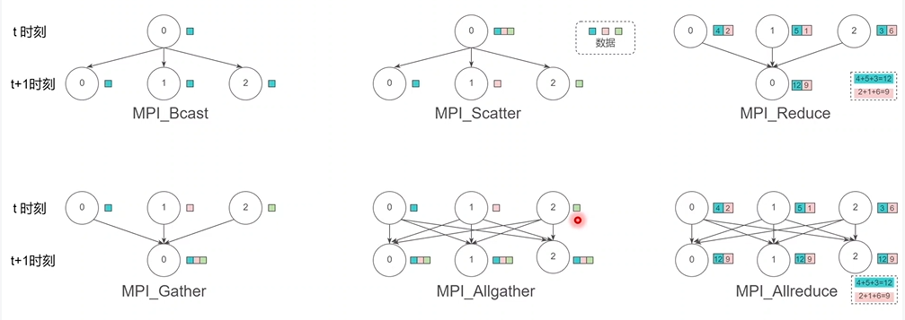

<!-- vscode-markdown-toc-config
	numbering=false
	autoSave=true
	/vscode-markdown-toc-config -->
<!-- /vscode-markdown-toc -->


## 1. python
### python概述
 Python 是一种解释型语言，就是解释一行，运行一行；解释型语言使用解释器将源码逐行解释成机器码并立即执行，不会进行整体性的编译和链接处理，相当于把编译语言中的编译和解释混合到一起同时完成。 可解释

 强类型、动态类型语言。不允许隐式类型转换，比如不允许"12"+34。在声明变量时，不需要说明变量的类型； 具有动态特性

 非常适合面向对象的编程（OOP），因为它支持继承的方式定义类；面向对象

 Python 中没有访问说明符（access specifier，类似 C++中的 public 和 private）；

 在Python 语言中，函数是 first-class objects。这指的是它们可以被指定给变量，函数既能返回函数类型，也可以接受函数作为输入；

 Python 代码编写快，但是运行速度比编译语言通常要慢。好在 Python 允许加入基于 C 语言编写的扩展，因此我们能够优化代码，消除瓶颈。numpy 就是一个很 好地例子，它的运行速度非常快，因为很多算术运算其实并不是通过 Python 实 现的；

 Python 用途非常广泛——网络应用，自动化，科学建模，大数据应用等等；

 python 开源，具有强大的社区支持； 


Python 最大的缺点： 
 执行速度：虽然 Cpython 也会先将代码编译为字节码，然后交给解释器执行， 但是速度还是比纯编译型语言慢。 

执行 python 脚本的两种方式 
a. ./run.py shell 直接调用 python 脚本 
b. python run.py 调用 python 解释器来调用 python 脚本 

### python2 与 python3 区别
1. Python3 使用 print 必须要以小括号包裹打印内容，比如 print('hi') Python2 既可以使用带小括号的方式，也可以使用一个空格来分隔打印内容，比如 print 'hi'  
2. python2 range(1,10)返回列表，python3 中返回迭代器，节约内存； 
3. python2 中使用 ascii 编码，python3 中使用 utf-8 编码； 
4. python2 中 unicode 表示字符串序列，str 表示字节序列 python3 中 str 表示字符串序列，byte 表示字节序列； 
5. python2 中为正常显示中文，引入 coding 声明，python3 中不需要； 
6. python2 中是 raw_input()函数，python3 中是 input()函数； 


### py2 项目如何迁移成 py3 
1. 先备份原文件，然后使用 python3 自带工具 2to3.py 将 py2 文件转换位 py3 文件 
2. 手动将不兼容的代码改写成兼容 py3 的代码 
 


### python 解释代码原理，函数怎么解析的
python 解释器由一个编译器和一个虚拟机构成，编译器负责将源代码转换成字节码文件，而虚拟机负责执行字节码。
所以，解释型语言其实也有编译过程，只不过这个编译过程并不是直接生成目标代码，而是中间代码（字节码），然后再通过虚拟机来逐行解释执行字节码

个人理解执行过程原理：执行 python XX.py 后，将会启动 Python 的解释器，python 解释器的编译器会将.py 源文件编译（解释）成字节码生成 PyCodeObject
字节码对象存放在内存中。python 解释器的虚拟机将执行内存中的字节码对象转化为机器语言，虚拟机与操作系统交互，使机器语言在机器硬件上运行。运行结
束后 python 解释器则将 PyCodeObject 写回到 pyc 文件中。当 python 程序第二次运行时，首先程序会在硬盘中寻找 pyc 文件，如果找到，则直接载入，否则就重
复上面的过程。 所以我们应该这样来定位 PyCodeObject 和 pyc 文件，我们说 pyc文件其实是 PyCodeObject 的一种持久化保存方式。 

.pyc文件通常在以下情况下会被更新：
1、当源代码文件（.py文件）被修改：如果您对源代码进行了修改，Python解释器会检测到源代码文件的时间戳发生了变化，它会重新编译源代码并生成新的.pyc文件。这确保了最新的代码变更可以得到正确的执行。
2、当.pyc文件不存在或已损坏：如果在执行Python程序时发现缺少或损坏了对应的.pyc文件，解释器会重新编译源代码并生成新的.pyc文件。
3、当Python解释器版本发生变化：不同版本的Python解释器可能使用不同的字节码格式，因此在切换Python解释器版本时，旧的.pyc文件可能会被认为不兼容并被重新生成。


## 可变和不可变数据类型，简述原理 
不可变数据类型：数值型、字符串型 string 和元组 tuple
不允许变量的值发生变化，如果改变了变量的值，相当于是新建了一个对象，而对于相同的值的对象，在内存中则只有一个对象（一个地址）

可变数据类型：列表 list 和字典 dict； 
允许变量的值发生变化，即如果对变量进行 append、+=等这种操作后，只是改变了变
量的值，而不会新建一个对象，变量引用的对象的地址也不会变化，不过对于相同的值
的不同对象，在内存中则会存在不同的对象，即每个对象都有自己的地址，相当于内存
中对于同值的对象保存了多份，这里不存在引用计数，是实实在在的对象 
 
可变 list，dict，set ，不可变 int string tuple 
当一个引用传递给函数的时候,函数自动复制一份引用,这个函数里的引用和外边的引用 没有半毛关系了； 
当函数内的引用指向的是可变对象,对它的操作就和定位了指针地址一样,在内存里进行修改。

1,可变类型有 list,dict.不可变类型有 string，number,tuple. 
2,当进行修改操作时，可变类型传递的是内存中的地址，也就是说，直接修改内存中的值，并没有开辟新的内存。 
3,不可变类型被改变时，并没有改变原内存地址中的值，而是开辟一块新的内存，将原
地址中的值复制过去，对这块新开辟的内存中的值进行操作。 

整数对象和字符串对象是不可变对象，python 会高效地缓存它们，python 缓存的整数范围为(-1, 100); 浮点数对象是可变对象； 
 
 


## GIL 
GIL 是 python 的全局解释器锁，同一进程中假如有多个线程运行，一个线程在运行 python 程序的时候会霸占 python 解释器（加了一把锁即 GIL），使该进程
内的其他线程无法运行，等该线程运行完后其他线程才能运行。如果线程运行过程中遇到耗时操作，则解释器锁解开，使其他线程运行。
所以在多线程中，线程的运行仍是有先后顺序的，并不是同时进行。 

Python GIL 底层实现原理 
比如Thread 1、2、3 轮流执行，每一个线程在开始执行时，都会锁住 GIL，以阻止别的线程执行；同样的，每一个线程执行完一段后，会释放 GIL，以允许别的线程开始利用资源。 
既然 CPython 能控制线程伪并行，为什么还需要 GIL 呢？其实，这和 CPython 的底层内存管理有关。 
CPython 使用引用计数来管理内容，所有 Python 脚本中创建的实例，都会配备一个引用计数，来记录有多少个指针来指向它。当实例的引用计数的值为 0 时，会自动释放其所占的内存。 
举个例子，看如下代码：
```shell
>>> import sys 
>>> a = [] 
>>> b = a 
>>> sys.getrefcount(a)  ## 3 
```
可以看到，a 的引用计数值为 3，因为有 a、b 和作为参数传递的 getrefcount 都引用了一个空列表。 
假设有两个 Python 线程同时引用 a，那么双方就都会尝试操作该数据，很有可能造成引用计数的条件竞争，导致引用计数只增加 1（实际应增加 2），这造成的后果是，当第一个线程结束时，会把引用计数减少 1，此时可能已经达到释放
内存的条件（引用计数为 0），当第 2 个线程再次视图访问 a 时，就无法找到有效的内存了。所以，CPython 引进 GIL，可以最大程度上规避类似内存管理这样复杂的竞争风险问题。 


## 装饰器
装饰器本质上是一个 callable object，它可以让其他函数在不需要做任何代码变动的前提下增加额外功能，装饰器的返回值也是一个函数对象。
装饰器的实现原理是将原函数作为参数传递给装饰器函数，然后将原函数替换为装饰器函数返回的新函数。
这意味着当我们调用原函数时，实际上是在调用装饰器函数返回的新函数。这使得我们可以在不修改原函数代码的情况下，为函数增加额外的功能。 
### 1. 不带参数的装饰器
```python
def wrap1(func): 
    def inner_func(*args, **kwargs): 
        print('I\'m inner_func', args, kwargs) 
        func() 
    return inner_func 

## 也就是说我们在进行不带参数的装饰器的调用时，相当于把下面的函数名当做参数传给了@后面的函数 
@wrap1   ## 等价于 func1 = wrap(func1) 
def func1(): 
    print('I\'m func1...') 
func1() 
func1('dong', 'xiang', name='dongxiang')
## 输出： 
## I'm inner_func () {} 
## I'm func1... 
## I'm inner_func ('dong', 'xiang') {'name': 'dongxiang'} 
## I'm func1...
```

### 2. 带参数的装饰器 
```python
def wrap2(type): 
    def outer(func): 
        def inner(*args, **kwargs): 
            if type == 'apple': 
                print('apple phone!!!') 
                func(*args, **kwargs) 
            else: 
                print('other phone!!!') 
        return inner 
    return outer 
## 如果要返回函数的话，带参数的装饰器就要写三层内嵌函数。 
## 等价于 func2 = wrap2('apple')(func) 
@wrap2('apple') 
def func2(): 
    print('func....') 

func2() 
## 输出： 
## apple phone!!! 
## func2.... 
```


任何时候使用装饰器的时候，都应该使用 functools 模块中的@wraps 装饰器来注解底层包装函数。

如果忘记使用@wraps，你会发现被装饰函数丢失了所有有用的信息；wraps 作用就是将被包装函数的元信息复制到可调用实例中。 

@wraps 有一个重要特征是它可以让你通过属性__wrapped__直接访问被包装函数； 一个装饰器已经包装在了函数上，你想撤销他，直接访问原始的未包装的函数。

可以使用:被包装函数名.__wrapped__(*args)访问；


将装饰器定义为类，让装饰器可以同时工作在类定义的内部和外部； 
给类或静态方法提供装饰器；但是要确保装饰器在@classmethod 和@staticmethod 之前； 
通过装饰器给被装饰函数增加参数 
使用装饰器扩充类的功能； 

函数装饰器有什么作用？请列举说明？ 
1. 引入日志  
2. 函数执行时间统计 
3. 执行函数前预备处理 
4. 执行函数后清理功能 
5. 权限校验等场景 
6. 缓存 
7. 事务处理 

一句话解释什么样的语言能够用装饰器? 
函数可以作为参数传递的语言，可以使用装饰器。 
多个装饰器装饰一个函数，其执行顺序是从下往上。 

对装饰器的理解，并写出一个计时器记录方法执行性能的装饰器？ 
```python
import time 
from functools import wraps 
 
def timeit(func): 
    @wraps(func) 
    def wrapper(*args, **kwargs): 
        start = time.clock() 
        ret = func(*args, **kwargs) 
        end = time.clock() 
        print('used:',end-start) 
        return ret 
    return wrapper 
 
@timeit 
def foo(): 
    print('in foo()')
    foo()
``` 


## 可迭代对象、生成器、迭代器的区别 
可迭代对象：包含__iter__()方法的对象； 

迭代器：包含__iter__()和__next__()方法的对象；可以使用 iter() 以从任何序列得到迭代器（如 list，tuple，dict，set 等） 

生成器：另一种形式的迭代器。要获取下一个元素，则使用成员函数 next()（Python 2）或函数 next() function（Python3）。
当没有元素时，则引发 StopIteration 异常。只是在需要返回数据的时候使用 yield 语句。每次 next()被调用时，生成器 会返回它脱离的位置（它记忆语句最后一次执行的位置和所有的数据值） 

区别：生成器能做到迭代器能做的所有事，而且因为自动创建 iter()和 next()方法，生成器显得特别简洁，而且生成器也是高效的，使用生成器表达式取代列表解析
可以同时节省内存。除了创建和保存程序状态的自动方法，当生成器终结时，还会自动抛出 StopIteration 异常。 


## copy 和 deepcopy 区别
1. 复制不可变数据类型，不管 copy 还是 deepcopy，都是同一个地址。当浅复制的值是不可变对象（数值，字符串，元组）时和=“赋值”的情况一样，对象的 id 值与浅复制原来的值相同。 
2. 复制的值是可变对象（列表和字典）
浅拷贝 copy 有两种情况： 
第一种情况：复制的对象中无复杂子对象，原来值的改变并不会影响浅复制的值，同时浅复制的值改变也并不会影响原来的值。原来值的 id 值与浅复制原来的值不同。 
第二种情况：复制的对象中有复杂子对象（例如列表中的一个子元素是一个列表），改变原来的值中的复杂子对象的值，会影响浅复制的值。 
深拷贝 deepcopy：完全复制独立，包括内层列表和字典

浅拷贝：浅拷贝意味着构造一个新的集合对象，然后用原始对象中找到的子对象的引用来填充它。从本质上讲，浅层的复制只有一层的深度。复制过程不会递归，因此不会创建子对象本身的副本。a 和 b 是一个独立的对象，但他们的子对象还是指向统一对象 （是引用）。 
深拷贝：深拷贝使复制过程递归。这意味着首先构造一个新的集合对象，然后递归地用在原始对象中找到的子对象的副本填充它。以这种方式复制一个对象，遍历整个对象树，以创建原始对象及其所有子对象的完全独立的克隆。 


## 进程、线程、协程 
1. 进程（Process），一个程序运行起来后，代码+用到的资源称之为进程，是系统进行资源分配和调度的基本单位； 
线程（Thread）是进程中的一个实体，是 CPU 调度和分派的基本单位； 
协程是一种用户态的轻量级线程，协程的调度完全由用户控制。在Python中使用asyncio库来实现。
2. 线程依赖于进程而存在，一个进程至少有一个线程；
进程有自己的独立地址空间，线程共享所属进程的地址空间； 
进程是拥有系统资源的一个独立单位，而线程自己基本上不拥有系统资源，只拥有一点在运行中必不可少的资源(如程序计数器,一组寄存器和栈)，和其他线程共享本进程的相关资源如内存、I/O、cpu 等； 
在进程切换时，涉及到整个当前进程 CPU 环境的保存环境的设置以及新被调度 运行的 CPU 环境的设置，而线程切换只需保存和设置少量的寄存器的内容，并不涉及存储器管理方面的操作，可见，进程切换的开销远大于线程切换的开销；
协程拥有自己的寄存器上下文和栈。协程调度切换时，将寄存器上下文和栈保存到其他地方，在切回来的时候，恢复先前保存的寄存器上下文和栈，直接操作栈则基本没有内核切换的开销，可以不加锁的访问全局变量，所以上下文的切换非常快。 
3. 线程之间的通信更方便，同一进程下的线程共享全局变量等数据，而进程之间的通信需要以进程间通信(IPC)的方式进行； 
多线程程序只要有一个线程崩溃，整个程序就崩溃了，但多进程程序中一个进程崩溃并不会对其它进程造成影响，因为进程有自己的独立地址空间，因此多进程更加健壮； 
当一个协程发生异常并崩溃时，通常只会影响当前的协程，其他协程可以继续执行。这是因为协程之间的切换是由事件循环控制的，事件循环会捕获协程的异常并处理，以确保其他协程的正常执行。

在 Python 中，协程不需要多线程的锁机制，因为只有一个线程，也不存在变量冲突。
Python2.x 对协程的支持比较有限，生成器 yield 实现了一部分但不完全，gevent 模块倒是有比较好的实现；
Python3.4 加入了 asyncio 模块，在 Python3.5 中又提供了 async/await 语法层面的支持，Python3.6 中 asyncio 模块更加完善和稳定。 

1. 线程和协程推荐在 IO 密集型的任务(比如网络调用)中使用，而在 CPU 密集型的任务中，表现较差。 
2. 对于 CPU 密集型的任务，则需要多个进程，绕开 GIL 的限制，利用所有可用的 CPU 核心，提高效率。 
3. 在高并发下的最佳实践就是多进程+协程，既充分利用多核，又充分发挥协程的高效率，可获得极高的性能。 


### python 中 IO 密集型为什么用多线程
在 Python 中,对于 IO 密集型任务,使用多线程可以显著提高程序的性能。这主要有以下几个原因:
1. IO 操作的阻塞特性
IO 操作,如读写文件、网络通信等,都是阻塞式的。当一个线程发起 IO 请求时,它会被阻塞,直到 IO 操作完成。在单线程模型下,IO 阻塞会导致整个程序停滞,无法继续执行其他任务。
2. GIL 的影响
Python 有全局解释器锁(GIL),导致在任意时刻只能有一个线程在执行 Python 字节码。这意味着 Python 的多线程并不能利用多核 CPU 实现并行计算。但是,当线程执行 IO 操作时,GIL 会被释放,允许其他线程执行。因此,IO 密集型任务可以通过多线程实现并发。
3. 操作系统的调度
当一个线程阻塞在 IO 操作上时,操作系统会将其挂起,并切换到其他就绪的线程。这样,在一个线程等待 IO 的同时,其他线程可以继续执行,从而提高了资源利用率和程序的整体性能。
4. 用户感知的响应速度
对于一些需要频繁 IO 操作的应用,如 Web 服务器,使用多线程可以显著提高用户感知的响应速度。当一个线程在处理请求时阻塞于 IO,其他线程可以继续处理新的请求,从而缩短了用户的等待时间。


## python asyncio
asyncio是Python标准库中提供的异步I/O框架，用于编写高性能、高并发的网络应用程序。
它基于事件循环（event loop）的概念，允许在单个线程内处理大量的并发操作，而不会阻塞程序的执行。

以下是asyncio的一些关键概念和组件：

1. 事件循环（Event Loop）：
   - 所谓事件循环，是指主线程每次将执行序列中的任务清空后，就去事件队列中检查是否有等待执行的任务，如果有则每次取出一个推到执行序列中执行，这个过程是循环往复的。
   - 事件循环是asyncio的核心，它负责管理和调度所有的异步任务和I/O操作。
   - 通过`asyncio.get_event_loop()`可以获取当前的事件循环，也可以使用`asyncio.new_event_loop()`创建一个新的事件循环。
   - 事件循环通过调用`loop.run_until_complete()`或`loop.run_forever()`来启动，直到所有任务完成或手动停止。

2. 协程（Coroutine）：
   - 协程是使用`async def`定义的特殊函数，它可以被暂停和恢复执行。
   - 协程通过`await`关键字来等待其他协程或异步操作的完成，而不会阻塞事件循环的执行。
   - 协程可以使用`asyncio.create_task()`函数将其封装为一个任务（Task）并交给事件循环执行。

3. 任务（Task）：
   - 任务是对协程的封装，表示一个正在运行或等待运行的协程。
   - 可以使用`asyncio.create_task()`函数创建一个任务，并将其提交给事件循环执行。
   - 任务可以使用`await`关键字等待其完成，也可以使用`asyncio.gather()`同时等待多个任务完成。

4. 异步I/O操作：
   - asyncio提供了各种异步I/O操作的支持，如异步文件读写、异步网络通信等。
   - 常用的异步I/O操作包括`asyncio.sleep()`、`asyncio.open_connection()`、`asyncio.start_server()`等。
   - 这些操作允许在等待I/O完成的同时，事件循环可以继续处理其他任务，提高了程序的并发性能。

5. 异步上下文管理器：
   - asyncio支持使用`async with`语句定义异步上下文管理器，用于管理异步资源的获取和释放。
   - 常见的异步上下文管理器包括`asyncio.Lock`、`asyncio.Semaphore`等，用于同步和控制并发访问。

6. 异步迭代器和异步生成器：
   - asyncio支持使用`async for`语句定义异步迭代器，用于异步地迭代可迭代对象。
   - 异步生成器使用`async def`和`yield`关键字定义，可以生成一系列的值，并在每次生成值时暂停执行。

7. 异步队列和异步管道：
   - asyncio提供了`asyncio.Queue`和`asyncio.PriorityQueue`等异步队列，用于在协程之间传递数据。
   - 异步管道`asyncio.Pipe`允许在协程之间进行双向通信。

asyncio还提供了其他功能，如异步子进程管理、异步文件系统操作、异步DNS解析等，使得编写高性能、高并发的异步应用程序变得更加方便和高效。

下面是一个使用Python的`asyncio`模块实现并发的示例：

```python
import asyncio
import random
import time

async def task(name):
    print(f"Task {name} started.")
    ## 模拟一个耗时的操作
    await asyncio.sleep(random.randint(1, 5))
    print(f"Task {name} completed.")

async def main():
    start_time = time.time()
    
    ## 创建多个任务
    tasks = [
        asyncio.create_task(task("A")),
        asyncio.create_task(task("B")),
        asyncio.create_task(task("C")),
        asyncio.create_task(task("D")),
    ]
    
    ## 等待所有任务完成
    await asyncio.gather(*tasks)
    
    end_time = time.time()
    print(f"Total time: {end_time - start_time:.2f} seconds.")

## 运行异步主函数
asyncio.run(main())
```

在这个示例中，我们定义了一个异步函数`task`，它接受一个名称参数。在函数内部，我们使用`asyncio.sleep`模拟一个耗时的操作，随机等待1到5秒钟。

在`main`函数中，我们创建了多个任务，每个任务都是通过调用`asyncio.create_task`创建的。我们将这些任务存储在一个列表中。

接下来，我们使用`asyncio.gather`函数等待所有任务完成。`asyncio.gather`接受任意数量的可等待对象（如协程或任务），并在所有任务完成后返回它们的结果。

最后，我们计算并打印出程序的总执行时间。

运行这个示例，你会看到类似以下的输出：

```
Task A started.
Task B started.
Task C started.
Task D started.
Task B completed.
Task A completed.
Task D completed.
Task C completed.
Total time: 3.14 seconds.
```

可以看到，所有任务都是并发执行的，它们的启动和完成顺序可能会有所不同，这取决于每个任务的随机等待时间。程序的总执行时间比任务的最长等待时间要短，这是因为任务是并发执行的，而不是串行执行的。

使用`asyncio`模块可以方便地实现并发编程，它允许我们编写异步代码，利用事件循环来管理和调度任务的执行。这对于处理大量的I/O操作、网络请求或其他耗时的任务非常有用，可以显著提高程序的性能和响应速度。

`asyncio`模块中一些常用函数的解释：

1. `asyncio.run(coro)`：
   - 用于运行传入的协程对象`coro`，并返回协程的结果。
   - 这是运行异步程序的主入口点，通常在程序的最外层调用。
   - 它会创建一个新的事件循环，运行协程直到完成，然后关闭事件循环。

2. `asyncio.create_task(coro)`：
   - 用于将协程对象`coro`封装成一个`Task`对象，并将其提交给事件循环执行。
   - 返回创建的`Task`对象，可以用于跟踪和控制任务的执行。
   - 通过`create_task`创建的任务会在事件循环中并发执行。

3. `asyncio.gather(*aws, loop=None, return_exceptions=False)`：
   - 用于并发地运行多个可等待对象（如协程或任务），并等待它们全部完成。
   - 接受任意数量的可等待对象作为参数，返回一个包含所有结果的列表。
   - 如果`return_exceptions`设置为`True`，异常会作为结果返回，而不是引发。

4. `asyncio.sleep(delay, result=None, *, loop=None)`：
   - 用于在指定的延迟时间`delay`（以秒为单位）后返回一个结果。
   - 在延迟期间，该函数会将控制权交还给事件循环，允许其他任务执行。
   - 通常用于模拟耗时的操作或引入延迟。

5. `asyncio.wait(aws, *, loop=None, timeout=None, return_when=ALL_COMPLETED)`：
   - 用于并发地运行多个可等待对象，并等待它们完成或超时。
   - 接受一个可等待对象的集合`aws`，返回两个集合：已完成的任务和未完成的任务。
   - `timeout`参数指定最大等待时间，`return_when`参数指定何时返回（如`FIRST_COMPLETED`、`FIRST_EXCEPTION`）。

6. `asyncio.ensure_future(coro_or_future, *, loop=None)`：
   - 用于将一个协程对象或`Future`对象封装成一个`Future`对象。
   - 如果参数已经是`Future`对象，则直接返回它。
   - 通常用于将协程对象转换为`Future`对象，以便在回调或其他地方使用。

7. `asyncio.get_event_loop()`：
   - 用于获取当前上下文的事件循环。
   - 如果当前上下文没有事件循环，则会引发异常。
   - 通常在协程或回调函数中使用，用于获取当前的事件循环对象。

这些是`asyncio`模块中一些常用的函数，它们提供了创建和管理异步任务、并发执行、延迟操作以及事件循环交互的功能。通过合理使用这些函数，你可以编写高效的异步程序，充分利用并发的优势。

当然，`asyncio`模块还提供了许多其他的函数和类，用于更高级的异步编程场景，如异步上下文管理器、异步迭代器、异步队列等。你可以根据具体的需求进一步探索和使用这些功能。


## 简述__new__和__init__区别
1. __new__至少要有一个参数 cls，代表当前类，此参数在实例化时由 Python 解释器自动识别；__init__是初始化方法，创建对象后，就立刻被默认调用了，可接收参数； 
2. __new__必须要有返回值，返回实例化出来的实例，可以 return 父类（通过super(当前类名, cls)）__new__出来的实例，或者直接是 object 的__new__出来的实例；
__init__有一个参数 self，就是这个__new__返回的实例，__init__在__new__的基础上可以完成一些其它初始化的动作，__init__不需要返回值； 
3. 如果__new__创建的是当前类的实例，会自动调用_init__函数，通过 return 语句里面调用的__new__函数的第一个参数是 cls 来保证是当前类实例，如果是其他类的类名，那么实际创建返回的就是其他类的实例，其实就不会调用当前类的;
_init__函数，也不会调用其他类的__init__函数。 
4. __new__在创建一个实例的过程中必定会被调用，但__init__就不一定，比如通过 pickle.load 的方式反序列化一个实例时就不会调用__init__。 
5. 创建对象的动作有两步：1. 在内存中为对象分配空间，调用__new__()方法完成；2. 调用初始化方法__init__为对象初始化； 
 
 
## python 内存管理机制 
#### python 内存池
当创建大量消耗小内存的对象时，频繁调用 new/malloc 会导致大量的内存碎片， 致使效率降低。 内存池的作用就是预先在内存中申请一定数量的，大小相等的内存块留作备用，当有新的内存需求时，就先从内存池中分配内存给这个需求，不够之后再申请新的内存。
这样做最显著的优势就是能够减少内存碎片，提升效率。 python 中的内存管理机制为 Pymalloc。
内存池是如果工作的（how）
首先，我们看一张 CPython(python 解释器)的内存架构图： 

python 的对象管理主要位于 Level+1~Level+3 层 
Level+3 层：对于 python 内置的对象（比如 int,dict 等）都有独立的私有内存池，对象之间的内存池不共享，即 int 释放的内存，不会被分配给 float 使用 
Level+2 层：当申请的内存大小小于 256KB 时，内存分配主要由 Python 对象分配器（Python’s object allocator）实施 
Level+1 层：当申请的内存大小大于 256KB 时，由 Python 原生的内存分配器进行分配，本质上是调用 C 标准库中的 malloc/realloc 等函数 
关于释放内存方面，当一个对象的引用计数变为 0 时，Python 就会调用它的析构函数。调用析构函数并不意味着最终一定会调用 free 来释放内存空间，如果真是这样的话，那频繁地申请、释放内存空间会使 Python 的执行效率大打折扣。
因此在析构时也采用了内存池机制，从内存池申请到的内存会被归还到内存池中， 以避免频繁地申请和释放动作。 

### 垃圾回收 
垃圾回收机制：主要是以对象引用计数为主标记清除和分代技术为辅的那么一种方式； 

#### 引用计数 PyObject 
python 里每一个东西都是对象，它们的核心就是一个结构体：PyObject。 PyObject 是每个对象必有的内容，其中 ob_refcnt 就是做为引用计数。
当一个对象有新的引用时，它的 ob_refcnt 就会增加，当引用它的对象被删除，它的 ob_refcnt就会减少，当引用计数降为 0 时，说明没有任何引用指向该对象，该对象就成为 要被回收的垃圾了。
不过如果出现循环引用（当对象 1 中的某个属性指向对象 2， 对象 2 中的某个属性指向对象 1 就会出现循环引用）的话，引用计数机制就不再起有效的作用了，del 语句可以减少引用次数，但是引用计数不会归 0，对象也就不会被销毁，从而造成了内存泄漏问题。 

#### 标记清除
标记-清除机制，顾名思义，首先标记对象（垃圾检测），然后清除垃圾（垃圾回收）。首先初始所有对象标记为白色，并确定根节点对象（这些对象是不会被删除），标记它们为黑色（表示对象有效）。将有效对象引用的对象标记为灰色（表示对象可达，但它们所引用的对象还没检查），检查完灰色对象引用的对象后，将灰色标记为黑色。重复直到不存在灰色节点为止。最后白色结点都是需要清除的对象。 
解决循环引用： 
```shell
>>> a=[1,2] 
>>> b=[3,4] 
>>> sys.getrefcount(a) 
2 
>>> sys.getrefcount(b) 
2 
>>> a.append(b) 
>>> sys.getrefcount(b) 
3 
>>> b.append(a) 
>>> sys.getrefcount(a) 
3 
>>> del a 
>>> del b 
```
a 引用 b,b 引用 a,此时两个对象各自被引用了 2 次（去除 getrefcout()的临时引用） 
 
执行 del 之后，对象 a,b 的引用次数都-1，此时各自的引用计数器都为 1，陷入循环引用
标记：找到其中的一端 a,因为它有一个对 b 的引用，则将 b 的引用计数-1
标记：再沿着引用到 b,b 有一个 a 的引用,将 a 的引用计数-1，此时对象 a 和 b 的引用次数全部为 0，被标记为不可达（Unreachable）
清除: 被标记为不可达的对象就是真正需要被释放的对象 


#### 分代回收 
Python 使用一种叫做分代垃圾回收(Generational Garbage Collection)的机制来管理内存。
这种机制基于这样一个观察:大部分对象的生命周期都很短,而那些生命周期长的对象通常会存活更长时间。
基于这个观察,Python 将所有对象分为三代:年轻代(Young Generation)、中年代(Middle Generation)和老年代(Old Generation)。

1. 年轻代(Young Generation)
新创建的对象都会被分配在年轻代。年轻代的空间通常很小,因为大部分新创建的对象都很快就会变得不可达,成为垃圾对象。
当年轻代空间被填满时,就会触发一次垃圾回收,这被称为 minor collection。 
在 minor collection 中,垃圾对象被清理,而那些还在使用的对象则被移动到一个叫做 S0 的 Survivor 空间。
当再次触发 minor collection 时,S0 空间的对象如果还在使用,就会被移动到另一个叫做 S1 的 Survivor 空间,同时年轻代和 S0 空间的垃圾对象被清理。
这个过程会不断重复,每次 minor collection 都会交换 S0 和 S1 的角色。

2. 中年代(Middle Generation)
经过几次 minor collection 后仍然存活的对象,会被提升到中年代。中年代的空间比年轻代大,但仍然比老年代小。
当中年代空间被填满时,会触发一次 major collection,这次回收的成本比 minor collection 高,因为中年代的对象数量比年轻代多,且大部分对象都会存活。

3. 老年代(Old Generation)
经过多次 major collection 后仍然存活的对象,会被提升到老年代。老年代的空间是最大的,因为它存储的都是生命周期很长的对象。
当老年代空间被填满时,会触发一次 full collection,这是成本最高的垃圾回收操作,因为它会回收所有代的对象。

这种分代的设计,是基于大部分新创建的对象都是短命的这一假设。
通过将对象按照年龄分代,Python 可以在大部分时候使用速度较快的 minor collection,
只在必要时才进行成本较高的 major collection 和 full collection,从而提高了垃圾回收的效率。

 
### 哪些操作会导致 Python 内存泄露，怎么处理？
内存泄漏指由于疏忽或错误造成程序未能释放已经不再使用的内存。内存泄漏并非指内存在物理上的消失，而是应用程序分配某段内存后，由于设计错误，导致在释放该段内存之前就失去了对该段内存的控制，从而造成了内存的浪费。 有 
__del__() 函数的对象间的循环引用是导致内存泄露的主凶。不使用一个对象时使用: del object 来删除一个对象的引用计数就可以有效防止内存泄露问题。 
通过 Python 扩展模块 gc 来查看不能回收的对象的详细信息。 
可以通过sys.getrefcount(obj) 来获取对象的引用计数，并根据返回值是否为 0 来判断是否内存泄露 
 python 的程序会内存泄漏吗？ 
o会发生内存泄漏，在 Python 程序里，内存泄漏是由于一个长期持有的对象不断的往一个 dict 或者 list 对象里添加新的对象, 而又没有即时释放，就会导致这些对象占用的内存越来越多，从而造成内存泄漏。另外，对象的交叉引用也会造成内存无法释放的问题。 
 说说有没有什么方面阻止或者检测内存泄漏？ 
1. 程序员管理好每个 python 对象的引用，尽量在不需要使用对象的时候，断开所有引用 
2. 尽量少通过循环引用组织数据，可以改用 weakref 做弱引用或者用 id 之类的句柄访问对象 
3. 通过 gc 模块的接口可以检查出每次垃圾回收有哪些对象不能自动处理，再逐个逐个处理 

关于内存溢出和内存泄漏的区别 
内存溢出：（Out Of Memory---OOM） 
系统已经不能再分配出你所需要的空间，比如你需要 100M 的空间，系统只剩90M 了，这就叫内存溢出 
内存泄漏： (Memory Leak) 
强引用所指向的对象不会被回收，可能导致内存泄漏，虚拟机宁愿抛出 OOM 也不会去回收他指向的对象. 

Python 的内存管理机制及调优手段？ 
gc 模块 
gc.disable()  ## 暂停自动垃圾回收. 
gc.collect()  ## 执行一次完整的垃圾回收, 返回垃圾回收所找到无法到达的对象的数量. 
gc.set_threshold()  ## 设置 Python 垃圾回收的阈值. 
gc.set_debug()  ## 设置垃圾回收的调试标记. 调试信息会被写入 std.err. 
Python 有两种共存的内存管理机制: 引用计数和垃圾回收 
垃圾回收机制：主要是以对象引用计数为主标记清除和分代技术为辅的那么一种方式 

三种情况触发垃圾回收 1、调用 gc.collect() 2、GC 达到阀值时 3、程序退出时 
调优手段: 
1.手动垃圾回收 
2.调高垃圾回收阈值 
3.避免循环引用 


## python 中单例模式实现方式 
第一种方法：使用装饰器 
```python
def singleton(cls): 
    instances = {} 
    def wrapper(*args, **kwargs): 
        if cls not in instances: 
            instances[cls] = cls(*args, **kwargs) 
        return instances[cls] 
    return wrapper 
@singleton 
class Foo(object): 
    pass 
foo1 = Foo() 
foo2 = Foo() 
print(foo1 is foo2) ##True
```
第二种方法：使用基类__new__是真正创建实例对象的方法，所以重写基类的__new__ 方法，以此保证创建对象的时候只生成一个实例 
```python
class Singleton(object): 
    def __new__(cls,*args,**kwargs): 
        if not hasattr(cls,'_instance'): 
            cls._instance = super(Singleton,cls).__new__(cls,*args,**kwargs) 
        return cls._instance
``` 
第三种方法：元类，元类是用于创建类对象的类，类对象创建实例对象时一定要调用__call__方法，因此在调用__call__时候保证始终只创建一个实例即可，type 是 python 的元类 
```python
class Singleton(type): 
    def __call__(cls, *args, **kwargs): 
        if not hasattr(cls, '_instance'): 
            cls._instance = super(Singleton, cls).__call__(*args, **kwargs) 
        return cls._instance 

## Python2 
class Foo(object): 
    __metaclass__ = Singleton 
 
## Python3 
class Foo(metaclass=Singleton): 
    pass 
 
foo1 = Foo() 
foo2 = Foo() 
print(foo1 is foo2)  ## True
```

第四种方法：import 方法 
作为 python 的模块是天然的单例模式 
```python
## mysingleton.py 
class My_Singleton(object): 
    def foo(self): 
        pass 
my_singleton = My_Singleton() 
## to use 
from mysingleton import my_singleton 
my_singleton.foo()
```
 
用double check（双重检查）实现单例模式
```python
import threading

class Singleton:
    _instance = None
    _lock = threading.Lock()

    def __new__(cls, *args, **kwargs):
        if not cls._instance:
            with cls._lock:
                if not cls._instance:
                    cls._instance = super().__new__(cls)
        return cls._instance
```


## python 上下文管理器的两种方式？ 
1. __enter__ __exit__ 
with 声明是从 Python2.5 开始引进的关键词。你应该遇过这样子的代码: 
with open('foo.txt') as bar: 
    do something with bar 
在 with 声明的代码段中，我们可以做一些对象的开始操作和清除操作，还能对
异常进行处理。这需要实现两个魔术方法: __enter__ 和 __exit__。 
__enter__(self) 
__enter__会返回一个值，并赋值给 as 关键词之后的变量。在这里，你可以定义代码段开始的一些操作。 
__exit__(self, exception_type, exception_value, traceback) 
__exit__定义了代码段结束后的一些操作，可以这里执行一些清除操作，或者做
一些代码段结束后需要立即执行的命令，比如文件的关闭，socket 断开等。如果
代码段成功结束，那么 exception_type, exception_value, traceback 三个参数传进
来时都将为 None。如果代码段抛出异常，那么传进来的三个参数将分别为: 异常
的类型，异常的值，异常的追踪栈。 如果__exit__返回 True, 那么 with 声明下的
代码段的一切异常将会被屏蔽。 如果__exit__返回 None, 那么如果有异常，异常
将正常抛出，这时候 with 的作用将不会显现出来。 
举例说明： 
这该示例中，IndexError 始终会被隐藏，而 TypeError 始终会抛出。 
```python
class DemoManager(object): 
 
    def __enter__(self): 
        pass 
 
    def __exit__(self, ex_type, ex_value, ex_tb): 
        if ex_type is IndexError: 
            print(ex_value.__class__) 
            return True 
        if ex_type is TypeError: 
            print(ex_value.__class__) 
            return  ## return None 
 
with DemoManager() as nothing: 
    data = [1, 2, 3] 
    data[4]  ## raise IndexError, 该异常被__exit__处理了 
 
with DemoManager() as nothing: 
    data = [1, 2, 3] 
    data['a']  ## raise TypeError, 该异常没有被__exit__处理 
 
''' 
输出: 
<type 'exceptions.IndexError'> 
<type 'exceptions.TypeError'> 
Traceback (most recent call last): 
  ... 
'''
```

with 方法打开处理文件做了什么? 

打开文件在进行读写的时候可能会出现一些异常状况，如果按照常规的 f.open 
写法，我们需要 try,except,finally，做异常判断，并且文件最终不管遇到什么情况，
都要执行 finally f.close()关闭文件，with 方法帮我们实现了 finally 中 f.close 
with 语句适用于对资源进行访问的场合，确保不管使用过程中是否发生异常都会
执行必要的“清理”操作，释放资源，比如文件使用后自动关闭、线程中锁的自动获取和释放等。
with 语句即“上下文管理器”，在程序中用来表示代码执行过程中所处的前后环境
上下文管理器：含有__enter__和__exit__方法的对象就是上下文管理器。 
__enter__：在执行语句之前，首先执行该方法，通常返回一个实例对象，如果 with 语句有 as 目标，则将对象赋值给 as 目标。 
__exit__：执行语句结束后，自动调用__exit__方法，用户释放资源，若此方法返
回布尔值 True，程序会忽略异常。 使用环境：文件读写、线程锁的自动释放等。

2. contextlib 实现上下文管理器 
contextlib 模块中@contextmanager 装饰器 
```python
@contextmanager 
def timethis(label): 
    start_time = time.time() 
    try: 
        yield 
    finally: 
        end_time = time.time() 
        print("{}: {}".format(label, (end_time - start_time))) 
 
 
with timethis('counting'): 
    n = 100000 
    while n > 0: 
        print("running...")
        
```

yield 之前的代码会在上下文管理器中作为__enter__()方法执行，所有再 yield 之后的代
码会作为__exit__()方法执行，如果出现了异常，代码会在 yield 那里抛出； 


## Python 中的反射 
反射就是通过字符串的形式，导入模块；通过字符串的形式，去模块寻找指定函数，并执行。
利用字符串的形式去对象（模块）中操作（查找/获取/删除/添加）成员，一种基于字符串的事件驱动！ 
自省就是面向对象的语言所写的程序在运行时,所能知道对象的类型。
简单一句就是运行时能够获得对象的类型.比如 type()，dir()，getattr()，hasattr()，isinstance()。 
getattr,hasattr,setattr,delattr 对模块的修改都在内存中进行，并不会影响文件中真
实内容。并且他们的入参可以是模块名；

1. getattr()函数是 Python 自省的核心函数，具体使用大体如下：
```python
class A:  
    def __init__(self):  
        self.name = 'zhangjing' 
       ## self.age='24' 

    def method(self):  
        print("method print") 

Instance = A()
print(getattr(Instance , 'name, 'not find'))   ##如果 Instance 对象中有属性 name 则打印 self.name的值，否则打印'not find' 
print(getattr(Instance , 'age', 'not find'))   ##如果 Instance 对象中有属性 age 则打印 self.age 的值，否则打印'not find'
print(getattr(Instance, 'method', 'default'))  ##如果有方法 method，否则打印其地址，否则打印 default  
print(getattr(Instance, 'method', 'default')()) ##如果有方法 method，运行函数并打印 None 否则打印default
```

2. hasattr(object, name) 
说明：判断对象 object 是否包含名为 name 的特性（hasattr 是通过调用 getattr(ojbect, name)是否抛出异常来实现的） 

3. setattr(object, name, value)
这是相对应的 getattr()。参数是一个对象,一个字符串和一个任意值。字符串可能会列出
一个现有的属性或一个新的属性。这个函数将值赋给属性的。该对象允许它提供。例
如,setattr(x,“foobar”,123)相当于 x.foobar = 123。 

4. delattr(object, name)
与 setattr()相关的一组函数。参数是由一个对象(记住 python 中一切皆是对象)和一个字
符串组成的。string 参数必须是对象属性名之一。该函数删除该 obj 的一个由 string 指定
的属性。delattr(x, 'foobar')=del x.foobar 


## 面向对象

#### 类class
类以及类中的方法在内存中只有一份，而根据类创建的每一个对象都在内存中需要存一份。只要创建一个对象,其内存空间就会保存一份。

 普通字段属于对象

 静态字段属于类

 静态字段在内存中只保存一份

 普通字段在每个对象中都要保存一份


```python
class foo: 
 
    country = '中国'  ## 静态字段,保存在类中，仅此一份 
    def __init__(self,name): 
 
        self.name = name  ## 普通字段,封装到对象中 
 
    def show(self): 
        print(self.name) 
 
 
obj = foo("xiaoxiao") 
print(obj.name)  ## 通过对象直接访问普通字段 
print(foo.country)  ## 通过类名直接访问静态字段 
print(obj.country)  ## 对象间接访问静态字段 
print(foo.name)  ##报错,

# 类中方法,除了类调用类中普通方法不一样,其余的全部都可以通过类或者对象来调用。
```

1. 凡是类中的方法和函数，都是绑定给对象使用的；
2. 绑定方法都有自动传值的功能。传递进去的值，就是对象本身。 
3. 如果类想调用绑定方法，就必须遵循函数的参数规则，有几个参数，就必须传递几个参数。 
只要你使用关键字 class，Python 解释器在执行的时候就会创建一个对象。下面的代码段： 
```shell
>>> class ObjectCreator(object): 
...      pass 
...  
```
将在内存中创建一个对象，名字就是 ObjectCreator。这个对象（类）自身拥有创建对象（类实例）的能力，而这就是为什么它是一个类的原因。
但是，它的本质仍然是一个对象，于是乎你可以对它做如下的操作： 
1) 你可以将它赋值给一个变量 
2) 你可以拷贝它 
3) 你可以为它增加属性 
4) 你可以将它作为函数参数进行传递 


#### property属性
由属性的定义和调用要注意一下几点： 
 定义时，在普通方法的基础上添加 @property 装饰器；
 定义时，属性仅有一个 self 参数 
 调用时，无需括号 方法：foo_obj.func() 属性：foo_obj.prop 

属性存在意义是：访问属性时可以制造出和访问字段完全相同的假象 
Python 的属性的功能是：属性内部进行一系列的逻辑计算，最终将计算结果返回。

property 的构造方法中有个四个参数 
1. 第一个参数是方法名，调用 对象.属性 时自动触发执行方法 
2. 第二个参数是方法名，调用 对象.属性 ＝ XXX 时自动触发执行方法 
3. 第三个参数是方法名，调用 del 对象.属性 时自动触发执行方法 
4. 第四个参数是字符串，调用 对象.属性.__doc__ ，此参数是该属性的描述信息

```python
class Foo1(object): 
    def get_bar(self): 
        return 'dong is a genius' 
 
    def set_bar(self, name): 
        return '%s is a genius, yes, you are right.' % name 
 
    def del_bar(self): 
        return 'dong is a foolish man' 
 
    BAR = property(get_bar, set_bar, del_bar, 'description dong...') 
 
 
## 执行结果 
## foo = Foo1() 
## print(foo.BAR)  ## 自动调用第一个参数中定义的方法：get_bar 
## foo.BAR = 'shane'  ## 自动调用第二个参数中定义的方法：set_bar 方法，并将“shane”当作参数传入 
## print(foo.BAR) 
## del foo.BAR  ## 自动调用第三个参数中定义的方法：del_bar 方法 
## print(foo.BAR.__doc__)  ## 自动获取第四个参数中设置的值：description dong...
```


#### 封装 
 属性和方法封装到一个抽象的类中，外界使用类创建对象，然后让对象调用方法，对象方法的细节都被封装到类的内部；一个对象的属性可以是另外一个类创建的对象；

 在对象方法的内部，是可以直接访问对象的属性；

 同一个类创建的多个对象之间，它们的属性是互不干扰的；

 身份运算符：用于比较两个对象的内存地址是否一致----是否是同一对象的引用；Python 中针对 None 的比较时建议使用 None 判断；is 用于判断两个变量引用对象是否是同一个，==判断引用变量的值是否相等。

 内部属性或方法(_internal)：任何以单下划线 _ 开头的名字都应该是内部实现。 同样适用于模块名和模块级别函数。 

 私有属性或方法(__private)：不希望外部访问的属性或方法，前面加上两个下划线，外界和子类都不能访问，使用双下划线开始会导致访问名称变成其他形式。 

```python
class A(object): 
    def __init__(self): 
        self._internal = 0 
        self.public = 1 
        self.__private_param = 100 
 
    def public_method(self): 
        print(self.__private_method) 
        print(self.__private_param) 
 
    def _internal(self): 
        pass 
 
    def __private_method(self): 
        pass 
     
class B(A): 
    def __init__(self): 
        super(B, self).__init__() 
        self.__private_param = 100 
 
    def __private_method(self): 
        pass 

a = A() 
a.public_method() 
print(a.__dict__) 
print(a._A__private_param) 
print(dir(a))    ## '_A__private_method', '_A__private_param','_internal', 'public', 'public_method'  

b = B() 
print(dir(b))    ## '_internal', 'public', 'public_method','_A__private_method', '_A__private_param', '_B__private_method', '_B__private_param', 
 

## 内部属性或方法就是：_internal 和_internal_method 
## 私 有 属 性 或 方 法 就 是 : _A_private_method ， _A_private_method ， 外 部 引 用就是a._A__private_param 
## 可以看到类 B 继承自 A，并在 B 中定义属性__private_param 和方法__private_method，
## 这个 B 中新定义的，并不是重写，而 B 中也继承了 A 中的私有属性和方法，也就是说python 这样命名私有属性这样重命名目的就是继承——这种属性通过继承是无法被覆盖的。 
 
## 使用下换线作为后缀可以避免与保留关键字冲突。 
## 如果想访问属性可以通过属性的 getter（访问器）和 setter（修改器）方法进行对应的操作。如果要做到这点，就可以考虑使用@property 包装器来包装 getter 和setter 方法，使得对属性的访问既安全又方便. 
```


#### 继承 
 继承用来实现代码的重用；子类拥有父类所有的属性和方法，可以直接使用父类的中封装好的方法，不需要再次开发；子类继承父类，子类的实例可以拥有父类的属性； 

 继承传递性； 

 重写父类方法： 

o 覆盖父类中的方法：实现方式就相当于在子类中定义一个和父类同名的方法并实现；运行时，只会调用子类中重写的方法，不会调用父类中封装的方法； o 对父类方法进行扩展：这种情况的意思是说，父类封装的方法实现是子类的一部分，具体实现方式就是在子类重写的父类方法体中，在需要的位置使用 super().父类方法来调用父类方法的执行，代码的其它位置编写子类特有的实现。 
o 多继承时，避免父类之间存在同名的属性或方法。如果一个类有多个父类时，子类调用方法的顺序是先子类，之后安装类名(A,B,C)中，先搜索 A，之后 B，再者C，最后 object 类，找到最后一个类没有这个方法的话，程序报错。Python 中提供一个内置属性__mro__可以查看方法的搜索顺序，MRO 是 method resolution order，主要用于多继承时判断方法属性的调用顺序。


python 解释器中有一个 C3 算法，来计算通过 super()调用父类的一个顺序，C3 算法的结论的体现保存到 MRO 中去，一个类中调用 super()的时候，拿着当前类的名字，到 MRO 元组中匹配，匹配成功，就调用匹配到的下一个类，上图的
Grandson()调用顺序是 Son1-->Son2-->Parent-->object o 新式类，旧式类： 
新式类----以 object 为基类的类，旧式类----不以 object 为基类的类 


super 用法 

super().__setter(name, value     没有显式的指明某个类的父类，super()仍然可以有效的工作。 
 
super().parent_function()----调用父类方法； 

super().__init__()----在__init__()方法中确保父类被正确初始化； 

super.__setter__(key, value)----调用原生的方法； 


#### 多态 
 不同的子类对象调用相同的父类方法，产生不同的执行结果； 
 以继承和重写父类方法为前提； 
 类：
o Python 中一切皆对象，class A:定义的类属于类对象； 

o 程序运行时，类同样会被加载到内存，类是一个特殊的对象---类对象，类对象在内存够中只有一份； 

o 类属性或类方法： 
 类属性----给类对象定义的属性； 
 Python 中属性获取存在一个向上查找机制；对象调用属性时，如 person01.count，
1. 首先在对象内部查找对象的属性；
2. 没有找到就会向上寻找类属性；
3. 访问类属性的两种方式：1. 类名.类属性名；2. 对象.类属性。 

 如果使用对象.类属性 = 值赋值语句时，只会给对象添加一个属性，不会影响类属性的值； 
 类方法----修饰器@classmethod 标识； 
 静态方法----修饰器@staticmethod 标识； 


#### 元类 
元类就是用来创建这些类（对象）的，元类就是类的类。 
MyClass = type('MyClass', (), {}) 
type 实际上是一个元类，type 就是 python 在背后用来创建所有类的元类。 
 

##### 元类控制器实例的创建 
Python 是一种动态语言，而动态语言和静态语言最大的不同，就是函数和类不是编译时定义的，而是运行时动态创建的。class 的定义是运行时动态创建的，而创建 class 的方法就是使用 type()函数 
定义：type(类名, 父类的元组（针对继承的情况，可以为空），包含属性的字典（名称和值）) 
type()函数既可以返回一个对象的类型，又可以创建出新的类型 
metaclass 允许你创建类或者修改类。换句话说，你可以把类看成是 metaclass 创建出来的“实例”。 
一个类定义时 metaclass=定义的元类，元类中定义__call__()方法，当这个类实例化时会调用元类的__call__方法，再调用自己的__init__方法； 


python2 和 python3 定义元类的方式 
在用 class 语句自定义类时，默认 metaclass 是 type，我们也可以指定 metaclass 来创建类。 
由于 python3 和 python2 在指定类的 metaclass 语法不兼容，下面分别示例python2 和 python3 两个版本。
```python
# python2 版本： 
class Bar(object): 
    __metaclass__ = MetaClass 
 
    def __init__(self, name): 
        self.name = name 
 
    def print_name(self): 
        print(self.name) 
 
# python3 版本： 
class Bar(object, metaclass=MetaClass): 
    def __init__(self, name): 
        self.name = name 
 
    def print_name(self): 
        print(self.name) 

```


单例模式：metaclass 的实现： 
```python
class Singleton(type): 
    def __init__(self, *args, **kwargs): 
        self._instance = None 
        super().__init__(*args, **kwargs) 
 
    def __call__(self, *args, **kwargs): 
        if not self._instance: 
            self._instance = super().__call__(*args, **kwargs) 
        return self._instance 
 
 
class OnePerson(metaclass=Singleton): 
    def __init__(self): 
        print('create OnePerson instance') 
 
# 缓存实例：
class Cached(type): 
    def __init__(self, *args, **kwargs): 
        super().__init__(*args, **kwargs) 
        self.__cached = weakref.WeakValueDictionary() 
 
    def __call__(self, *args): 
        if args in self.__cached: 
            return self.__cached[args] 
        else: 
            obj = super().__call__(*args) 
            self.__cached[args] = obj 
            return obj 
 
 
class CachedInstance(metaclass=Cached): 
    def __init__(self, name): 
        print('create cached instance({!r})'.format(name)) 
        self.name = name 

```

一个基本元类通常是继承 type 并重定义它的__new__()方法或者是__init__()方法； 
比如定义__new__()方法： 
```python
class MyMeta(type): 
    def __new__(cls, clsname, bases, clsdict): 
        # clsname is name of class being defined, bases is tuple of base classes, clsdict is class dictionary  
        return super().__new__(cls, clsname, bases, clsdict) 

# 另一种定义__init__()方法， 
class MyMeta(type):
    def __init__(self, clsname, bases, clsdict):
        super().__init__(clsname, bases, clsdict)
```

为了使用这个元类，你通常要将它放到到一个顶级父类定义中，然后其他的类继承这个顶级父类。例如： 
```python
class Root(metaclass=MyMeta):
    pass 
class A(Root):
    pass 
class B(Root):
    pass 

```
 
元类的一个关键特点是它允许你在定义的时候检查类的内容。在重新定义 init()方法中， 
你可以很轻松的检查类字典、父类等等。并且，一旦某个元类被指定给了某个类，那么就会被继承到所有子类中去。 

使用 type.new_class()初始化新的类对象。 
你需要做的只是提供类的名字、父类元组、关键字参数，以及一个用成员变量填充类字典的回调函数。 
一个类的定义如下：
```python
class Spam(Base, debug=True, typecheck=False):
    pass
```
那么可以将其翻译成如下的 new class() 调用形式： 
```python
Spam = type.new_class('Spam', (Base,),{'debug': True, 'typecheck': False},lambda ns: ns.update(cls_dict))
```

new class() 第四个参数最神秘，它是一个用来接受类命名空间的映射对象的函数。 
通常这是一个普通的字典，但是它实际上是 prepare () 方法返回的任意对象。 
 
另一种构造类对象： 
Stock = collections.nametuple('Stock', ['name', 'shares', 'price']) 


#### 定义接口和抽象基类 
继承 metaclass=abc.ABCMeta，方法加@abstractmethod 
抽象类的定义就是让别的类继承它并实现特定的抽象方法，抽象类不能被实例化；


## 函数
函数名其实就是指向一段内存空间的地址，既然是地址，那么我们可以利用这种特性来： 
1. 函数名可以作为一个值; 
2. 函数名可以作为返回值; 
3. 函数名可以作为一个参数；


### python 函数参数类型
python 函数传递参数类型比较多，按照是否确定参数数目可分为定长参数变长参数，按照是否引入关键字分为普通参数和关键字参，可以从以下五个方面进行介绍： 
 定长普通参数

 定长关键字参数

 变长普通参数

 变长关键字参数

 复合参数

定长普通参数为最常见的参数传递方式，参数传递时要求实参和虚参的个数相同，顺序也必须相同，否则会出现错误。如果要设置默认参数，默认参数应该放在参数链表的尾部, 否则在函数调用时会给默认参数指定实参，从而使默认参数的设置失去意义。定长普通参数对参数位置要求严格，为了摆脱位置对参数的束缚， python 引入了关键字参数。 
定长关键字参数进行参数传递时，必须设定指定参数的名字，函数调用时将以键值对的方式进行传递，若要给某个参数设定缺省值，在函数定义时直接指定缺省键值对即可，且不受位置的束缚，在函数调用时则不需要设定指定参数的键值对。 
```python
def fun2(Name='Tom', Age=20, Sex="Male"): 
    print('Name:', Name) 
    print('Age:', Age)
    print('Sex:', Sex)


if __name__ == "__main__": 
    fun2(Name="Alice", Sex="Female") 
    fun2(Name="Bob", Age=22)
```
有些情况我们在定义一个函数时，并不能能够确定接受的参数的个数，只是知道需要对所接受的参数依次进行处理，这种情况下需要使用变长参数进行参数传递，
python 在定义变长参数时引入了*，定义变长普通参数时在参数名前面放在 ，如 
`args，定义变长关键字参数时在参数前面放两个*号，如**kargs`。 
变长普通参数只需要在参数前面放一个*号即可，在函数体内部把形参当作一个元组来处理。在函数调用时可以把一个元组当作参数，不过需要对元组进行unpack，即在相应参数前面加 * 即可。 
```python
def foo(*args): 
    for arg in args: 
        print(arg) 
     
if __name__ == "__main__": 
    foo(1, 2, 3, "good") 
    arglist = 1, 2, 3, "good" 
    foo(*arglist)
```
注意在函数定义时变长参数（包括后面介绍的变长关键字参数）必须设置在定长参数后面。 
变长关键字长参数类似于变长普通参数，只是变长关键字参数在函数定义时在参数前面加 ** 号，在函数体内部把参数当作一个参数字典来处理。在函数调用时可以把一个字典当作参数，不过需要对字典进行 unpack，即在字典参数前面加 **。 
```python
def foo(**kwargs): 
    for k, v in kwargs.items(): 
        print(k, v) 
if __name__ == "__main__": 
    foo(Name="Jim", Age=22, Sex="Male") 
    argDict = {"Name": "Jim", "Age": 22, "Sex": "Male"} 
    foo(**argDict)
```

对于变长关键字参数，我们可以任意指定关键字的名字，函数调用的内部会去获取关键字的名字和值。 
在实际编程的过程当中，我们可能面临这样一种情况，函数定义时不能够确定会接受到什么样参数，包括参数的数目，参数的类型等，这个时候，我们就会用到
这里介绍的复合参数，复合参数及前面介绍的四种参数的混搭形式。 
```python
def foo(firstname, lastname="John", *args, **kwargs): 
    print(firstname) 
    print("LastName: ", lastname) 
    for arg in args: 
        print(arg) 
    for k, v in kwargs.items(): 
        print(k, v) 
 
if __name__ == "__main__": 
    arglist = 1, 2, 3, "good" 
    argDict = {"Name": "Jim", "Sex": "Male"} 
    foo("Jim", "Jack", *arglist, **argDict)
```

只是在函数定义时对参数的顺序特定的要求： 
 关键字参数必须在普通参数后面 
 变长普通参数必须放在定长参数的后面 
 变长关键字参数必须放在变长普通参数的后面

函数调用时赋值的过程为： 
1. 依次为普通参数赋值 
2. 为关键字参数赋值 
3. 将多余出的零散实参打包成一个元组传递给赋给变长普通参数 *args 
4. 将多余的键值对形式的实参打包成一个字典传递给变长关键字参数 **kargs 
此外，我们还可以从一个函数传递变长普通参数和变长关键字参数到另一个函数中去，如下： 
```python
def f(x, *args, **kwargs): 
    ... 
    kwargs['width'] = '14.3c' 
    ... 
    g(x, *args, **kwargs) 

```
fun(*args，**kwargs)中的*args，**kwargs 什么意思？ 

*args，**kwargs 主要用于函数定义，可以将不定数量的参数传递给函数，这里的
不定的意思是，预先并不知道函数使用者会传递多少个参数给你，所以在这种场
景下使用这两个关键字，*args 是用来发送一个非键值对的可变数量的参数列表
给一个函数，**kwargs 允许你将不定长度的键值对，作为参数传递给函数。 

默认参数值 
定义一个有可选参数的函数是非常简单的，直接在函数定义中给参数指定一个默认值，并放到参数列表最后就行了。但是要注意：默认参数的值仅仅在函数定义的时候赋值一次。看下面的例子： 
```python
def f(a, L=[]): 
    L.append(a) 
    return L 
print(f(1))  ## [1] 
print(f(2))  ## [1, 2] 
print(f(3))  ## [1, 2, 3] 

```
关于这点，文档上着重给出警告，如下： 
Important warning: The default value is evaluated only once. This makes a difference 
when the default is a mutable object such as a list, dictionary, or instances of most 
classes. 
所以，如果默认参数是一个可修改的容器比如一个列表、集合或者字典，最好使用 None 作为默认值。 
```python
## Using a list as a default value 
def spam(a, b=None):  
    if b is None:  
        b = []  
    ... 
# 如果不想提供一个默认值，而是想仅仅测试下某个默认参数是不是有传递进来，可以像下面这样写: 
_no_value = object()

def spam(a, b=_no_value):  
    if b is _no_value:  
        print('No b value supplied') 
    ...
```

###### lambda 匿名函数
Python 使用 lambda 关键字创造匿名函数。所谓匿名，意即不再使用 def 语句这样标准的形式定义一个函数。这种语句在调用时绕过函数的栈分配，可以提高效率。
其语法是： 
lambda [arg1[, arg2, ... argN]]: expression 
其中，参数是可选的，如果使用参数的话，参数通常也会在表达式之中出现。 

lambda 匿名函数捕获值 
lambda 表达式允许你定义简单函数,但是它的使用是有限制的。你只能指定单个
表达式,它的值就是最后的返回值。也就是说不能包含其他的语言特性了，包括多个语句、条件表达式、迭代以及异常处理等等

```shell
>>> x = 10 
>>> a = lambda y: x + y 
>>> x = 20 
>>> b = lambda y: x + y  
那么 a(10) 和 b(10) 返回的结果是什么? 答案是 30，30。 
这其中的奥妙在于 lambda 表达式中的 x 是一个自由变量，在运行时绑定值，
而不是定义时就绑定，这跟函数的默认值参数定义是不同的。因此在调用这个 
lambda 表达式的时候，x 的值是执行时的值。 
如果想让某个匿名函数在定义时就捕获到值，可以将那个参数值定义成默认参数
即可，就像下面这样: 
>>> x = 10 
>>> a = lambda y, x=x: x + y 
>>> x = 20 
>>> b = lambda y, x=x: x + y  
这样结果就是 20，30 了。下面再看两个例子，加深对 lambda 变量捕获机制的了
解： 
>>> funcs = [lambda x: x+n for n in range(5)]  
>>> for f in funcs: 
... print(f(0))         ## 4 4 4 4 4  这意味着内部函数被调用时，参数的值在闭包内进行查找。因此，当任何由 funcs()返回的函数被调用时，n 的值将在附近的范围进行查找。那时，不管返回的函数是否被调用，for 循环已经完成，n 被赋予了最终的值 4。 

>>> funcs = [lambda x, n=n: x+n for n in range(5)] 
>>> for f in funcs: 
... print(f(0))        ## 0 1 2 3 4 

```

###### python 函数参数传递方式 
python 中参数传递类似于引用传递。 

当函数参数为不可变对象（整数，字符串，元组）时，函数体内的参数在被改变之前，会一直持有该对象的引用，但当参数发生改变时，由于该对象为不可变对象，必须生成一份新的拷贝作为函数的本地变量，函数对该本地变量的修改不会影响函数调用者的变量值，这一点有点类似 C++ 函数的值传递。 

当函数参数为可变对象（列表，字典）时，除非发生赋值操作，函数体类的参数会一直持有该对象的引用，函数对该参数的修改也会影响到函数调用者的变量值，类似于 C++函数中的引用传递。但在函数体内发生赋值操作时，也会生成一份新的拷贝作为函数的本地变量，函数对该本地变量的修改不会影响到函数调用者的变量值。 
 

静态方法/类方法/实例方法 
```python
class Person(object): 
    def foo(self, num): 
        print('foo %s' % num) 
 
    @staticmethod 
    def foo_static(num): 
        print('foo_static %s' % num) 
 
    @classmethod 
    def foo_cls(cls, num): 
        print('foo_cls %s' % num) 
 
 
if __name__ == "__main__": 
    person = Person() 
    person.foo(1) 
    ## Person.foo(2) 
    person.foo_cls(2) 
    Person.foo_cls(2) 
    person.foo_static(3) 
    Person.foo_static(3) 
     
## 类名.方式不能访问实例方法 
## 类名和实例对象都可以访问静态方法和类方法 

``` 
 
编写函数的 4 个原则 
1. 函数设计要尽量短小，嵌套层次不宜过深。避免过长函数，嵌套最好能控制在 3 层之内 
2. 函数申明应该合理，简单，易于使用。除函数名能够够正确反映其大体功能
外，参数的设计也应该简洁明了，参数个数不宜太多 
3. 函数参数设计应该考虑向下兼容。可以通过加入默认参数来避免退化 
4. 一个函数只做一件事，就要尽量保证抽象层级的一致性，所有语句尽量在一个粒度上。若在一个函数中处理多件事，不利于代码的重用 


## 迭代器 
何为迭代：重复+继续 
第一，迭代需要重复进行某一操作； 
第二，本次迭代的要依赖上一次的结果继续往下做，如果中途有任何停顿，都不能算是迭代； 

可迭代对象---就是一个对象能够被迭代的使用。 
python 内部是如何知道一个对象是否为可迭代对象呢？答案是，在每一种数据类型对象中，都会有有一个__iter__()方法，正是因为这个方法，才使得这些基本数据类型变为可迭代。 
一个对象是否可迭代，关键看這个对象是否有__iter__()方法

迭代器---迭代器与可迭代对象区别在于:__next__()方法。迭代器有__next__()方法，可迭代对象没有。 
迭代器优点: 
1.节约内存 
2.不依赖索引取值 
3.实现惰性计算(什么时候需要，在取值出来计算) 
for 循环内部机制 
```python
l = [1,2,3,4,5] 
 
for i in l: 
    print(i) 
l = [1,2,3,4,5]  # 是一个可迭代对象，而且可迭代对象是不可以直接从其中取到元素。那么为啥我们还能从列表 l 中取到元素呢？这一切都是因为 for 循环内部实现。在 for 循环内部，首先 l 会调用__iter__()方法，将列表 l 变为一个迭代器，然后这个迭代器再调用其__next__()方法，返回取到的第一个值,这个元素就被赋值给了 i，接着就打印输出了。 
 
it = l.__iter__() 
print(type(it)) ## <class 'list_iterator'> 
print(it.__next__()) ## 1 
print(it.__next__()) ## 2 
print(it.__next__()) ## 3 
print(it.__next__()) ## 4 
print(it.__next__()) ## 5 
print(it.__next__()) ## 什么都不输出 

``` 
 
from collections import Iterable, Iterator 
判断一个变量是否是可迭代的，isinstance(a, Iterable) 
判断一个变量是否是迭代器，isinstance(a, Iterator) 
 
__iter__方法返回一个迭代器； 
只要 raise StopIteration，for 循环自动就停了； 
 
并不是只有 for 循环能接收可迭代对象，list,tuple 等也能接收；判断对象是否是可迭代对象 
```python
from collections.abc import Iterable 
 
f = open('test.txt', 'r') 
a = 10 
b = 'dong' 
c = {'name': 'dong'} 
d = ['2', 3, '56', 'ssha'] 
e = (2, 3, (3, 4, 6), 'sa') 
g = {2, 4, 9, 10} 
 
print(isinstance(f, Iterable))  ## True 
print(isinstance(a, Iterable))  ## False 
print(isinstance(b, Iterable))  ## True 
print(isinstance(c, Iterable))  ## True 
print(isinstance(d, Iterable))  ## True 
print(isinstance(e, Iterable))  ## True 
print(isinstance(g, Iterable))  ## True
# 除了整型之外，python 内的基本数据类型都是可迭代对象，包括文件对象。 
 
# 可迭代表明有__iter__方法 
print(hasattr(f, '__iter__')) ## True 
print(hasattr(a, '__iter__')) ## False 
print(hasattr(b, '__iter__')) ## True 
print(hasattr(c, '__iter__')) ## True 
print(hasattr(d, '__iter__')) ## True 
print(hasattr(e, '__iter__')) ## True 
print(hasattr(g, '__iter__'), '\n') ## True 

# 迭代器与可迭代对象的区别就是，迭代器中多个__next__方法 
print(isinstance(f, Iterator)) ## True 
print(isinstance(a, Iterator)) ## False 
print(isinstance(b, Iterator)) ## False 
print(isinstance(c, Iterator)) ## False 
print(isinstance(d, Iterator)) ## False 
print(isinstance(e, Iterator)) ## False 
print(isinstance(g, Iterator)) ## False 

```
 
 
 
## 生成器 
将列表生成式中[]改成()之后数据结构是否改变？ 答案：是，从列表变为生成器。 
生成器： 
如果一个函数中有 yield 语句，表明这个函数就不再是一个函数了，而是一个生成器模板，如果调用这个函数的时候，就不再是调用这个函数了，而是创建一个生成器对象。
这个函数的返回值就是 yield 后面的内容，yield 表明执行到此语句的时候，函数停止，返回 yield 后面的内容；生成器是一个特殊的迭代器，它是可以迭代的，所以可以使用 next()语句调用。 
可以理解为一种数据类型，这种数据类型自动实现了迭代器协议（其他的数据类型需要调用自己内置的__iter__方法） 

Python 有两种不同的方式提供生成器: 
1.生成器函数（函数内部有 yield 关键字）：常规函数定义，但是，使用 yield 语句而不是 return 语句返回结果。yield 语句一次返回一个结果，在每个结果中间，挂起函数的状态，以便下次从它离开的地方继续执行 
2.生成器表达式：类似于列表推导，但是，生成器返回按需产生结果的一个对象，而不是一次构建一个结果列表Python 使用生成器对延迟操作提供了支持。所谓延迟操作，是指在需要的时候才产生结果，而不是立即产生结果。这也是生成器的主要好处。 

生成器小结： 
1. 是可迭代对象 
2. 实现了延迟计算,省内存啊 
3. 生成器本质和其他的数据类型一样，都是实现了迭代器协议，只不过生成器附加了一个延迟计算省内存的好处，其余的可迭代对象可没有这点好处！ 
```python
def get_fibonacci(num): 
    a, b = 0, 1 
    current_num = 0 
    while current_num <= num: 
        yield a 
        a, b = b, a + b 
        current_num += 1 
    return "ok..." 
 
         
obj = get_fibonacci(10)  ## 获得一个生成器对象 
next(obj)  ## 调用生成器获取元素； 

```

###### 怎么获取 return 的值？
```python
while True: 
    try: 
        ret = next(obj) 
        print(ret) 
    except Exception as e: 
        print(e.value) 
        break 
# 迭代完，抛出异常 e 的 value 的值就是 return 的值； 


def foo(): 
    while True: 
         x = yield 
         print('x==%s' % x) 
 
 
f = foo() 
print(next(f)) ## 程序运动到 yield 就卡住，等待下一个 next 
f.send('dong') ## 给 yield 发送值 dong,然后这个值被赋值给了 x，并且打印出来,然后继续下一次循环停在 yield 处 
f.send('xiang')  
print(next(f)) ## 没有给 x 赋值，执行 print 语句，打印出 None,继续循环停在 yield 处 
 
## None 
## x==dong 
## x==xiang 
## x==None 
## None 

``` 
程序一旦执行到 yield 就会停在该处,并且将其返回值进行返回。上面的例子中，我们并
没有设置返回值，所有默认程序返回的是 None 
 
send()方法具有两种功能： 
1. 传值，send()方法，将其携带的值传递给 yield，注意，是传递给 yield，而不是 x, 然后再将其赋值给 x；
2. send()方法具有和 next()方法一样的功能，也就是说，传值完毕后，会接着上次执行的结果继续执行，直到遇到 yield 停止。这也就为什么在调用g.send()方法后，还会打印出 x 的数值 


执行下面的操作会报错： 
f = foo() 
f.send('dong') 
can't send non-None value to a just-started generator  ## 错误提示:不能传递一个非空值给一个未启动的生成器。 
在一个生成器函数未启动之前，是不能传递数值进去。必须先传递一个 None 进去或者调用一次 next(g)方法，才能进行传值操作。 
 
```python
def deco(func): 
    def wrapper(): 
        res = func() 
        next(res) 
        return res 
    return wrapper 
 
 
@deco 
def func1(): 
    food_list = list() 
    while True: 
        x = yield food_list 
        food_list.append(x) 
        print('food_list==%s' % food_list) 
 
 
f1 = func1() 
f1.send('水蜜桃') 
f1.send('榴莲') 
f1.send('苹果') 
 
## food_list==['水蜜桃'] 
## food_list==['水蜜桃', '榴莲'] 
## food_list==['水蜜桃', '榴莲', '苹果'] 

 
# yield 的返回值是 yield 后面的值，food_list传给 yield 的值为 food 
# send()既是传值，也是调用 next，执行下面的代码，直到下次 yield 停止； 

``` 
 
 
 
###### yield 与 yield from 
yield 将一个函数变成一个生成器 

yield 返回一个值 

yield from 后面跟的可以是生成器、元组、列表等可迭代对象以及 range()函数产生的序列; 


#### 什么是闭包？ 
作用域 
全局变量能够被文件任何地方引用，但修改只能在全局进行操作; 
如果局部没有找到所需的变量，就会往外进行查找，没有找到就会报错。

函数闭包 
在计算机科学中，闭包（Closure）是词法闭包（Lexical Closure）的简称，是指引用了自由变量的函数。这个被引用的自由变量将和这个函数一同存在，即使已经离开了创造它的环境也不例外。所以，有另一种说法认为闭包是由函数和与其相关的引用环境组合而成的实体。 
Python 中如果调用函数 A，它返回函数 B。这个返回的函数 B 就叫做闭包，在调用函数 A 的时候传递的参数就是自由变量。举个例子： 
```python
def func(name): 
    def inner_func(age): 
        print('name:', name, 'age:', age) 
    return inner_func 
 
bb = func('the5fire') 
bb(26)  ## name: the5fire age: 26 

```
这里面调用 func 的时候就产生了一个闭包——inner_func,并且该闭包持有自由变量——name，因此这也意味着，当函数 func 的生命周期结束之后，name 这
个变量依然存在，因为它被闭包引用了，所以不会被回收。（闭包并不是 Python中特有的概念，所有把函数作为一等公民的语言均有闭包的概念。） 

解释一下什么是闭包？ 
在函数内部再定义一个函数，并且这个函数用到了外边函数的变量，那么将这个
函数以及用到的一些变量称之为闭包。闭包函数必须满足两个条件:1.函数内部定
义的函数 2.包含对外部作用域而非全局作用域的引用。 
 


## python 中的魔法方法 
在 Python 中，所有以__双下划线包起来的方法，都统称为"魔术方法"。比如我们接触最多的__init__. 
有些魔术方法,我们可能以后一辈子都不会再遇到了,这里也就只是简单介绍下; 
而有些魔术方法,巧妙使用它可以构造出非常优美的代码,比如将复杂的逻辑封装
成简单的 API。

__doc__ ----类的描述信息; 
__module__ ----表示当前操作的对象在那个模块; 
__class__ ----表示当前操作的对象的类是什么; 
__name__ ----类调用的时候是类名，本 python 文件执行等于__main__，外部模块调用本模块时，是模块名； 
__dic__ ----类或对象中的所有成员; 
__str__ ----如果一个类中定义了__str__方法，那么在打印对象时，默认输出该方法的返回值; 
__getslice__、__setslice__、__delslice__ ----片操作时候被调用； 
__getitem__、__setitem__、__delitem__ ----用于索引操作，如字典。以上分别表示获取、设置、删除数据 
__iter__ ----用于迭代器，之所以列表、字典、元组可以进行 for 循环，是因为类
型内部定义了 __iter__，一个类可迭代---类中定义__iter__方法，且方法返回一个迭代器， 
__metaclass__ ----其用来表示该类由谁来实例化创建; 
__call__ ----对象后面加括号，触发执行。注：构造方法的执行是由创建对象触发
的，即：对象 = 类名() ；而对于 __call__ 方法的执行是由对象后加括号触发的，即：对象() 或者 类()() 
 
property 用法
属性加个@property 装饰器，也就是 get 方法，set 方法加@name.setter，delete 方法加@name.deleter；

如果子类扩展父类的 property 装饰的属性，get----return super().name 
set----super(SubClass, SubClass).name.__set__(self, value) 
delete----super(SubClass, SubClass).name.__delete__(self) 

如果只扩展一个方法的话，装饰器可以这样写 
@ParentClass.name.setter 和@ParentClass.name.getter; 
__delete__在其拥有者对其进行删除的时候调用。 
 

 
对象的序列化
Python 对象的序列化操作是 pickling 进行的。pickling 非常的重要，以至于 Python
对此有单独的模块 pickle，还有一些相关的魔术方法。使用 pickling, 你可以将数
据存储在文件中，之后又从文件中进行恢复。 
下面举例来描述 pickle 的操作。从该例子中也可以看出,如果通过 pickle.load 初
始化一个对象, 并不会调用__init__方法。 
```python
## -*- coding: utf-8 -*- 
from datetime import datetime 
import pickle 
 
class Distance(object): 
 
    def __init__(self, meter): 
        print 'distance __init__' 
        self.meter = meter 
 
data = { 
    'foo': [1, 2, 3], 
    'bar': ('Hello', 'world!'), 
    'baz': True, 
    'dt': datetime(2016, 10, 01), 
    'distance': Distance(1.78), 
} 
print 'before dump:', data 
with open('data.pkl', 'wb') as jar: 
    pickle.dump(data, jar)  ## 将数据存储在文件中 
 
del data 
print 'data is deleted!' 
 
with open('data.pkl', 'rb') as jar: 
    data = pickle.load(jar)  ## 从文件中恢复数据 
print 'after load:', data 

```

值得一提，从其他文件进行 pickle.load 操作时，需要注意有恶意代码的可能性。
另外，Python 的各个版本之间,pickle 文件可能是互不兼容的。 
pickling 并不是 Python 的內建类型，它支持所有实现 pickle 协议(可理解为接口)
的类。pickle 协议有以下几个可选方法来自定义 Python 对象的行为。 
__getinitargs__(self) 
如果你希望 unpickle 时，__init__方法能够调用，那么就需要定义__getinitargs__, 
该方法需要返回一系列参数的元组，这些参数就是传给__init__的参数。 
该方法只对 old-style class 有效。所谓 old-style class,指的是不继承自任何对象的类，
往往定义时这样表示: class A:, 而非 class A(object): 
__getnewargs__(self) 
跟__getinitargs__很类似，只不过返回的参数元组将传值给__new__ 
__getstate__(self) 
在调用 pickle.dump 时，默认是对象的__dict__属性被存储，如果你要修改这种行
为，可以在__getstate__方法中返回一个 state。state 将在调用 pickle.load 时传值给
__setstate__ 
__setstate__(self, state) 
一般来说,定义了__getstate__,就需要相应地定义__setstate__来对__getstate__返回
的 state 进行处理。 
__reduce__(self) 
如果 pickle 的数据包含了自定义的扩展类（比如使用 C 语言实现的 Python 扩展
类）时，就需要通过实现__reduce__方法来控制行为了。由于使用过于生僻，这里
就不展开继续讲解了。 
令人容易混淆的是，我们知道, reduce()是 Python 的一个內建函数, 需要指出
__reduce__并非定义了 reduce()的行为，二者没有关系。 
__reduce_ex__(self) 
__reduce_ex__ 是为了兼容性而存在的, 如果定义了 __reduce_ex__, 它将代替
__reduce__ 执行。 
下面的代码示例很有意思，我们定义了一个类 Slate(中文是板岩的意思)。这个类
能够记录历史上每次写入给它的值,但每次 pickle.dump 时当前值就会被清空，仅
保留了历史。 
```python
## -*- coding: utf-8 -*- 
import pickle 
import time 
 
class Slate: 
    '''Class to store a string and a changelog, and forget its value when pickled.''' 
    def __init__(self, value): 
        self.value = value 
        self.last_change = time.time() 
        self.history = [] 
 
    def change(self, new_value): 
        ## 修改 value, 将上次的 valeu 记录在 history 
        self.history.append((self.last_change, self.value)) 
        self.value = new_value 
        self.last_change = time.time() 
 
    def print_changes(self): 
        print('Changelog for Slate object:') 
        for k, v in self.history: 
            print('%s    %s' % (k, v)) 
 
    def __getstate__(self): 
        ## 故意不返回 self.value 和 self.last_change, 
        ## 以便每次 unpickle 时清空当前的状态，仅仅保留 history 
        return self.history 
 
    def __setstate__(self, state): 
        self.history = state 
        self.value, self.last_change = None, None 
 
slate = Slate(0) 
time.sleep(0.5) 
slate.change(100) 
time.sleep(0.5) 
slate.change(200) 
slate.change(300) 
slate.print_changes()  ## 与下面的输出历史对比 
with open('slate.pkl', 'wb') as jar: 
    pickle.dump(slate, jar) 
del slate  ## delete it 
with open('slate.pkl', 'rb') as jar: 
    slate = pickle.load(jar) 
print('current value:', slate.value)  ## None 
print(slate.print_changes())  ## 输出历史记录与上面一致 

```

 
## 文件 
python 文件操作步骤：1. 打开；2. 读写；3. 关闭。

第一次打开文件时，文件指针会指向文件的开始位置，当执行了 read 方法后，文件指针会移动到读取内容的末尾。read 一次性全部读取到内存。

文件以什么方式编码的，就应该以什么方式解码；

file.readlines()----逐行读取，返回每行内容的列表；

file.tell()----查找当前文件指针的位置并返回; 

file.seek(offset [, whence])----设置文件指针的位置并返回，whence 表明参考位置 0 表示文件开头，1 表示当前位置， 2 表示文件末尾，offset 表示按照参考位置移动的字节;

os.rename(current_file_name, new_file_name) 
 
os.remove(file_name) 
 
read 读取整个文件 
 
readline 读取下一行 
 
readlines 读取整个文件到一个迭代器以供我们遍历 

with open('somefile.txt', 'rt') as f:         ## 使用带有 rt 模式的 open() 函数读取文本文件  

with open('somefile.txt', 'wt') as f:           ## 使用带有 wt 模式的 open() 函数，如果之前文件内容存在则清除并覆盖掉。  ## 如果是在已存在文件中添加内容，使用模式为 at 的 open() 函数。 

print(sys.getdefaultencoding()) ## utf-8                 ## 文件的读写操作默认使用系统编码，调用如下代码查看      
 
是关于换行符的识别问题，在 Unix 和 Windows 中是不一样的(分别是\n 和\r\n)。默认
情况下，Python 会以统一模式处理换行符。这种模式下，在读取文本的时候，Python 可
以识别所有的普通换行符并将其转换为单个\n 字符。类似的，在输出时会将换行符\n 转
换为系统默认的换行符。如果你不希望这种默认的处理方式，可以给 open()函数传入参数 newline=''， 
with open('somefile.txt', 'rt', newline='') as f 

如果编码错误还是存在的话，你可以给 open() 函数传递一个可选的 errors 参数来处理这些错误。 
open('sample.txt', 'rt', encoding='ascii', errors='replace') 
open('sample.txt', 'rt', encoding='ascii', errors='ignore') 

打印输出到文件中    有一点要注意的就是文件必须是以文本模式打开 
with open('d:/work/test.txt', 'wt') as f: 
    print('Hello World!', file=f) 
     
在 print() 函数中使用 sep 和 end 关键字参数，以你想要的方式输出 
print('ACME', 50, 91.5, sep=',', end='!!\n') 
 
使用模式为 rb 或 wb 的 open() 函数来读取或写入二进制数据 
with open('somefile.bin', 'wb') as f 
with open('somefile.bin', 'rb') as f: 
 
     
一个文件中写入数据，但前提必须是这个文件在文件系统上不存在。也就是不允许覆盖已存在的文件内容。 
open() 函数中使用 x 模式来代替 w 模式的方法来解决这个问题, 
完美替代方案是：
```shell
>>> import os 
>>> if not os.path.exists('somefile'): 
...     with open('somefile', 'wt') as f: 
...     f.write('Hello\n') 
... else: 
...     print('File already exists!') 
... 
File already exists! 
``` 

使用 io.StringIO() 和 io.BytesIO() 类来创建类文件对象操作字符串数据 
```python
def test_io(): 
    str_obj = io.StringIO() 
    str_obj.write('Hello World\n') 
    print(str_obj.getvalue()) ## Get all of the data written so far 
    ## ## 将 This is a test_id 追加到文件对象 str_object 中 
    print('This is a test_io', file=str_obj) 
    print(str_obj.getvalue()) ## Get all of the data written so far 
 
    str_obj1 = io.StringIO('dongxiang is s gaenius!') 
    print(str_obj1.read(4)) 
    print(str_obj1.read()) 
    byte_obj = io.BytesIO() 
    byte_obj.write(b'binary data') 
    print(byte_obj.getvalue()) 
 
## test_io() 
 
 
## output: 
## Hello World 
## 
## Hello World 
## This is a test_io 
## 
## dong 
## xiang is s gaenius! 
## b'binary data' 
 
 
## 读写一个 gzip 或 bz2 格式的压缩文件。 
## 以文本形式读取压缩文件 
with gzip.open('somefile.gz', 'rt') as f: 
    f.read() 
 
with bz2.open('somefile.bz2', 'rt') as f: 
    f.read() 
 
## 以文本形式写入压缩数据 
with gzip.open('somefile.gz', 'wt') as f: 
    f.write() 
 
with bz2.open('somefile.bz2', 'wt') as f: 
    f.write() 
 
 
## gzip.open() 和 bz2.open() 接受跟内置的 
## open() 函数一样的参数，包括 encoding，errors，newline 等等。 
 
## 它们可以作 
## 用在一个已存在并以二进制模式打开的文件上。比如，下面代码是可行的： 
f = open('somefile.gz', 'rb') 
with gzip.open(f, 'rt') as g: 
    text = g.read() 
     
     
## 读取固定大小的二进制数据 
from functools import partial 
 
## 如果文本文件，一行一行读取更普遍些 
with open('somefile.data', 'rt') as f: 
    f.read() 
 
 
## 如果是二进制文件，读取到固定大小的记录中更普遍 
RECODE_SIZE = 16 
with open('somefile.data', 'rb') as f: 
    records = iter(partial(f.read, RECODE_SIZE), b'') 
    for x in records: 
        print(x) 
## records 对象是一个可迭代对象，它会不断的产生固定大小的数据 
## 块，直到文件末尾。 
## 在例子中，functools.partial 用来创建一个每次被调用时从文件中读取固定数 
## 目字节的可调用对象。标记值 b'' 就是当到达文件结尾时的返回值。 
 
 
## iter() 函数有一个鲜为人知的特性就是，如果你给它传递一个可调用对象和一个标记值，它会创建一个迭代器。这个迭代器会一直调用传入的可调用对象直到它返回标记值为止，这时候迭代终止。 
 
 
## 获取文件名后缀名 
def get_extension_of_a_file2(file_name): 
    lis = file_name.split('.') 
    return lis[-1] 
 
## print(get_extension_of_a_file2('dong.xiang.java')) 
## output: java 

``` 
 
b. 判断文件路径是文件还是目录 
os.path.isfile(path) 
os.path.isdir(path) 
 
 
c. 获取文件的大小 
os.path.getsize("abc.txt") 
 
 
d. 获取文件所在的目录 
os.path.dirname(__file__) 
 
 
e. 判断文件或目录是否存在 
os.path.exists(file) 
 
 
f. 列出当前文件目录下的文件列表 
os.listdir(os.path.dirname(__file__))等价于 glob.glob("*") 
 
 
file 操作 
itertools.islice(file, n)----指的是获取文件的前 n 行，返回可迭代对象； 
seek()方法用于移动文件读取指针到指定位置--fileObject.seek(offset[, whence]) 
    offset--开始的偏移量，也就是代表需要移动偏移的字节数 
    whence：可选，默认值为 0。给 offset 参数一个定义，表示要从哪个位置开始偏移； 
            0 代表从文件开头开始算起，1 代表从当前位置开始算起，2 代表从文件末尾算起。 
    由于程序中使用 seek()时，使用了非 0 的偏移量，因此文件的打开方式中必须包含
b，否则就会报 io.UnsupportedOperation 错误 
tell()方法返回文件的当前位置，即文件指针当前位置。 
f.readlines()----直接返回一个列表，每行+\n 是一个元素； 
f.read()----表示将文件所有内容读取出来，返回一个 str; 
f.write(string)----将 string 写入文件，打开文件写入，如果文件之前有内容，会清除掉，新写入； 
shutil.copyfile(one_file, another_file)----将一个文件的内容拷贝到另一个文件； 
shutil.copy(src, dst)----## Copy src to dst. (cp src dst) 
shutil.copy2(src, dst)----## Copy files, but preserve metadata (cp -p src dst) 
shutil.copytree(src, dst)----## Copy directory tree (cp -R src dst) 
shutil.move(src, dst)----## Move src to dst (mv src dst) 
shutil.unpack_archive('Python-3.3.0.tgz')----解压文件； 
shutil.make_archive('py33','zip','Python-3.3.0')----将目录压缩成 py33.zip 文件； 
with open(f1) as f, open(f2) as g----可以使用 with 同时打开两个文件； 
f.read().splitlines()----返回一个列表，分裂每行； 
random.choice(original_list)----从一个列表中随机取出一个元素； 
f.closed()----返回文件是否关闭，True or False; 
string.ascii_uppercase----'ABCDEFGHIJKLMNOPQRSTUVWXYZ'; 
 
csv 
import csv 
with open('test.csv', 'w') as new_file: 
    filewriter = csv.writer(new_file): 
        for x in lis: 
            for key, value in x.items(): 
                filewriter.writerow([key, value]) 

 
 
 
 
## 正则表达式 
一是：检测某一段字符串是否符合规则，也就是我们常说的"校验"  
二是：从一大段字符串中找到符合规则的字符串，可以理解为"检索" 

正则表达式模块 
正则表达式模块标记：re.A 或 re.ASCII  
re.I 或 re.IGNORECASE 忽略大小写 
re.M 或 re.MULTILINE 使^在起始处并在每个换行符后匹配，使$在结尾处但在
每个换行符之前匹配  
re.S 或 re.DOTALL 使.匹配每个字符，包括换行符 
re.X 或 re.VERBOSE 使空白与注释包含在匹配中 

正则表达式模块的函数：  
re.compile(r,f) 返回编译后的正则表达式 r，如果指定，就将其标记设置为 f(即上
边的 re.A 等，且可同时有多个标记，用|分隔)；通常用作预编译，接下来重复使
用时不需再编译，返回 pattern 对象；然后 pattern 对象可以调用 search 方法，

pattern.search(string)----获得根据 pattern 搜索的字符串； 

re.escape(s) 返回字符串 s，其中所有非字母数字的字符都使用反斜线进行了转义
处理，因此，返回的字符串中没有特殊的正则表达式字符；  

re.findall(r,s,f) 返回正则表达式 r 在字符串 s 中所有非交叠的匹配（如果给定 f,就
受其制约）。如果正则表达式中有捕获，那么每次匹配都作为一个捕获元组返回； 

re.finditer(r,s,f) 对正则表达式 r 在字符串 s 中每个非交叠的匹配（如果给定了 f，
就受其制约），都返回一个匹配对象；  

re.match(r,s,f) 如果正则表达式 r 在字符串 s 的起始处匹配（如果给定 f，就受其
制约），就返回一个匹配对象(MatchObject)，否则返回 None;  

re.search(r,s,f) 如果正则表达式 r 在字符串 s 的任意位置匹配（如果给定 f,就受其
制约），就返回一个匹配对象，否则返回 None;  

re.split(r,s,m) 返回分割字符串 s(在正则表达式 r 每次出现处进行分割）所产生的
字符串的列表，至多分割 m 次（如果没有给定 m,就尽可能多的分割），如果正
则表达式中包含捕获，就被包含在分割的部分之间；  
```shell
>>> s="info:xiaoZhang 33 shandong" 
>>> import re 
>>> res = re.split(r':| ', s) 
>>> res 
['info', 'xiaoZhang', '33', 'shandong'] 
```
 
re.sub(r,x,s,m) 对正则表达式 r 的每次匹配（如果给定 m，那么至多 m 次），返
回字符串 s 的一个副本，并将其替换为 x--这可以是一个字符串，也可以是一个函数；

re.subn(r,x,s,m) 与 re.sub()函数相同，区别在于此函数返回一个二元组；


#### 贪婪模式和惰性模式 
在正则中，默认的匹配模式是“贪婪匹配”，也就是说，在符合匹配规则的前提下尽可能
多的去匹配字符，但是有些时候，我们不需要匹配太多的内容，只要得到需要的“片段” 内容就好了。 
而量词是匹配多次的，这时我们可以在量词的后面加上?就可以让匹配“适可而止”了，这
样的匹配规则就是惰性匹配 
这里举一个贪婪匹配与惰性匹配对比的例子： 
有字符串"aasdasdasdxxxxxxasdasd"，现在想匹配到 x 结束 

（1）用"惰性匹配"的话：
语法：a.*?x
说明：遇见一个先检测是不是 x，如果是的话就停止，不是的话就匹配
结果：aasdasdasdx 

（2）默认的"贪婪匹配"：
语法：a.*x  
说明：这里会匹配后面所有的 x
结果：aasdasdasdxxxxxx 

贪婪模式： 
定义：正则表达式去匹配时，会尽量多的匹配符合条件的内容 
标识符：+，?，*，{n}，{n,}，{n,m} 
匹配时，如果遇到上述标识符，代表是贪婪匹配，会尽可能多的去匹配内容 
 
非贪婪模式： 
定义：正则表达式去匹配时，会尽量少的匹配符合条件的内容 也就是说，一旦发现匹
配符合要求，立马就匹配成功，而不会继续匹配下去(除非有 g，开启下一组匹配) 
标识符：+?，??，*?，{n}?，{n,}?，{n,m}? 
可以看到，非贪婪模式的标识符很有规律，就是贪婪模式的标识符后面加上一个? 
 
为了加深印象，看下下面的分别： 
用 Python 匹配 HTML tag 的时候，<.> 和 <.?> 有什么区别 
第一个代表贪心匹配，第二个代表非贪心； 
?在一般正则表达式里的语法是指的"零次或一次匹配左边的字符或表达式"相当于{0,1} 
而当?后缀于*,+,?,{n},{n,},{n,m}之后，则代表非贪心匹配模式，也就是说，尽可能少的
匹配左边的字符或表达式，这里是尽可能少的匹配.(任意字符) 
所以：第一种写法是，尽可能多的匹配，就是匹配到的字符串尽量长，第二中写法是尽
可能少的匹配，就是匹配到的字符串尽量短。 
比如<tag>tag>tag>end，第一个会匹配<tag>tag>tag>,第二个会匹配<tag>。 
re 模块实现正则的功能简单举例 
re 模块实现正则的功能  
re.match(正则表达式,要匹配的字符串，[匹配模式]) 
要匹配的字符串为 str1 = "Python's features"  
正则表达式 r'(.*)on(.*?) .*' 
r 表示后面的字符串是一个普通字符串（比如\n 会译为\和 n，而不是换行符） 
()符号包住的数据为要提取的数据，通常与.group()函数连用。 
.匹配单个任意字符 
*匹配前一个字符出现 0 次或无限次 
?匹配前一个字符出现 0 次或 1 次 
(.*)提取的数据为 str1 字符串中 on 左边的所有字符，即 Pyth 
(.*?)提取的数据为 str1 中 on 右边，空格前面，即's 
 
.group(0)输出的是匹配正则表达式整体结果 
.group(1) 列出第一个括号匹配部分 
.group(2) 列出第二个括号匹配部分 
 
#### re.match 与 re.search 的区别 
re.match 只匹配字符串的开始，如果字符串开始不符合正则表达式，则匹配失败，函数
返回 None；而 re.search 匹配整个字符串，直到找到一个匹配。 
```python
import re
line = "Cats are smarter than dogs" 
matchObj = re.match(r'dogs', line, re.M | re.I) 
if matchObj: 
    print("match --> matchObj.group() : ", matchObj.group()) 
else: 
    print("No match!!") 
 
matchObj = re.search(r'dogs', line, re.M | re.I) 
if matchObj: 
    print("search --> searchObj.group() : ", matchObj.group()) 
else: 
    print("No match!!") 
## 输出 
## No match!! 
## search --> searchObj.group() :  dogs 

``` 
 
#### 正则表达式中的特殊字符 
正则表达式中的特殊字符： 
$ 
匹配输入字符串的结尾位置。如果设置了 RegExp 对象的 Multiline 属性，则 
$ 也匹配 '\n' 或 '\r'。要匹配 $ 字符本身，请使用\$。 
( ) 
标记一个子表达式的开始和结束位置。子表达式可以获取供以后使用。要匹配
这些字符，请使用 \( 和 \)。 
* 
匹配前面的子表达式零次或多次。要匹配 * 字符，请使用 \*。例如，zo* 能
匹配 "z" 以及 "zoo"。* 等价于{0,}。 
+ 
匹配前面的子表达式一次或多次。要匹配 + 字符，请使用 \+。例如，'zo+' 能
匹配 "zo" 以及 "zoo"，但不能匹配 "z"。+ 等价于 {1,}。 
. 
匹配除换行符 \n 之外的任何单字符。要匹配 . ，请使用 \. 。 
[ 
标记一个中括号表达式的开始。要匹配 [，请使用 \[。 
? 
匹配前面的子表达式零次或一次，或指明一个非贪婪限定符。要匹配 ? 字符，
请使用 \?。例如，"do(es)?" 可以匹配 "do" 、 "does" 中的 "does" 、 "doxy" 中的 
"do" 。? 等价于 {0,1}。 
\ 
将下一个字符标记为或特殊字符、或原义字符、或向后引用、或八进制转义符。
例如， 'n' 匹配字符 'n'。'\n' 匹配换行符。序列 '\\' 匹配 "\"，而 '\(' 则匹配 "("。 
^ 
匹配输入字符串的开始位置，除非在方括号表达式中使用，当该符号在方括号
表达式中使用时，表示不接受该方括号表达式中的字符集合。要匹配 ^ 字符本身，请使
用 \^。 
{ 
标记限定符表达式的开始。要匹配 {，请使用 \{。 
| 
指明两项之间的一个选择。要匹配 |，请使用 \|。 
{n} 
n 是一个非负整数。匹配确定的 n 次。例如，'o{2}' 不能匹配 "Bob" 中的 'o'，
但是能匹配 "food" 中的两个 o。 
{n,} 
n 是一个非负整数。至少匹配 n 次。例如，'o{2,}' 不能匹配 "Bob" 中的 'o'，
但能匹配 "foooood" 中的所有 o。'o{1,}' 等价于 'o+'。'o{0,}' 则等价于 'o*'。 
{n,m} 
m 和 n 均为非负整数，其中 n <= m。最少匹配 n 次且最多匹配 m 次。例
如，"o{1,3}" 将匹配 "fooooood" 中的前三个 o。'o{0,1}' 等价于 'o?'。请注意在逗号和
两个数之间不能有空格。 
[ABC] 
匹配 [...] 中的所有字符，例如 [aeiou] 匹配字符串 "google runoob taobao" 中
所有的 e o u a 字母。 
[^ABC] 匹配除了 [...] 中字符的所有字符，例如 [^aeiou] 匹配字符串 "google runoob 
taobao" 中除了 e o u a 字母的所有字母。 
[A-Z] 
[A-Z] 表示一个区间，匹配所有大写字母，[a-z] 表示所有小写字母。 
[\s\S] 
匹配所有。\s 是匹配所有空白符，包括换行，\S 非空白符，包括换行。 
\w 
匹配字母、数字、下划线。等价于 [A-Za-z0-9_] 
 
非打印字符也可以是正则表达式的组成部分。下表列出了表示非打印字符的转义序列： 
\cx 
匹配由 x 指明的控制字符。例如， \cM 匹配一个 Control-M 或回车符。x 的
值必须为 A-Z 或 a-z 之一。否则，将 c 视为一个原义的 'c' 字符。 
\f 
匹配一个换页符。等价于 \x0c 和 \cL。 
\n 
匹配一个换行符。等价于 \x0a 和 \cJ。 
\r 
匹配一个回车符。等价于 \x0d 和 \cM。 
\s 
匹配任何空白字符，包括空格、制表符、换页符等等。等价于 [ \f\n\r\t\v]。注
意 Unicode 正则表达式会匹配全角空格符。 
\S 
匹配任何非空白字符。等价于 [^ \f\n\r\t\v]。 
\t 
匹配一个制表符。等价于 \x09 和 \cI。 
\v 
匹配一个垂直制表符。等价于 \x0b 和 \cK。 
 
 
## 多线程、多进程、协程

### 多任务： 
简单地说，就是操作系统可以同时执行多个任务。CPU 执行代码都是顺序执行的，也就是说同一时间片 CPU 只能执行一个任务。

单核 CPU 也可以执行多任务----这是由于操作系统是轮流让多个任务交替执行，任务 A 执行 0.01 秒，切换到任务 B 执行 0.01 秒，之后切换到任务 C 执行 0.01 秒，表面上看每个任务都是交替执行的，但是 CPU 执行速度较快，感觉就像所有任务是同时在执行一样；


并发
就是上述单核 CPU 执行多个任务的场景，就是同一时间片只能执行一个任务，最主要判断方式就是 CPU 的数量小于任务的数量，一定是并发； 

并行
就是多个任务真的是在同时执行。
用上课来举例就是，并发情况下是一个老师在同一时间段辅助不同的人功课。并行则是好几个老师分别同时辅助多个学生功课。简而言之就是一个人同时吃三个馒头还是三个人同时分别吃一个的情况，吃一个馒头算一个任务。 

全局锁全局解释锁(GIL),python 线程被限制到同一时刻只允许一个线程执行这样的一个执行模型；
实际上，解释器被一个全局解释器锁保护着，它确保任何时候都只有一个 Python 线程执行。GIL 最大的问题就是 Python 的多线程程序并不能
利用多核 CPU 的优势（比如一个使用了多个线程的计算密集型程序只会在一个单 CPU 上面运行）。

### 多线程
#### threading

thread01 = threading.Thread(target=函数名)----创建线程； 
可以通过继承 threading.Thread 类完成创建线程，实现 run()方法； 

threading.enumerate()----列出当前存活的线程对象，返回一个 list； 

多线程共享全局变量，多线程共享全局变量的问题----为什么结果不是 2000000 呢，这是由于 number += 1 不是原子性的操作，这个代码
可以分为几步：1. 内存获取 numbe 的值；2. number+1；3. number 写入内存；也
就是说可能的情况是线程 test01 执行完后 number=1 还没写入内存，线程 test02
取到值是 0，可能两个线程执行完后 number 的值才会变成 1，cpu 同一时间执行
执行一段代码，因此当执行次数多时，产生的混乱概率越大。

从开销的角度来讲，开进程的开销要远远大于开线程的开销，因为开进程涉及到
空间的创建，而开启线程仅仅是在既有的空间的基础上进行的；其次，同一个进
程的各个线程之间是共享资源的，而不同的进程之间的资源是不共享的。 

对于多线程来说:我们全局定义的 n=100，而经过子线程 t1 的处理，n 的值不管是在主线程还是子线程都变成了 0。 

死锁：在线程间共享多个资源的时候，如果两个线程分别占用一部分资源并且同时等待对方的资源，就会造成死锁； 

target=----指定这个线程将来去哪个函数去执行代码； 

args=----指定将来调用函数的时候传递什么数据过去；格式：args=(var, ) 
 

 
多线程同步方式 
```python
import os
import threading
## 找到当前线程的名字，用到 getName 方法 
from threading import current_thread   ## 需要引入 current_thread 类 
print(current_thread().getName())   
 
## os 模块的 getpid 方法，获取线程 id： 
print(os.getpid())

from threading import active_count, enumerate 
print(active_count())    ## 查看当前存活的线程的数量  
print(enumerate())       ## 查 看 当 前 存活 的线 程 名字 ,[<_MainThread(MainThread, started 5940)>] 

def worker(): 
    print('os.get_pid==%s' % os.getpid()) 
    print('the thread is working...') 
    print(current_thread().getName, 'is in worker') 
    print(current_thread().is_alive()) 
     
thread1 = threading.Thread(target=worker, name='thread1') 
thread1.start() 
thread1.join() 
print(thread1.getName())    
print(thread1.is_alive()) 
thread1.setName('thread1_to_update') 
print(thread1.getName())   
## os.get_pid==9972 
## the thread is working... 
## thread1 is in worker 
## True 
## thread1 
## False 
## thread1_to_update 

``` 


#### threading.Event
Event 对象包含一个可由线程设置的信号标志，它允许线程等待某些事件的发生。
在初始情况下，event 对象中的信号标志被设置为假。如果有线程等待一个 event 
对象，而 这个 event 对象的标志为假，那么这个线程将会被一直阻塞直至该标志
为真。一个线程 如果将一个 event 对象的信号标志设置为真，它将唤醒所有等待
这个 event 对象的线程。如果一个线程等待一个已经被设置为真的 event 对象，
那么它将忽略这个事件，继续执行。event 对象的一个重要特点是当它被设置为真时会唤醒所有等待它的线程。

判断一个线程是否已经启动 threading.Event 中 set()方法将 flag 置为 True,clear()置为 False,wait()阻塞直到 flag 置为 True； 
一般用法：
threading.Event().wait()---主线程等待着，那边线程结束将次标志置为真，即
threading.Event().set(); 
 

#### threading.Condition 
如果你只想唤醒单个线程，最好是使用信号量或者 Condition 对象来替代 Event。 
上下文管理器上使用 Condition: 
   
with threading.Condition(): 
    threading.Condition().wait()        ## 等待 

with threading.Condition(): 
    threading.Condition().notify_all()   ## 唤醒  
 
 
 
#### threading.Semaphore信号量 
threading.Semaphore(0).acquire()        ## 线程等待获取信号量

threading.Semaphore(0).release()       ## 信号量被释放  
 

#### threading.Lock
Lock 对象和 with 语句块一起使用可以保证互斥执行，就是每次只有一个线程
可 以执行 with 语句包含的代码块。with 语句会在这个代码块执行前自动获取锁，在执行结束后自动释放锁。 
with threading.Lock(): 
    do something

Lock 对象和 with 语句块一起使用可以保证互斥执行，就是每次只有一个线程可以执行 with 语句包含的代码块。with 语句会在这个代码块执行前自动获取锁，在执行结束后自动释放锁。
```python
from threading import Lock 

class ShareCounter(): 
    def __init__(self, init_num): 
        self._init_num = init_num 
        self._lock = Lock() 
 
    def incr(self, delta=1): 
        with self._lock: 
            self._init_num += delta 
 
    def decr(self, delta): 
        with self._lock: 
            self._init_num -= delta 

```

线程调度本质上是不确定的，因此，在多线程程序中错误地使用锁机制可能会导致随机数据损坏或者其他的异常行为，我们称之为竞争条件。为了避免竞争条件，最好只在临界区（对临界资源进行操作的那部分代码）使用锁。

“互斥锁”是将代码的“局部变成串行。互斥锁的意思就是互相排斥，如果把多个进程比喻为多个人，互斥锁的工作原理就是多个人都要去争抢同一个资源：卫生间，一个人抢到卫生间后上一把锁，其他人都要等着，等到这个完成任务后释放锁，其他人才有可能有一个抢到......所以互斥锁的原理，就是把并发改成串行， 降低了效率，但保证了数据安全不错乱。
```python
import json 
import time 
from multiprocessing import Process, Lock 
 
 
def remain(ticket_name, ticket_buyer): 
    time.sleep(1) 
    with open('tickets.json', 'r', encoding='utf-8') as f: 
        tickets_dict = json.load(f) 
        tickets_remain = tickets_dict.get(ticket_name) 
        if tickets_remain <= 0: 
            print('<%s>查看%s 余票不足...' % (ticket_buyer, ticket_name)) 
        else: 
            print('<%s>查看 remain tickets numbers==%s' % (ticket_buyer, 
                                                        tickets_remain)) 
 
def buy_tickets(ticket_name, ticket_buyer): 
    time.sleep(1) 
    with open('tickets.json', 'r', encoding='utf-8') as f: 
        tickets_dict = json.load(f) 
        tickets_remain = tickets_dict.get(ticket_name) 
    tickets_remain -= 1 
    with open('tickets.json', 'w', encoding='utf-8') as f: 
        if tickets_remain >= 0: 
            tickets_dict = {'%s' % ticket_name : tickets_remain} 
            json.dump(tickets_dict, f, ensure_ascii=False) 
            print('<%s>购买到票' % ticket_buyer) 
        else: 
            tickets_dict = {'%s' % ticket_name: 0} 
            json.dump(tickets_dict, f, ensure_ascii=False) 
            print('<%s>未购买到票' % ticket_buyer) 
 
 
def task(ticket_name, ticket_buyer, mutex): 
    remain(ticket_name, ticket_buyer) 
    mutex.acquire() 
    buy_tickets(ticket_name, ticket_buyer) 
    mutex.release() 
 
 
if __name__ == '__main__': 
    mutex = Lock() 
    for i in range(4): 
        p = Process(target=task, args=('速度与激情 7', '学生%s' % (i + 1), mutex)) 
        p.start() 
         
 
    ## with open('tickets.json', 'w', encoding='utf-8') as f: 
    ##     json.dump({'速度与激情 7': 4}, f, ensure_ascii=False) 
    ## file_new = open('tickets.json', 'r', encoding='utf-8') 
    ## print(file_new.read()) 
    ## file_new.close() 
 
# tickets.json  ---- {"速度与激情 7": 3} 
 
# output: 
# <学生 1>查看 remain tickets numbers==3 
# <学生 3>查看 remain tickets numbers==3 
# <学生 2>查看 remain tickets numbers==3 
# <学生 4>查看 remain tickets numbers==3 
# <学生 1>购买到票 
# <学生 3>购买到票 
# <学生 2>购买到票 
# <学生 4>未购买到票
```

 
 
 
#### threading.RLock 
可重入锁。
一个 RLock （可重入锁）可以被同一个线程多次获取，主要用来实现基于监测对象模式的锁定和同步。在使用这种锁的情况下，当锁被持有时，只有一个线程可以使用完整的函数或者类中的方法。 
 

#### 线程池 
创建一个线程池，用来相应客户端请求或者执行其它的工作； 
concurrent.furtures 函数库中有一个 ThreadPoolExecutor 类可以达到这种效果； 
pool = ThreadPoolExecutor(128) 
pool.submit(func, args) 


### 多进程 
一个程序运行起来后，代码+用到的资源称之为进程，它是操作系统分配资源的最小单元。 

python 的多进程的模块是 multiprocessing，创建进程的方式和线程类似，multiprocessing.Process(target=, args=())，另一个种方式就是继承 Processing，重写run 方法，创建实例 start；start 仅仅是向操作系统发出信号，具体谁先执行不一定，由操作系统决定。在主进程运行过程中如果想并发地执行其他的任务，我们可以开启子进程，此时主进程的任务与子进程的任务分两种情况 

情况一：在主进程的任务与子进程的任务彼此独立的情况下，主进程的任务先执行完毕后，主进程还需要等待子进程执行完毕，然后统一回收资源。 

情况二：如果主进程的任务在执行到某一个阶段时，需要等待子进程执行完毕后才能继续执行，就需要有一种机制能够让主进程检测子进程是否运行完毕，在子进程执行完毕后才继续执行，否则一直在原地阻塞，这就是 join 方法的作用。 


#### 进程间通信 Queue 
使用 multiprocessing 模块中的 Queue 实现多进程之间的数据传递，Queue 本身是一个消息队列程序。 
from multiprocessing import Queue
from multiprocessing import Manager 
queue = Manager().Queue() 


#### 进程池 Pool 
from multiprocessing import Pool 

pool = multiprocessing.Pool(3)，3 表明进程池中初始化 3 个进程，pool.apply_async(worker)表明进程池中进程执行任务，每次循环将会用空闲出来的子进程去调用目标； 

pool.close() ## 关闭进程池，关闭后进程池将不再接受请求 

pool.join()   ## 等待 pool 的子进程执行完成，必须放在 pool.close()之后； 


```python
def show_video_stats(options): 
    pool = Pool(8) 
    video_page_urls = get_video_page_urls() 
    results = pool.map(get_video_data, video_page_urls)
```
multiprocessing.Pool 类开启了 8 个工作进程等待分配任务运行。

调用 pool.map()类似于调用常规的 map()，它将会对第二个参数指定的迭代变量中的每个元素调用一次第一个参数指定的函数。最大的不同是，它将发送这些给进程池所拥有的进程运行，所以在这个例子中八个任务将会并行运行。 

concurrent.futures.ProcessPoolExecutor    ## 计算密集型函数
简单用法： 
with ProcessPoolExecutor() as pool: 
    do work in parallel using pool 
其原理是，一个 ProcessPoolExecutor 创建 N 个独立的 Python 解释器，N 是系统上面可用 CPU 的个数。

你可以通过提供可选参数给 ProcessPoolExecutor(N)来修改处理器数量。

这个处理池会一直运行到 with 块中最后一个语句执行完成，然后处理池被关闭。
不过，程序会一直等待直到所有提交的工作被处理完成。被提交到池中的工作必须被定义为一个函数。 
有两种方法去提交。如果你想让一个列表推导或一个 map()操作并行执行的话，可使用pool.map(): 
 
 
#### daemon 和 join 的区别 
守护进程(daemon) 
主进程创建守护进程 
其一：守护进程会在主进程代码执行结束后就终止 

其二：守护进程内无法开启子进程，否则抛出异常：AssertionError: daemonic processes are not allowed to have children 

注意：进程之间是相互独立的，主进程的代码运行结束，守护进程随即终止 p.join([timeout]): 主进程等待相应的子进程 p 终止（强调：是主线程处于等的状态，而 p 是处于运行的状态）。需要强调的是 p.join()只能 join 住 start 开始的进程，而不能 join住 run 开启的进程 
 
 

### 协程 
协程实现多任务，意思就是说任务完成或者等待某些条件时，可以在此期间完成其它的任务，也就说一个线程等待某些条件，可以充分利用这段时间去完成其它事情，这就是协程。 

生成器替换线程 yield 语句会让它的生成器挂起它的执行，这样可以编写一个调度器，将生成器当作某种任务并使用任务协作切换来替换它们执行； 
```python
def task01(): 
    while True: 
        print("----------task01---------") 
        time.sleep(0.1) 
        yield 
def task02(): 
    while True: 
        print("-----------task02---------") 
        yield 
 
def test_coroutine(): 
    t01 = task01() 
    t02 = task02() 
    while True: 
        next(t01) 
        next(t02)
```
         
     
#### greenlet
为了更好地使用协程来完成任务，python 中的 greenlet 模块对其进行封装，从而使得切换任务变得更加简单。 
```python
from greenlet import greenlet 
import time 
 
 
def func1(): 
    while True: 
        print("---A---") 
        gr2.switch() 
        time.sleep(0.5) 
 
 
def func2(): 
    while True: 
        print('---B---') 
        gr1.switch() 
        time.sleep(0.5) 
 
 
gr1 = greenlet(func1) 
gr2 = greenlet(func2) 
 
gr1.switch()
```

#### gevent
更强大的并且能够自动切换任务的模块---gevent 

其原理是当一个 gevent 遇到 IO(指的是 input output 输入输出，比如网络，文件操作等)操作时，比如访问网络，就自动切换到其他的 gevent，等到 IO 操作完成，再在适当的时候切换回来继续执行。 

```python
import gevent 
 
 
def func1(n): 
    for i in range(n): 
        print(gevent.getcurrent(), i) 
        gevent.sleep(0.5)   ## gevent 只有遇到 sleep()的时候才会切换任务 
 
 
def func2(n): 
    for i in range(n): 
        print(gevent.getcurrent(), i) 
        gevent.sleep(0.5) 
 
 
def func3(n): 
    for i in range(n): 
        print(gevent.getcurrent(), i) 
        gevent.sleep(0.5) 
 
 
g1 = gevent.spawn(func1, 5) 
g2 = gevent.spawn(func2, 5) 
g3 = gevent.spawn(func3, 5) 
 
g1.join() 
g2.join() 
g3.join() 

## <Greenlet at 0x1da0fa898c0: func1(5)> 0 
## <Greenlet at 0x1da0fa89ae0: func2(5)> 0 
## <Greenlet at 0x1da0fa899d0: func3(5)> 0 
## <Greenlet at 0x1da0fa898c0: func1(5)> 1 
## <Greenlet at 0x1da0fa89ae0: func2(5)> 1 
## <Greenlet at 0x1da0fa899d0: func3(5)> 1 
## <Greenlet at 0x1da0fa898c0: func1(5)> 2 
## <Greenlet at 0x1da0fa89ae0: func2(5)> 2 
## <Greenlet at 0x1da0fa899d0: func3(5)> 2 
## <Greenlet at 0x1da0fa898c0: func1(5)> 3 
## <Greenlet at 0x1da0fa89ae0: func2(5)> 3 
## <Greenlet at 0x1da0fa899d0: func3(5)> 3 
## <Greenlet at 0x1da0fa898c0: func1(5)> 4 
## <Greenlet at 0x1da0fa89ae0: func2(5)> 4 
## <Greenlet at 0x1da0fa899d0: func3(5)> 4


以上代码等同于如下： 
from gevent import monkey 
import gevent 
import time 

gevent.monkey.patch_all()  ## 将程序中用到的耗时操作代码，换位 gevent 中自己实现的代码 
 
 
def func1(n): 
    for i in range(n): 
        print(gevent.getcurrent(), i) 
        time.sleep(0.5)    
 
 
def func2(n): 
    for i in range(n): 
        print(gevent.getcurrent(), i) 
        time.sleep(0.5) 
 
 
def func3(n): 
    for i in range(n): 
        print(gevent.getcurrent(), i) 
        time.sleep(0.5) 
 
 
g1 = gevent.spawn(func1, 5) 
g2 = gevent.spawn(func2, 5) 
g3 = gevent.spawn(func3, 5) 
 
g1.join() 
g2.join() 
g3.join() 
 
# 以上 6 行代码可以用如下代替： 
gevent.joinall([ 
    gevent.spawn(func1, 5), 
    gevent.spawn(func2, 5), 
    gevent.spawn(func3, 5), 
]) 

```
 


#### asyncio 
asyncio 是 Python 语言内置的异步编程库，它提供了一种协程（coroutine）基础架构，使得开发者能够编写高效的异步代码。

asyncio 的核心是事件循环（event loop）、协程和任务（task）。 

事件循环负责运行异步任务，协程是异步任务的执行单元，任务则是协程的高层封装，包含协程的状态信息以及其他必要属性。

通过 async/await 语法，开发者可以编写类似于同步代码的异步程序。当遇到 IO 操作等阻塞调用时，协程会主动挂起并切换到其他协程，直到 IO 操作完成后再切换回来继续执行。这样就避免了线程切换时的资源浪费和上下文切换带来的额外消耗。 

同步，是指操作一个接一个地执行，下一个操作必须等上一个操作执行完成之后才能开始执行；

异步，是指不同操作间可以相互交替执行，如果其中地某个操作被堵塞，程序并不会等待，而是会找出可执行的操作继续执行。 

 
什么是 Asyncio? 
Asyncio 和其他 Python 程序一样，是单线程的，它只有一个主线程，但可以进行多个不同的任务。这里的任务，指的就是特殊的 future 对象，我们可以把它类比成多线程版本里的多个线程。 

这些不同的任务，被一个叫做事件循环（Event Loop）的对象所控制。

所谓事件循环，是指主线程每次将执行序列中的任务清空后，就去事件队列中检查是否有等待执行的任务，如果有则每次取出一个推到执行序列中执行，这个过程是循环往复的。 
程序开启一个无限的循环，程序员会把一些函数注册到事件循环上。当满足事件发生的时候，调用相应的协程函数。

为了简化讲解这个问题，可以假设任务只有两个状态：分别是预备状态和等待状态： 
预备状态是指任务目前空闲，但随时待命准备运行； 

等待状态是指任务已经运行，但正在等待外部的操作完成，比如 I/O 操作。 

在这种情况下，事件循环会维护两个任务列表，分别对应这两种状态，并且选取预备状态的一个任务（具体选取哪个任务，和其等待的时间长短、占用的资源等等相关）使其运行，一直到这个任务把控制权交还给事件循环为止。 

当任务把控制权交还给事件循环对象时，它会根据其是否完成把任务放到预备或等待状态的列表，然后遍历等待状态列表的任务，查看他们是否完成：如果完成，则将其放到
预备状态的列表；反之，则继续放在等待状态的列表。而原先在预备状态列表的任务位置仍旧不变，因为它们还未运行。
这样，当所有任务被重新放置在合适的列表后，新一轮的循环又开始了，事件循环对象继续从预备状态的列表中选取一个任务使其执行…如此周而复始，直到所有任务完成。 

值得一提的是，对于 Asyncio 来说，它的任务在运行时不会被外部的一些因素打断，因此 Asyncio 内的操作不会出现竞争资源（多个线程同时使用同一资源）的情况，也就不需要担心线程安全的问题了。


coroutine 协程 
协程对象，指一个使用 async 关键字定义的函数，它的调用不会立即执行函数，而是会返回一个协程对象。协程对象需要注册到事件循环，由事件循环调用。

```python
def test_define_coroutine(): 
    async def do_some_work(x): 
        print('waiting: {}'.format(x)) 
 
    now = lambda: time.time() 
 
    start = now() 
    coroutine = do_some_work(4) 
    loop = asyncio.get_event_loop() 
    loop.run_until_complete(coroutine) 
    print('Time lost: %s' % (now() - start))
``` 
 
task 任务 
一个协程对象就是一个原生可以挂起的函数，任务则是对协程进一步封装，其中包含任务的各种状态。协程对象不能直接运行，在注册事件循环的时候，其实是 run_until_complete 方法将协程包装成为了一个任务（task）对象。

所谓 task 对象是 Future类的子类。保存了协程运行后的状态，用于未来获取协程的结果。 

```python
def test_task(): 
    async def do_some_work(x): 
        print('waiting: {}'.format(x)) 
 
    now = lambda :time.perf_counter() 
    start = now() 
    coroutine = do_some_work(4) 
    loop = asyncio.get_event_loop() 
    ## task = asyncio.ensure_future(coroutine) 
    task = loop.create_task(coroutine) 
    print(task) 
    loop.run_until_complete(task) 
    print(task) 
    print('Time lost: %s' % (now() - start)) 
## <Task pending name='Task-1' coro=<test_task.<locals>.do_some_work() running at F:/projects/python/test_coroutine/test_asyncio.py:52>> 
## waiting: 4 
## <Task finished name='Task-1' coro=<test_task.<locals>.do_some_work() done, defined at F:/projects/python/test_coroutine/test_asyncio.py:52> result=None> 
## Time lost: 0.0006648999999999683 
 
## 创建 task 后，task 在加入事件循环之前是 pending 状态，因为 do_some_work 中没有耗时的阻塞操作，task 很快就执行完毕了。后面打印的 finished 状态。 
## asyncio.ensure_future(coroutine) 和 loop.create_task(coroutine)都可以创建一个 task，run_until_complete 的参数是一个 futrue 对象。当传入一个协程，其内部会自动封装成task，task 是 Future 的子类。isinstance(task, asyncio.Future)将会输出 True。
## task 的 result,run_until_complete()执行后，task.result()可以获取协程 return 结果; 

```
 
future 代表将来执行或没有执行的任务的结果。它和 task 上没有本质的区别 
 

async/await 关键字 python3.5 用于定义协程的关键字，async 定义一个协程，await 用于挂起阻塞的异步调用接口。 
Async 和 await 关键字是 Asyncio 的最新写法，表示这个语句（函数）是非阻塞的，
正好对应前面所讲的事件循环的概念，即如果任务执行的过程需要等待，则将其放入等待状态的列表中，然后继续执行预备状态列表里的任务; 

使用 async 可以定义协程对象，使用 await 可以针对耗时的操作进行挂起，就像生成器里的 yield 一样，函数让出控制权。协程遇到 await，事件循环将会挂起该协程，执行别的协程，直到其他的协程也挂起或者执行完毕，再进行下一个协程的执行。 
```python
def test_await(): 
    async def do_some_work(x): 
        print('Waiting: {}'.format(x)) 
        await asyncio.sleep(x) 
        return "Done after {}s".format(x) 
 
    now = lambda: time.perf_counter() 
    start = now() 
    coroutine = do_some_work(4) 
    loop = asyncio.get_event_loop() 
    task = loop.create_task(coroutine) 
    loop.run_until_complete(task) 
    print('Task ret: ', task.result()) 
    print('Time lost: %s' % (now() - start)) 
     
## output: 
## Waiting: 4 
## Task ret:  Done after 4s 
## Time lost: 4.00298 
 
```
 
 
asyncio.ensure_future(coro) 表示对输入的协程 coro 创建一个任务，安排它的执行，并返回此任务对象。 

asyncio.gather() 表示在事件循环对象中运行 aws 序列的所有任务。 
 
asyncio 实现并发 
```python
def test_concurrent_using_asyncio(): 
    async def do_some_work(x): 
        print('Waiting: {}'.format(x)) 
        await asyncio.sleep(x) 
        return "Done after {}s".format(x) 
 
    now = lambda: time.perf_counter() 
    start = now() 
    coroutine1 = do_some_work(1) 
    coroutine2 = do_some_work(2) 
    coroutine3 = do_some_work(4) 
    tasks = [asyncio.ensure_future(coroutine1), 
             asyncio.ensure_future(coroutine2), 
             asyncio.ensure_future(coroutine3)] 
    loop = asyncio.get_event_loop() 
    loop.run_until_complete(asyncio.wait(tasks)) 
    for task in tasks: 
        print("Task ret: ", task.result()) 
    print('Time lost: %s' % (now() - start)) 
  
# output: 
# Waiting: 1 
# Waiting: 2 
# Waiting: 4 
# Task ret:  Done after 1s 
# Task ret:  Done after 2s 
# Task ret:  Done after 4s 
# Time lost: 4.0084599999999995 

```
asyncio.wait(tasks)也可以使用 asyncio.gather(*tasks),前者接受一个 task 列表，后者接收一堆 task。 
 

### queue 
队列是将数据存到内存中处理，这就满足了“效率高”这个要求，另外，队列是基于“管道+锁”设计的，所以另外一点也满足了。事实上，队列才是进程间通信（IPC）的最佳选择！
另外需要大家注意的是：队列是一种先进先出的数据结构。 

```python
def producer(queue): 
    for i in range(4): 
        res = '商品%s' % (i + 1) 
        time.sleep(0.5) 
        print('生产者%s 生产%s' % (os.getpid(), res)) 
        queue.put(res) 
 
 
def consumer(queue): 
    while True: 
        res = queue.get() 
        if not res: 
            break 
        time.sleep(1) 
        print('消费者%s 消费了%s' % (os.getpid(), res)) 
 
## 执行代码 
##     q = Queue() 
##     p1 = Process(target=producer, args=(q, ), name='p1') 
##     p2 = Process(target=producer, args=(q, ), name='p2') 
##     c1 = Process(target=consumer, args=(q, ), name='c1') 
##     c2 = Process(target=consumer, args=(q, ), name='c2') 
##     p1.start() 
##     p2.start() 
##     c1.start() 
##     c2.start() 
##     p1.join() 
##     p2.join() 
    ## 以下 put 两个 None 是为了让两个消费者停止消费，跳出循环 
    ## q.put(None) 
    ## q.put(None) 

# output: 
# 生产者 15292 生产商品 1 
# 生产者 13788 生产商品 1 
# 生产者 15292 生产商品 2 
# 生产者 13788 生产商品 2 
# 消费者 15120 消费了商品 1 
# 生产者 15292 生产商品 3 
# 消费者 13816 消费了商品 1 
# 生产者 13788 生产商品 3 
# 生产者 15292 生产商品 4 
# 生产者 13788 生产商品 4 
# 消费者 15120 消费了商品 2 
# 消费者 13816 消费了商品 2 
# 消费者 15120 消费了商品 3 
# 消费者 13816 消费了商品 3 
# 消费者 15120 消费了商品 4 
# 消费者 13816 消费了商品 4

``` 


创建队列----queue.Queue(),此对象不可迭代，要迭代使用 queue.Queue().queue； 

队列的元素个数----queue.Queue().qsize(); 

判断队列是否为空----queue.Queue().empty(); 

往 queue.Queue()中 put 元素时是 insert 队列的后面; 
往 queue.LifoQueue()中 put 元素是 insert 队列的前面； 
 
 
 
 
### 解释一下什么是锁，有哪几种锁？ 
锁(Lock)是 python 提供的对线程控制的对象。有互斥锁，可重入锁，死锁。 

#### 死锁
在两个或者多个并发进程中，每个进程持有某种资源而又等待其它进程释放它们现在保持着的资源，在未改变这种状态之前都不能向前推进，称这一组进程产生了死锁(deadlock)。通俗的讲就是两个或多个进程无限期的阻塞、相互等待的一种状态。 

#### 死锁产生的必要条件？
互斥：一个资源一次只能被一个进程使用； 
占有并等待：一个进程至少占有一个资源，并在等待另一个被其它进程占用的资源； 
非抢占：已经分配给一个进程的资源不能被强制性抢占，只能由进程完成任务之后自愿释放； 
循环等待：若干进程之间形成一种头尾相接的环形等待资源关系，该环路中的每个进程都在等待下一个进程所占有的资源。 

#### 死锁有哪些处理方法？
鸵鸟策略 
直接忽略死锁。因为解决死锁问题的代价很高，因此鸵鸟策略这种不采取任务措施的方案会获得更高的性能。当发生死锁时不会对用户造成多大影响，或发生死锁的概率很低，可以采用鸵鸟策略。 

死锁预防 
基本思想是破坏形成死锁的四个必要条件： 

破坏互斥条件：允许某些资源同时被多个进程访问。但是有些资源本身并不具有这种属性，因此这种方案实用性有限；

破坏占有并等待条件：实行资源预先分配策略（当一个进程开始运行之前，必须一次性向系统申请它所需要的全部资源，否则不运行）；或者只允许进程在没有占用资源的时候才能申请资源（申请资源前先释放占有的资源）； 
缺点：很多时候无法预知一个进程所需的全部资源；同时，会降低资源利用率，降低系统的并发性；

破坏非抢占条件：允许进程强行抢占被其它进程占有的资源。会降低系统性能；破坏循环等待条件：对所有资源统一编号，所有进程对资源的请求必须按照序号递增的顺序提出，即只有占有了编号较小的资源才能申请编号较大的资源。这样避免了占有大号资源的进程去申请小号资源。 


死锁避免 
动态地检测资源分配状态，以确保系统处于安全状态，只有处于安全状态时才会
进行资源的分配。所谓安全状态是指：即使所有进程突然请求需要的所有资源，
也能存在某种对进程的资源分配顺序，使得每一个进程运行完毕。 


死锁解除 
如何检测死锁：检测有向图是否存在环；或者使用类似死锁避免的检测算法。 

死锁解除的方法 
利用抢占：挂起某些进程，并抢占它的资源。但应防止某些进程被长时间挂起而处于饥饿状态； 

利用回滚：让某些进程回退到足以解除死锁的地步，进程回退时自愿释放资源。要求系统保持进程的历史信息，设置还原点； 

利用杀死进程：强制杀死某些进程直到死锁解除为止，可以按照优先级进行。


多线程交互访问数据，如果访问到了就不访问了？ 
怎么避免重读？
创建一个已访问数据列表，用于存储已经访问过的数据，并加上互斥锁，在多线程访问数据的时候先查看数据是否在已访问的列表中，若已存在就直接跳过。 


什么是线程安全，什么是互斥锁？
每个对象都对应于一个可称为互斥锁的标记，这个标记用来保证在任一时刻，只能有一个线程访问该对象。 

同一进程中的多线程之间是共享系统资源的，多个线程同时对一个对象进行操作，一个线程操作尚未结束，另一线程已经对其进行操作，导致最终结果出现错误，此时需要对被操作对象添加互斥锁，保证每个线程对该对象的操作都得到正确的结果。 


说说下面几个概念：同步，异步，阻塞，非阻塞？ 
同步： 多个任务之间有先后顺序执行，一个执行完下个才能执行。 

异步： 多个任务之间没有先后顺序，可以同时执行，有时候一个任务可能要在必要的时候获取另一个同时执行的任务的结果，这个就叫回调！ 

阻塞： 如果卡住了调用者，调用者不能继续往下执行，就是说调用者阻塞了。 

非阻塞： 如果不会卡住，可以继续执行，就是说非阻塞的。 

同步异步相对于多任务而言，阻塞非阻塞相对于代码执行而言。 


#### 什么是僵尸进程和孤儿进程？怎么避免僵尸进程？
孤儿进程： 父进程退出，子进程还在运行的这些子进程都是孤儿进程，孤儿进
程将被 init 进程（进程号为 1）所收养，并由 init 进程对他们完成状态收集工作。 
僵尸进程：进程使用 fork 创建子进程，如果子进程退出，而父进程并没有调用
wait 获 waitpid 获取子进程的状态信息，那么子进程的进程描述符仍然保存在系
统中的这些进程是僵尸进程。 
避免僵尸进程的方法： 
1. fork 两次用孙子进程去完成子进程的任务 
2. 用 wait()函数使父进程阻塞 
3. 使用信号量，在 signal handler 中调用 waitpid,这样父进程不用阻塞 
 
 
 
 
 
线程是并发还是并行，进程是并发还是并行？ 
线程是并发，进程是并行; 
进程之间互相独立，是系统分配资源的最小单位，同一个线程中的所有线程共享资源。 
 
 
 
并行(parallel)和并发（concurrency)? 
并行：同一时刻多个任务同时在运行 

并发：不会在同一时刻同时运行，存在交替执行的情况。 

实现并行的库有：multiprocessing 
实现并发的库有: threading 
程序需要执行较多的读写、请求和回复任务的需要大量的 IO 操作，IO 密集型操作使用并发更好。 
CPU 运算量大的程序，使用并行会更好 

 
IO 密集型和 CPU 密集型区别？ 
IO 密集型： 系统运行，大部分的状况是 CPU 在等 I/O（硬盘/内存）的读/写 
CPU 密集型： 大部分时间用来做计算，逻辑判断等 CPU 动作的程序称之 CPU密集型。 
 
 
 
#### 简述乐观锁和悲观锁 
悲观锁, 就是很悲观，每次去拿数据的时候都认为别人会修改，所以每次在拿数据的时候都会上锁，这样别人想拿这个数据就会 block 直到它拿到锁。传统的关
系型数据库里边就用到了很多这种锁机制，比如行锁，表锁等，读锁，写锁等，都是在做操作之前先上锁。

乐观锁，就是很乐观，每次去拿数据的时候都认为别人不会修改，所以不会上锁，但是在更新的时候会判断一下在此期间别人有没有去更新这个数据，可以使用版本号等机制，乐观锁适用于多读的应用类型，这样可以提高吞吐量。

生产者消费者模型的应用场景 

说明 
生产者只在仓库未满时进行生产，仓库满时生产者进程被阻塞；消费者只在仓库
非空时进行消费，仓库为空时消费者进程被阻塞； 
应用场景：处理数据比较消耗时间，线程独占，生产数据不需要即时的反馈等。
比如说写入日志，将多线程产生的日志放在队列中，然后写入。 


## python 模块 
就好比工具包，模块中定义的全局变量、函数、类都是提供给外界直接使用的工具；
一个独立的 python 文件就是一个模块，在导入文件时，文件中所有没有任何缩进的代码都会被执行一遍。

random---产生随机数； 

requests---网络请求；

functools---functools.reduce()函数会对参数序列中元素进行累积；functool 中的
wraps 在类中定义装饰器，并将其作用在其它函数和方法上；如果需要减少某个函数的参数个数，可以使用 functools.partial()； 

collections---collections.Counter 序列的元素出现频率；collections.deque 创建双向链表；

pkg_resources---获取本地安装的所有模块； 

argparse---解析命令行参数； 

json---解析 json 格式内容； 

contextlib---实现上下文管理器； 
 
导入模块 import 
 导入模块，每个导入都应该独占一行； 
 模块别名应该符合大驼峰命名法，如 DogModule； 
 import 模块名----一次性把模块中的所有工具全部导入； 
 from...import...----导入部分工具； 

import common 
from common import num_list 
比如 num_list 是 common 中的全局变量， 
在块中使用变量 num_list，common.num_list.append(1)  ----这个修改会使 common 模块中的 num_list 增加元素 1； 
from common import num_list 导入到本模块中，要是修改的话，不会同步到 common模块了； 

 如果两个模块，存在同名的函数，后导入的模块的函数会覆盖掉先导入的函数； 

 模块的搜索顺序： 
Python 解释器在导入模块时，1. 先搜索当前目录制定模块名的文件，如果有就直接导入；2. 如果没有再搜索系统目录 sys.path； 
Python 中每个模块都有一个内置属性__file__查看模块的完整路径。 

 程序执行时添加新的模块路径： 
sys.path.append('/home/plugins') 
sys.path.insert(0, '/home/plugins') 

 重新导入模块 
重新加载已经加载的模块 
使用 imp 模块，imp.reload(module)----reload()擦除了模块底层字典的内容，并通过重新执行模块的源代码来刷新它。 
模块对象本身的身份保持不变。因此，该操作在程序中所有已经被导入了的地方更新了模块。也就是说再使用这个 reload 之前这个模块已经被导入过了。 

 name 属性： 
内置属性，记录着一个字符串； 
如果是被其它文件导入的，__name__就是模块名；如果是当前执行的程序，__name__就是"main"。 

 包： 
包含多个模块的特殊目录，目录下有一个特殊的文件 init.py，包名命名方式：小写字母+“_“； 
import 包名可以一次性导入包中的所有模块； 
init.py 中是用来指定对外界暴露的模块列表。格式：from . import 模块名 

 发布模块步骤：
1. 创建 setup.py，用来添加一些描述信息,放置在和模块路径一样的位置： 
2. 构建模块：python setup.py build 
3. 生成发布压缩版本：python setup.py sdist，产生一个压缩文件； 
4. 安装模块：解压，执行python setup.py install 进行安装，安装路径在/usr/local/lib/python/dist-packages/  

__init__.py 用法
文件__init__.py 的目的是要包含不同运行级别的包的可选的初始化代码。 

举个例子
如果你执行了语句 import graphics，文件 graphics/init.py 将被导入, 建立 graphics 命名空间的内容。 
像 import graphics.format.jpg 这样导入，文件graphics/__init__.py 和文件graphics/graphics/formats/__init__.py 将在文件 graphics/formats/jpg.py 导入之前导入。

__init__.py 能够用来自动加载子模块: 
graphics/formats/__init__.py 
from . import jpg 
from . import png 
像这样一个文件,用户可以仅仅通过import grahpics.formats来代替import graphics.formats.jpg 以及 import graphics.formats.png。
 

## 简述同源策略 
同源策略需要同时满足以下三点要求： 
1）协议相同 
2）域名相同 
3）端口相同 
http://www.test.com 与 http://www.test.com 不同源——协议不同 
http://www.test.com 与 http://www.admin.com 不同源——域名不同 
http://www.test.com 与 http://www.test.com:8081 不同源——端口不同 
只要不满足其中任意一个要求，就不符合同源策略，就会出现“跨域” 
 

 
## 关于 list tuple copy 和 deepcopy 的区别是什么？ 
tuple： 
a = (1, 2, 3, [4, 5, 6, 7], 8) 
a[3] = 3  //typeerror 
a[3][3] = 9 // a (1, 2, 3, [4, 5, 6, 9], 8) 
列表是可变数据类型，数据的值可以修改的这里只是修改了元祖子对象的值，而
不是修改了元祖的值 修改可变类型的值不会改变内存 id，因此元祖的引用还是
没有发生变化 可以这么理解，只要不修改元祖中值的内存 id，那么就可以进行
“修改元祖”操作扩展， 面试官可能会问到：元祖是否可以被修改？ 答：元祖是
不可变数据类型，因此不能修改元祖中的值，但是如果元组中有可变数据类型，
那么可以修改可变数据类型中的值，修改可变数据类型的值并不会使其内存 id
发生变化，所以元祖中元素中的内存 id 也没有改变，因此就做到了“修改元祖”
操作 
list: 
a = [1,2,[3,4]] 
b = a 
c = a[:] 
d = a.copy() 
e = copy.deepcopy(a) 
 
id(a), id(b), id(c), id(d), id(e)  // 只有 a b 是同一个指向 
 >>> (4398429512, 4398429512, 4398398664, 4398429576, 4398429192) 
 
a.append(5) // 只有 b 跟着改变 
a, b, c,d,e 
([1, 2, [3, 4], 5], [1, 2, [3, 4], 5], [1, 2, [3, 4]], [1, 2, [3, 4]], [1, 2, [3, 4]]) 
 
a[2][1] = 7 // 除了 deepcopy， 其他都跟着变了 
a, b, c,d,e 
([1, 2, [3, 7], 5], [1, 2, [3, 7], 5], [1, 2, [3, 7]], [1, 2, [3, 7]], [1, 2, [3, 4]]) 
copy 仅拷贝对象本身，而不拷贝对象中引用的其它对象。 deepcopy 除拷贝对象
本身，而且拷贝对象中引用的其它对象。（子对象） 
 

#### sort 和 sorted 对列表排序区别 
sort 是在原列表的基础上修改，无返回值，sort()不能对 dict 字典进行排序； 
sorted 有返回值，是新的 list，对 dict 排序默认会按照 dict 的 key 值进行排序，最
后返回的结果是一个对 key 值排序好的 list。 
sorted 对 tuple， dict 依然有效，而 sort 不行。 
 
 

#### 列表推导式、字典推导式、生成器 
```shell
>>> l = [i for i in range(4)] 
>>> print(l, type(l)) 
[0, 1, 2, 3] <class 'list'> 
>>> g = (i for i in range(4)) 
>>> print(g, type(g)) 
<generator object <genexpr> at 0x000001C813ED7270> <class 'generator'> 
>>> import random 
>>> d = {i:random.randint(0,4) for i in ['a', 'b', 'c', 'd']} 
>>> print(d, type(d)) 
{'a': 2, 'b': 2, 'c': 4, 'd': 1} <class 'dict'> 

``` 
 
 
#### int("1.4"),int(1.4)输出结果？ 
int("1.4")报错-->float("1.4")输出 1.4，int(1.4)输出 1 
 

#### Python 对象的命名规范，例如方法或者类等 
变量命名：字母数字下划线，不能以数字开头 
_ 受保护的 
__ 私有的 
__init__ 内置变量 
函数和方法（类中叫做方法，模块中称作函数）命名 
下划线开头的命名方式被常用于模块中，在一个模块中以单下划线开头的变量和
方法会被默认划入模块内部范围。 
当使用 from my_module import * 导入时，单下划线开头的变量和方法是不会被
导入的。但使用 import my_module 导入的话，仍然可以用 my_module._var 这
样的形式访问属性或方法。 
双下划线开头和结尾的是一些 python 的“魔术”对象 
class A 中定义的属性__cont ，这样的变量获取时需要用 A._A__cont 
 
 
#### 编码为 GBK 的字符串 S，转成 UTF-8 编码的字符串 
demo_str = "demo".encode("gbk")  
demo=demo_str.decode('gbk').encode('utf-8'） 
 
 
#### 哪些不能作为字典的健 
字典中的键是不可变类型，可变类型 list 和 dict 不能作为字典键 一个对象能不
能作为字典的 key，就取决于其有没有__hash__方法; 
 
 
#### 如何判断一个对象是函数还是方法 
在类外声明 def 为函数 
类中声明 def：使用类调用为函数，使用实例化对象调用为方法 
可以使用 isinstance()判断 
class Work(object): 
    def show(self): 
        print("执行 show 方法") 
 
work = Work() 
print(Work.show) 
print(work.show) 
 
结果： 
<function Work.show at 0x000001CC55BC5268> 
<bound method Work.show of <__main__.Work object at 0x000001CC55C2F240>> 
 
from types import MethodType,FunctionType 
print(isinstance(Work.show,FunctionType)) 
print(isinstance(work.show,MethodType)) 
 
结果： 
True 
True 
 
 
#### python 实现接口 
接口只是定义了一些方法，而没有去实现，多用于程序设计时，只是设计需要有
什么样的功能，但是并没有实现任何功能，这些功能需要被另一个类（B）继承
后，由类 B 去实现其中的某个功能或全部功能。 
遵循：开放封闭原则，依赖导致原则，接口隔离原则，继承多态。 
编程思想：为子类做规范； 归一化设计：几个类 实现了相同的方法 抽象类：
最好单继承，且可以简单的实现功能，接口类：可以多继承，且最好不实现具体功能 
在 python 中接口由抽象类和抽象方法去实现，接口是不能被实例化的，只能被
别的类继承去实现相应的功能。 
个人觉得接口在 python 中并没有那么重要，因为如果要继承接口，需要把其中
的每个方法全部实现，否则会报编译错误，还不如直接定义一个 class，其中的方
法实现全部为 pass，让子类重写这些函数。 

方法一：用抽象类和抽象函数实现方法（适用于单继承） 方法二：用普通类定
义接口（推荐） 
 
 
#### Python 中变量的作用域？（变量查找顺序) 
函数作用域的 LEGB 顺序 
1.什么是 LEGB? 
L： local 函数内部作用域 
E: enclosing 函数内部与内嵌函数之间 
G: global 全局作用域 
B：build-in 内置作用 
python 在函数里面的查找分为 4 种，称之为 LEGB，也正是按照这是顺序来查找的。 
 
 
#### python 判断对象相等 
python 中的 == python 中的对象包含三要素:id, type, value id 用来标识唯一一个
对象，type 标识对象的类型，value 用来设置对象的值。  
is 判断是否是一个对象，使用 id 来判断的，比较的是两个对象的 id 值是否相等，
也就是比较俩对象是否为同一个实例对象。是否指向同一个内 存地址。  
== 是判断 a 对象的值是否是 b 对象的值，默认调用它的__eq__方法。 
 
 
#### not A 与 A is None 
not A 就是 True,但是这并不代表该对象没有定义，也不代表该对象没有其它的属
性，它只是代表 A 中元素为空，仅此而已； 
如果要看对象是否又定义，就要使用 is None 来判断； 
 
 
#### 通过字符串调用某个对象对应的方法 
1. 直接 getattr(obj, 'func')(*args)；    
2. operator.methodcaller('func', *args)(obj)； 


#### 如何提高 python 的运行效率 
使用生成器； 
关键代码使用外部功能包（Cython，pylnlne，pypy，pyrex）； 
针对循环的优化–尽量避免在循环中访问变量的属性。 
 
 
 
#### 如果你想让某个匿名函数在定义时就捕获到值，可以将那个参数值定义成默认参数即可 
a = lambda y, x=x: x + y 
b = lambda y, x=x: x + y 
funcs = [lambda x: x+n for n in range(5) 
funcs = [lambda x, n=n: x+n for n in range(5)] 

#### sys.modules[__name__] 
def function(): 
    print('test sys.modules') 
 
 
print(sys.modules[__name__])   ## 此 python 文件中的 module 'main' 
print(function.__name__)    ## 函数名 
function_obj = getattr(sys.modules[__name__], function.__name__)## 获得此函数名对象 
function_obj() 


#### 各种加密方式 
Base64 编码 
Base64 是一种用 64 个字符来表示任意二进制数据的方法。 
Base64 编码可以称为密码学的基石。可以将任意的二进制数据进行 Base64 编码。
所有的数据都能被编码为并只用 65 个字符就能表示的文本文件。（ 65 字符：
A~Z a~z 0~9 + / = ）编码后的数据~=编码前数据的 4/3，会大 1/3 左右。 
原理 

1. 将所有字符转化为 ASCII 码。 
2. 将 ASCII 码转化为 8 位二进制 。 
3. 将二进制 3 个归成一组(不足 3 个在后边补 0)共 24 位，再拆分成 4 组，每组 6 位。 
4. 统一在 6 位二进制前补两个 0 凑足 8 位。 
5. 将补 0 后的二进制转为十进制。 
6. 从 Base64 编码表获取十进制对应的 Base64 编码。 


说明 
1. 转换的时候，将三个 byte 的数据，先后放入一个 24bit 的缓冲区中，先来的 byte 占高位。 
2. 数据不足 3byte 的话，于缓冲区中剩下的 bit 用 0 补足。然后，每次取出 6 个 bit，按照其值选择查表选择对应的字符作为编码后的输出。
3. 不断进行，直到全部输入数据转换完成。 
4. 如果最后剩下两个输入数据，在编码结果后加 1 个“=”。 
5. 如果最后剩下一个输入数据，编码结果后加 2 个“=”。 
6. 如果没有剩下任何数据，就什么都不要加，这样才可以保证资料还原的正确性。 
Python 内置的 base64 模块可以直接进行 base64 的编解码 
*注意：用于 base64 编码的，要么是 ASCII 包含的字符，要么是二进制数据* 
import base64 
 
 
def test_base64(): 
    encode_str = base64.b64encode(b'dongxiang is a genius!!!') 
    print('encode_str==%s' % encode_str) 
    decode_str = base64.b64decode(encode_str) 
    print('decode_str==%s' % decode_str) 
     
output: 
encode_str==b'ZG9uZ3hpYW5nIGlzIGEgZ2VuaXVzISEh' 
decode_str==b'dongxiang is a genius!!!' 

MD5（信息-摘要算法） 
message-digest algorithm 5（信息-摘要算法）。经常说的“MD5 加密”，就是信息
摘要算法。 
md5，其实就是一种算法。可以将一个字符串，或文件，或压缩包，执行 md5 后，
就可以生成一个固定长度为 128bit 的串。这个串，基本上是唯一的。 
特点 
1. 压缩性：任意长度的数据，算出的 MD5 值长度都是固定的。 
2. 容易计算：从原数据计算出 MD5 值很容易。 
3. 抗修改性：对原数据进行任何改动，哪怕只修改 1 个字节，所得到的 MD5 值都 有很大区别。 
4. 强抗碰撞：已知原数据和其 MD5 值，想找到一个具有相同 MD5 值的数据（即伪造数据）是非常困难的。 
5. 不可逆性：每个人都有不同的指纹，看到这个人，可以得出他的指纹等信息，并
且唯一对应，但你只看一个指纹，是不可能看到或读到这个人的长相或身份等信息。 
举个栗子：世界上只有一个我，但是但是妞却是非常非常多的，以一个有限的我
对几乎是无限的妞，所以可能能搞定非常多（100+）的妞，这个 理论上的确是
通的，可是实际情况下.... 
python 使用 
由于 MD5 模块在 python3 中被移除，在 python3 中使用 hashlib 模块进行 md5 操
作。 
import hashlib 
 
 
def test_md5(string): 
    h1 = hashlib.md5() 
    ## 若写法为 hl.update(str)  报错为： Unicode-objects must be encoded before hashing 
    ## 此处必须声明 encode 
    h1.update(string.encode('utf-8')) 
    print('string 加密前==%s' % string) 
    print('string 加密后==%s' % h1.hexdigest()) 
 
test_md5('dong xiang is a genius!!!') 
output: 
string 加密前==dong xiang is a genius!!! 
string 加密后==c025c1458ea539328a8b0b38de686049 

AES 
高级加密标准（英语：Advanced Encryption Standard，缩写：AES），在密码
学中又称 Rijndael 加密法，是美国联邦政府采用的一种区块加密标准。这个标准
用来替代原先的 DES，已经被多方分析且广为全世界所使用。经过五年的甄选流
程，高级加密标准由美国国家标准与技术研究院（NIST）于 2001 年 11 月 26 日
发布于 FIPS PUB 197，并在 2002 年 5 月 26 日成为有效的标准。2006 年，高级
加密标准已然成为对称密钥加密中最流行的算法之一。 
AES 在软件及硬件上都能快速地加解密，相对来说较易于实作，且只需要很少的
存储器。作为一个新的加密标准，目前正被部署应用到更广大的范围。 
特点 
1. 抵抗所有已知的攻击。 
2. 在多个平台上速度快，编码紧凑。 
3. 设计简单。 
 
AES 为分组密码，分组密码也就是把明文分成一组一组的，每组长度相等，每次
加密一组数据，直到加密完整个明文。在 AES 标准规范中，分组长度只能是 128
位，也就是说，每个分组为 16 个字节（每个字节 8 位）。密钥的长度可以使用
128 位、192 位或 256 位。密钥的长度不同，推荐加密轮数也不同。 
一般常用的是 128 位 
PyCrypto 是 Python 中密码学方面最有名的第三方软件包，提供了许多加密算法
的使用。可惜的是，它的开发工作于 2012 年就已停止。 幸运的是，有一个该项
目的分支 PyCrytodome 取代了 PyCrypto 。 
在 Linux 上安装，可以使用以下 pip 命令： pip install pycryptodome import Crypto 
在 Windows 系统上安装则稍有不同： pip install pycryptodomex 导入：import 
Cryptodome 
from Cryptodome.Cipher import AES 
from Cryptodome import Random 
from binascii import b2a_hex 
 
 
 
传入要加密的明文 
def test_AES(string): 
    ## 密钥 key 长度必须为 16（AES-128）、24（AES-192）、或 32（AES-256）Bytes 
长度. 
    key = b'xiangdong1234567' 
    ## 生成长度等于 AES 块大小的不可重复的密钥向量 
    iv = Random.new().read(AES.block_size) 
    ## 使用 key 和 iv 初始化 AES 对象, 使用 MODE_CFB 模式 
    mycipher = AES.new(key, AES.MODE_CFB, iv) 
    ## 加密的明文长度必须为 16 的倍数，如果长度不为 16 的倍数，则需要补足为 16
的倍数 
    ## 将 iv（密钥向量）加到加密的密文开头，一起传输 
    cipher_text = iv + mycipher.encrypt(string.encode()) 
    ## 解密的话要用 key 和 iv 生成新的 AES 对象 
    mydecrypt = AES.new(key, AES.MODE_CFB, cipher_text[:16]) 
    ## 使用新生成的 AES 对象，将加密的密文解密 
    decrypt_text = mydecrypt.decrypt(cipher_text[16:]) 
    print('密匙是==%s' % key) 
    print('iv==%s, len(iv)==%s' % (iv, len(iv))) 
    print('加密后数据为==%s' % b2a_hex(cipher_text[16:]).decode()) 
    print('解密后数据为==%s' % decrypt_text.decode()) 
 
test_AES('dong xiang 0816') 
output: 
密匙是==b'xiangdong1234567' 
iv==b'\xba_0\x86\xc4\xa1\xa3B\x00\xf9\xb9_\xab\xe1\xc2##', len(iv)==16 
加密后数据为==94690bf43b12b63e0cc61bc90049c5 
解密后数据为==dong xiang 0816 
 
 
import hashlib 
 
def hash_code(s, salt='mysite'):## 加点盐 
    h = hashlib.sha256() 
    s += salt 
    h.update(s.encode())  ## update 方法只接收 bytes 类型 
    return h.hexdigest() 
 
 
hash a word 
soundx = [0, 1, 2, 3, 0, 1, 2, 0, 0, 2, 2, 4, 5, 5, 0, 1, 
          2, 6, 2, 3, 0, 1, 0, 2, 0, 2] 
 
 
def hash_word(): 
    word = input('input the word be hashed:') 
    word = word.upper() 
    coded = word[0] 
    for a in word[1:len(word)]: 
        i = 65 - ord(a) 
        coded = coded + str(soundx[i]) 
    print('the coded word is ', coded) 
  
 
#### logging 模块使用记录日志 
DEBUG   ## 级别最低，详细的信息，通常只出现在诊断问题上； 
INFO    ## 确认一切按预期进行； 
WARNING ## 一个迹象表明，一些意想不到事情发生了，或表明一些问题在不久将来，这个软件能按预期进行；  
ERROR ## 更严重的问题，软件没能执行一些功能； 
CRITICAL ## 一个严重的错误，这表明程序本身可能无法继续运行； 
 
默认的是 WARNING，当在 WARNING 或者之上时才被追踪； 
 
 
日志打印在文件中； 
logging.BasicConfig(level=logging.WARNING,  
                    filename="./log.txt", 
                    filemode='w', format='%(asctime)s' - %(filename)s[line:%(lineno)d] 
- %(levelname)s: %(message)s') 
 
 
import logging 
 
 
logging 模块使用 
def get_logger_object(): 
    ## 生成 logger 对象 
    logger = logging.getLogger('dx.log') 
    logger.setLevel(logging.INFO) 
    ## 获取文件 handler 对象，用于写入日志文件 
    file_handler = logging.FileHandler('dx.log') 
    file_handler.setLevel(logging.INFO) 
                     
    ## 创建一个 handler,用于输出到控制台 
    ch_handler = logging.StreamHandler() 
    ch.setLevel(logging.WARNING)    
                     
    ## 定义 handler 的输出格式，生成 formatter 对象,asctime--类似于这样 2020-07-28 
22:17:02,875,name--就是日志文件名 
    file_formatter = logging.Formatter('%(asctime)s - %(name)s - ' 
                                       '%(levelname)s - %(message)s ') 
    ## 把 formatter 绑定到 handler 对象中 
    file_handler.setFormatter(file_formatter) 
    ch_handler.setFormatter(file_formatter)                 
    ## 把 handler 对象绑定到 logger 对象中 
    logger.addHandler(file_handler) 
    return logger 
 
 
def write_log(msg): 
    logger = get_logger_object() 
    logger.info(msg) 
    logger.handlers.pop() 
 
 
if __name__ == '__main__': 
    while True: 
        msg = input('输入日志信息').strip() 
        write_log(msg)


#### iter 方法取文件方式 
def iter_file(file, size=1024): 
    with open(file, 'r') as f: 
        for data in iter(lambda: f.read(size), b''): 
            yield data 
 
 
def test_iter(): 
    for row in iter_file('test.txt'): 
        print(row)

#### type 
isinstance 不止可以判断对象与实例化这个对象类的关系，还能接受“继承关系” 
只有直接实例化这个对象的类才是 type(对象)的类，即使有继承关系，type 也不会“承认”
这个类的父类的； 
type 创建类的方式： 
type(类名, 父类的元组（针对继承的情况，可以为空），包含属性的字典（名称和值）) 
 
type 方法创建类： 
Student = type( 
   'Student',  
  (object,), 
  { 
       'country': 'China', 
       'add': lambda self, x, y: x+y 
  } 
) 
 
等价于 
class Student(object): 
   country = "China" 
   def add(self,x:int,y:int)->int: 
       return x+y 
 
type(self)---在对象中使用类的方法 
class People1(object): 
   def __init__(self, name): 
       self.name = name 
       ## type(self)，在对象方法中使用类的方法 
       self.age = type(self).get_default_age() 
 
   @classmethod 
   def get_default_age(cls): 
       return 18 
 
   def get_age(self): 
       ## type(self)，在对象方法中使用类的方法 
       return type(self).get_default_age() 
    
type(self)---在对象中使用对象的方法 
class People2(object): 
   def __init__(self, name): 
       self.name = name 
       ## type(self)，在对象方法中使用类的方法 
       self.age = type(self).get_default_age(self) 
 
   @classmethod 
   def get_default_age(cls): 
       return 18 
 
   def get_age(self): 
       ## type(self)，在对象方法中使用类的方法 
       return type(self).get_default_age(self) 
 
   起一个与类方法同名的对象方法 
   def get_default_age(self): 
       return 20 
 
p1 = People1('shane') 
print(p1.get_age())  ## 18 
对象也可以直接调用“类方法”，但是为了“规范”，我们不这么直接让对象直接调用“类方法” 
print(p1.get_default_age())  ## 18 
 
如果对象方法与类方法同名的话，对象会优先调用自己的方法 
p2 = People2('shane') 
print(p2.get_age())  ## 20 
print(p2.get_default_age()) ## 20 
 
 
type 使变量输出为空 
x = 90 
y = [2, 3, 5] 
z = {12, '23', b'78'} 
print(type(x)(), x) 
print(type(y)(), y) 
print(type(z)(), z) 
0 90 
[] [2, 3, 5] 
set() {b'78', 12, '23'} 
 

type(('a'))--表示的是 str 类型，不是 tuple 类型； 


#### 时间格式化 
import datetime 
时间戳转时间 
d = datetime.datetime.fromtimestamp(23343555) 
print(d) ## 1970-09-28 12:19:15 

时间字符串格式化 
d = d.strftime("%Y-%m-%d %H-%M-%S") 
print(d) ## 1970-09-28 12-19-15 
 
计算两个日期之间差的天数 
from datetime import date 
f_date = date(2014, 7, 2) 
l_date = date(2014, 7, 11) 
delta = l_date - f_date 
 
 
获取当前日期 
from datetime import datetime 
datetime.now() 

#### 闭包使用外围作用域的变量 
自定义比较器，根据列中的元素的索引为 2 的元素大小进行排序 
students_tuples = [('join','a',15),('kane','b',20),('pole','c',30)] 
students_tuples.sort(key=lambda student:student[2]) 
print(students_tuples) 
output ---> [('join', 'a', 15), ('kane', 'b', 20), ('pole', 'c', 30)] 
 
 
def sort_priority(values, group): 
    def comparator(x): 
        if x in group: 
            return (0, x) 
        return (1, x) 
    values.sort(key=comparator) 
说明：闭包是一种定义在某个作用域中的函数，这种函数引用了那个作用域的变量。 
 
numbers = [8, 3, 1, 2, 5, 4, 7, 6] 
group = {2, 3, 7, 5} 
sort_priority(numbers, group) 
print(numbers) 
output ---> [2, 3, 5, 7, 1, 4, 6, 8] 

 
lis =  [(1, 8), (0, 3), (1, 1), (0, 2), (0, 5), (1, 4), (0, 7), (1, 6)] 
lis.sort() 
print(lis) 
output ---> [(0, 2), (0, 3), (0, 5), (0, 7), (1, 1), (1, 4), (1, 6), (1, 8)] 
说明：元组可以进行比较，先比较元组中下标为 0 的元素，如果相等再比较下标为 1 的对应元素。 
 
def sort_priority1(values, group): 
    found = False 
 
    def comparator(x): 
        if x in group: 
            found = True 
            return (0, x) 
        return (1, x) 
    values.sort(key=comparator) 
    return found 
 
 
found = sort_priority1(numbers, group) 
print('found==%s' % found) 
print(numbers) 
说明：在表达式中引用变量时，python 解释器按照如下顺序遍历各作用域，以解析该引用 
a. 当前函数的作用域； 
b. 任何外围作用域(例如，包含当前函数的其它函数); 
c. 包含当前代码的那个模块的作用域(也叫全局作用域，global scope); 
d. 内置作用域(包含 len 与 str 等函数的那个作用域); 
给变量赋值时，规则又有所不同，如果当前作用域已经定义了这个变量，那么该变量
就会具备新值；若是当前作用域没有这个变量，python 把这次赋值视为对该变量的定义。
而新变量的这个变量，其作用域就是包含赋值操作的这个函数。 
 
def sort_priority2(values, group): 
    found = False 
    print(id(found)) ## 140720592160624 
 
    def comparator(x): 
        nonlocal found 
        if x in group: 
            found = True 
            print(id(found))  ## 140720592160592 
            return (0, x) 
        return (1, x) 
    values.sort(key=comparator) 
    return found 
 
 
found = sort_priority2(numbers, group) 
print('found==%s' % found) 
print(numbers) 

output 
140720592160624 
140720592160592 
140720592160592 
140720592160592 
140720592160592 
found==True 
[2, 3, 5, 7, 1, 4, 6, 8] 
说明：nonlocal 作用就是给相关变量赋值时，应该再上层作用域中查找该变量，当时
它不能延伸到模块级别。nolocal 允许用来修改闭包中的变量； 

```python
 
nonl = ['gfd', 'g', 546] 

## def test_nonlocal(): 
##     nonlocal nonl 
##     nonl = 4354 
##     print(nonl) 
## 会报错，说明 nonlocal 不能延伸到模块级别，这是为了防止它污染全局作用域。 
##     nonlocal nonl 
##     ^ 
## SyntaxError: no binding for nonlocal 'nonl' found 

``` 
 
def sort_priority3(values, group): 
    found = [False] 
    print(id(found)) ## 140720592160624 
 
    def comparator(x): 
        if x in group: 
            found[0] = True 
            print(id(found))  ## 140720592160592 
            return (0, x) 
        return (1, x) 
    values.sort(key=comparator) 
    return found[0] 
 
 
found = sort_priority3(numbers, group) 
print('found==%s' % found) 
print(numbers) 
output:  
found==True 
[2, 3, 5, 7, 1, 4, 6, 8] 
说明：可以使用可变值来实现 nonlocal 语句相仿的机制。 

 
#### 函数的默认参数 
def foo(x=[]): 
    x.append(1) 
    print(x) 
 
 
foo() ## [1] 
foo() ## [1, 1] 
更安全的做法 

def foo_safe(x=None): 
    if x is None: 
        x = [] 
    x.append(1) 
    print(x) 
 
 
foo_safe() ## [1] 
foo_safe() ## [1] 


#### isinstance 可以接收一个元组 
print(isinstance(1, (int, float))) ## 判断 1 是不是 int 类型或者 float 类型 
True 

print(isinstance(1.3, (float, int))) 
True 

print(isinstance('2.5', (str, int))) 
True 

#### 打印一年中的某一个月的日历 
calendar.month(year, month)


#### python 重定向 
标准输入、标准输出和错误输出。 
sys.stdin、sys.stdout 和 sys.stderr 
 
def stderr_test(*args, **kwargs): 
    print(*args, file=sys.stderr, **kwargs) 
 
stderr_test('abc', 'def', 'xyz', sep='-*-')   ## abc-*-def-*-xyz 
 
 
def stdin_test(): 
    print('please input your name:') 
    name = sys.stdin.readline() 
    print(name) 
 
 
stdin_test() 
 
output: 
please input your name: 
dongx 
dongx 
 
 
def stdout_test(): 
    sys.stdout.write('hello' + '\n') 
 
 
stdout_test() ## 等价于 print('hello' + '\n') 
44. 调用栈的打印 
import traceback 
 
 
def abc(): 
    traceback.print_stack() 
 
 
def func(): 
    abc() 
 
 
func() 
  File "F:/projects/python/w3resource/traceback_use_96.py", line 12, in <module> 
    func() 
  File "F:/projects/python/w3resource/traceback_use_96.py", line 9, in func 
    abc() 
  File "F:/projects/python/w3resource/traceback_use_96.py", line 5, in abc 
    traceback.print_stack() 
 
 
 
#### 写一个类，并让它尽可能多的支持操作符? 
class Array: 
 
__list = [] 
    def __init__(self): 
        print "constructor" 
 
    def __del__(self): 
        print "destruct" 
 
    def __str__(self): 
        return "this self-defined array class" 
 
    def __getitem__(self,key): 
        return self.__list[key] 
 
    def __len__(self): 
        return len(self.__list) 
 
    def Add(self,value): 
        self.__list.append(value) 
 
    def Remove(self,index): 
        del self.__list[index] 
 
    def DisplayItems(self): 
        print "show all items---" 
        for item in self.__list: 
        print item 
 
 
 
#### 请描述抽象类和接口类的区别和联系 
1.抽象类： 规定了一系列的方
法，并规定了必须由继承类实现的方法。由于有抽象方法的存在，所以抽 象类
不能实例化。可以将抽象类理解为毛坯房，门窗，墙面的样式由你自己来定，所
以抽象类与作为基 类的普通类的区别在于约束性更强 
 
2.接口类：与抽象类很相似，表现在接口中定义的方法，必须由引用类实现，但
他与抽象类的根本区别 在于用途：与不同个体间沟通的规则，你要进宿舍需要
有钥匙，这个钥匙就是你与宿舍的接口，你的舍 友也有这个接口，所以他也能
进入宿舍，你用手机通话，那么手机就是你与他人交流的接口

3.区别和关联： 1.接口是抽象类的变体，接口中所有的方法都是抽象的，而抽象
类中可以有非抽象方法，抽象类是声明方法的存在而不去实现它的类 2.接口可
以继承，抽象类不行 3.接口定义方法，没有实现的代码，而抽象类可以实现部分
方法 4.接口中基本数据类型为 static 而抽象类不是 
 
 
 
 
算法与数据结构 
算法 
 
 
## 网络编程 
#### socket 
 
python 获取本机主机名和 ip 地址` 
import socket 
hostname = socket.gethostname()   ## PC201910292213 
print(socket.gethostbyname(hostname)) ## 192.168.31.58 
print(socket.gethostbyname_ex(socket. ()))  ## 获得当前主机的所有 ip 列表 
('PC201910292213', [], ['172.30.64.1', '192.168.176.17', '192.168.73.1', '192.168.49.1', '192.168.31.58']) 


使用 socketserver 库创建一个 TCP 服务器 
class EchoHandler(BaseRequestHandler): 
    def handle(self) -> None: 
        print('Got connection from', self.client_address) 
        while True: 
            msg = self.request.recv(8192) 
            if not msg: 
                break 
            self.request.send(msg) 
 
 
if __name__ == "__main__": 
    server = TCPServer(('', 20000), EchoHandler) 
    server.serve_forever() 
定义了一个特殊的处理类，实现了一个 handler 方法，用来为客户端连接服务。 
request 属性是客户端 socket,client_address 有客户端地址; 
打开另外的 python 进程可以访问这个服务器; 
s = socket.socket(AF_INET, SOCK_STREAM) 
s.connect(('localhost', 20000)) 
s.send(b'hello')---必须是字节类型的; 
s.recv(8192) 

s.sendto(b'hello', ('localhost', 20000)) 
s.recvfrom(128) 
注意：一般情况下这种服务器是单线程的，一次只能为一个客户端提供服务； 
如果想处理多个客户端，可以初始化一个 ForkingTCPServer 或者 ThreadingTCPServer 对象； 
 
from socket import socket, AF_INET, SOCK_DGRAM 
s = socket(AF_INET, SOCK_DGRAM) 
s.sendto(b'', ('localhost', 20000)) 
 
 
#### ipaddress 使用 
CIDR 网络地址转换成所代表的所有 IP----net = ipaddress.ip_network("10.42.115.0/24"); 
允许像数组一样索引取值----net[0],net.num_address---地址数; 
创建一个 ip----address = ipaddress.ip_address('10.42.115.99'); 
执行网路成员检查----address in net--True; 
一个 ip 地址和网络地址能通过一个 ip 接口来指定: 
inet = ipaddress.ip_interface('10.42.115.23/24'); 
inet.network = '10.42.115.23/24'; 
inet.ip = '10.42.115.23'; 
 
 
ssl 模块为底层 socket 连接添加 SSL 的支持 
 
 
事件驱动 I/O 
事件驱动 I/O 本质上来讲就是将基本 I/O 操作（比如读和写）转化为你程序需要处理的事件。 
例如，当数据在某个 socket 上被接受后，它会转换成一个 receive 事件， 
然后被你定义的回调方法或函数来处理。 
select.select()调用，它会不断轮询文件描述符从而激活它。 
在调用 select()之前，时间循环会询问所有的处理器来决定哪一个想接受或发生。 
然后它将结果列表提供给 select()。然后 select()返回准备接受或发送的对象组成的列表。 
 
 
#### 创建一个简单 tcp 服务器需要的流程 
1.socket 创建一个套接字 
2.bind 绑定 ip 和 port 
3.listen 使套接字变为可以被动链接 
4.accept 等待客户端的链接 
5.recv/send 接收发送数据 
 
server 端： 
```python
import socket 
import threading 
from concurrent.futures import ThreadPoolExecutor 
 
 
def communicate(conn): 
    while True: 
        try: 
            data = conn.recv(1024) 
            if not data: 
                break 
            print('Client Data:', data.decode('utf-8')) 
            conn.send(data.upper()) 
        except ConnectionResetError: 
            break 
 
 
def server(ip, post): 
    server = socket.socket(socket.AF_INET, socket.SOCK_STREAM) 
    server.bind((ip, post)) 
    server.listen(5) 
    while True: 
        conn, addr = server.accept() 
        ## t = threading.Thread(target=communicate, args=(conn, )) 
        ## t.start() 
        pool.submit(communicate, conn) 
 
 
if __name__ == '__main__': 
    ## 最多可开 client 端为 2 个 
    pool = ThreadPoolExecutor(2) 
    server('127.0.0.1', 8000)
``` 

client 端： 
```python
import socket 
client = socket.socket(socket.AF_INET, socket.SOCK_STREAM) 
client.connect(('127.0.0.1', 8000)) 
 
while True: 
    msg = input('>>>:').strip() 
    if not msg: 
        continue 
    client.send(msg.encode('utf-8')) 
    data = client.recv(1024) 
    print('Server Data:', data.decode('utf-8'))
``` 
     
     
#### 判断 ip 地址是否有效 
import socket 
def test_valid_ip_address(addr): 
 
    try: 
        socket.inet_aton(addr) 
        print('valid ip address') 
    except socket.error: 
        print('invalid ip address') 
 
 
addr1 = '125.23.22.2356' 
addr2 = '125.23.22.215' 
test_valid_ip_address(addr1) ## invalid ip address 
test_valid_ip_address(addr2) ## valid ip address 
 
我们在线程池设置了最多可以有 2 个客户端与服务器端通信，所以当第三个客户端试
图去与服务器端建立链接时是没有用的，只有当其中的一个客户端停掉才能通信 
 
 
 
## 异常 
AttributeError 试图访问一个对象没有的树形，比如 foo.x，但是 foo 没有属性 x 
IOError 输入/输出异常；基本上是无法打开文件 
ImportError 无法引入模块或包；基本上是路径问题或名称错误 
IndentationError 语法错误（的子类） ；代码没有正确对齐 
IndexError 下标索引超出序列边界，比如当 x 只有三个元素，却试图访问 x[5] 
KeyError 试图访问字典里不存在的键 
KeyboardInterrupt Ctrl+C 被按下 
NameError 使用一个还未被赋予对象的变量 SyntaxError Python 代码非法，代码不能编
译(个人认为这是语法错误，写错了）TypeError 传入对象类型与要求的不符合 
UnboundLocalError 试图访问一个还未被设置的局部变量，基本上是由于另有一个同名
的全局变量，导致你以为正在访问它 
ValueError 传入一个调用者不期望的值，即使值的类型是正确的 
SyntaxError:Python 代码逻辑语法出错，不能执行 


 
## 设计模式 
###### 单例模式的应用场景有那些？ 
单例模式应用的场景一般发现在以下条件下：资源共享的情况下，避免由于资源操作时导致的性能或损耗等，如日志文件，应用配置。 控制资源的情况下，方便资源之间的互相通信。如线程池等， 
1.网站的计数器 
2.应用配置 
3.多线程池 
4.数据库配置 数据库连接池 
5.应用程序的日志应用... 

###### 代理模式
代理模式是给某一个对象提供一个代理，并由代理对象控制对原对象的引用。 
优点： 代理模式能够协调调用者和被调用者，在一定程度上降低了系统的耦合度；可以灵活地隐藏被代理对象的部分功能和服务，也增加额外的功能和服务。 
缺点： 由于使用了代理模式，因此程序的性能没有直接调用性能高； 使用代理模式提高了代码的复杂度。 
黄牛卖火车票：没有流行网络购票的年代是很喜欢找黄牛买火车票的，因为工作忙的原因，没时间去买票，然后就托黄牛给你买张回家过年的火车票。 这个过程中黄牛就是代理人，火车票就是被代理的对象。
婚姻介绍所：婚姻介绍所的工作人员，搜集单身人士信息，婚介所的工作人员为这个单身人士找对 象，这个过程也是代理模式的生活案例。对象就是被代理的对象。

静态代理模式中，代理类在编译时就已经确定了；代理类和被代理类实现同一个接口或继承同一个父类，以便代理类可以代理被代理类的行为。
在动态代理模式中，代理类在运行时动态生成。动态代理模式通过反射或字节码操作等方式，在运行时创建代理对象，无需预先定义代理类。

代码实现就是代理类和被代理类继承同一类，代理类实例化时带上被代理类，实际调用时就是在代理类中调用被代理类的方法；
```python
from abc import ABC, abstractmethod 
 
 
class Subject(ABC): 
    @abstractmethod 
    def request(self) -> None: 
        pass 
 
 
class RealSubject(Subject): 
    def request(self) -> None: 
        print("RealSubject: Handling request.") 
 
 
class Proxy(Subject): 
    def __init__(self, real_subject: RealSubject) -> None: 
        self._real_subject = real_subject 
 
    def request(self) -> None: 
        if self.check_access(): 
            self._real_subject.request() 
            self.log_access() 
 
    def check_access(self) -> bool: 
        print("Proxy: Checking access prior to firing a real request.") 
        return True 
 
    def log_access(self) -> None: 
        print("Proxy: Logging the time of request.", end="") 
 
 
def client_code(subject: Subject) -> None: 
    ## ... 
    subject.request() 
    ## ... 
 
 
if __name__ == "__main__": 
    print("Client: Executing the client code with a real subject:") 
    real_subject = RealSubject() 
    client_code(real_subject) 
 
    print("") 
 
    print("Client: Executing the same client code with a proxy:") 
    proxy = Proxy(real_subject) 
    client_code(proxy)
```

###### 工厂模式
该模式旨在创建对象而无需指定具体类。我们可以通过定义一个工厂函数或者类来实现它。
例如，假设我们正在创建一个游戏，需要创建多个不同类型的角色对象，可以使用工厂模式来创建这些对象。工厂模式的优点是可以将对象的创建和使用分离，使得代码更加灵活和可扩展；缺点是增加了代码的复杂度和工作量，需要额外编写工厂类。 
```python
from abc import ABC, abstractmethod 
 
class Character(ABC): 
    @abstractmethod 
    def say_hello(self): 
        pass 
 
class Knight(Character): 
    def say_hello(self): 
        print("I'm a knight!") 
 
class Mage(Character): 
    def say_hello(self): 
        print("I'm a mage!") 
 
class CharacterFactory: 
    def create_character(self, character_type): 
        if character_type == 'knight': 
            return Knight() 
        elif character_type == 'mage': 
            return Mage() 
        else: 
            raise ValueError(f'Unknown character type {character_type}') 
 
## Create some characters using the factory 
factory = CharacterFactory() 
knight = factory.create_character('knight') 
mage = factory.create_character('mage') 
 
knight.say_hello()  ## Output: "I'm a knight!" 
mage.say_hello()    ## Output: "I'm a mage!"
```


###### 策略模式
在 Python 中实现策略模式，可以通过定义抽象策略类和具体策略类，以及包含策略对象的上下文类来完成。
具体代码实现如下：
```python
## 抽象策略类
class Strategy: 
    def do_strategy(self): 
        pass
 
## 具体策略类 1
class StrategyA(Strategy): 
    def do_strategy(self): 
        print("执行策略 A") 
 
## 具体策略类 2 
class StrategyB(Strategy): 
    def do_strategy(self): 
        print("执行策略 B") 
 
## 上下文类 
class Context: 
    def __init__(self, strategy): 
        self.strategy = strategy 
 
    def set_strategy(self, strategy): 
        self.strategy = strategy 
 
    def execute_strategy(self): 
        self.strategy.do_strategy()
```

在上述实现中，抽象策略类 Strategy 定义了一个抽象方法 do_strategy()，具体策略类 StrategyA 和 StrategyB 分别实现了该方法，上下文类 Context 包含一个策略对象，并提供了设置策略和执行策略方法。
策略模式的优点是能够更轻松地对算法进行切换和替换，使得代码更加灵活和可扩展；同时不需要创建额外的类，因此较为简洁。缺点是会使得代码变得更加分散和复杂，需要开发人员有较高的设计能力和抽象能力。 


说说策略模式在我们生活的场景？  
答：策略模式是指定义一系列算法，将每个算法都封装起来，并且使他们之间可以相互替换。 
优点：遵循了开闭原则，扩展性良好。 缺点：随着策略的增加，对外暴露越来越多。 条条大路通罗马，条条大路通北京。 我们去北京的交通方式（策略）很多，比如说坐飞机、坐高铁、自己开车等方式。每一种方式就可以理解为每一种策略。 这就是生活中的策略模式。  


###### 访问者模式
```python
from abc import ABC, abstractmethod


class Element(ABC):
    @abstractmethod
    def accept(self, visitor):
        pass


class ConcreteElementA(Element):
    def accept(self, visitor):
        visitor.visit_concrete_element_a(self)

    def operation_a(self):
        return "ConcreteElementA operation A."


class ConcreteElementB(Element):
    def accept(self, visitor):
        visitor.visit_concrete_element_b(self)

    def operation_b(self):
        return "ConcreteElementB operation B."


class Visitor(ABC):
    @abstractmethod
    def visit_concrete_element_a(self, element):
        pass

    @abstractmethod
    def visit_concrete_element_b(self, element):
        pass


class ConcreteVisitor1(Visitor):
    def visit_concrete_element_a(self, element):
        print("ConcreteVisitor1 visited ConcreteElementA.")
        print(element.operation_a())

    def visit_concrete_element_b(self, element):
        print("ConcreteVisitor1 visited ConcreteElementB.")
        print(element.operation_b())


class ConcreteVisitor2(Visitor):
    def visit_concrete_element_a(self, element):
        print("ConcreteVisitor2 visited ConcreteElementA.")
        print(element.operation_a())

    def visit_concrete_element_b(self, element):
        print("ConcreteVisitor2 visited ConcreteElementB.")
        print(element.operation_b())


class ObjectStructure:
    def __init__(self):
        self._elements = []

    def attach(self, element):
        self._elements.append(element)

    def detach(self, element):
        self._elements.remove(element)

    def accept(self, visitor):
        for element in self._elements:
            element.accept(visitor)


if __name__ == "__main__":
    object_structure = ObjectStructure()
    object_structure.attach(ConcreteElementA())
    object_structure.attach(ConcreteElementB())

    visitor1 = ConcreteVisitor1()
    visitor2 = ConcreteVisitor2()

    object_structure.accept(visitor1)
    print("-" * 20)
    object_structure.accept(visitor2)

```
这个例子中，我们先定义了两个元素类 ConcreteElementA 和 ConcreteElementB，它们都继承于 Element 抽象基类，并实现了 accept() 方法。接着定义了两个访问者类 ConcreteVisitor1 和 ConcreteVisitor2，它们都继承于 Visitor 抽象基类，并实现了 visit_concrete_element_a() 和 visit_concrete_element_b() 方法。
最后我们定义了一个对象结构类 ObjectStructure，用于管理元素对象，并向外提供访问接口。在这个类中，我们定义了 attach()、detach() 和 accept() 方法，分别用于添加/删除元素对象和接受访问者访问元素对象。
当我们创建完元素对象并添加到对象结构中后，可以通过调用 accept() 方法接受访问者的访问，这个过程中通过动态多态性调用相应的 visit_concrete_element_a() 和 visit_concrete_element_b() 方法，实现了访问者对元素的操作。
在这个示例中，我们创建了两个不同的访问者对象 visitor1 和 visitor2，它们分别对相同的元素对象进行不同的操作。最后我们通过调用 accept() 方法，分别接受两个访问者的访问，并输出结果。


###### 抽象工厂模式
答：抽象工厂模式是在简单工厂的基础上将未来可能需要修改的代码抽象出来，通过继承的方式让子类去做决定。 
比如，以上面的咖啡工厂为例，某天我的口味突然变了，不想喝咖啡了想喝啤酒，这个时候如果直接修改简单工厂里面的代码，这种做法不但不够优雅，也不符合软件设计的“开闭原则”，因为每次新增品 类都要修改原来的代码。
这个时候就可以使用抽象工厂类了，抽象工厂里只声明方法，具体的实现交给子类（子工厂）去实现，这个时候再有新增品类的需求，只需要新创建代码即可。

抽象工厂模式包含以下几个核心角色：
抽象工厂（Abstract Factory）：声明了一组用于创建产品对象的方法，每个方法对应一种产品类型。抽象工厂可以是接口或抽象类。
具体工厂（Concrete Factory）：实现了抽象工厂接口，负责创建具体产品对象的实例。
抽象产品（Abstract Product）：定义了一组产品对象的共同接口或抽象类，描述了产品对象的公共方法。
具体产品（Concrete Product）：实现了抽象产品接口，定义了具体产品的特定行为和属性。

```python
## Python原生默认不支持接口，默认多继承，所有的方法都必须不能实现
from abc import  abstractmethod,ABCMeta

## 创建一个接口Shape
class Shape(metaclass=ABCMeta):
    @abstractmethod
    def draw(self):
        pass
##创建Shape的实体类
class Rectangle(Shape):
    def draw(self):
        print("Inside Rectangel:draw() method.")

class Square(Shape):
    def draw(self):
        print("Inside Square:draw() method.")

class Circle(Shape):
    def draw(self):
        print("Inside Circle:draw() method.")

## 创建一个接口Color
class Color(metaclass=ABCMeta):
    @abstractmethod
    def fill(self):
        pass
## 创建Color的实体类
class Red(Color):
    def fill(self):
        print("Inside Red.fill() method.")

class Green(Color):
    def fill(self):
        print("Inside Green.fill() method.")

class Blue(Color):
    def fill(self):
        print("Inside Blue.fill() method.")

##创建抽象工厂
class AbstractFactory(metaclass=ABCMeta):
    @abstractmethod
    def getColor(self,color):
        pass

    @abstractmethod
    def getShape(self,shape):
        pass

##创建抽象工厂实例 ShapeFactory,ColorFactory
class ShapeFactory(AbstractFactory):
    def getShape(self,shapeType):
        if shapeType == None :
            return None
        elif shapeType.upper() == "CIRCLE":
            return Circle()
        elif shapeType.upper() == "RECTANGLE":
            return Rectangle()
        elif shapeType.upper() == "SQUARE":
            return Square()
        return None
    def getColor(self,colorType):
        pass

class ColorFactory(AbstractFactory):
    def getShape(self,shapeType):
        pass
    def getColor(self,colorType):
        if colorType == None:
            return None
        elif colorType.upper() == "RED":
            return Red()
        elif colorType.upper() == "GREEN":
            return Green()
        elif colorType.upper() == "BLUE":
            return Blue()
        return None

## 创建工厂创造器/生产器类
class FactoryProducer(object):
    @staticmethod
    ## 这里不能写成 def getFactory(self,choiceType): 否则会报错
    ## 因为是静态方法，被直接调用，所以不能带self参数
    ## 如果不是静态方法，必须加self参数，且需要先实例化对象，再用实例化的对象调用方法
    def getFactory(choiceType):
        if choiceType.upper() == "SHAPE":
            return ShapeFactory()
        elif choiceType.upper() == "COLOR":
            return ColorFactory()
        return None

## 调用输出
if __name__ == '__main__':
    shapeFactory = FactoryProducer.getFactory('SHAPE')
    shape1 = shapeFactory.getShape("CIRCLE")
    shape1.draw()
    shape2 = shapeFactory.getShape("RECTANGLE")
    shape2.draw()
    shape3 = shapeFactory.getShape("SQUARE")
    shape3.draw()

    colorFactory = FactoryProducer.getFactory("COLOR")
    color1 = colorFactory.getColor("RED")
    color1.fill()
    color2 = colorFactory.getColor("Green")
    color2.fill()
    color3 = colorFactory.getColor("BLUE")
    color3.fill()
```

###### 装饰器模式
装饰器模式是指动态地给一个对象增加一些额外的功能，同时又不改变其结构。 优点：装饰类和被装饰类可以独立发展，不会相互耦合，装饰模式是继承的一个替代模式，装饰模式可以动态扩展一个实现类的功能。 
装饰器模式的关键：装饰器中使用了被装饰的对象。比如，创建一个对象“laowang”，给对象添加不同的装饰，穿上夹克、戴上帽子......，这个执行过程就是装饰者模式。
代理模式和装饰器模式有什么区别？
答：都是结构型模式，代理模式重在访问权限的控制，而装饰器模式重在功能的加强。  
装饰器模式通过将对象包装在装饰器类中，以便动态地修改其行为。
```python
## Decorator Pattern with Python Code
from abc import  abstractmethod,ABCMeta

## 创建Shape接口
class Shape(metaclass=ABCMeta):
    @abstractmethod
    def draw(self):
        pass
## 实现Shape的实体类：Rectangle、Circle
class Rectangle(Shape):
    def draw(self):
        print("Shape: Rectangle")
class Circle(Shape):
    def draw(self):
        print("Shape: Circle")

## 创建实现了Shape接口的抽象装饰类ShapeDecorator类
class ShapeDecorator(Shape):
    _decoratedShape = None
    def __init__(self,inDecoratedShape):
        self._decoratedShape = inDecoratedShape
    def draw(self):
        self._decoratedShape.draw()

## 创建扩展了ShapeDecorator类的实体装饰类对象
class RedShapeDecorator(ShapeDecorator):
    def __init__(self,inDecoratedShape):
        ShapeDecorator.__init__(self,inDecoratedShape)
    def draw(self):
        self._decoratedShape.draw()
        self.setRedBorder(self._decoratedShape)
    def setRedBorder(self,inDecoratedShape):
        print("Border Color: Red")

## 调用输出
if __name__ == '__main__':
    aCircle = Circle()
    aRedCircle = RedShapeDecorator(Circle())
    aRedRectangle = RedShapeDecorator(Rectangle())

    print("Circle with normal border")
    aCircle.draw()
    print("\nCircle of red border")
    aRedCircle.draw()
    print("\nRectangle of red border")
    aRedRectangle.draw()
```


###### 模板方法模式
答：模板方法模式是指定义一个算法骨架，将具体内容延迟到子类去实现。 
优点： 提高代码复用性：将相同部分的代码放在抽象的父类中，而将不同的代码放入不同的子类中； 
实现了反向控制：通过一个父类调用其子类的操作，通过对子类的具体实现扩展不同的行为，实现了反向控制并且符合开闭原则。 
喝茶茶：烧水----放入茶叶---喝茶。放入的茶叶每个人自己的喜好不一样，有的是普洱、有的是铁观 音等。 每日工作：上班打卡----工作---下班打卡。每个人工作的内容不一样，后端开发的、前端开发、测 试、产品每个人的工作内容不一样。  
```python
## Template Pattern code with Python
from abc import abstractmethod,ABCMeta

## 创建一个game父类
class Game(metaclass=ABCMeta):

    ## 把几乎不变的公共部分代码集中在父亲类，比如showcopyright
    ## 此例子中，初始化、开始、结束三个方法，除了游戏名以外，都一样，所以把共性部分放在父类
    def initialize(self):
        print("%s Game Initialized! Start Playing." %self.setGameName())
    def startPlay(self):
        print("%s Game Started. Enjoy the game!" % self.setGameName())
    def endPlay(self):
        print("%s Game Finished! \n" % self.setGameName())
    def play(self):
        self.initialize()
        self.startPlay()
        self.endPlay()

    ## 每个游戏子类的抽象部分仅仅是游戏名称的设定
    @abstractmethod
    def setGameName(self):
        pass

class Cricket(Game):
    def setGameName(self):
        return  "Cricket"

class Football(Game):
    def setGameName(self):
        return "Football"

## 调用输出
if __name__ == '__main__':
    game1 = Cricket()
    game1.play()
    game2 = Football()
    game2.play()
```

###### 享元模式
答：顾名思义就是被共享的单元。享元模式的意图是复用对象，节省内存，前提是享元对象是不可变对象。 
具体来讲，当一个系统中存在大量重复对象的时候，如果这些重复的对象是不可变对象，我们就可以利用享元模式将对象设计成享元，在内存中只保留一份实例，供多处代码引用。
这样可以减少内存中对象的数量，起到节省内存的目的。 
享元模式和单例模式的区别？  
答：单例模式是创建型模式，重在只能有一个对象。而享元模式是结构型模式，重在节约内存使用，提升程序性能。 享元模式：把一个或者多可对象霍村起来，用的时候，直接从缓存里获取。也就是说享元模式不一 定只有一个对象。
```python
## Flyweight Pattern with Python Code
from abc import abstractmethod,ABCMeta
import random

##创建一个Shape接口
class Shape(metaclass=ABCMeta):
    @abstractmethod
    def draw(self):
        pass
## 创建实现接口的实体类Circle
class Circle(Shape):
    _color=""
    _x =0
    _y =0
    _radius = 0

    def __init__(self, inColor):
        self._color = inColor
    def setX(self, inX):
        self._x = inX
    def setY(self,inY):
        self._y = inY
    def setRadius(self,inRadius):
        self._radius = inRadius
    def draw(self):
        print("Circle: Draw() [Color : {0}, x : {1}, y : {2}, radius : {3}]".format(self._color,self._x,self._y,self._radius))

## 创建一个工厂，生成基于给定信息的实体类的对象
class ShapeFactory():
    circleMap = {}
    @staticmethod
    def getCircle(inColor):
        circle = None
        if inColor in ShapeFactory.circleMap :
            circle = ShapeFactory.circleMap[inColor]
        else:
            circle = Circle(inColor)
            aCircle = {inColor:circle}
            ShapeFactory.circleMap.update(aCircle)
            print("Creating circle of color : " + inColor)
        return circle
## 调用输出
if __name__ == '__main__':
    colors = ["Red","Green","Blue","White","Black"]

    def getRandomColor():
        return colors[random.randint(0,len(colors)-1)]
    def getRandom():
        return random.randint(1,100)

    for i in range(20):
        ranColor = getRandomColor()
        circle = ShapeFactory.getCircle(ranColor)
        circle.setX(getRandom())
        circle.setY(getRandom())
        circle.setRadius(getRandom())
        circle.draw()
```

###### 责任链模式
是行为型设计模式之一，其将链中每一个节点看作是一个对象，每个节点处理的请求均不同，且内部自动维护一个下一节点对象。
当一个请求从链式的首端发出时，会沿着链的路径依次传递给 每一个节点对象，直至有对象处理这个请求为止。 
优点：解耦了请求与处理；请求处理者（节点对象）只需关注自己感兴趣的请求进行处理即可，对于不感兴趣的请求，直接转发给下一级节点对象； 具备链式传递处理请求功能，请求发送者无需知晓链路结构，只需等待请求处理结果； 链路结构灵活，可以通过改变链路结构动态地新增或删减责任； 易于扩展新的请求处理类（节点），符合 开闭原则；
缺点 责任链路过长时，可能对请求传递处理效率有影响； 如果节点对象存在循环引用时，会造成死循环，导致系统崩溃； 
生活案列：我们在公司内部发起一个 OA 审批流程，项目经理审批、部门经理审批。老板审批、人力审批。这就是生活中的责任链模式，每个角色的责任是不同。 SpringMVC 中的拦截器和 Mybatis 中的插件机制，都是拦截器经典实现。  
```python
## Chain of Responsibility Pattern with Python Code
from abc import  abstractmethod,ABCMeta


## 创建抽象的记录器类
class AbstractLogger(metaclass=ABCMeta):
    INFO = 1
    DEBUG = 2
    ERROR = 3
    _level = 0
    ##责任链中的下一个元素
    _nextLogger = None

    def setNextLogger(self,inNextLogger):
        self._nextLogger = inNextLogger

    def logMessage(self,inLevel,inMessage):
        if self._level <= inLevel :
            self.write(inMessage)
        if self._nextLogger is not None :
            self._nextLogger.logMessage(inLevel,inMessage)

    @abstractmethod
    def write(self,inMessage):
        pass


## 创建扩展了该记录器类的实体类
class ConsoleLogger(AbstractLogger):
    def __init__(self,inLevel):
        self._level = inLevel

    def write(self,inMessage):
        print("Standard Console::Logger: "+inMessage)


class ErrorLogger(AbstractLogger):
    def __init__(self,inLevel):
        self._level = inLevel

    def write(self,inMessage):
        print("Error Console::Logger: "+inMessage)


class FileLogger(AbstractLogger):
    def __init__(self,inLevel):
        self._level = inLevel

    def write(self,inMessage):
        print("File::Logger: "+inMessage)


## 创建不同类型的记录器，赋予它们不同的错误级别，并在每个记录器中设置下一个记录器。每个记录器中的下一个记录器代表的是链的一部分
if __name__ == '__main__':
    errorLogger = ErrorLogger(AbstractLogger.ERROR)
    fileLogger = FileLogger(AbstractLogger.DEBUG)
    consoleLogger = ConsoleLogger(AbstractLogger.INFO)

    errorLogger.setNextLogger(fileLogger)
    fileLogger.setNextLogger(consoleLogger)

    loggerChain = errorLogger
    loggerChain.logMessage(AbstractLogger.INFO,"This is an information.")
    loggerChain.logMessage(AbstractLogger.DEBUG,"This is a debug level information")
    loggerChain.logMessage(AbstractLogger.ERROR,"This is an error information.")
    
## Standard Console::Logger: This is an information.
## File::Logger: This is a debug level information
## Standard Console::Logger: This is a debug level information
## Error Console::Logger: This is an error information.
## File::Logger: This is an error information.
## Standard Console::Logger: This is an error information.

```


###### 适配器模式
答：适配器模式是将一个类的接口变成客户端所期望的另一种接口，从而使原本因接口不匹配而无法一起工作的两个类能够在一起工作。 
优点： 可以让两个没有关联的类一起运行，起着中间转换的作用； 灵活性好，不会破坏原有的系统。 
缺点：过多地使用适配器，容易使代码结构混乱，如明明看到调用的是 A 接口，内部调用的却是 B 接口的实现。 
生活中的插座，为了适应各种插头，然后上面有两个孔的，三个空的，基本都能适应。还有万能充电器、USB 接口等。
```python
##Adapter Pattern with Python Code
from abc import abstractmethod,ABCMeta

## 为媒体播放器和更高级的媒体播放器创建接口
class MediaPlayer(metaclass=ABCMeta):
    @abstractmethod
    def play(self, strAudioType, strFilename):
        pass

class AdvancedMediaPlayer(metaclass=ABCMeta):
    @abstractmethod
    def playVlc(self,strFilename):
        pass
    @abstractmethod
    def playMp4(self,strFilename):
        pass

## 实现AdvancedMediaPlayer接口的实体类
class VlcPlayer(AdvancedMediaPlayer):
    def playVlc(self,strFilename):
        print("Playing vlc file. Name: "+strFilename)
    def playMp4(self,strFilename):
        pass

class Mp4Player(AdvancedMediaPlayer):
    def playVlc(self,strFilename):
        pass
    def playMp4(self,strFilename):
        print("Playing MP4 file. Name: " + strFilename)

## 实现MediaPlayer的MediaAdapter实体类
class MediaAdapter(MediaPlayer):
    advancedMusicPlayer = None

    def __init__(self,strAudioType):
        strAudioType = str.lower(strAudioType)
        if strAudioType == "vlc" :
            self.advancedMusicPlayer = VlcPlayer()
        elif strAudioType == "mp4" :
            self.advancedMusicPlayer = Mp4Player()
    def play(self,strAudioType,strFilename):
        if strAudioType == "vlc" :
            self.advancedMusicPlayer.playVlc(strFilename)
        elif strAudioType == "mp4" :
            self.advancedMusicPlayer.playMp4(strFilename)

## 实现MediaPlayer的AudiPlayer实体类
class AudioPlayer(MediaPlayer):
    mediaAdapter = None
    def play(self,strAudioType,strFilename):
        strAudioType = str.lower(strAudioType)
        ## 播放MP3音乐文件
        if strAudioType == "mp3" :
            print("Playing mp3 file. Name: "+ strFilename)
        elif (strAudioType == "vlc") or (strAudioType == "mp4") :
            self.mediaAdapter = MediaAdapter(strAudioType)
            self.mediaAdapter.play(strAudioType,strFilename)
        else :
            print("Invalid media. "+ strAudioType + " format not supported.")

## 调用输出
if __name__ == '__main__':
    audioPlayer = AudioPlayer()

    audioPlayer.play("mp3","beyond the horizon.mp3")
    audioPlayer.play("mp4","alone.mp4")
    audioPlayer.play("vlc", "far far away.vlc")
    audioPlayer.play("avi", "mind me.avi")
```


###### 观察者模式
答：观察者模式是定义对象间的一种一对多依赖关系，使得每当一个对象状态发生改变时，其相关依赖对象皆得到通知并被自动更新。
观察者模式又叫做发布-订阅（Publish/Subscribe）模式、模型-视图（Model/View）模式、源-监听器（Source/Listener）模式或从属者（Dependents）模式。 
优点： 观察者模式可以实现表示层和数据逻辑层的分离，并定义了稳定的消息更新传递机制，抽象了更新接口，使得可以有各种各样不同的表示层作为具体观察者角色； 
观察者模式在观察目标和观察者之间建立一个抽象的耦合； 观察者模式支持广播通信； 
观察者模式符合开闭原则（对拓展开放，对修改关闭）的要求。
缺点： 如果一个观察目标对象有很多直接和间接的观察者的话，将所有的观察者都通知到会花费很多时间； 
如果在观察者和观察目标之间有循环依赖的话，观察目标会触发它们之间进行循环调用，可能导致系统崩溃； 
观察者模式没有相应的机制让观察者知道所观察的目标对象是怎么发生变化的，而仅仅只是知道观察目标发生了变化。 

在观察者模式中有如下角色： 
Subject：抽象主题（抽象被观察者），抽象主题角色把所有观察者对象保存在一个集合里，每个主题都可以有任意数量的观察者，抽象主题提供一个接口，可以增加和删除观察者对象；
ConcreteSubject：具体主题（具体被观察者），该角色将有关状态存入具体观察者对象，在具体主题的内部状态发生改变时，给所有注册过的观察者发送通知； 
Observer：抽象观察者，是观察者者的抽象类，它定义了一个更新接口，使得在得到主题更改通知时更新自己； 
ConcrereObserver：具体观察者，实现抽象观察者定义的更新接口，以便在得到主题更改通知 时更新自身的状态。

```python
## Observer Pattern with Python Code
from abc import abstractmethod,ABCMeta

## 创建一个目标对象Subject，如果有多种不同的目标，可以抽象subject，用子对象实现
class Subject:
    ## 建立一个私有集合，存放观察者对象
    _observers = []
    _state = ""
    def getState(self):
        return self._state
    def setState(self,inState):
        self._state = inState
        self.notifyAllObservers()
    ## 追加观察者
    def attach(self, inObserver):
        self._observers.append(inObserver)
    ## 通知观察者
    def notifyAllObservers(self):
        for aObser in self._observers:
            aObser.update()

## 创建观察者抽象类
class Observer(metaclass=ABCMeta):
    subject = Subject()
    @abstractmethod
    def update(self):
        pass
    def __init__(self):
        self.subject = Subject()

## 实现具体观察者
class BinaryObserver(Observer):
    def __init__(self, inSubject):
        self.subject = inSubject
        self.subject.attach(self)

    def update(self):
        print("Binary String : " + str(bin(self.subject.getState())))

class OctalObserver(Observer):
    def __init__(self,inSubject):
        self.subject = inSubject
        self.subject.attach(self)
    def update(self):
        print("Octal String : " + str(oct(self.subject.getState())))

class HexaObserver(Observer):
    def __init__(self,inSubject):
        self.subject = inSubject
        self.subject.attach(self)
    def update(self):
        print("Hex String : " + str(hex(self.subject.getState())))

## 调用输出
if __name__ == '__main__':
    aSubject = Subject()

    HexaObserver(aSubject)
    OctalObserver(aSubject)
    BinaryObserver(aSubject)

    print("First state change : 15")
    aSubject.setState(15)
    print("======================")
    print("First state change : 10")
    aSubject.setState(10)
``` 


## AI

### MPI
Message Passing interface，消息传递接口，常用于多进程间的通信。
点对点通信：SEND、RECV；
集合通信：broadcast、gather、scatter、reduce、allreduce；



#### 节点间的梯度同步
size: 进程总数，比如说2台服务器（4C），为8。
rank: 进程的唯一ID，比如说2台服务器（4C），针对每个C，进程集合的编号0-7。
local rank: 每台服务器中的进程的本地唯一ID，，比如4C，则4个C在当前机器内的编号，0-3;
allreduce: 累加所有数据，并同步到所有节点的操作。
allgather：收集所有数据，并同步到所有节点的操作，完成后每个节点都包含所有节点的数据，并且这些数据单独存在
broadcast：将数据（需要由根节点确认）从一个节点传播到其他所有节点的操作


每个rank都有计算线程和后台线程；

计算线程负责本地rank的梯度计算；

后台线程负责rank之间的通信与梯度allreduce；

两个线程遵循生产者和消费者模式。


梯度同步过程：
1. 各rank的计算线程产生本地梯度，并压入队列；
2. 后台线程取出梯度；
3. 各rank进行梯度allreduce；
4. 各rank完成梯度allreduce；
5. 为各rank更新参数。

rank0作为coordinator，协调所有rank的梯度同步进度；

各rank会将已就绪的梯度tensor信息压入message_queue，并发送给rank0;

rank0收集到所有rank的request，便向所有rank发送response；

各rank收到response后，从各自的message_queue取出tensor信息进行allreduce。


### keras
神经网络API框架。


### MNIST数据集
Modified National Institute of Standards and Technology，
手写数字识别数据集，常用于评估和测试机器学习和深度学习算法在图像分类任务上的性能。

MNIST 数据集的特点如下：

数据量：MNIST 包含 70,000 张灰度图像，其中 60,000 张用于训练，10,000 张用于测试。

图像大小：每张图像的大小为 28x28 像素，为正方形图像。

图像内容：每张图像包含一个手写数字，数字范围从 0 到 9。这些数字是经过预处理的，图像已经过尺寸归一化和居中处理。

标签：每张图像都有相应的标签，表示图像中的数字。标签是一个整数，范围从 0 到 9。

数据格式：MNIST 数据集以二进制文件的形式提供，包括训练集和测试集。图像数据和标签分别存储在不同的文件中。

易于使用：许多机器学习和深度学习框架，如 TensorFlow 和 PyTorch，都内置了 MNIST 数据集的加载器，使得加载和使用 MNIST 数据集变得非常方便。


### 概念
epoch
当一个完整的数据集通过了神经网络一次并且返回了一次，这个过程称为一次>epoch。（也就是说，所有训练样本在神经网络中都 进行了一次正向传播 和一次反向传播 ）
再通俗一点，一个Epoch就是将所有训练样本训练一次的过程。


Batch
将整个训练样本分成若干个Batch。
batch_size，每批样本的大小。


iteration
iteration同样指的是次数，iteration = 10 指的是把整个数据集分成10次扔进神经网络。


向前传播
上一层的输出作为下一层的输入，并计算下一层的输出，一直到运算到输出层为止。
输入数据 -> 神经网络各层的计算 -> 输出预测结果

反向传播
前向传播是为反向传播准备好要用到的数值，反向传播本质上是一种求梯度的高效方法。
反向传播其实就是将复杂函数（尽管例子中的函数并不复杂）的求导，分解成一个个小步骤。
损失函数 -> 计算梯度 -> 更新权重

损失函数
评估预测结果与真实标签的差异


### horovod
高性能分布式训练框架。整合底层集合通信库Openmpi、Gloo，简化多节点分布式训练开发模型，支持Tensorflow、PyTorch、Keras、MXNet，使得上层应用不需关注底层通信。

在单机 4 卡的机上起训练，只需执行以下命令：
horovodrun -np 4 -H localhost:4 python train.py

在 4 机，每机 4 卡的机子上起训练，只需在一个机子上执行以下命令即可：
horovodrun -np 16 -H server1:4,server2:4,server3:4,server4:4 python train.py

注意无论是单机多卡，还是多机多卡，都只需在一个机子上执行一次命令即可，其他机 Horovod 会用 MPI 启动进程和传递数据。

训练代码 train.py 需要手动拷贝到各个节点上，且目录相同。


### tensorflow


查看checkpoints
tensorboard --logdir /workspace --bind_all


